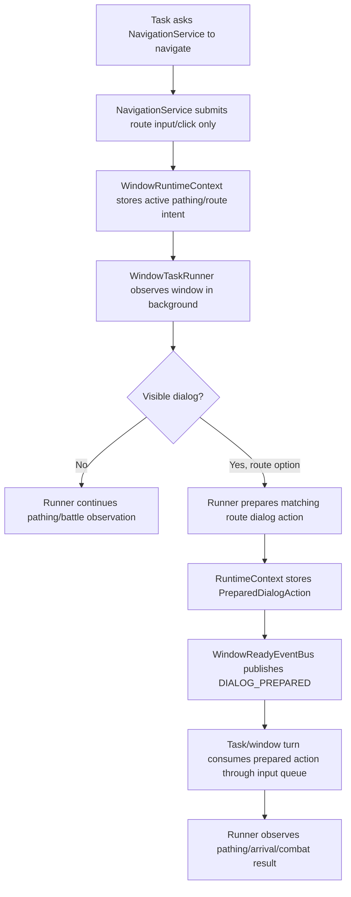
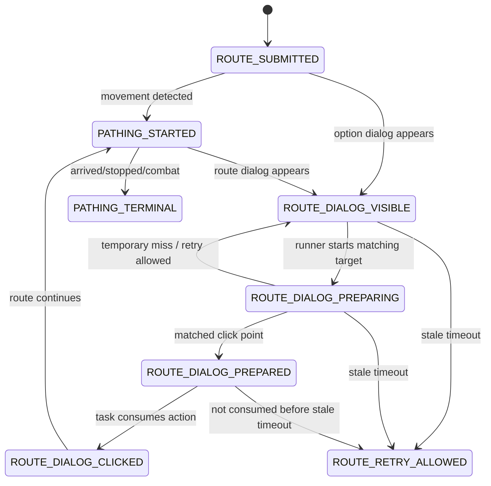

# 2026-06-14 Runner / Dialog Preparation 架构交接

## 基本信息

- 仓库：`D:\mavenProject\DHXY`
- 分支：`dev`
- 日期：`2026-06-14`
- 本文目的：把当前关于“窗口 Runner、导航、弹窗准备、任务放权/唤醒”的讨论整理成可交接文档，方便其他 agent 继续评审和实现。

## 当前目标

现在重点不是单独修某一个点击点，而是把多窗口任务里“移动中/停下/弹窗/准备好的点击动作”这套架构理顺。

最近暴露出来的核心问题是：

- 窗口已经出现了路线选择弹窗，比如从某地图去长安的选项框。
- Runner 或窗口层其实能看见有弹窗。
- 但是任务或 `NavigationService` 没有消费这个弹窗，反而又打开世界地图，重新搜索/导航。
- 多窗口时，这会导致窗口来回切、重复导航、弹窗一直挂着、任务状态滞后。

用户明确要求：

- 不要把“弹窗识别/业务处理”塞进 `NavigationService`。
- `NavigationService` 应该只负责导航动作本身。
- 是否有弹窗、弹窗是不是当前导航目标、弹窗是否已经准备好点击，应该由窗口 Runner / 窗口状态层处理。
- 任务层只消费已经准备好的动作，或者根据 Runner 给出的状态继续下一步。

## 当前现象和证据

日志里能看到两类状态同时存在，但它们没有接起来。

一类是 Runner 已经看见弹窗：

```text
WindowReadyEventBus ... type=TASK_ATTENTION_REQUIRED ... source=dialog-visible:OPTION
```

另一类是 `NavigationService` 在准备再次打开世界地图前，看不到可用的 prepared action：

```text
route dialog preparation snapshot before world-map search ...
statusPhase=NONE ...
preparedTarget=null
usable=false
```

这说明现在有两个“状态通道”：

1. EventBus 的软唤醒信号：告诉系统“这个窗口有事情需要注意”。
2. RuntimeContext 里的 `PreparedDialogAction` / `DialogPreparationStatus`：真正可执行的准备结果。

问题在于：

- Runner 看见弹窗后，只发了 `TASK_ATTENTION_REQUIRED`。
- 但它没有把“我看见了一个路线弹窗，并且它可能对应当前导航目标”登记成稳定状态。
- `NavigationService` 查的是 `PreparedDialogAction`，不是 EventBus。
- 所以它看到的是 `NONE`，然后继续重新导航。

曾经工作正常的路径类似：

```text
type=DIALOG_PREPARED ... source=navigateToMap:map-route-clicked
route dialog preparation snapshot ... statusPhase=READY target=长安 usable=true
consume prepared route dialog before world-map search
```

但这个路径现在仍然是 `NavigationService` 发起准备请求，这和目标架构冲突。

## 当前架构简述

### WindowTaskRunner

`WindowTaskRunner` 是每个窗口的后台观察者。它现在大概负责：

- 后台识别战斗状态。
- 后台识别移动/寻路状态。
- 后台刷新 `WindowPathingSnapshot`。
- 在满足条件时发布 `WindowReadyEvent`。
- 如果存在 `DialogPreparationRequest`，刷新弹窗准备状态。
- 如果看到普通弹窗，发布 `TASK_ATTENTION_REQUIRED`。

关键点：

- 它已经有能力在后台看窗口。
- 它发布的事件目前更像“叫醒用的软信号”。
- 它还没有形成一个稳定的“当前可见弹窗状态”。

### WindowRuntimeContext

`WindowRuntimeContext` 是每个窗口的运行时状态容器。当前已有类似状态：

- `WindowPathingSnapshot`
- `DialogPreparationRequest`
- `DialogPreparationStatus`
- `PreparedDialogAction`
- 任务相关上下文
- 窗口绑定、身份、截图、状态等

缺口：

- 缺少一个稳定的 `VisibleDialogState` / `WindowDialogSnapshot`。
- 现在“看见了弹窗”只体现在 EventBus 的 source 文本里，不适合业务判断。

### WindowReadyEventBus

`WindowReadyEventBus` 是软唤醒机制。

已有事件类型：

- `PATHING_TERMINAL`
- `DIALOG_PREPARED`
- `TASK_ATTENTION_REQUIRED`
- `TASK_TRACKER_PREPARED`

注意：

- EventBus 不应该承载完整业务状态。
- EventBus 只负责提醒调度层“某个窗口该优先被看一下”。
- 任务线程醒来后，必须回读 `WindowRuntimeContext` 的稳定状态。

### NavigationService

`NavigationService` 现在仍然承担了一部分路线弹窗准备逻辑，例如：

- 打开世界地图。
- 输入目标。
- 点击路线结果。
- 请求 route dialog preparation。
- 检查 prepared route dialog。
- 等待 prepared action。

当前问题：

- 它既做导航，又参与弹窗准备。
- 这导致职责混杂。
- 更重要的是，它不知道 Runner 已经看见了弹窗，只能查 prepared action。
- 当 prepared action 为空时，它会重新打开世界地图，制造重复导航。

## 目标架构

目标是把职责拆清楚：



核心原则：

1. `NavigationService` 只提交导航动作，不负责弹窗 OCR 和业务判断。
2. Runner 负责后台观察窗口。
3. Runner 看到弹窗后，写入稳定的 runtime 状态。
4. 如果当前有 active route target，Runner 尝试把弹窗准备成可点击 action。
5. EventBus 只发唤醒，不承载完整状态。
6. 任务层消费 runtime 里的 prepared action。
7. 如果弹窗正在准备或已经准备好，任务/导航不能重复打开世界地图。

## 建议新增/调整的状态

### VisibleDialogState / WindowDialogSnapshot

建议加一个窗口级可见弹窗状态，放在合适的 window/model 包里。

建议字段：

```java
@Value
@Builder
public class WindowDialogSnapshot {
    DialogType type;
    String source;
    long detectedAtMs;
    String targetKeyword;
    String windowId;
}
```

说明：

- `type`：`NONE` / `OPTION` / `STORY` 等。
- `source`：日志来源，比如 runner scan。
- `detectedAtMs`：用于 stale 判断。
- `targetKeyword`：可选，只有已经识别出目标时才填。
- `windowId`：方便多窗口日志排查。

`WindowRuntimeContext` 里增加：

- `updateVisibleDialogState(...)`
- `clearVisibleDialogState(...)`
- `getVisibleDialogState()`

不要长期依赖 `source="dialog-visible:OPTION"` 这种字符串解析。

### Route / Pathing Intent

Runner 要准备路线弹窗，必须知道当前窗口正在尝试去哪里。

需要确认现有 `WindowPathingSnapshot` 或相关状态能提供：

- 当前 route target map，比如 `长安`。
- 当前 route phase，比如正在跨地图导航。
- 当前任务来源，比如 五环 / 修罗 / 五倍 / debug。
- 目标是否仍然有效。

如果现有字段不够，可以小幅补字段，但不要新建大 service。

### PreparedDialogAction

`PreparedDialogAction` 应该继续作为“可执行点击动作”的稳定状态。

它和 visible dialog 的区别：

- `VisibleDialogState`：我看见了弹窗。
- `PreparedDialogAction`：我已经知道要点哪里。

任务层只应该执行 prepared action，而不是自己重新扫图猜。

## 推荐状态机



这里最重要的是：

- 只要存在 `ROUTE_DIALOG_VISIBLE / PREPARING / PREPARED`，同一目标就不应该马上重新打开世界地图。
- 超过 stale timeout 才允许路线重试。
- route dialog 点击后，清理 prepared action 和 visible state。

## 分阶段实现建议

### Phase 1：给 Runner 增加可见弹窗状态

修改点：

- `WindowRuntimeContext`
- 新 model：`WindowDialogSnapshot` 或类似名称
- `WindowTaskRunner.publishTaskAttentionIfDialogVisible(...)`

行为：

1. Runner 后台检测到 `OPTION/STORY`。
2. 写入 `WindowRuntimeContext.visibleDialogState`。
3. 发布 `TASK_ATTENTION_REQUIRED`。
4. 如果检测为 `NONE`，清理旧的 visible state。

日志建议：

```text
runner dialog visible update window=... type=OPTION source=... elapsedMs=...
runner dialog visible clear window=...
```

### Phase 2：Runner 根据 active route target 准备路线弹窗

修改点：

- `WindowTaskRunner`
- `DialogService`
- `WindowRuntimeContext`

行为：

1. Runner 看到 visible dialog 是 `OPTION`。
2. Runner 检查当前是否有 active route target。
3. 如果有，比如目标是 `长安`，调用现有路线选项匹配逻辑。
4. 成功后写入 `PreparedDialogAction`。
5. 发布 `DIALOG_PREPARED`。

日志建议：

```text
runner route dialog prepare start window=... target=长安 source=visible-dialog
runner route dialog prepare ready window=... target=长安 click=(x,y) elapsedMs=...
runner route dialog prepare miss window=... target=长安 reason=...
```

### Phase 3：任务/窗口线程消费 prepared action

行为：

1. 调度层收到 `DIALOG_PREPARED` 后优先安排该窗口。
2. 任务线程读取 `WindowRuntimeContext.getPreparedDialogAction()`。
3. 通过 `InputSequences` 原子点击。
4. 点击后清理 prepared action。
5. Runner 继续观察是否开始移动、到达、进入战斗。

注意：

- 真实鼠标点击必须走 input queue。
- move + click 仍然要保持原子序列。

### Phase 4：阻止重复世界地图导航

在提交世界地图导航前，任务/导航入口需要检查：

- 当前是否有同目标 visible dialog。
- 当前是否有同目标 preparing dialog。
- 当前是否有同目标 prepared action。

如果存在：

- 不要打开世界地图。
- 等 Runner 准备或让任务消费 action。

如果超过 stale timeout：

- 清理状态。
- 允许重新导航。

建议 stale timeout 初始值：

- visible/preparing：`8-12s`
- prepared 未消费：`10-15s`

具体值后续根据日志调整。

### Phase 5：逐步退出 NavigationService 的弹窗准备职责

后续清理目标：

- `NavigationService` 不再发起 `DialogPreparationRequest`。
- `NavigationService` 不再等待 `PreparedDialogAction`。
- `NavigationService` 不再判断弹窗是否匹配目标。

暂时可以保留兼容代码，但必须明确标注：

- 这是过渡路径。
- 新路径以 Runner + RuntimeContext 为准。

### Phase 6：日志和验证

必须能从日志回答：

1. Runner 什么时候看见弹窗？
2. 这个弹窗是 OPTION 还是 STORY？
3. 当时 active route target 是什么？
4. Runner 是否开始 prepare？
5. prepare 是否成功？
6. prepared action 是否被消费？
7. 同一目标在准备期间有没有重复打开世界地图？

建议关键日志：

```text
runner dialog visible update ...
runner route dialog prepare start ...
runner route dialog prepare ready ...
runner route dialog prepare stale ...
route retry blocked by visible/prepared dialog ...
prepared route dialog consumed ...
```

## 当前不建议做的事

不要做这些：

- 不要把 dialog OCR 继续塞进 `NavigationService`。
- 不要让 `NavigationService` 自己决定“看到弹窗就点”。
- 不要通过改 `GameStateUtil.isMovingByPixelDiff()` 掩盖架构问题。
- 不要新增一堆 wrapper/service，只为了换名字。
- 不要用 source 字符串长期表示业务状态。
- 不要因为某个 live case 临时 hardcode 地图或坐标。

## 和现有任务的关系

### 五环

五环的核心动作是点左侧任务追踪绿字。

对五环来说：

- Runner 可以观察是否移动、是否进入战斗、是否战斗结束。
- 如果移动停下且有 route option/dialog，应该优先让 Runner 准备并唤醒。
- 五环自身不应该重新扫一大堆世界地图状态来猜。

### 修罗

修罗更依赖显式阶段：

- 接任务。
- 读目标。
- 导航到目标地图。
- 当前地图内导航。
- 点击目标进入战斗。
- 战斗结束后回程。

修罗适合较完整地消费 Runner 的：

- `PATHING_TERMINAL`
- `DIALOG_PREPARED`
- 战斗进入/退出信号

### 五倍

五倍当前主要依赖任务追踪面板绿字。

但五倍也会出现：

- 移动中停住。
- 需要进入战斗 dialog。
- 特殊显形镜/白龙马任务。
- 黄袍怪连续战斗。

这些仍然需要 Runner 提供更可靠的“停下/弹窗/战斗”信号。

## 需要优先检查的文件

后续实现建议先看这些文件：

- `src/main/java/com/bot/dhxy/window/execution/WindowTaskRunner.java`
- `src/main/java/com/bot/dhxy/window/runtime/WindowRuntimeContext.java`
- `src/main/java/com/bot/dhxy/window/runtime/WindowReadyEventBus.java`
- `src/main/java/com/bot/dhxy/window/model/WindowReadyEvent.java`
- `src/main/java/com/bot/dhxy/window/model/WindowReadyEventType.java`
- `src/main/java/com/bot/dhxy/window/model/WindowPathingSnapshot.java`
- `src/main/java/com/bot/dhxy/model/dialog/DialogPreparationRequest.java`
- `src/main/java/com/bot/dhxy/model/dialog/DialogPreparationStatus.java`
- `src/main/java/com/bot/dhxy/model/dialog/PreparedDialogAction.java`
- `src/main/java/com/bot/dhxy/service/DialogService.java`
- `src/main/java/com/bot/dhxy/service/NavigationService.java`
- `src/main/java/com/bot/dhxy/task/FiveRingTaskV2.java`
- `src/main/java/com/bot/dhxy/task/XiuluoTaskV2.java`
- `src/main/java/com/bot/dhxy/task/WubeiTask.java`

## 开放问题

1. active route target 当前是否总能稳定写入 `WindowPathingSnapshot`？
2. route dialog 出现时，Runner 是否一定能知道它属于哪次导航？
3. visible dialog 的 stale timeout 应该是多少？
4. prepared action 未消费时，是否应该阻止同窗口所有导航，还是只阻止同目标导航？
5. 如果 visible dialog 是任务专属 option，比如接任务/取消任务/修理/医宝宝，Runner 应该只登记 visible，还是也准备 action？
6. `DIALOG_PREPARED` 和 `TASK_ATTENTION_REQUIRED` 的优先级是否已经在调度层完全生效？
7. 如果任务线程正在执行长动作，事件唤醒是否会被延迟到不可接受？

## 建议下一步

1. 先只加 `WindowDialogSnapshot` 和 `WindowRuntimeContext` 的 visible dialog 状态，不改导航行为。
2. 在 Runner 里写 visible dialog 状态，并补关键日志。
3. 跑一次五环/修罗导航场景，确认日志里能看到“runner 看见 route option dialog”。
4. 再把 route target + visible option 接到 `PreparedDialogAction`。
5. 添加“准备期间阻止重复打开世界地图”的 gating。
6. 跑一次北俱芦洲/洛阳/长安这类路线弹窗，确认不再重复打开世界地图。
7. 最后再清理 `NavigationService` 里旧的 dialog preparation 逻辑。

## 外部审核意见采纳记录

另一位 agent 对本文做了架构审核。下面是可采纳点、需要改写点和暂不采纳点，供后续实现时参考。

### 可以直接采纳

#### 1. PreparedDialogAction 的消费必须原子化

现在 `WindowRuntimeContext` 里有：

- `getPreparedDialogAction()`
- `clearPreparedDialogAction(...)`

如果任务线程先 `get` 再 `clear`，中间 Runner 可能重新写入新的 prepared action。后续实现时建议增加类似：

```java
public PreparedDialogAction consumePreparedDialogAction(String reason)
```

这个方法内部用 `AtomicReference.getAndSet(null)` 完成“读取 + 清理”。任务线程消费 action 时应优先用这个方法。

注意：

- 点击动作本身不能放进 `WindowRuntimeContext`。
- `consume` 只负责原子拿走 action。
- 真实点击仍然走 `InputSequences`。

#### 2. Prepared action 未消费时，应阻止同窗口所有导航

外部审核里提出：只阻止同目标导航可能不够，因为 dialog 通常是模态 UI。

这个建议可以采纳。理由：

- 只要当前窗口存在未消费的 prepared action，说明屏幕已经处在一个可点击的弹窗状态。
- 此时再发起其他导航，风险不是“同目标重复”，而是“整个窗口 UI 被弹窗占用”。
- 所以 gating 应该阻止同窗口所有新的导航提交，直到：
  - prepared action 被消费；
  - visible/prepared 状态过期；
  - 或任务显式清理 UI。

#### 3. EventBus 不是业务状态源

审核里强调“单一事实来源”是对的。当前代码也已经在 `WindowReadyEventBus` 注释里说明：

- EventBus 是 soft wake bus。
- 它不拥有任务状态。
- 任务被唤醒后必须回读 `WindowRuntimeContext`。

后续实现不要把业务状态塞到 event source 字符串里。

#### 4. 长动作需要能被唤醒或拆小

如果任务线程正在长 sleep 或长轮询，Runner 即使发布 `DIALOG_PREPARED`，任务也可能很久才响应。后续应该继续把任务拆成短 transaction / phase，或者在长等待里使用 `WindowReadyEventBus.awaitNewer(...)` 这类机制。

### 需要改写后采纳

#### 1. “引入 traceId/navId”

这个建议方向对，但要谨慎。

可取点：

- route dialog 确实应该绑定一次导航意图，避免旧弹窗被新任务误消费。

需要改写：

- 不一定要马上加复杂 `traceId`。
- 第一版可以先使用 `WindowPathingIntent` 中的目标地图、创建时间、source 作为轻量绑定。
- 如果后续仍出现串状态，再补 `navigationIntentId`。

建议第一版字段：

- `intentCreatedAtMs`
- `targetMapName`
- `source`
- 可选 `intentId`

#### 2. “异常弹窗优先级”

方向对，但不要一开始扩大成完整系统弹窗分类。

第一版只需要：

- `OPTION`
- `STORY`
- `NONE`

后续如果识别到系统断线、维护、随机奖励等，再扩展 `DialogType` 或增加业务分类。

#### 3. “动态 stale timeout”

方向对，但第一版不要做复杂指数退避。

建议第一版：

- visible/preparing/prepared 使用不同超时。
- 跨地图 route 比普通 option 稍长。
- 先通过日志调参。

暂定：

- visible route option：`8-12s`
- preparing：`10-15s`
- prepared 未消费：`10-15s`

### 暂不采纳或不准确

#### 1. 当前调度不是 FIFO 队列

审核意见担心 EventBus 是 FIFO，被低优先级事件淹没。这个风险方向可以理解，但当前代码不是 FIFO。

当前 `WindowReadyEventBus` 逻辑：

- 用 `latestByWindowAndType` 合并每个窗口/事件类型的最新事件。
- `DIALOG_PREPARED` 默认优先级 `100`。
- `TASK_ATTENTION_REQUIRED` 默认优先级 `90`。
- `PATHING_TERMINAL` 默认优先级 `70`。
- `TASK_TRACKER_PREPARED` 默认优先级 `60`。

`TaskTurnCoordinator` 会通过 `latestFreshHigherPriority(...)` 查找其他窗口的新鲜高优先级事件。

所以准确说法是：

- 当前是“事件合并 + 新鲜度 + 优先级 gate”的混合模型。
- 不是纯 FIFO。
- 也不是完全由 EventBus 驱动的休眠唤醒模型。

真正风险在于：

- 事件 freshness 只有一段时间。
- 当前持有 task turn 的长动作可能让高优事件过期。
- `READY_PRIORITY_GATE_MAX_WAIT_MS` 目前只有 `500ms`，它只是短暂让路，不是强抢占。

#### 2. Runner 不应该处理所有任务专属 option

审核里说任务专属 option 只登记 visible，这个原则大体对，但路线弹窗是特殊例外。

本文当前目标里的“route dialog preparation”不是普通任务业务弹窗，而是导航链路的一部分。它可以由 Runner 根据 active route target 准备 action。

但对于五环接任务、修罗接任务、医宝宝、修装备等业务弹窗：

- Runner 第一版只登记 visible。
- 任务层决定如何处理。

## 当前调度模型回答

外部审核最后问：现在任务线程调度器是固定周期轮询，还是完全由 EventBus 驱动的休眠唤醒模型？

答案：当前是混合模型，不是纯 EventBus 驱动。

### 当前实际机制

1. `WindowTaskRunner` 后台周期性观察窗口。
   - 它会根据战斗、pathing、dialog preparation 等状态调整 sleep interval。
   - 这属于固定周期观察。

2. `WindowReadyEventBus` 保存每个窗口/事件类型的最新事件。
   - 它不是 FIFO。
   - 它会按事件类型优先级和 sequence 选择更强事件。

3. `TaskTurnCoordinator` 控制任务权。
   - 它用公平 `ReentrantLock` 串行化大的 task turn。
   - 在获取任务权前，它会短暂检查其他窗口是否有更高优先级 ready event。
   - 如果有，它会 defer 最多约 `READY_PRIORITY_GATE_MAX_WAIT_MS`。

4. 任务内部也可以主动等待新事件。
   - 例如五环、修罗、五倍里已经有 `WindowReadyWaitService` / `awaitNewer(...)` 的使用痕迹。

### 当前模型的缺口

这个模型能提前让路，但不是强抢占。

如果当前窗口正在跑一个长 transaction：

- 其他窗口即使发了 `DIALOG_PREPARED`；
- 也要等当前 transaction yield；
- 如果等太久，event 可能 stale；
- 于是又回到慢轮询。

所以后续优化方向不是把 EventBus 改成 FIFO/PriorityQueue，而是：

- 缩短 task transaction。
- 长等待中使用 `awaitNewer(...)`。
- RuntimeContext 保存稳定状态，不依赖事件还“新鲜”。
- prepared action / visible dialog 不应因为 EventBus 事件过期而丢失。

## 唐德补充审核意见 - 2026-06-14

我同意本文的大方向：EventBus 只做唤醒，稳定状态必须落到 `WindowRuntimeContext`；路线弹窗准备应该从 `NavigationService` 逐步迁到 Runner/窗口状态层。

但实现时有几个点需要收紧，否则容易继续出现“又套一层、职责还是混”的问题。

### 1. 先修正文档里的代码路径

“需要优先检查的文件”里有几处旧路径，实际文件是：

- `src/main/java/com/bot/dhxy/task/wuhuan/FiveRingTaskV2.java`
- `src/main/java/com/bot/dhxy/task/xiuluo/XiuluoTaskV2.java`
- `src/main/java/com/bot/dhxy/task/wubei/WubeiTask.java`

不要让后续 agent 按旧路径找文件，容易误判为类不存在或误开旧 `FiveRingTask.java`。

### 2. `WindowDialogSnapshot` 第一版不要承载业务判断

建议第一版只表示“窗口上确实看见了什么类型的弹窗”，不要在这里过早塞业务含义。

建议字段比正文里的草案稍微补强：

```java
@Value
@Builder
public class WindowDialogSnapshot {
    String windowId;
    Long hwnd;
    DialogType type;
    String source;
    long detectedAtMs;
    int[] dialogRect;
    String captureProvider;
}
```

说明：

- `targetKeyword` 第一版不建议放在 visible snapshot 里。
  - visible snapshot 只回答“有没有弹窗、是什么框”。
  - `targetKeyword=长安` 这类信息属于 route preparation / prepared action。
- `dialogRect` 有价值，因为后续判断 fingerprint、prepared action、点击点都要知道这次识别对应的框。
- `hwnd/windowId` 要保留，避免旧窗口/旧 binding 的 snapshot 被消费。
- `captureProvider` 可以帮助排查 HWND/Robot 路径差异。

如果后续确实需要保存“这个弹窗疑似属于哪个业务目标”，建议另建 route/dialog preparation 状态，不要污染基础 visible snapshot。

### 3. `NONE` 清理 visible state 必须谨慎

正文说 Runner 检测到 `NONE` 就清理旧 visible state，这个方向可以，但需要加条件。

不要在这些情况下清理：

- 当前截图失败；
- 当前窗口 binding 已经变化但 snapshot 还没刷新；
- capture provider fallback 失败；
- 检测本身被 stop/pause 中断；
- OCR/template 临时 miss，但上一帧 visible 仍在 stale window 内。

更安全的第一版：

- 只有在同一 `windowId/hwnd` 下成功完成一次 dialog detection，并明确得到 `DialogType.NONE` 时，才清理 visible state。
- 清理日志要带上旧 state age、旧 type、新 detection source。

### 4. Route dialog preparation 必须绑定 active intent

Runner 准备路线弹窗时，不能只因为看见 OPTION 就尝试所有路线匹配。

第一版只允许这个条件成立时准备：

- 当前 `WindowRuntimeContext` 有 active `WindowPathingIntent` / `WindowPathingSnapshot.intent`；
- intent 的 target map 非空；
- intent 未 stale；
- 当前 visible dialog 是 `OPTION`；
- 当前没有未消费的 `PreparedDialogAction`。

这样可以避免 Runner 把五环接任务、修装备、医宝宝、买鞋等业务 OPTION 当作路线弹窗去扫。

业务 OPTION 的第一版处理原则仍然是：

- Runner 只登记 visible；
- 任务层根据当前 phase 决定怎么处理；
- 不在 Runner 里准备业务点击 action。

### 5. 不要急着删除 `NavigationService` 里的旧 preparation

正文 Phase 5 说逐步退出 `NavigationService` 的弹窗准备职责，这个方向对，但不要第一轮就删。

推荐迁移顺序：

1. 加 `WindowDialogSnapshot` 和日志，不改变行为。
2. Runner 在 active route intent + visible OPTION 时写 `DialogPreparationStatus/PREPARED`。
3. `NavigationService` 在准备打开世界地图前先 gate：
   - 如果同窗口有 fresh visible OPTION / PREPARING / READY / prepared action，就不要重复打开世界地图。
   - 返回 `DIALOG_PREPARING` 或类似状态，让任务短让权。
4. 跑日志确认 Runner 准备路径稳定后，再删除/弱化 `NavigationService.requestRouteDialogPreparationAfterMapRouteClick(...)` 这类旧路径。

也就是说，第一轮的重点不是“删旧逻辑”，而是“先让新状态可见，并阻止重复打开世界地图”。

### 6. `PreparedDialogAction` 需要 consume API，但不要把点击塞进去

正文里提到 `consumePreparedDialogAction(...)`，我同意。

现状：

- `WindowRuntimeContext.clearPreparedDialogAction(...)` 已经用 `getAndSet(null)`。
- 但调用方仍然容易先 `getPreparedDialogAction()` 再 `clearPreparedDialogAction(...)`。

建议加：

```java
public PreparedDialogAction consumePreparedDialogAction(String reason)
```

语义：

- 原子拿走 action；
- 同步把 READY 状态清掉；
- 写一条日志；
- 不执行任何输入动作。

真实点击仍然必须在任务/窗口线程里通过 `InputSequences` 走原子 move+click。

### 7. Gating 应该优先阻止同窗口导航，而不是只阻止同目标

我同意外部审核里的这个点，并建议第一版就这样做。

只要同窗口有 fresh 的：

- visible OPTION；
- PREPARING；
- READY；
- prepared action；

就应该阻止该窗口重新提交世界地图导航。

理由：游戏里的 option/story 大多是模态 UI。即使目标不同，重新打开世界地图也很可能只是把状态弄乱。

例外只能由任务显式清 UI 或 stale timeout 触发，不能由 `NavigationService` 自己硬冲。

### 8. `DialogPreparationStatus.FAILED` 不应长期阻塞

现有状态里有 `FAILED`。后续 gating 时不要把 fresh failed 和 ready/preparing 混在一起。

建议：

- `REQUESTED/PREPARING/READY` 可以阻止重复导航。
- `FAILED` 只阻止很短时间，或者不阻止，只用于日志和降噪。
- 如果同一 visible dialog 仍然存在，但 prepare failed，可以由 Runner 在下一轮重试，直到 visible stale。

否则会出现：prepare 一次 miss 后，窗口既不重试 prepare，也不允许重新导航。

### 9. 需要补一个“旧 action 不可消费”的硬校验

消费 prepared action 前至少校验：

- `windowId/hwnd` 与当前 runtime binding 一致；
- `verifiedAtMs` 未超时；
- `targetKeyword/targetMapName` 与 active intent 一致；
- action 的 dialog fingerprint 仍然匹配，或者最近一次 validate 已经通过；
- 当前 task type 不冲突。

这几个校验不应该散落在多个任务里，最好放在 `WindowTaskRunner` / `WindowRuntimeContext` 附近的统一方法里。

### 10. 下一步建议改成更小的可验证切片

原文建议下一步总体可行，但我建议压得更小：

1. 只加 `WindowDialogSnapshot` model 和 `WindowRuntimeContext` getter/update/clear。
2. Runner 的 `publishTaskAttentionIfDialogVisible(...)` 更新 visible snapshot，补日志。
3. 不改 `NavigationService` 行为，先跑一次确认日志：
   - `runner dialog visible update`
   - `runner dialog visible clear`
   - snapshot 的 `windowId/hwnd/type/age`
4. 再加 gating：`NavigationService` 打开世界地图前，如果同窗口 fresh visible OPTION 存在，直接返回让权，不再重复开图。
5. 最后才做 Runner route prepare。

这样每一步都有日志能验证，出问题也容易回滚。

### 11. 暂时不要扩展 DialogType

本文提到以后可能扩展异常弹窗分类。这个可以留后续，但当前不要动。

现在 `DialogType` 只有：

- `NONE`
- `OPTION`
- `STORY`

第一版架构整理只围绕这三个类型。不要为了架构重整顺手加 `UNKNOWN/SYSTEM/MAINTENANCE`，否则任务分支会被扩大。

## 给下一个 Agent 的简短启动提示

请先阅读：

- `AGENTS.md`
- `docs/DHXY_CONTEXT.md`
- `docs/codex-handoffs/2026-06-14-runner-dialog-preparation-architecture.md`

当前任务不是改某个点击点，而是把 Runner / Navigation / Dialog Preparation 的职责重新接顺：

- `NavigationService` 只负责提交导航。
- `WindowTaskRunner` 负责后台发现弹窗，并根据 active route target 准备 `PreparedDialogAction`。
- EventBus 只负责唤醒，稳定状态必须写入 `WindowRuntimeContext`。
- 在 route dialog visible/preparing/prepared 期间，不要重复打开世界地图。

不要先大改业务任务。先补 visible dialog runtime state 和日志，用日志证明 Runner 看到弹窗后状态能被任务层读到。

## 谢帅审核意见 - 2026-06-14

我认可本文的大方向：问题不应该继续靠 `NavigationService` 临时 rescue，因为真正缺的是窗口级稳定状态。`WindowReadyEventBus` 只能告诉调度层“这个窗口该被看一下”，不能作为业务事实来源；任务被唤醒后必须回读 `WindowRuntimeContext`。这一点是后续修五环/五倍/修罗多窗口卡顿和重复导航的关键。

### 我建议第一版这样收敛

第一版不要一次性把所有 dialog 处理都迁进去，只做“看得见、记得住、能挡住重复导航”三件事：

1. `WindowRuntimeContext` 增加可见弹窗快照。
   - 字段保持轻量：`DialogType type`、`detectedAtMs`、`source`、`windowId`，最多再加截图/检测来源。
   - 不要一开始就放业务 operation、任务名、复杂分类。

2. `WindowTaskRunner` 后台探测到 `OPTION/STORY` 时写入 visible dialog state。
   - 看到 `NONE` 时清理。
   - 同时保留现有 `TASK_ATTENTION_REQUIRED` 软唤醒。
   - 日志必须包含窗口、类型、age、source，方便验证 runner 是否真的看见弹窗。

3. 导航提交前先看同窗口 visible/prepared 状态。
   - 只要当前窗口有未过期 visible option、preparing、prepared action，就不要立刻重新打开世界地图。
   - 这里不需要 `NavigationService` 去识别业务弹窗内容；只需要阻止“弹窗还在屏幕上却又重新导航”的错误。

4. 路线弹窗 prepared action 可以第二步再接。
   - 第一版先证明 visible state 能写入、能被任务/导航入口读到、能阻止重复世界地图。
   - 然后再让 runner 根据 active route target 准备 `PreparedDialogAction`。

### 边界建议

- `NavigationService` 可以临时读取 runtime 的 visible/prepared 状态来决定“先别重新导航”，但不要把 OCR/template 业务匹配继续塞进去。
- `Runner` 第一版只对路线弹窗做准备动作；五环接任务、修装备、医宝宝、三技能等业务弹窗只登记 visible，不替任务层做业务决策。
- `PreparedDialogAction` 消费必须做成原子读取并清理。这个点我同意外部审核意见，否则多窗口下容易出现 get 后还没 clear，runner 又写入新 action 的竞态。
- Stale timeout 第一版用固定值即可，不要上来做动态退避。建议先用：
  - visible option：`10s`
  - preparing：`12s`
  - prepared：`15s`
  后续只根据日志调。
- 不要加新的“调度器”。当前问题不是缺一个更大的 scheduler，而是 runner 看到的状态没有稳定写回 runtime，任务醒来后读不到。

### 需要特别验证的场景

1. 北俱芦洲 / 洛阳 / 长安这类路线弹窗已经出现后，窗口再次拿权时不能重新打开世界地图。
2. 如果 visible dialog 过期或消失，导航可以正常重试，不能永久卡住。
3. 单窗口时不能因为“主动放权/等待事件”多等几秒；如果只有一个 active window，应该尽量快速回读 runtime 并继续。
4. prepared action 被消费后，visible state 和 prepared state 都要清理，否则下一轮会误挡导航。
5. 五环任务追踪 green-click、五倍任务追踪、修罗 route dialog 三条线都要各跑一次日志验证，因为它们使用 ready event 的方式不同。

### 当前我不同意的做法

- 不要为了这个问题新建一套 `DialogRecommendService` 或类似大服务。
- 不要通过 source 字符串解析业务含义，例如长期依赖 `source=dialog-visible:OPTION`。
- 不要把五环/五倍/修罗各自加一套私有 rescue；这会继续把同一个架构问题复制三遍。
- 不要改 `GameStateUtil.isMovingByPixelDiff()` 来掩盖 route dialog 没被消费的问题。

### 推荐下一步顺序

1. 先补 `WindowDialogSnapshot` 和 `WindowRuntimeContext` visible dialog state。
2. 在 `WindowTaskRunner` 的现有 dialog visible 分支里写入/清理 state，并补日志。
3. 在世界地图导航提交前加 gating：有未过期 visible/prepared dialog 时，返回等待/让权，不重新打开世界地图。
4. 跑一次真实日志，只验证是否不再重复打开世界地图。
5. 再把 route target 的 prepared action 从 `NavigationService` 迁到 runner。

这个顺序比较稳：第一步只增加可观测状态和阻止明显错误，不动任务业务含义；等日志证明 state 通了，再迁移 route prepared action。

## 第二轮外部审核补充 - 2026-06-14

这轮审核意见总体可取，而且把一个关键边界说得更准确：`NavigationService` 不是完全不能读状态，而是不能做弹窗识别、弹窗准备和业务匹配。

### 采纳的核心边界

后续实现以这句话为准：

```text
Runner/EventBus 负责“看见并唤醒”，RuntimeContext 负责“稳定状态”，任务/统一 consumer 负责“消费动作”，NavigationService 只做导航提交和 modal gating。
```

这里的 `modal gating` 是只读判断：

- 可以问 `WindowRuntimeContext` 当前窗口是否有未消费 prepared action / modal visible dialog。
- 可以因此返回 `DIALOG_PENDING`、`DIALOG_PREPARED`、`UI_BLOCKED` 这类结构化结果。
- 不可以自己截图 OCR。
- 不可以自己判断 option 是不是目标地图。
- 不可以自己构建 `PreparedDialogAction`。
- 不可以自己点弹窗。

### WindowDialogSnapshot 字段建议

第一版可以保持轻量，但建议不要只存 `DialogType`。更稳的模型：

```java
@Value
@Builder(toBuilder = true)
public class WindowDialogSnapshot {
    String windowId;
    DialogType type;
    boolean modalBlocking;
    DialogOperation suspectedOperation;
    String targetKeyword;
    String source;
    long detectedAtMs;
    long expiresAtMs;
}
```

说明：

- `modalBlocking`：是否阻塞新导航。大多数 option dialog 应该是 true。
- `suspectedOperation`：Runner 的轻量猜测。第一版只在 active route target 明确时填 `ROUTE_TRANSFER`，其他业务弹窗可以为空。
- `expiresAtMs`：把 stale 逻辑收敛到状态本身，避免每个调用点自己算。

注意：`suspectedOperation` 不是强业务结论。五环、修罗、五倍仍要按自己的 phase/context 决定具体处理。

### PreparedDialogAction 原子消费必须优先做

`consumePreparedDialogAction(...)` 应该放在第一批，而不是后续优化。

原因：

```text
任务线程 get 到 action
Runner 线程刷新/替换 action
任务线程 clear，把新的 action 清掉
```

推荐接口：

```java
public PreparedDialogAction consumePreparedDialogAction(String reason)
```

如果要更安全：

```java
public PreparedDialogAction consumePreparedDialogAction(
        DialogOperation expectedOperation,
        String expectedTargetKeyword,
        String reason)
```

内部用 `AtomicReference.getAndSet(null)` 完成读取和清理。真实点击不放在 `WindowRuntimeContext`，仍然通过 input queue 执行。

### prepared/modal gating 允许的动作

未消费 prepared action 应阻止同窗口所有新的导航提交，但不能阻止处理这个 prepared action 本身。

正确规则：

```text
if has unconsumed prepared action:
    allow consumePreparedAction
    allow explicit cleanup
    block new world-map search / mini-map click / task tracker green click
```

否则会变成：明明有 prepared action，但因为 gating 太死，任务反而点不掉它。

### Runner 准备 route dialog 的严格前提

Runner 不能只因为“OPTION + 有 targetMapName”就准备 route dialog。建议条件：

```text
1. 当前有 active pathing intent；
2. intent.targetMapName 非空；
3. 当前 visible dialog 是 OPTION；
4. 当前没有业务任务显式声明正在处理其他 dialog；
5. dialog preparation request / route intent 未过期；
6. targetMapName 与当前 intent 一致。
```

这样可以避免把五环接任务、修罗接任务、五倍进战斗、医宝宝、修装备等业务 option 当成 route dialog 去扫。

### Legacy 路径不要立刻删除

旧路径现在可能仍然支撑一部分跨地图路线：

```text
NavigationService -> DialogPreparationRequest -> Runner prepare -> NavigationService consume
```

后续不要第一步就删。更稳的迁移：

```text
1. 新增 Runner-owned route dialog preparation path。
2. 旧 NavigationService preparation 保留为 fallback。
3. 旧路径日志标成 legacy。
4. 新路径稳定后，再删除旧逻辑。
```

可选临时开关：

```properties
bot.window.runner-dialog-preparation-enabled=true
bot.navigation.legacy-dialog-preparation-enabled=true
```

不一定必须加配置，但原则是先可回滚，再迁移。

### 统一 prepared action consumer

不要让五环、修罗、五倍、`NavigationService` 各写一套 prepared action 消费逻辑。

建议后续做统一入口，例如：

```java
DialogResult consumePreparedDialogActionIfMatches(
        DialogOperation operation,
        String targetKeyword,
        String source)
```

内部负责：

```text
1. runtime.consumePreparedDialogAction(...)
2. 校验 windowId / hwnd / age / fingerprint
3. inputSequences 原子 move+click
4. 成功后清 visible dialog state
5. 返回 DialogResult
```

这个 consumer 可以放进现有合适 service，第一版不一定要新建 service，避免再加套壳层。

### 更新后的实现顺序

综合当前交接文档和两轮审核，推荐顺序改为：

```text
1. 给 WindowRuntimeContext 加 WindowDialogSnapshot。
2. Runner 检测 dialog 后写 visible state，只写日志，不改变行为。
3. 加 consumePreparedDialogAction 原子消费方法。
4. 给 NavigationService 加只读 gating：如果当前窗口有未消费 prepared/modal dialog，不重复打开世界地图。
5. Runner 在 active route intent + OPTION dialog 时准备 ROUTE_TRANSFER action。
6. 任务/导航通过统一 consumer 消费 prepared action。
7. 旧 NavigationService dialog preparation 降级为 legacy fallback。
8. 稳定后删除 legacy。
```

一句话：

```text
先可观测，再 gating，再 prepare，再消费，最后删旧逻辑。
```

## 何黎收敛意见 - 2026-06-14

我看完唐德、谢帅和第二轮外部审核后，建议按下面这个版本收敛。核心方向不变，但实现要更保守，避免继续把业务含义塞进底层窗口状态。

### 1. 最终采纳的职责边界

```text
Runner 负责观察屏幕状态并写 RuntimeContext。
EventBus 只负责唤醒，不保存业务事实。
WindowRuntimeContext 保存稳定事实和可消费动作。
NavigationService 只负责发起导航动作，并做只读 modal gating。
任务层/统一 consumer 负责消费 prepared action 和业务判断。
```

`NavigationService` 可以读取 runtime state 来判断“现在先别重新打开世界地图”，但不能再自己做 OCR/template 识别、不能准备弹窗 action，也不能点弹窗。

### 2. WindowDialogSnapshot 第一版保持纯净

采纳唐德和谢帅的保守建议：`WindowDialogSnapshot` 第一版只表示窗口上看到的弹窗事实，不放 `targetKeyword` / `suspectedOperation` 这类业务字段。

推荐字段：

```java
@Value
@Builder
public class WindowDialogSnapshot {
    String windowId;
    Long hwnd;
    DialogType type;
    String source;
    long detectedAtMs;
    int[] dialogRect;
    String captureProvider;
}
```

路线目标、目标关键字、点击点、operation 类型，放在 `DialogPreparationRequest` / `DialogPreparationStatus` / `PreparedDialogAction` 里。这样基础 visible state 不会被五环、修罗、五倍的业务语义污染。

### 3. 与第二轮审核的差异

第二轮审核建议把 `modalBlocking`、`suspectedOperation`、`targetKeyword` 放进 `WindowDialogSnapshot`。这个思路能减少调用点判断，但第一版不建议这样做。

原因：

- `visible snapshot` 是底层观察事实，不应该承担业务猜测。
- `targetKeyword=长安` 这类信息只在 route preparation 场景成立。
- 五环接任务、五倍进战斗、医宝宝、修装备也是 OPTION，但不应该被 runner 误认为 route dialog。
- 后续如果真的需要“疑似用途”，可以新增 `RouteDialogCandidate` 或扩展 preparation status，而不是改基础 snapshot。

### 4. 立即可做的最小切片

第一轮只做这四步，不迁移业务逻辑：

1. 增加 `WindowDialogSnapshot` model 和 `WindowRuntimeContext` update/get/clear。
2. Runner 检测到 `OPTION/STORY/NONE` 后写入或清理 visible snapshot，并打日志。
3. 增加 `consumePreparedDialogAction(String reason)`，原子拿走 action 并清理 READY 状态。
4. 在世界地图导航提交前加只读 gating：同窗口存在 fresh visible OPTION、PREPARING、READY、prepared action 时，不重复打开世界地图。

这一阶段的验收只看日志：Runner 是否看见弹窗、runtime 是否保存、navigation 是否因为 modal state 停止重复开图。

### 5. 第二阶段再做 route prepared action

只有第一阶段日志稳定后，再把 route dialog preparation 迁到 Runner。

Runner 准备 route action 的严格前提：

```text
1. 当前窗口有 active pathing intent；
2. intent.targetMapName 非空；
3. intent 未 stale；
4. visible dialog 是 OPTION；
5. 当前没有未消费 PreparedDialogAction；
6. 当前没有任务显式声明正在处理业务 dialog；
7. route target 与 intent 一致。
```

业务 OPTION 第一版只登记 visible，不由 Runner 准备 action。

### 6. 旧逻辑迁移规则

不要第一步删除 `NavigationService` 旧 dialog preparation。先保留为 legacy fallback，并在日志里标明 legacy。

迁移顺序：

```text
visible state 可观测
-> modal gating 生效
-> Runner route prepare 生效
-> 统一 consumer 消费
-> 旧 NavigationService preparation 降级
-> 稳定后删除 legacy
```

### 7. 对外部问题的回答

当前不是完整 EventBus 驱动的休眠唤醒模型，也不是传统 FIFO 队列。现在更接近：

```text
Runner 后台观察 + WindowReadyEventBus 软唤醒 + TaskTurnCoordinator 公平锁/优先级 gate + 任务线程轮询/让权
```

`WindowReadyEventBus` 是 coalesced latest-event 模型，会保留每个窗口每类事件的最新值，但不适合作为业务事实来源。所以后续真正的事实必须落在 `WindowRuntimeContext`，事件只用于“提醒调度层快来看一下”。

### 8. 当前最重要的验收场景

- 北俱芦洲 / 洛阳 / 长安路线弹窗出现后，窗口再次拿权时不能重新打开世界地图。
- visible dialog 消失或过期后，导航可以正常重试，不能永久卡住。
- prepared action 被消费后，prepared state 必须原子清理，避免旧 action 挡下一轮。
- 单窗口不能因为 gating 多等几秒；只有一个 active window 时应快速继续。
- 五环、五倍、修罗各跑一次日志，验证不会再把业务 OPTION 当路线 OPTION。

## Phase 1 分工计划 - 2026-06-14

本阶段只做第一步：让 Runner 看到的弹窗稳定落到 `WindowRuntimeContext`，并能从日志验证。不要改业务任务、不要改点击策略、不要迁移 route preparation、不要删除旧逻辑。

### Phase 1 总目标

```text
Runner 检测到 OPTION/STORY/NONE
-> 写入或清理 WindowRuntimeContext.visibleDialogSnapshot
-> 打清楚日志
-> 不改变现有任务行为
```

本阶段完成后，应该能回答：

- Runner 到底有没有看到弹窗？
- 看到的是哪个窗口、哪个 hwnd、什么类型？
- 这个 snapshot 是什么时候写入、什么时候清掉的？
- 后续 Navigation/Task 为什么没有消费它，能从日志继续追。

### 唐德工作包：Runtime 状态与模型

负责人：唐德

范围：

1. 新增 `WindowDialogSnapshot` model。
   - 放到合适的 window/runtime 或 window/model package。
   - 不要放在 service implementation package。
   - 用项目现有 Lombok 风格：`@Value` + `@Builder`。

2. 第一版字段只保留窗口可见事实：

```java
String windowId;
Long hwnd;
DialogType type;
String source;
long detectedAtMs;
int[] dialogRect;
String captureProvider;
```

说明：

- 不加 `targetKeyword`。
- 不加 `suspectedOperation`。
- 不加任务名。
- 不加业务判断。
- `dialogRect` 如果当前 detection 暂时拿不到，可以先允许为空，但字段保留。

3. 在 `WindowRuntimeContext` 增加 visible dialog state API。

建议 API：

```java
public Optional<WindowDialogSnapshot> getVisibleDialogSnapshot()
public void updateVisibleDialogSnapshot(WindowDialogSnapshot snapshot, String reason)
public void clearVisibleDialogSnapshot(String reason)
```

实现要求：

- 内部用线程安全引用，例如 `AtomicReference<WindowDialogSnapshot>`。
- update/clear 必须打日志。
- 日志包含：windowId、hwnd、type、source、age 或 detectedAtMs、reason。

4. `NONE` 清理规则先只提供 API，不在唐德这边决定 detection 何时清。

唐德不要做：

- 不改 `NavigationService`。
- 不改 `WindowTaskRunner` 的 detection 逻辑。
- 不准备 `PreparedDialogAction`。
- 不处理 route target。
- 不碰五环、五倍、修罗任务代码。

验收标准：

- 编译能过。
- 能在代码里看到 `WindowRuntimeContext` 有 visible snapshot 的 get/update/clear。
- update/clear 日志清楚。
- `WindowDialogSnapshot` 不包含业务字段。

### 谢帅工作包：Runner 写入与日志验证

负责人：谢帅

前提：等唐德的 `WindowDialogSnapshot` 和 runtime API 合入后再做。

范围：

1. 找到 `WindowTaskRunner` 当前检测 dialog visible / 发布 `TASK_ATTENTION_REQUIRED` 的位置。

2. 在同一个检测点补写 runtime visible state。

目标行为：

```text
检测到 OPTION/STORY
-> build WindowDialogSnapshot
-> runtime.updateVisibleDialogSnapshot(...)
-> 仍然保留现有 EventBus wake 行为
```

```text
成功检测到 NONE
-> runtime.clearVisibleDialogSnapshot(...)
```

3. `NONE` 清理必须谨慎。

只有满足这些条件才清：

- 本次 dialog detection 完整执行成功；
- 当前 windowId/hwnd 与 runtime binding 一致；
- detection 明确返回 `DialogType.NONE`；
- 不是截图失败、OCR/template 中断、stop/pause 中断。

4. 日志要求。

必须能从 `logs/dhxy-console.log` 看到：

```text
runner visible dialog update: windowId=..., hwnd=..., type=OPTION/STORY, source=..., rect=..., provider=..., age=0
runner visible dialog clear: windowId=..., hwnd=..., oldType=..., oldAgeMs=..., source=..., reason=detected-none
```

具体 wording 可以按项目日志风格调整，但信息必须全。

5. 不改变行为。

本阶段不能因为 visible snapshot 存在就阻止导航，也不能让任务提前消费。只写状态和日志。

谢帅不要做：

- 不改 `NavigationService` gating。
- 不准备 route dialog action。
- 不改 `DialogService` 业务判断。
- 不改五环、五倍、修罗。
- 不新增 scheduler。

验收标准：

- 编译能过。
- 启动一次任务或 debug 路径后，日志能看到 visible update/clear。
- 弹窗存在时 runtime 有 snapshot；弹窗消失后 snapshot 清掉。
- 没有业务行为变化。

### 何黎验收清单

两边完成后，何黎只做验收，不继续扩范围：

1. 读 diff，确认没有业务代码被顺手改掉。
2. 确认 `WindowDialogSnapshot` 没有业务字段。
3. 确认 Runner 写 state 的位置就是现有 dialog detection / attention publish 附近。
4. 确认 `NONE` 不会因为截图失败误清。
5. 跑或让用户跑一次包含路线 OPTION 的场景，只看日志：

```text
visible update 是否出现
visible clear 是否出现
windowId/hwnd 是否正确
source/type 是否正确
```

### Phase 1 完成后才进入 Phase 2

Phase 2 才做：

- `consumePreparedDialogAction(...)`
- Navigation 只读 gating
- route preparation 迁移
- prepared action consumer

Phase 1 没验收前，不要提前做 Phase 2。

## 何黎验收结果 - 2026-06-14 20:03

结论：Phase 1 不能整体通过。核心 visible dialog state 做出来了，但混入了 Phase 2/Phase 3 的调度和任务等待改动，必须拆回 Phase 1 边界后再验收。

本次验收只允许 Phase 1：

- runner 观察到 visible dialog；
- 写入 `WindowRuntimeContext`；
- 记录日志；
- 不改变导航、任务、调度、放权、等待行为。

### 可以保留

唐德可以保留：

- `src/main/java/com/bot/dhxy/window/model/WindowDialogSnapshot.java`
  - 字段范围基本正确：`windowId`、`hwnd`、`type`、`source`、`detectedAtMs`、`dialogRect`、`captureProvider`。
  - 没有塞业务字段，符合 Phase 1。

- `src/main/java/com/bot/dhxy/window/runtime/WindowRuntimeContext.java`
  - `visibleDialogSnapshot`
  - `getVisibleDialogSnapshot()`
  - `updateVisibleDialogSnapshot(...)`
  - `clearVisibleDialogSnapshot(...)`
  - native binding changed / runtime reset 时清 visible snapshot

谢帅可以保留：

- `src/main/java/com/bot/dhxy/window/execution/WindowTaskRunner.java`
  - runner 检测到 `OPTION/STORY` 后写 `WindowDialogSnapshot`。
  - 发布 `TASK_ATTENTION_REQUIRED` 作为轻量 wake hint。
  - 注意：这里只允许做“我看到弹窗了”的提示，不能准备点击、不能改导航策略。

### 必须返工：唐德

唐德负责把自己的部分收回到 Phase 1 范围：

1. 不要在 Phase 1 里改 `WindowReadyEvent` 的调度语义。

目前看到：

- `src/main/java/com/bot/dhxy/window/model/WindowReadyEvent.java`
  - 新增了 `priority`。

这属于调度层设计，不属于 Phase 1。要么撤掉，要么单独放到 Phase 2 patch。

2. 不要在 Phase 1 里扩展 `WindowReadyEventBus` 优先级调度。

目前看到：

- `src/main/java/com/bot/dhxy/window/runtime/WindowReadyEventBus.java`
  - `latestFreshForWindow(...)`
  - `latestFreshHigherPriority(...)`
  - `defaultPriority(...)`
  - publish 时自动写 priority

这些是 Phase 2/调度层内容。Phase 1 只需要已有 event bus 能发布轻量事件，不需要 priority gate。

3. `WindowRuntimeContext.clearPreparedDialogAction(...)` 的日志化可以保留为小改，但不要把它当成 Phase 1 核心内容。

这不是主要问题，但要注意别顺手引入 prepared action consumer。`consumePreparedDialogAction(...)` 是 Phase 2，不是 Phase 1。

### 必须返工：谢帅

谢帅负责把 runner/task 侧改动收回到 Phase 1 范围：

1. 撤出 `WindowReadyWaitService`。

目前看到新增：

- `src/main/java/com/bot/dhxy/window/runtime/WindowReadyWaitService.java`

它已经是“任务等待提前唤醒”机制，不是 Phase 1 的 visible state。要么撤掉，要么单独放到 Phase 2 patch。

2. 撤出任务代码里的 `WindowReadyWaitService` 接入。

目前看到这些文件已经被接入：

- `src/main/java/com/bot/dhxy/task/wuhuan/FiveRingTaskV2.java`
- `src/main/java/com/bot/dhxy/task/wubei/WubeiTask.java`
- `src/main/java/com/bot/dhxy/task/xiuluo/XiuluoTaskV2.java`

这些改动会改变五环、五倍、修罗的 `PATHING_STARTED` 等待行为。Phase 1 明确不能改任务业务行为，必须撤出。

3. 暂时撤出 `publishPreparedActionEvent(...)` 相关逻辑。

目前看到：

- `WindowTaskRunner` 在 task tracker prepared 时发布 `TASK_TRACKER_PREPARED`。
- `WindowTaskRunner` 在 dialog prepared 时发布 `DIALOG_PREPARED`。

这些是 prepared action wake 机制，属于 Phase 2。Phase 1 只需要 visible dialog update/clear 和 `TASK_ATTENTION_REQUIRED`。

4. `NONE` 清 visible 的条件要收紧。

现在逻辑是：

```text
detectDialogTypeNoFocus(...) == NONE
-> clearVisibleDialogSnapshot(...)
```

风险：`detectDialogTypeNoFocus` 内部截图失败也会返回 `NONE` 形态的 detection。虽然日志上会显示 `NONE`，但这不等价于“确认没有弹窗”。

谢帅需要改成：

```text
只有本次截图成功、dialog 区域检测完整执行、并明确没有 dialog，才 clear visible snapshot。
如果截图失败、stop/interrupted、或 detection 没拿到有效 image，不要清旧 visible。
```

建议最小做法：

- Runner 不要只拿 `DialogType`。
- 要么让 `DialogService` 暴露一个包含 `type + imagePresent/captureSuccess + rect/provider` 的轻量 detection result；
- 要么 Phase 1 先不在 `NONE` 时清旧 snapshot，只打日志，等 Phase 2 再精细处理 clear。

### 当前验证结果

已执行：

```powershell
mvn -q -DskipTests compile
```

结果：编译通过。

这个只能说明代码能编译，不代表 Phase 1 验收通过。

### Phase 1 重新验收标准

返工后需要满足：

1. `git diff` 里只保留：
   - `WindowDialogSnapshot`
   - `WindowRuntimeContext` visible snapshot API
   - `WindowTaskRunner` visible update/clear 与轻量 attention publish

2. `git diff` 里不能出现：
   - `TaskTurnCoordinator` 行为改动
   - `WindowReadyWaitService`
   - 五环/五倍/修罗任务等待逻辑改动
   - Navigation gating 改动
   - prepared action consumer/wake 机制

3. 日志能看到：

```text
window.dialog.visible.update
window.dialog.visible.clear
windowId
hwnd
type
source
provider
age
```

4. visible snapshot 只表达“屏幕上看到了什么”，不表达“任务应该怎么做”。

### 下一步分工

唐德：

- 收回 `WindowReadyEvent` / `WindowReadyEventBus` 的 priority 相关改动。
- 保留 `WindowDialogSnapshot` 和 runtime visible state。
- 如果要做 priority，请另起 Phase 2 patch，等 Phase 1 过了再说。

谢帅：

- 收回 `WindowReadyWaitService`。
- 收回五环/五倍/修罗里接入 `WindowReadyWaitService` 的改动。
- 收回 `DIALOG_PREPARED` / `TASK_TRACKER_PREPARED` 的 prepared action wake 发布。
- 保留 runner 写 visible snapshot 和 `TASK_ATTENTION_REQUIRED`。
- 修正 `NONE` 清理策略，避免截图失败误清。

何黎下一次只验收返工后的 Phase 1 diff，不验收混入的 Phase 2 内容。

## 唐德返工结果 - 2026-06-14 20:20

已按何黎验收意见把当前实现收回到 Phase 1 边界。

### 保留范围

- `WindowDialogSnapshot`
- `WindowRuntimeContext.visibleDialogSnapshot`
- `getVisibleDialogSnapshot()`
- `updateVisibleDialogSnapshot(...)`
- `clearVisibleDialogSnapshot(...)`
- Runner no-focus 探测到 `OPTION/STORY` 后写 visible snapshot
- Runner 继续发布轻量 `TASK_ATTENTION_REQUIRED`

### 已撤出或确认不再存在

- `WindowReadyEvent.priority`
- `WindowReadyEventBus` priority / `latestFreshHigherPriority(...)`
- `TaskTurnCoordinator` priority gate
- `WindowReadyWaitService`
- 五环/五倍/修罗的 `waitForPathingWakeOrTimeout(...)` 接入
- `DIALOG_PREPARED`
- `TASK_TRACKER_PREPARED`
- `publishPreparedActionEvent(...)`

### NONE 清理策略

当前 Phase 1 不在 `DialogType.NONE` 时清理旧 visible snapshot，只打 debug 日志。

原因：

- 当前 Runner 调用的 `detectDialogTypeNoFocus(...)` 只返回 `DialogType`。
- 它不能告诉 Runner 本次截图是否成功、image 是否有效、dialog 区域检测是否完整执行。
- 为避免截图失败或中断被误当成 `NONE` 后清掉旧 snapshot，安全 clear 延后到后续让 `DialogService` 暴露轻量 detection result 后再做。

### 验证

已执行：

```powershell
rg -n "WindowReadyWaitService|waitForPathingWakeOrTimeout|TASK_TRACKER_PREPARED|DIALOG_PREPARED|publishPreparedActionEvent|latestFreshHigherPriority|latestFreshForWindow|currentReadyPriority|priority gate|higherPriority|READY_PRIORITY|WINDOW_DIALOG_PREPARED_RECENT_MS" src/main/java/com/bot/dhxy/window src/main/java/com/bot/dhxy/task
mvn -q -DskipTests compile
```

结果：

- Phase 2 关键词无命中。
- Maven compile 通过。

## 何黎复验结果 - 2026-06-14 20:35

结论：Phase 1 复验通过，可以进入下一阶段设计评审，但不要把后续 Phase 2/Phase 3 混回这次 patch。

本次复验范围只看 Phase 1：窗口 Runner 能否把“看见弹窗”登记到 `WindowRuntimeContext`，并用轻量事件唤醒任务层；不验收完整 route prepared/action consumer 架构迁移。

### 复验命令

```powershell
rg -n "WindowReadyWaitService|latestFreshHigherPriority|latestFreshForWindow|DIALOG_PREPARED|TASK_TRACKER_PREPARED|publishPreparedActionEvent|waitForReady|consumePrepared|PreparedDialog|visibleDialogSnapshot|WindowDialogSnapshot|TASK_ATTENTION_REQUIRED" src/main/java/com/bot/dhxy -S
mvn -q -DskipTests compile
```

### 通过项

- `WindowReadyWaitService` 已撤掉。
- `WindowReadyEvent.priority` 和 `WindowReadyEventBus` priority / higher-priority 查询已撤掉。
- `DIALOG_PREPARED` / `TASK_TRACKER_PREPARED` / `publishPreparedActionEvent(...)` 已撤掉。
- 五环、五倍、修罗任务里没有看到 `WindowReadyWaitService` / `waitForPathingWakeOrTimeout(...)` 的接入残留。
- `WindowDialogSnapshot` 保持为窗口级观察事实，只包含 `windowId`、`hwnd`、`type`、`source`、`detectedAtMs`、`dialogRect`、`captureProvider`，没有塞任务业务字段。
- `WindowRuntimeContext` 已有 `visibleDialogSnapshot`、getter、update、clear，并在 native binding changed / runtime reset 时清理。
- `WindowTaskRunner.publishTaskAttentionIfDialogVisible(...)` 只做 no-focus 检测、写 visible snapshot、发布 `TASK_ATTENTION_REQUIRED`，没有直接点击或关闭弹窗。
- `DialogType.NONE` 当前只打 debug，不会清掉旧 visible snapshot；截图失败误清风险已避开。
- `mvn -q -DskipTests compile` 通过。

### 仍需注意

- `NavigationService` 里仍然存在旧的 route `DialogPreparationRequest` / `PreparedDialogAction` 消费逻辑。这是历史机制，不属于本次返工新增；它仍然是后续架构目标里要拆的债务。
- 现在 `visibleDialogSnapshot` 只会在 native binding changed / runtime reset 时清理。Phase 1 为避免误清先这样保守处理；后续如果要精细 clear，需要 `DialogService` 暴露包含 capture success / image present 的轻量 detection result。
- 工作区里有大量与本次验收无关的图片、日志、未跟踪文件和历史改动。不要为了提交 Phase 1 直接 `git add .`，需要按文件挑选。

### 下一步建议

1. 先用一次路线 OPTION 场景验证日志里是否出现：
   - `window.dialog.visible.update`
   - `window.ready.publish type=TASK_ATTENTION_REQUIRED`
   - windowId / hwnd / type / source 是否正确
2. 下一阶段再讨论 `PreparedDialogAction` 的消费原子性，例如 `consumePreparedAction()`。
3. 下一阶段再决定 `NavigationService` 里的 route preparation 迁移，不要在 Phase 1 patch 内继续扩大。

## Phase 2 工作包布置 - 2026-06-14 20:50

目标：解决“弹窗已经挂在屏幕上，但任务又重新打开世界地图/重复导航”的第一层问题。Phase 2 只做两个小切片：

1. prepared action 原子消费；
2. `NavigationService` 在重新打开世界地图前做只读 modal gating。

不要在本阶段迁移 Runner 负责 route preparation，不要新增优先级调度，不要改五环/五倍/修罗业务状态机。

### Phase 2 总原则

- `WindowRuntimeContext` 是稳定状态来源。
- `WindowReadyEventBus` 仍然只做 wake hint，不承载业务状态。
- `NavigationService` 可以读取 runtime 状态来判断“现在不要重复打开世界地图”，但不能做新的 OCR/template 识别。
- `NavigationService` 可以消费已经准备好的 `PreparedDialogAction`，但消费必须是原子操作。
- 任务层暂时不接新的等待机制。
- 不增加 `WindowReadyWaitService`、priority queue、`DIALOG_PREPARED`、`TASK_TRACKER_PREPARED`。

### 唐德工作包：PreparedDialogAction 原子消费 API

负责人：唐德

#### 要做

1. 在 `WindowRuntimeContext` 增加 prepared action 原子消费方法。

建议 API：

```java
public PreparedDialogAction consumePreparedDialogAction(String reason)
```

或者增加匹配版：

```java
public PreparedDialogAction consumePreparedDialogAction(
        DialogOperation operation,
        String targetKeyword,
        String reason)
```

匹配版更推荐，因为 route dialog 消费时天然需要校验 operation 和 target。

2. consume 必须用 `getAndSet(null)`，不能先 `getPreparedDialogAction()` 再 `clearPreparedDialogAction(...)`。

3. consume 时要同步清理 READY 状态。

要求：

- 如果当前 `DialogPreparationStatus.phase == READY`，消费 action 后把 status 置为 `none()`。
- 如果 action 不匹配 operation/target，不能清掉 action。
- 如果 action 属于其他 window/hwnd，不要清掉；由调用方或现有校验逻辑处理。

4. 加结构化日志。

日志必须包含：

- `windowId`
- `hwnd`
- `reason`
- `operation`
- `target`
- `source`
- `preparedAgeMs`
- `verifiedAgeMs`
- 是否 consumed / mismatch / absent

5. 保留现有 `clearPreparedDialogAction(...)`。

`clearPreparedDialogAction(...)` 仍然用于 stale、binding changed、runtime reset 等清理场景；新 consume API 只用于“我要拿走并执行这个 action”的场景。

#### 不要做

- 不改 `NavigationService`。
- 不改 `WindowReadyEventBus`。
- 不改任务层。
- 不做 route preparation 迁移。
- 不新增新的 service。

#### 唐德验收标准

```powershell
rg -n "consumePreparedDialogAction" src/main/java/com/bot/dhxy/window/runtime/WindowRuntimeContext.java
mvn -q -DskipTests compile
```

代码审查点：

- consume 内部必须是原子 `getAndSet(null)`。
- 匹配失败不能误清 action。
- READY 状态能被消费后清掉。

### 谢帅工作包：NavigationService 只读 gating 与消费替换

负责人：谢帅

前提：等唐德的 consume API 合入后再做。

#### 要做

1. 找出 `NavigationService` 里所有“打开世界地图/重新打开世界地图/route retry”之前的 prepared route 检查点。

重点看当前已有位置：

- `consume prepared route dialog before pathing guard`
- `consume prepared route dialog before world-map search`
- `waitForPreparedRouteDialogAction(...)`
- `route dialog preparation requested`
- `route dialog preparation requested after map route click`

2. 把“get action -> click -> clear action”的路径改成原子 consume。

规则：

- 先用 `runtime.consumePreparedDialogAction(DialogOperation.ROUTE_TRANSFER, targetMapName, reason)` 拿 action。
- 拿到 action 后再做 binding / age / fingerprint 必要校验。
- 如果校验失败，记录日志；不要再用非原子 get/clear 组合。
- 点击失败时不要重新用旧 action；让后续重试重新准备。

3. 增加只读 modal gating：在准备打开世界地图前，如果当前窗口已有 fresh visible OPTION 或 matching prepared/preparing route 状态，不要重新打开世界地图。

推荐 gating 条件：

- `runtime.getPreparedDialogAction()` 有 matching route action 且未过期；
- 或 `runtime.getDialogPreparationStatus()` 是 matching `REQUESTED/PREPARING/READY` 且未 stale；
- 或 `runtime.getVisibleDialogSnapshot()` 是 fresh `OPTION`，并且当前 pathing/route intent 仍指向同一个目标。

行为：

- 不要点击；
- 不要清 UI；
- 不要重新打开世界地图；
- 返回现有能表达“先让出/等待”的结果，例如 `DialogResultStatus.DIALOG_PREPARING` 或当前 `NavigationService` 已有的等价结果。

4. 日志要能解释为什么没有重新打开世界地图。

日志至少包含：

- `targetMapName`
- `source`
- `windowId`
- visible snapshot type / age
- preparation phase / age
- prepared action target / age
- gating result

5. 保留旧 foreground OCR fallback。

本阶段不要删除旧逻辑，只是在“已有 visible/preparing/prepared 的时候”阻止重复开图。没有 visible/prepared/preparing 时，旧流程照旧。

#### 不要做

- 不让 `NavigationService` 新增 OCR/template 识别。
- 不让 `NavigationService` 构造新的 `PreparedDialogAction`。
- 不改 `WindowTaskRunner` route preparation 策略。
- 不改五环/五倍/修罗任务代码。
- 不新增 `WindowReadyWaitService` 或事件优先级。

#### 谢帅验收标准

```powershell
rg -n "getPreparedDialogAction\\(\\).*clearPreparedDialogAction|clearPreparedDialogAction\\(\".*consumed|WindowReadyWaitService|DIALOG_PREPARED|TASK_TRACKER_PREPARED|latestFreshHigherPriority|latestFreshForWindow" src/main/java/com/bot/dhxy -S
mvn -q -DskipTests compile
```

日志验收场景：

1. 路线 OPTION 已经打开时，不应再看到同窗口马上重新打开世界地图。
2. 应看到类似：

```text
route dialog gating: skip world-map retry ...
```

3. 如果 action 已 ready，应看到 consume 日志，然后才有点击日志。
4. 如果 visible OPTION 存在但未 ready，应返回/yield，不做世界地图输入。

### 何黎验收点

两边完成后，何黎只验收 Phase 2：

1. 编译通过。
2. 没有重新引入 `WindowReadyWaitService` / event priority / task waiting。
3. `WindowRuntimeContext` 有原子 consume API。
4. `NavigationService` 不再在同窗口已有 fresh visible/preparing/prepared route dialog 时重复打开世界地图。
5. 日志能解释每次 gating 或 consume 的原因。
6. 不要求本阶段解决所有 route preparation 迁移；旧 legacy fallback 可以继续存在。

### Phase 2 之后才做

Phase 3 才讨论：

- Runner 根据 active route target 主动准备 route `PreparedDialogAction`。
- 任务层统一 consumer。
- `NavigationService` 旧 preparation 逻辑降级或删除。
- EventBus 是否需要真正的 priority queue。

## 唐德 Phase 2 完成记录 - 2026-06-14 21:05

唐德工作包已完成：`PreparedDialogAction` 原子消费 API 已加入 `WindowRuntimeContext`。

### 已实现

- `consumePreparedDialogAction(String reason)`
  - 无条件原子消费当前 prepared action。
  - 内部使用 `preparedDialogAction.getAndSet(null)`。
  - 消费后清理 `DialogPreparationStatus.READY`。

- `consumePreparedDialogAction(DialogOperation expectedOperation, String expectedTargetKeyword, String reason)`
  - 先匹配 windowId / hwnd / operation / target。
  - 匹配失败不清 action，只打 `result=mismatch` 日志。
  - 匹配成功后用 `getAndSet(null)` 原子消费。
  - 消费后清理 `DialogPreparationStatus.READY`。

### 日志

新增日志事件：

```text
event=window.ready.consumePrepared result=absent
event=window.ready.consumePrepared result=mismatch
event=window.ready.consumePrepared result=consumed
event=window.ready.consumePrepared result=race-mismatch-restored
```

日志字段包含：

- windowId
- hwnd
- reason
- operation
- target
- source
- expectedOperation
- expectedTarget
- preparedAgeMs
- verifiedAgeMs

### 未做

- 未改 `NavigationService`。
- 未改任务层。
- 未改 Runner route preparation。
- 未引入 `WindowReadyWaitService` / priority / `DIALOG_PREPARED` / `TASK_TRACKER_PREPARED`。

### 验证

已执行：

```powershell
rg -n "consumePreparedDialogAction" src/main/java/com/bot/dhxy/window/runtime/WindowRuntimeContext.java
rg -n "WindowReadyWaitService|waitForPathingWakeOrTimeout|TASK_TRACKER_PREPARED|DIALOG_PREPARED|publishPreparedActionEvent|latestFreshHigherPriority|latestFreshForWindow|currentReadyPriority|priority gate|higherPriority|READY_PRIORITY" src/main/java/com/bot/dhxy/window src/main/java/com/bot/dhxy/task
mvn -q -DskipTests compile
```

结果：

- `consumePreparedDialogAction` 可搜到。
- Phase 2 禁止项无命中。
- Maven compile 通过。

## 何黎 Phase 2 验收记录 - 2026-06-14 21:20

验收结论：Phase 2 通过，可以进入下一步规划。

### 已验收通过

- `WindowRuntimeContext` 已补原子消费 API：
  - `consumePreparedDialogAction(String reason)`
  - `consumePreparedDialogAction(DialogOperation expectedOperation, String expectedTargetKeyword, String reason)`
- 匹配失败不会清掉 prepared action，避免把别的任务/别的目标的 prepared action 误删。
- 匹配成功使用 `getAndSet(null)` 消费，消费后清理 READY 状态。
- `NavigationService` 的 route prepared 点击路径已集中到 `consumePreparedRouteDialogAction(...)`，不再用“先 get、点击后 clear”的主要消费路径。
- `NavigationService` 在重新打开世界地图前增加了只读 modal gating：
  - fresh visible route option；
  - matching REQUESTED/PREPARING；
  - usable prepared route action；
  - 命中时返回 `DIALOG_PREPARING`，不重复打开世界地图。
- 没有重新引入 `WindowReadyWaitService`、任务等待、事件优先级队列、`DIALOG_PREPARED`、`TASK_TRACKER_PREPARED`。

### 复验命令

```powershell
rg -n "WindowReadyWaitService|waitForPathingWakeOrTimeout|TASK_TRACKER_PREPARED|DIALOG_PREPARED|publishPreparedActionEvent|latestFreshHigherPriority|latestFreshForWindow|currentReadyPriority|priority gate|higherPriority|READY_PRIORITY" src/main/java/com/bot/dhxy/window src/main/java/com/bot/dhxy/task src/main/java/com/bot/dhxy/service -S
rg -n "consumePreparedDialogAction|getPreparedDialogAction\(|clearPreparedDialogAction\(" src/main/java/com/bot/dhxy/service/NavigationService.java src/main/java/com/bot/dhxy/window/runtime/WindowRuntimeContext.java -S
mvn -q -DskipTests compile
```

结果：

- 禁止项在 `src` 内无命中。
- Maven compile 通过。

### 保留注意项

- `NavigationService.clickRouteDialogOption(...)` 仍保留旧的“发 preparation request 后等 200ms / foreground fallback”路线。这是 legacy fallback，Phase 2 允许保留；Phase 3 再讨论是否降级或移除。
- `NavigationService` 里仍有多处 `getPreparedDialogAction()` 只读探测，用于 gating、日志、wait poll 和 memory fallback 前校验。当前没有发现主要 prepared action 点击路径继续使用非原子 get+clear 消费。
- `consumePreparedDialogAction(expectedOperation, expectedTargetKeyword, reason)` 在极小竞态下会先 `getAndSet(null)`，发现 race mismatch 后再 `compareAndSet(null, consumed)` 还原。这个实现没有丢 action，但后续如果继续收紧并发语义，可以考虑改成 CAS loop。

### 下一步建议

先不要直接改任务业务。下一步应该进入 Phase 3 设计/拆单：

1. Runner 根据 active route target 主动把 route dialog 准备成 `PreparedDialogAction`。
2. 明确谁消费 prepared action：任务层统一 consumer，还是 Navigation 暂时继续作为 route consumer。
3. 明确 prepared/visible 状态过期策略，避免旧弹窗长期阻止导航重试。
4. 再决定是否需要事件优先级或更轻量的唤醒机制。

## Phase 3 工作包布置 - 2026-06-14

Phase 3 的目标不是改修罗/五环/五倍业务，而是把 route dialog 的职责边界收紧：

- `WindowTaskRunner` 是 route dialog 的唯一后台准备方。
- `NavigationService` 只负责发起导航动作、登记导航意图、消费已经准备好的 route action、以及在 modal 状态新鲜时让路。
- `NavigationService` 不应该再拥有 route dialog OCR/模板识别主流程。
- 这一阶段不引入新 service、不引入 `DIALOG_PREPARED` 事件、不引入 priority queue、不改任务业务状态机。

### 当前代码事实

- Runner 已有入口：
  - `WindowTaskRunner.refreshDialogPreparationSignal(...)`
  - 它会读取 `WindowRuntimeContext.getDialogPreparationRequest()`。
  - 目前只处理 `DialogOperation.ROUTE_TRANSFER`。
  - 它会调用 `dialogService.prepareRememberedRouteOption(...)` 或 `dialogService.prepareRouteKeywordOption(...)`，然后写入 `WindowRuntimeContext.updatePreparedDialogAction(...)`。

- Navigation 仍有 legacy route-dialog 主流程：
  - `NavigationService.clickRouteDialogOption(...)`
  - 它会自己 `updateDialogPreparationRequest(...)`。
  - 它会 `waitForPreparedRouteDialogAction(...)` 等待 200ms。
  - 它还会走 remembered route click 和 `dialogService.handleDialog(DialogHandleRequest.handleRouteKeywordOption(...))`。

- Phase 2 已完成：
  - `WindowRuntimeContext.consumePreparedDialogAction(...)` 已经存在。
  - `NavigationService.consumePreparedRouteDialogAction(...)` 已经改成原子消费。
  - `NavigationService.shouldYieldForRouteDialogBeforeWorldMap(...)` 已有只读 gating。

### 唐德工作包 A：Runner route dialog producer 收口

目标：让 Runner 在看到 route option dialog 时，稳定地产生 `PreparedDialogAction`，并把所有状态写进 `WindowRuntimeContext`。

改动范围：

- `src/main/java/com/bot/dhxy/window/execution/WindowTaskRunner.java`
- 必要时只小改 `src/main/java/com/bot/dhxy/window/runtime/WindowRuntimeContext.java`

具体要求：

1. 保留 `refreshDialogPreparationSignal(...)` 作为 Runner 侧 route dialog preparation 主入口。
2. Runner 准备 action 时，目标来源优先级固定为：
   - 当前 `DialogPreparationRequest.targetKeyword`
   - 如果 request 缺少目标，才允许从当前 active pathing intent 读取目标地图。
3. 只处理 `DialogOperation.ROUTE_TRANSFER`。
4. 只在当前窗口可见 dialog 是 `DialogType.OPTION` 时准备 route action。
5. 如果 `WindowDialogSnapshot` 已经过期或 hwnd/windowId 不匹配，不准备 action。
6. 准备成功后写入：
   - `WindowRuntimeContext.updatePreparedDialogAction(...)`
   - `DialogPreparationStatus.READY`
7. 准备失败只标记当前 request failed，不要清 visible dialog。
8. Runner 不允许执行鼠标点击、不允许关闭窗口、不允许改任务 phase。
9. 日志必须包含：
   - windowId
   - hwnd
   - taskType
   - operation
   - target
   - source
   - visibleAgeMs
   - requestAgeMs
   - result
   - matchedText
   - absolute click point
   - elapsedMs

禁止事项：

- 不要新增 `WindowReadyWaitService`。
- 不要新增 `DIALOG_PREPARED` / `TASK_TRACKER_PREPARED`。
- 不要在 Runner 里做业务任务判断，例如五环/修罗/五倍专属 option。
- 不要在 Runner 里点鼠标。

验收点：

- `refreshDialogPreparationSignal(...)` 仍然是 Runner route preparation 主入口。
- Runner 可以在 pathing active 时准备 route action。
- Runner 可以在 pathing inactive 但 request 存在时准备 route action。
- Runner 的 prepared action 必须带当前 windowId/hwnd。

### 谢帅工作包 B：Navigation route dialog ownership 降级

目标：让 `NavigationService` 不再自己拥有 route dialog OCR 主流程。它只登记 request、消费 prepared action、在新鲜 modal 状态下让路。

改动范围：

- `src/main/java/com/bot/dhxy/service/NavigationService.java`

具体要求：

1. `NavigationService` 发起世界地图路线点击后，只负责登记 route preparation request：
   - `DialogOperation.ROUTE_TRANSFER`
   - target map
   - from map / from coord
   - remembered relative point，如有
   - TTL
2. 在准备重新打开世界地图前，必须先走：
   - `consumePreparedRouteDialogAction(...)`
   - `shouldYieldForRouteDialogBeforeWorldMap(...)`
3. 如果 `consumePreparedRouteDialogAction(...)` 成功，直接返回 route click result。
4. 如果 `shouldYieldForRouteDialogBeforeWorldMap(...)` 命中，返回 `DIALOG_PREPARING`，不要重新打开世界地图。
5. `clickRouteDialogOption(...)` 中的 foreground OCR 路径要降级：
   - 主路径不能再依赖它。
   - 如果暂时保留，只允许作为明确命名的 legacy fallback。
   - legacy fallback 只有在没有 fresh visible dialog、没有 REQUESTED/PREPARING、没有 usable prepared action 时才能运行。
   - 日志必须打印 `legacy-foreground-route-ocr` 或同等清晰标识。
6. `waitForPreparedRouteDialogAction(...)` 不应该再是主流程的一部分。
   - 优先移除调用。
   - 如果暂时保留，只能用于非常短的兼容观察，并且必须不触发前台 OCR。
7. `NavigationService` 不允许为了 route option 主流程直接调用：
   - `dialogService.detectDialogTypeNoFocus(...)`
   - `dialogService.handleDialog(DialogHandleRequest.handleRouteKeywordOption(...))`
   - 除非在明确命名的 legacy fallback 分支中，并且日志可搜。

禁止事项：

- 不要把 dialog 检测塞回 `navigateToMap(...)` 或 `navigateInCurrentMap(...)`。
- 不要让 Navigation 判断任务专属 dialog。
- 不要新增 service。
- 不要改任务业务流程。

验收点：

- route option 已可见时，Navigation 不应重复打开世界地图。
- Runner 已经准备好 action 时，Navigation 使用原子 consume 点击。
- Runner 正在准备 action 时，Navigation 返回 `DIALOG_PREPARING`。
- Runner 长时间没有结果时，Navigation 的 fallback 必须有明确日志，不能静默抢回 route dialog OCR。

### 何黎验收工作包 C：Phase 3 验证清单

唐德、谢帅完成后，何黎按下面清单验收。

代码搜索：

```powershell
rg -n "WindowReadyWaitService|waitForPathingWakeOrTimeout|TASK_TRACKER_PREPARED|DIALOG_PREPARED|publishPreparedActionEvent|latestFreshHigherPriority|latestFreshForWindow|currentReadyPriority|priority gate|higherPriority|READY_PRIORITY" src/main/java/com/bot/dhxy -S
rg -n "clickRouteDialogOption|waitForPreparedRouteDialogAction|handleRouteKeywordOption|detectDialogTypeNoFocus|legacy-foreground-route-ocr" src/main/java/com/bot/dhxy/service/NavigationService.java -S
rg -n "refreshDialogPreparationSignal|updatePreparedDialogAction|markDialogPreparationStarted|markDialogPreparationFailed" src/main/java/com/bot/dhxy/window/execution/WindowTaskRunner.java -S
rg -n "consumePreparedDialogAction" src/main/java/com/bot/dhxy/window/runtime/WindowRuntimeContext.java src/main/java/com/bot/dhxy/service/NavigationService.java -S
```

编译：

```powershell
mvn -q -DskipTests compile
```

期望结果：

- 禁止项在 `src` 内无命中。
- `NavigationService` 仍可搜到 `consumePreparedRouteDialogAction(...)`。
- `NavigationService` 里如果还保留 `clickRouteDialogOption(...)`，必须能从日志和调用点看出它是 legacy fallback，不是主路径。
- `WindowTaskRunner` 负责 route dialog 的 `prepare...` 和 `updatePreparedDialogAction(...)`。
- Maven compile 通过。

日志验收：

- route option 已经挂在屏幕上时：
  - Runner 打出 `dialog preparation probe start`。
  - Runner 打出 `dialog prepared` 或明确的 `prepare miss`。
  - Navigation 不重复打开世界地图。
  - 如果 prepared action 可用，Navigation 打出 `route dialog uses consumed prepared action`。
- 如果 Runner 正在准备：
  - Navigation 打出 world-map gate / yield 日志。
  - 不应马上重新输入世界地图。
- 如果超过 stale/TTL：
  - 必须有明确 `expired` / `stale` / `legacy fallback` 日志。

### Phase 3 暂定开放决策

1. legacy foreground OCR 是否保留：
   - 暂定保留，但只能作为明确日志标识的 fallback。
   - 后续如果 Runner preparation 足够稳定，再删除。

2. stale timeout 是否动态化：
   - Phase 3 不做动态 timeout。
   - 先沿用现有 TTL / max age 常量，避免扩大改动。

3. route prepared action 谁消费：
   - Phase 3 仍由 `NavigationService` 消费 route-transfer prepared action。
   - 通用任务 consumer 放到 Phase 4 再讨论。

4. task-specific option 是否由 Runner 准备：
   - Phase 3 不做。
   - Runner 只登记 visible 或准备 route transfer。
   - 修装备、医宝宝、五环/修罗/五倍专属 option 仍归任务层或 `DialogService.handleDialog(...)` 的业务调用处理。

### 不要碰的区域

- 不要改 minimap 坐标识别算法。
- 不要改 world-map 结果点击算法。
- 不要改 NPC click smart pipeline。
- 不要改五环/修罗/五倍任务 phase。
- 不要新增截图/点击 testcase，除非实际改了点击目标算法。
- 不要把 Navigation 变成 dialog 检测 owner。

## 唐德 Phase 3 工作包 A 完成记录 - 2026-06-14 21:45

Status: implemented / compile passed

### 完成内容

- `WindowTaskRunner.refreshDialogPreparationSignal(...)` 仍是 Runner 侧 route dialog preparation 主入口。
- Runner route producer 现在只处理 `DialogOperation.ROUTE_TRANSFER`。
- route target 来源顺序已固定：
  1. `DialogPreparationRequest.targetKeyword`
  2. request 没有 target 时，回退当前 active pathing intent 的 `targetMapName`
- Runner 准备 route action 前必须先读取 `WindowRuntimeContext.visibleDialogSnapshot`，并校验：
  - `windowId` 匹配当前 runtime；
  - `hwnd` 匹配当前 native binding；
  - snapshot 未超过 `WINDOW_DIALOG_VISIBLE_MAX_AGE_MS`；
  - visible type 是 `DialogType.OPTION`。
- 准备成功仍写入 `WindowRuntimeContext.updatePreparedDialogAction(...)`，由 runtime 统一进入 READY。
- 准备失败只标记当前 request failed，不清 visible snapshot。
- Runner 没有执行鼠标点击、没有关闭窗口、没有改任务 phase。
- 新增统一日志 `route dialog preparation`，包含：
  - result
  - windowId
  - hwnd
  - taskType
  - operation
  - target
  - source/actionSource
  - visibleType/visibleAgeMs
  - requestAgeMs
  - matchedText
  - click
  - elapsedMs
- 另外，为了让当前工作树恢复编译，`NavigationService` 只补回两个缺失常量：
  - `ROUTE_PREPARED_DIALOG_WAIT_MS = 200L`
  - `ROUTE_PREPARED_DIALOG_WAIT_POLL_MS = 50L`
  - 这是 Phase 2/3 改名残留的 compile fix，不改变 `NavigationService` 行为。

### 验证

```powershell
mvn -q -DskipTests compile
rg -n "WindowReadyWaitService|waitForPathingWakeOrTimeout|TASK_TRACKER_PREPARED|DIALOG_PREPARED|publishPreparedActionEvent|latestFreshHigherPriority|latestFreshForWindow|currentReadyPriority|priority gate|higherPriority|READY_PRIORITY" src/main/java/com/bot/dhxy -S
rg -n "refreshDialogPreparationSignal|route dialog preparation|detectDialogTypeNoFocus|prepareRememberedRouteOption|prepareRouteKeywordOption|updatePreparedDialogAction|markDialogPreparationFailed" src/main/java/com/bot/dhxy/window/execution/WindowTaskRunner.java -S
```

结果：

- Maven compile 通过。
- Phase 3 禁止项无命中。
- Runner producer 路径保留在 `refreshDialogPreparationSignal(...)`，`detectDialogTypeNoFocus(...)` 只在 attention probe 中用于写 visible snapshot。

### 下一步

- 谢帅继续工作包 B：
  - 降级 `NavigationService.clickRouteDialogOption(...)` 的 foreground OCR 主流程；
  - 如果保留，只能作为明确日志标识的 `legacy-foreground-route-ocr` fallback；
  - `NavigationService` 主路径应只登记 request、consume prepared action、或在 fresh modal/preparing 状态下让路。

## 何黎 Phase 3 验收记录 - 2026-06-14 21:10

结论：Phase 3 代码验收基本通过，可以进入日志实跑验证；但 MD 里暂时没有看到谢帅单独写的工作包 B 完成记录，建议谢帅补一段完成记录，避免后续 agent 误判 B 还没做。

### 已验收通过

- `mvn -q -DskipTests compile` 通过。
- `src/main/java` 内未命中 Phase 3 禁止项：
  - `WindowReadyWaitService`
  - `waitForPathingWakeOrTimeout`
  - `TASK_TRACKER_PREPARED`
  - `DIALOG_PREPARED`
  - `publishPreparedActionEvent`
  - `latestFreshHigherPriority`
  - `latestFreshForWindow`
  - `currentReadyPriority`
  - `READY_PRIORITY`
- `WindowRuntimeContext` 已提供原子消费：
  - `consumePreparedDialogAction(String reason)`
  - `consumePreparedDialogAction(DialogOperation expectedOperation, String expectedTargetKeyword, String reason)`
  - 匹配成功使用 `AtomicReference.getAndSet(null)` 消费，避免同一个 prepared action 被多个调用方重复使用。
  - operation/target 不匹配时不清掉 action，避免误删别的业务准备结果。
- `WindowTaskRunner.refreshDialogPreparationSignal(...)` 仍是 Runner 侧 route dialog preparation 主入口。
- Runner 侧准备 route action 前会校验 `WindowDialogSnapshot`：
  - windowId
  - hwnd
  - age
  - `DialogType.OPTION`
- Runner 侧准备成功后写入 `WindowRuntimeContext.updatePreparedDialogAction(...)`，由 runtime 进入 READY。
- Runner 侧没有执行鼠标点击，没有关闭窗口，也没有改任务 phase。
- `NavigationService` route dialog 路径已降级到：
  - 优先 `consumePreparedRouteDialogAction(...)`
  - 遇到 fresh visible/requested/preparing/prepared 时 `shouldYieldForRouteDialogBeforeWorldMap(...)` 返回让路
  - foreground route OCR 只保留为明确日志标识的 `legacy-foreground-route-ocr` fallback
- `waitForPreparedRouteDialogAction(...)` 没有继续出现在 `NavigationService` 主流程里。

### 需要注意

- `NavigationService.clickRouteDialogOption(...)` 还存在，但当前看起来是 route-dialog 兼容入口，不再是“自己等 OCR 准备”的 owner。它内部仍会在所有 fresh modal/prepared/preparing 条件不成立时走 `legacy-foreground-route-memory` / `legacy-foreground-route-ocr`，这是 Phase 3 暂定允许的 fallback。
- `docs/codex-handoffs/2026-06-14-runner-dialog-preparation-architecture.md` 前半段仍保留历史讨论里的 `DIALOG_PREPARED` / priority queue / `WindowReadyWaitService` 字样；这只是历史记录，不代表当前 `src` 里仍有这些实现。后续搜索禁止项时要限定 `src/main/java`。
- 还没有做实跑日志验收。下一轮测试需要重点看：
  - route option 已经在屏幕上时，Navigation 不再重复打开世界地图；
  - Runner 打出 `route dialog preparation: result=prepared` 或明确 `prepare-miss`；
  - Navigation 成功消费时打出 `route dialog uses consumed prepared action`；
  - fallback 时必须看到 `legacy-foreground-route-ocr start/finish`，不能静默抢回 OCR。

### 建议给谢帅补写

谢帅请在本节后补一段 “Phase 3 工作包 B 完成记录”，说明：

- `NavigationService` 哪些路径从前台 OCR owner 改成 request/consume/yield；
- foreground OCR 为什么仍保留为 legacy fallback；
- 哪些日志可以用于确认没有重复开世界地图；
- 这次没有改任务业务流程、没有新增 service、没有引入 priority/event wait。

## Phase 4 工作包布置 - 2026-06-14

Phase 4 总目标：阻止“route dialog 已经可见/正在准备/已经准备好，但同一窗口又重复打开世界地图、重复输入目的地、重复导航”的问题。

这一阶段只收紧 route navigation gating，不改五环/修罗/五倍任务业务 phase，不改 NPC click pipeline，不改 minimap/world-map 点击算法，不新增 service。

### Phase 4 当前基线

Phase 3 后已经具备这些基础：

- Runner 可以把可见弹窗写入 `WindowRuntimeContext.visibleDialogSnapshot`。
- Runner 可以在 `DialogPreparationRequest` 存在时准备 `PreparedDialogAction`。
- `WindowRuntimeContext.consumePreparedDialogAction(...)` 已经是原子消费。
- `NavigationService` 已有：
  - `consumePreparedRouteDialogAction(...)`
  - `shouldYieldForRouteDialogBeforeWorldMap(...)`
  - `legacy-foreground-route-ocr` fallback 日志。

Phase 4 不是重新做一套机制，而是确认所有会重新打开世界地图的入口都尊重这些状态。

### 唐德工作包 A：Runtime/Runner route dialog 状态完整性

负责人：唐德

目标：确保 Runner 写入的 visible/prepared 状态足够稳定，让 Navigation 可以可靠判断“现在不能重复开世界地图”。

改动范围：

- `src/main/java/com/bot/dhxy/window/runtime/WindowRuntimeContext.java`
- `src/main/java/com/bot/dhxy/window/execution/WindowTaskRunner.java`
- 必要时只小改 route dialog 相关 model。

具体要求：

1. 确认 `visibleDialogSnapshot` 只表示窗口事实，不加业务字段。
2. 确认 visible snapshot 必须包含：
   - windowId
   - hwnd
   - type
   - source
   - detectedAtMs
   - dialogRect / provider 如果 detector 能提供
3. 确认 `DialogPreparationStatus` 的状态流清楚：
   - `REQUESTED`
   - `PREPARING`
   - `READY`
   - `FAILED`
   - `NONE`
4. Runner 准备失败时，只标记当前 request failed，不要清 visible snapshot。
5. Runner 准备成功时，prepared action 必须绑定当前 windowId/hwnd。
6. 如果 native binding 改变，必须清 visible/prepared/request，避免串窗口。
7. 不要因为一次 `NONE` 或短暂截图失败就清 visible snapshot。清理必须依赖 stale/绑定变化/明确消费。
8. 日志需要能回答：
   - 这个 visible 是哪个窗口看到的；
   - 它是否过期；
   - request 是谁发的；
   - prepare 成功/失败耗时多少。

禁止事项：

- 不要新增 `WindowReadyWaitService`。
- 不要新增 event priority。
- 不要让 Runner 点击鼠标。
- 不要让 Runner 判断五环/修罗/五倍专属业务 option。

验收点：

- Runner 看到 route option 后，runtime 里能稳定读到 fresh visible snapshot。
- request 存在时 Runner 会尝试 prepare。
- prepare action 上有 windowId/hwnd。
- 短暂未检测到 dialog 不会立刻把 visible 清空。

### 谢帅工作包 B：Navigation 所有世界地图入口统一 gate

负责人：谢帅

目标：任何准备打开世界地图、重试世界地图、重新输入目的地之前，都必须先检查 route dialog 状态；如果同窗口已有 fresh visible/preparing/prepared route dialog，则不能重复开图。

改动范围：

- `src/main/java/com/bot/dhxy/service/NavigationService.java`

具体要求：

1. 找出所有可能打开世界地图或重试世界地图的入口，至少包括：
   - `submitWorldMapSearchAndClickDestination(...)`
   - `retryWorldMapDestinationClick(...)`
   - `navigateToMap(...)` 中调用上述方法前的分支
   - 特殊路线如 `navigateToLingShouVillageViaZhangWen(...)` 里进入 route dialog 的分支
2. 每个入口打开世界地图前，都必须先按这个顺序检查：
   - `consumePreparedRouteDialogAction(...)`
   - `shouldYieldForRouteDialogBeforeWorldMap(...)`
   - 只有都没有命中，才允许打开世界地图。
3. 如果 consume 成功：
   - 返回 `PATHING_STARTED` 或等价 route-click result；
   - 不再继续打开世界地图。
4. 如果 gate 命中：
   - 返回 `DIALOG_PREPARING`；
   - 不打开世界地图；
   - 日志必须清晰说明是哪个 source/target/window 被 gate 拦住。
5. 如果 gate 没命中才走世界地图搜索。
6. foreground OCR 只能留在 `legacy-foreground-route-ocr` 分支。
7. legacy fallback 运行前也必须先过一次 gate，不能在 fresh visible/preparing/prepared 存在时抢回 OCR。
8. 不要把 `dialogService.detectDialogTypeNoFocus(...)` 塞进 Navigation。
9. 不要让 Navigation 判断任务专属 dialog。

建议日志：

```text
route dialog world-map gate: result=true source=... windowId=... target=... visibleType=... statusPhase=... preparedTarget=...
route dialog uses consumed prepared action: source=... target=... click=(x,y)
legacy-foreground-route-ocr start: source=... target=...
```

验收点：

- 屏幕上已经有到目标地图的 option dialog 时，Navigation 不再重复开世界地图。
- Runner 正在 prepare 时，Navigation 返回 `DIALOG_PREPARING`。
- prepared action 可用时，Navigation 原子 consume 后点击。
- legacy OCR fallback 有明确日志，且只在没有 fresh modal/prepared/preparing 时运行。

### 何黎验收工作包 C：Phase 4 验收

负责人：何黎

代码搜索：

```powershell
rg -n "submitWorldMapSearchAndClickDestination|retryWorldMapDestinationClick|openWorldMapRoutePanelDirect|legacy-foreground-route-ocr|shouldYieldForRouteDialogBeforeWorldMap|consumePreparedRouteDialogAction" src/main/java/com/bot/dhxy/service/NavigationService.java -S
rg -n "detectDialogTypeNoFocus|handleRouteKeywordOption" src/main/java/com/bot/dhxy/service/NavigationService.java -S
rg -n "WindowReadyWaitService|DIALOG_PREPARED|TASK_TRACKER_PREPARED|latestFreshHigherPriority|waitForPathingWakeOrTimeout" src/main/java/com/bot/dhxy -S
```

编译：

```powershell
mvn -q -DskipTests compile
```

日志验收场景：

1. route dialog 已经挂在屏幕上，再次轮到该窗口时：
   - 不应出现新的世界地图输入；
   - 应看到 `route dialog world-map gate: result=true` 或 prepared action consume。
2. Runner 正在 prepare 时：
   - Navigation 返回 `DIALOG_PREPARING`；
   - 不开世界地图。
3. prepared action ready 时：
   - 应看到 `route dialog uses consumed prepared action`；
   - 点击后清 prepared/request。
4. 如果超过 stale/TTL：
   - 必须有 `expired` / `stale` / `legacy-foreground-route-ocr` 日志；
   - 才允许 fallback。

### Phase 4 完成后再进入 Phase 5

Phase 5 才考虑逐步删除 `NavigationService` 的 legacy foreground route OCR。Phase 4 不删除旧 fallback，只保证旧 fallback 不会抢在 fresh Runner 状态前面运行。

## 唐德 Phase 4 工作包 A 完成记录 - 2026-06-14 22:05

Status: implemented / compile passed

### 完成内容

- `WindowRuntimeContext.visibleDialogSnapshot` 继续只表示窗口事实：
  - windowId
  - hwnd
  - type
  - source
  - detectedAtMs
  - dialogRect/provider 如果 detector 提供
- native binding changed / runtime reset 仍会清 visible、prepared、request，避免旧 hwnd 串到新窗口。
- `DialogType.NONE` 或短暂 no-focus miss 不会清 visible snapshot；Runner 只写 debug 日志。
- Runner route preparation 失败只标记当前 request failed，不清 visible snapshot。
- prepared action 仍由 `WindowRuntimeContext.updatePreparedDialogAction(...)` 写入，且 action 带当前 windowId/hwnd。
- Runtime 增加 `window.dialog.prepare.state` 状态流日志：
  - `phase=requested`
  - `phase=preparing`
  - `phase=READY`
  - `phase=failed`
  - `phase=request-clear/request-cleared`
- READY 日志保留 request/preparing 时间，便于看：
  - request 是谁发的；
  - prepare 花了多久；
  - prepared action 新鲜度；
  - matchedText；
  - absolute click point。
- 当前工作树里 `NavigationService` 已有 Phase 4 B 的半截调用但缺方法定义，导致 compile failure。本次只补齐最小实现以恢复编译：
  - `routeDialogGateBeforeWorldMap(...)`
    - 先 `consumePreparedRouteDialogAction(...)`；
    - 再 `shouldYieldForRouteDialogBeforeWorldMap(...)`；
    - 命中时返回 `PATHING_STARTED` / `DIALOG_PREPARING`。
  - `submitWorldMapSearchAndClickDestination(NavigationRequest, String, String)`
    - 开图前再过一次 gate；
    - 未命中才复用原 `submitWorldMapSearchAndClickDestination(String)`。
  - 没有改 world-map 搜索/点击算法。

### 验证

```powershell
mvn -q -DskipTests compile
rg -n "WindowReadyWaitService|DIALOG_PREPARED|TASK_TRACKER_PREPARED|latestFreshHigherPriority|waitForPathingWakeOrTimeout|READY_PRIORITY|currentReadyPriority" src/main/java/com/bot/dhxy -S
rg -n "window\\.dialog\\.prepare\\.state|window\\.dialog\\.visible|clearVisibleDialogSnapshot|DialogType\\.NONE|route dialog preparation|updatePreparedDialogAction" src/main/java/com/bot/dhxy/window/runtime/WindowRuntimeContext.java src/main/java/com/bot/dhxy/window/execution/WindowTaskRunner.java -S
```

结果：

- Maven compile 通过。
- Phase 4 禁止项无命中。
- visible/preparation 状态日志可搜；`DialogType.NONE` 仍只在 Runner attention probe 中 debug，不清 visible snapshot。

### 下一步

- 谢帅执行 Phase 4 工作包 B：
  - 找齐所有打开/重试世界地图入口；
  - 每个入口前统一先 `consumePreparedRouteDialogAction(...)`，再 `shouldYieldForRouteDialogBeforeWorldMap(...)`；
  - legacy foreground OCR fallback 前也必须先过 gate。

## 谢帅 Phase 4 工作包 B 完成记录 - 2026-06-14 22:35

Status: implemented / compile passed

### 完成内容

- `NavigationService.navigateToMap(...)`
  - 正式 world-map submit 前继续先走 `routeDialogGateBeforeWorldMap(...)`。
- `NavigationService.submitWorldMapSearchAndClickDestination(NavigationRequest, String, String)`
  - 作为业务层唯一 world-map submit wrapper。
  - 开图前再次 gate，避免调用方绕过 `navigateToMap` 前置检查。
  - 绿色路线链接点击成功后统一 `requestRouteDialogPreparationAfterMapRouteClick(...)`，让 watcher 负责后续 route dialog preparation。
- 原底层 boolean 搜索点击方法改名为 `performWorldMapSearchAndClickDestination(...)`。
  - 该方法只负责实际世界地图输入/滚动/点击，不作为业务入口。
- `retryWorldMapDestinationClick(...)`
  - 开 route panel 前先过 route dialog gate。
  - fallback 改走带 gate 的 `submitWorldMapSearchAndClickDestination(...)` wrapper。

### 验证

```powershell
rg -n "submitWorldMapSearchAndClickDestination\(|performWorldMapSearchAndClickDestination\(|retryWorldMapDestinationClick\(|openWorldMapRoutePanelDirect\(|requestRouteDialogPreparationAfterMapRouteClick\(" src/main/java/com/bot/dhxy/service/NavigationService.java -S
rg -n "detectDialogTypeNoFocus|handleRouteKeywordOption|legacy-foreground-route-ocr|waitForPreparedRouteDialogAction" src/main/java/com/bot/dhxy/service/NavigationService.java -S
mvn -q -DskipTests compile
```

结果：

- `detectDialogTypeNoFocus` / `waitForPreparedRouteDialogAction` 在 `NavigationService` 中无命中。
- `handleRouteKeywordOption` 只保留在 `legacy-foreground-route-ocr` fallback。
- Maven compile 通过。

### 下一步

- 进入实跑日志验收：
  - route dialog 已可见/正在 prepare/已 prepare 时，不应再次打开世界地图。
  - 重点看 `route dialog world-map gate`、`route dialog uses consumed prepared action`、`route dialog preparation requested after map route click`。
  - 如果仍进入 `legacy-foreground-route-ocr`，需要确认是否是 TTL/stale 后的合法 fallback。

## 何黎 Phase 4 验收记录 - 2026-06-14

Status: source validation passed / compile passed

### 验收结论

Phase 4 的代码层验收通过，可以进入实跑日志验证。

这轮已经达到 Phase 4 的目标：`NavigationService` 不再在 fresh route dialog / prepared action 存在时直接重开世界地图；Runner/runtime 仍保留单一事实来源；旧 foreground OCR fallback 还在，但已经被 gate 约束，不会抢在 fresh Runner 状态前面运行。

### 已验证点

```powershell
mvn -q -DskipTests compile
rg -n "submitWorldMapSearchAndClickDestination|performWorldMapSearchAndClickDestination|retryWorldMapDestinationClick|openWorldMapRoutePanelDirect|legacy-foreground-route-ocr|shouldYieldForRouteDialogBeforeWorldMap|consumePreparedRouteDialogAction|routeDialogGateBeforeWorldMap|requestRouteDialogPreparationAfterMapRouteClick" src/main/java/com/bot/dhxy/service/NavigationService.java -S
rg -n "WindowReadyWaitService|DIALOG_PREPARED|TASK_TRACKER_PREPARED|latestFreshHigherPriority|waitForPathingWakeOrTimeout|READY_PRIORITY|currentReadyPriority" src/main/java/com/bot/dhxy -S
rg -n "visibleDialogSnapshot|WindowDialogSnapshot|clearVisibleDialogSnapshot|updateVisibleDialogSnapshot|markDialogPreparationFailed|updatePreparedDialogAction|consumePreparedDialogAction|consumePreparedRouteDialogAction" src/main/java/com/bot/dhxy/window src/main/java/com/bot/dhxy/service/NavigationService.java -S
```

- Maven compile 通过。
- Phase 4 禁止项无命中。
- `navigateToMap(...)` 会在 stale pathing / world-map submit 前优先消费 prepared route dialog action，并在 fresh visible/preparing 状态下 yield。
- `submitWorldMapSearchAndClickDestination(NavigationRequest, String, String)` 是业务层 world-map submit wrapper，开图前会先 `routeDialogGateBeforeWorldMap(...)`。
- `performWorldMapSearchAndClickDestination(...)` 是 private 底层动作函数，目前只由带 gate 的 wrapper 调用。
- `retryWorldMapDestinationClick(...)` 在 `openWorldMapRoutePanelDirect()` 前已经先过 gate，fallback 也改走带 gate 的 submit wrapper。
- legacy route memory 和 legacy foreground OCR fallback 前都有 `shouldYieldForRouteDialogBeforeWorldMap(...)`，且 late prepared action 会先被消费。
- `WindowRuntimeContext.consumePreparedDialogAction(...)` 是原子消费：匹配 operation/target 后才 `getAndSet(null)`，不匹配不会误清。
- `WindowTaskRunner` 仍负责可见弹窗 snapshot 与 route action preparation；`NavigationService` 没有重新引入 no-focus dialog 检测。

### 实跑时重点观察

- route dialog 已经可见时，后续不应再出现新的 Alt+2 / 世界地图输入。
- 应看到 `route dialog world-map gate` 或 `route dialog uses consumed prepared action`。
- prepared action 被消费后，应清 prepared/request。
- 如果进入 `legacy-foreground-route-ocr`，必须确认前面有 stale/expired/yield timeout 类日志。
- `retryWorldMapDestinationClick(...)` 在 gate 返回 `DIALOG_PREPARING` 时仍是 boolean false 语义；如果实跑中因此被上层当成硬失败，需要再收敛该旧接口的返回语义。

## Phase 5 任务布置 - 2026-06-14

### Phase 5 总目标

把 route dialog 的“看见、准备、可点击状态”彻底上移到 `WindowTaskRunner` / `WindowRuntimeContext`。

最终目标：

- `NavigationService` 只负责发起导航动作：打开世界地图、输入目标、点击路线、登记 pathing intent。
- `NavigationService` 不再创建 `DialogPreparationRequest`。
- `NavigationService` 不再跑 route option OCR / template 匹配。
- `NavigationService` 不再等待 background prepare。
- `NavigationService` 不再判断屏幕上的 option dialog 是否匹配目标。
- Runner 根据当前窗口的 active pathing intent + visible dialog snapshot 来准备 `PreparedDialogAction`。
- 任务层或统一消费入口只消费已经准备好的 action，不再把“识别弹窗”塞回 Navigation。

这不是一次性硬删 fallback。本轮先做 5A / 5B，验收通过后再做 5C 清旧路径。

### 当前问题来源

Phase 4 已经挡住了一部分重复开世界地图，但 `NavigationService` 里面还残留三类职责：

1. 它会在 `clickRouteDialogOption(...)` / `requestRouteDialogPreparationAfterMapRouteClick(...)` 里写 `runtime.updateDialogPreparationRequest(...)`。
2. 它会读取并消费 `PreparedDialogAction`。
3. 它还保留 legacy foreground route OCR fallback：`dialogService.handleDialog(DialogHandleRequest.handleRouteKeywordOption(...))`。

这些职责让 Navigation 同时既是动作发起者，又像半个 Runner。后续多窗口时，状态来源会继续混乱。

### 唐德工作包 A：Runner-owned route dialog preparation

负责人：唐德

目标：让 Runner 在没有 Navigation request 的情况下，也能根据 active pathing intent 准备 route dialog action。

要求：

1. 给 active pathing intent 增加足够的路线弹窗上下文。
   - 至少需要：`intentId` 或等价 trace id、target map、source。
   - 如果代码里已有稳定 trace id，不要重复造；没有就加在 `WindowPathingIntent` 里。
   - 这个 id 用来避免旧 prepared action 串到新导航。
2. `WindowTaskRunner` 在 watcher loop 中负责 route dialog preparation。
   - 输入：`WindowRuntimeContext.getActivePathingIntent()`。
   - 输入：`WindowRuntimeContext.getVisibleDialogSnapshot()`。
   - 条件：active intent 存在，目标地图存在，visible dialog 是 fresh OPTION。
   - 输出：`PreparedDialogAction` 写入 `WindowRuntimeContext.updatePreparedDialogAction(...)`。
3. Runner 不要点击。
   - Runner 只能准备 action、验证 action、发布 wake。
   - 真实鼠标点击仍由任务线程/统一消费入口拿到 task turn 后做。
4. Runner 准备 action 时可以复用现有 `DialogService.prepareRouteKeywordOption(...)` / `prepareRememberedRouteOption(...)`。
   - 如果需要记忆坐标，优先从当前 map + target map 查 `DialogChoiceMemoryService`。
   - 不要为了这个新增 service；需要 collaborator 就按 Spring 构造注入。
5. `VisibleDialogSnapshot` 仍然只表示事实。
   - 不要把业务 target、task phase、route option 文本塞进 visible snapshot。
6. `PreparedDialogAction` 必须绑定当前 window id / hwnd / intent id 或等价校验字段。
   - 如果现在 `PreparedDialogAction` 没有 intent id，可以加字段。
   - 验证时必须防止旧窗口、旧 intent 的 prepared action 被消费。

禁止项：

- 不要让 `WindowTaskRunner` 点击鼠标。
- 不要让 Runner 处理修罗/五倍/五环的业务 option。
- 不要把专属任务 dialog 识别写进 route dialog preparation。
- 不要新增一个套壳 service。

验收点：

```powershell
rg -n "route dialog preparation: result=prepared|window\\.dialog\\.prepare\\.state|intentId|PreparedDialogAction" src/main/java/com/bot/dhxy/window src/main/java/com/bot/dhxy/model -S
mvn -q -DskipTests compile
```

日志验收需要能回答：

- Runner 是根据哪个 active intent 准备的 action？
- visible dialog 是什么时候看到的？
- prepared action 属于哪个 window / hwnd / intent？
- prepared action 是否因为旧 intent 或旧 hwnd 被拒绝？

### 谢帅工作包 B：NavigationService 退到动作边界

负责人：谢帅

目标：让 `NavigationService` 不再主动创建 route dialog preparation request；它只登记 route/pathing intent，让 Runner 接管弹窗准备。

要求：

1. 找出 `NavigationService` 里所有 `runtime.updateDialogPreparationRequest(...)`。
   - 当前至少包括 `clickRouteDialogOption(...)` 和 `requestRouteDialogPreparationAfterMapRouteClick(...)` 路径。
   - 本轮完成后，`NavigationService` 里不应再有 `DialogPreparationRequest.builder()`。
2. 世界地图路线点击成功后，只登记/刷新 active pathing intent。
   - intent 必须带目标地图、source、trace id / intent id。
   - 如果是 map-only route，targetX/Y 可以为空。
   - 不要在这里准备 dialog。
3. `NavigationService` 开世界地图前仍然可以 gate，但 gate 的事实来源必须是 RuntimeContext：
   - active pathing intent；
   - visible dialog snapshot；
   - prepared action。
   - 不允许为了 gate 再跑 no-focus OCR。
4. route option 的 foreground OCR fallback 暂时不要第一刀硬删。
   - 先把它标成 legacy fallback。
   - 必须只在没有 fresh visible/prepared/preparing 状态时进入。
   - 5A 验收通过后，Phase 5C 再决定是否删除。
5. `performWorldMapSearchAndClickDestination(...)` 仍然只做低层输入动作。
   - 不要在里面加 dialog 判断。
   - 不要在里面加 route option OCR。

禁止项：

- 不要修改世界地图搜索/点击坐标算法。
- 不要修改路线绿字点击算法。
- 不要把 dialog 检测塞进 `performWorldMapSearchAndClickDestination(...)`。
- 不要把业务任务逻辑放进 `NavigationService`。

验收点：

```powershell
rg -n "DialogPreparationRequest\\.builder|updateDialogPreparationRequest\\(" src/main/java/com/bot/dhxy/service/NavigationService.java -S
rg -n "handleRouteKeywordOption|legacy-foreground-route-ocr|detectDialogTypeNoFocus" src/main/java/com/bot/dhxy/service/NavigationService.java -S
rg -n "registerPathingIntent|WindowPathingIntent\\.builder|submitWorldMapSearchAndClickDestination|performWorldMapSearchAndClickDestination" src/main/java/com/bot/dhxy/service/NavigationService.java -S
mvn -q -DskipTests compile
```

期望：

- `DialogPreparationRequest.builder` 在 `NavigationService` 中无命中。
- `updateDialogPreparationRequest` 在 `NavigationService` 中无命中。
- `detectDialogTypeNoFocus` 在 `NavigationService` 中无命中。
- 如果 `handleRouteKeywordOption` 还存在，必须只在明确 legacy fallback 中，且前面有 fresh-state gate。

### 何黎验收工作包 C：Phase 5 验收

负责人：何黎

唐德、谢帅完成后，只验收 Phase 5，不扩大到任务业务逻辑。

代码验收：

```powershell
mvn -q -DskipTests compile
rg -n "DialogPreparationRequest\\.builder|updateDialogPreparationRequest\\(" src/main/java/com/bot/dhxy/service/NavigationService.java -S
rg -n "detectDialogTypeNoFocus" src/main/java/com/bot/dhxy/service/NavigationService.java -S
rg -n "handleRouteKeywordOption|legacy-foreground-route-ocr" src/main/java/com/bot/dhxy/service/NavigationService.java -S
rg -n "intentId|WindowPathingIntent|PreparedDialogAction|consumePreparedDialogAction" src/main/java/com/bot/dhxy/window src/main/java/com/bot/dhxy/model -S
```

日志验收：

1. 世界地图路线链接点击后：
   - Navigation 只登记 pathing intent；
   - 不再写 dialog preparation request。
2. route option dialog 出现后：
   - Runner 看到 visible OPTION；
   - Runner 根据 active intent 准备 action；
   - Runtime 保存 prepared action。
3. 任务线程拿回 turn 后：
   - 消费 prepared action；
   - 点击 route option；
   - 点击成功后 pathing watcher 继续观察。
4. 如果 prepared action stale：
   - 必须有 intent/window/hwnd 不匹配或 fingerprint stale 的日志；
   - 不允许静默重开世界地图。
5. 如果仍走 legacy OCR：
   - 必须解释为什么 fresh Runner 状态不可用；
   - 否则 Phase 5 不通过。

### Phase 5C：清 legacy path（暂不分配，等 5A/5B 验收后做）

5A/5B 通过后再做：

- 删除 `NavigationService` 的 `legacy-foreground-route-ocr`。
- 删除 `NavigationService` 中 route dialog matching / waiting 的旧 helper。
- 保留最小 gate：如果 RuntimeContext 表明当前窗口有 route dialog / prepared action / prepare active，Navigation 只能 yield，不能自己识别。
- 更新 Phase 6 日志验收清单。

## 2026-06-14 唐德 Phase 5A 执行记录

Status: implemented / compile passed

Scope:

- 只做唐德工作包 A：Runner-owned route dialog preparation。
- 未改世界地图点击算法。
- 未改任务业务 option。
- 未让 Runner 点击鼠标。
- 未新增 wrapper/service。

Implemented:

1. `WindowPathingIntent` 新增 `intentId`，默认 UUID。
   - 作用：单次 pathing intent 的 trace id。
   - 后续 prepared action 可以用它拒绝旧 intent。
2. `PreparedDialogAction` 新增 `intentId`。
   - route action 写入时绑定当前 active intent。
   - 非 route / legacy action 可保持 null。
3. `WindowRuntimeContext`
   - `consumePreparedDialogAction(...)` 增加 intentId mismatch 检查。
   - consume 日志包含 action intentId 和当前 activeIntentId。
4. `WindowTaskRunner`
   - active pathing intent 存在时，watcher 会尝试刷新 route dialog preparation。
   - 没有 `DialogPreparationRequest` 时，Runner 也可以从 active intent 的 target map 准备 route action。
   - 准备前仍以 `visibleDialogSnapshot` 为事实来源，要求 windowId / hwnd / OPTION / fresh age 匹配。
   - 无 request 的 route memory 来自 `DialogChoiceMemoryService.findUsableRoute(fromMap, targetMap)`。
   - 发布 action 前会重查 request 或 active intent，防止准备过程中 intent 被替换。
   - prepared action validation 支持 intent-owned action：有 intentId 时只校验 active intent；无 intentId 时保留旧 request 校验。
   - `isSamePathingIntent(...)` 现在包含 intentId。
   - route preparation 日志增加 intentId / intentAgeMs。

Verification:

```powershell
mvn -q -DskipTests compile
```

Result: passed.

Pending Phase 5B:

- `NavigationService` 仍需由谢帅继续退到动作边界。
- 目标是移除 Navigation route path 中的 `DialogPreparationRequest.builder()` / `updateDialogPreparationRequest(...)`。
- legacy foreground route OCR 只能作为 fresh Runner state 不可用时的 fallback；5A 不处理删除。

## 2026-06-14 谢帅 Phase 5B 执行记录

Status: implemented / compile passed

Scope:

- 只做谢帅工作包 B：`NavigationService` 退到动作边界。
- 未改世界地图搜索/点击坐标算法。
- 未改路线绿字点击算法。
- 未把业务任务逻辑放进 `NavigationService`。

Implemented:

1. `NavigationService.clickRouteDialogOption(...)`
   - 删除主动 `DialogPreparationRequest.builder()` / `runtime.updateDialogPreparationRequest(...)`。
   - 删除 request-created 后的 foreground 等待/REQUESTED/PREPARING 分支。
   - 现在只消费 Runner 已经写入 Runtime 的 route `PreparedDialogAction`。
   - 如果没有可用 prepared action，会先过 runtime fresh-state gate，再进入 legacy route memory / legacy foreground OCR fallback。
2. `NavigationService.submitWorldMapSearchAndClickDestination(...)`
   - 世界地图路线链接点击成功后只调用 `registerWindowPathingIntent(...)`。
   - pathing intent 已带 `intentId`，Runner 用 active intent + visible dialog snapshot 准备 route action。
3. 删除 `requestRouteDialogPreparationAfterMapRouteClick(...)`。
4. 删除 `NavigationService` 中的 request-only import/常量/helper。

Verification:

```powershell
rg -n "DialogPreparationRequest\.builder|updateDialogPreparationRequest\(" src/main/java/com/bot/dhxy/service/NavigationService.java -S
rg -n "handleRouteKeywordOption|legacy-foreground-route-ocr|detectDialogTypeNoFocus" src/main/java/com/bot/dhxy/service/NavigationService.java -S
rg -n "registerPathingIntent|WindowPathingIntent\.builder|submitWorldMapSearchAndClickDestination|performWorldMapSearchAndClickDestination" src/main/java/com/bot/dhxy/service/NavigationService.java -S
mvn -q -DskipTests compile
```

Result:

- `DialogPreparationRequest.builder` no matches。
- `updateDialogPreparationRequest` no matches。
- `detectDialogTypeNoFocus` no matches。
- `handleRouteKeywordOption` 只保留在 `legacy-foreground-route-ocr` fallback。
- Maven compile passed。

Next for Phase 5C / 验收:

- 实跑确认世界地图路线点击后只登记 active pathing intent。
- route option dialog 出现后，应由 Runner 准备 `PreparedDialogAction`，日志含 `intentId`。
- 如果仍进入 `legacy-foreground-route-ocr`，必须解释为什么没有 fresh visible/prepared/preparing state。

## 2026-06-14 何黎 Phase 5 验收记录

Status: source validation passed / compile passed / live-log validation pending

Scope:

- 只验 Phase 5A / 5B 的架构边界。
- 未验五环、五倍、修罗业务流程。
- 未修改导航、点击、OCR、任务业务逻辑。

Commands:

```powershell
rg -n "DialogPreparationRequest\.builder|updateDialogPreparationRequest\(" src/main/java/com/bot/dhxy/service/NavigationService.java -S
rg -n "detectDialogTypeNoFocus" src/main/java/com/bot/dhxy/service/NavigationService.java -S
rg -n "handleRouteKeywordOption|legacy-foreground-route-ocr" src/main/java/com/bot/dhxy/service/NavigationService.java -S
rg -n "intentId|WindowPathingIntent|PreparedDialogAction|consumePreparedDialogAction|prepare.*Route|route dialog preparation|visibleDialogSnapshot|activePathingIntent" src/main/java/com/bot/dhxy/window src/main/java/com/bot/dhxy/model -S
rg -n "DialogPreparationRequest\.builder|updateDialogPreparationRequest\(|detectDialogTypeNoFocus|handleRouteKeywordOption|legacy-foreground-route-ocr|markDialogPreparation|DialogPreparationRequest" src/main/java/com/bot/dhxy -S
mvn -q -DskipTests compile
```

Result:

- `NavigationService` 中 `DialogPreparationRequest.builder` 无命中。
- `NavigationService` 中 `updateDialogPreparationRequest(...)` 无命中。
- `NavigationService` 中 `detectDialogTypeNoFocus` 无命中。
- `handleRouteKeywordOption` 只保留在 `legacy-foreground-route-ocr` fallback。
- 全项目只剩 `WindowRuntimeContext.updateDialogPreparationRequest(...)` 这个 runtime API，本轮允许保留，供旧 request 路径和后续清理阶段处理。
- `WindowPathingIntent` 已有 `intentId`，默认 UUID。
- `PreparedDialogAction` 已有 `intentId`。
- `WindowTaskRunner.refreshDialogPreparationSignal(...)` 会在没有 `DialogPreparationRequest` 时，从 active `WindowPathingIntent` + fresh visible OPTION snapshot 准备 route `PreparedDialogAction`。
- Runner 准备 action 前检查 windowId / hwnd / visible age / dialog type，发布前重查 request 或 active intent，避免 OCR/template 耗时期间 intent 被替换。
- `WindowRuntimeContext.consumePreparedDialogAction(...)` 是 get-and-clear 原子消费；operation / target / window / hwnd / intentId mismatch 不会破坏性清掉别人的 prepared action。
- `NavigationService.submitWorldMapSearchAndClickDestination(...)` 在路线点击成功后只调用 `registerWindowPathingIntent(...)`，没有创建 preparation request。
- `NavigationService.performWorldMapSearchAndClickDestination(...)` 仍是底层输入动作，没有塞回 dialog preparation。
- Maven compile passed。

Verdict:

Phase 5A / 5B 源码验收通过。现在的代码边界符合目标：Navigation 只登记 pathing intent，Runner 负责从 active intent + visible dialog 准备 prepared action，Navigation 只消费已准备好的 action 或在 fresh Runner 状态不可用时走 legacy fallback。

Live-log validation checklist:

- 世界地图路线链接点击后，应出现 `window pathing intent registered`，并带同一条 route 的 `intentId`。
- route option dialog 出现后，应出现 `route dialog preparation: result=start/prepared`，并带同一个 `intentId`。
- 任务线程拿回 turn 后，应出现 `route dialog uses consumed prepared action` 或 `event=window.ready.consumePrepared result=consumed`。
- route dialog fresh visible/preparing/prepared 时，不应再次打开世界地图。
- 如果仍出现 `legacy-foreground-route-ocr start`，必须能从前置日志解释为没有 fresh visible/prepared/preparing state，或者状态已经 stale。

## 2026-06-14 Phase 5C 任务布置

Owner split:

- 唐德：清理 `NavigationService` 的 legacy route dialog 处理路径。
- 谢帅：补齐调度/日志/调用方验收点，确认 stale 和 retry 行为不会误开世界地图。
- 何黎：只做源码验收、编译验收、实跑日志验收，不直接改业务路径。

Goal:

让 route option dialog 的处理完全走 “Runner 观察窗口 -> Runtime 写入 prepared action -> 任务线程消费 prepared action” 这条链路。`NavigationService` 只负责发起世界地图输入/点击、登记 `WindowPathingIntent`、消费已经准备好的 action；它不再自己 OCR、模板匹配、记忆点击 route dialog。

Hard boundaries:

- 不改世界地图搜索/结果点击算法。
- 不改小地图算法。
- 不改 NPC click smart 算法。
- 不改五环、五倍、修罗业务策略。
- 不新增 service / wrapper 层。
- 不在 Runner 里直接鼠标点击。
- 不在 `NavigationService` 里重新做 dialog OCR/template 判断。

### 唐德工作包 A：Navigation 彻底退到动作边界

Target files:

- `src/main/java/com/bot/dhxy/service/NavigationService.java`
- 如有必要，只触碰 route dialog 相关 model/result，不扩大范围。

Tasks:

1. 删除 `NavigationService` 里 `legacy-foreground-route-ocr` 路径。
   - 不能再调用 `DialogService.handleRouteKeywordOption(...)`。
   - 不能再在 Navigation 内部做 foreground route OCR。
2. 删除/迁出 Navigation 内部 route memory 直接点击。
   - `DialogChoiceMemoryService.findUsableRoute(...)` 只能由 Runner preparation 使用。
   - Navigation 不应该根据 route memory 自己点 option。
3. 收敛 `clickRouteDialogOption(...)`。
   - 只消费 Runtime 已准备好的 `ROUTE_TRANSFER` / route prepared action。
   - 如果有 fresh visible/preparing/prepared route state 但 action 还没准备好，返回 “正在准备 / retryable wait” 状态，不能重开世界地图。
   - 如果没有 fresh state，返回明确的 no-dialog / retryable 结果，交给上层决定是否重新导航。
4. 删除只服务 legacy route OCR/memory click 的 private helper。
   - 不做重命名式清理。
   - 只删确认已经无调用、且只属于 legacy 路径的 helper。
5. 保留 `registerWindowPathingIntent(...)`。
   - 世界地图 route link 点击成功后仍要登记 active intent。
   - intent 必须带 `intentId`、target map、from map、timestamp。

Expected result:

- `NavigationService` 中不再出现 `legacy-foreground-route-ocr`。
- `NavigationService` 中不再出现 `handleRouteKeywordOption`。
- `NavigationService` 中不再出现 route option 的 direct OCR/template click。
- `NavigationService` 中不再直接调用 `DialogChoiceMemoryService.findUsableRoute(...)`。

### 谢帅工作包 B：调用方、stale、日志验收补齐

Target files:

- `src/main/java/com/bot/dhxy/service/NavigationService.java`
- `src/main/java/com/bot/dhxy/window/execution/WindowTaskRunner.java`
- `src/main/java/com/bot/dhxy/window/runtime/WindowRuntimeContext.java`
- 必要时触碰 task 调用方，但不要改业务规则。

Tasks:

1. 审计所有调用 route dialog 点击/世界地图重试的路径。
   - 重点看 `clickRouteDialogOption(...)`、`routeDialogGateBeforeWorldMap(...)`、`submitWorldMapSearchAndClickDestination(...)` 的调用方。
   - “prepared action 暂时没有” 不能被当成 hard failure。
2. fresh route dialog gate 必须挡住重复世界地图。
   - 如果 Runtime 里存在 fresh visible OPTION / preparing / prepared route state，同窗口不能再次打开世界地图。
   - 只有 stale timeout 后才允许重新导航。
3. stale timeout 需要显式日志。
   - 日志必须说明为什么允许 retry world map。
   - 至少包含 windowId/title、intentId、targetMap、visibleAgeMs、preparedAgeMs、state。
4. prepared action 消费日志要足够查问题。
   - action intentId。
   - active intentId。
   - source dialog type。
   - matchedText / targetLabel。
   - click point。
   - consume result：consumed / mismatch / stale / absent。
5. Runner preparation 日志要能回答这几个问题：
   - Runner 是否看见 route dialog。
   - 它属于哪个 active intent。
   - 是否准备成功。
   - 如果没准备成功，失败原因是什么。
6. timeout 常量必须命名。
   - 不允许散落硬编码 magic number。
   - 如果不同 route phase 需要不同 timeout，先命名并局部化，不要引入新 service。

Expected result:

- 实跑日志能直接解释 “为什么没有点 route dialog” 和 “为什么又打开世界地图”。
- route dialog 可见且 fresh 时，不会重复世界地图搜索。
- stale 后重试有明确日志，不是静默重试。

### 何黎验收清单

Source checks:

```powershell
rg -n "legacy-foreground-route-ocr|handleRouteKeywordOption|handleRememberedRouteOption|findUsableRoute" src/main/java/com/bot/dhxy/service/NavigationService.java -S
rg -n "DialogPreparationRequest\.builder|updateDialogPreparationRequest\(|detectDialogTypeNoFocus" src/main/java/com/bot/dhxy/service/NavigationService.java -S
rg -n "prepareRouteKeywordOption|prepareRememberedRouteOption|findUsableRoute|route dialog preparation" src/main/java/com/bot/dhxy/window/execution/WindowTaskRunner.java src/main/java/com/bot/dhxy/service/DialogService.java -S
rg -n "consumePreparedDialogAction|intentId|window.ready.consumePrepared" src/main/java/com/bot/dhxy/window/runtime/WindowRuntimeContext.java src/main/java/com/bot/dhxy/service/NavigationService.java -S
mvn -q -DskipTests compile
```

Expected source results:

- `NavigationService` no `legacy-foreground-route-ocr`。
- `NavigationService` no `handleRouteKeywordOption`。
- `NavigationService` no `handleRememberedRouteOption` route-memory direct click。
- `NavigationService` no direct `findUsableRoute`。
- Runner/DialogService 仍有 route preparation 能力。
- Compile passed。

Live-log validation:

1. 世界地图 route link 被点击后：
   - 有 active pathing intent registered。
   - 日志带 intentId / fromMap / targetMap。
2. route option dialog 出现后：
   - Runner 看见 fresh OPTION visible snapshot。
   - Runner 用 active intent 准备 route prepared action。
   - 日志带同一个 intentId。
3. 任务线程拿回 turn 后：
   - 消费 prepared action。
   - 点击 route option。
   - 不重新打开世界地图。
4. 如果 prepared action 没准备出来：
   - fresh 状态期间只等待/yield。
   - stale 后才允许重试。
   - 日志必须说明 stale reason。

Phase 5C 结束标准:

- 源码检查通过。
- Maven compile 通过。
- 至少一条实跑路线日志证明：route dialog 是 Runner 准备、任务线程消费、Navigation 没有 legacy OCR/click。
- 如果实跑仍重复打开世界地图，必须能从日志定位为 stale/absent/mismatch，而不是 Navigation 自己绕过 Runner。

Phase 5C 后再进入 Phase 6：

- Phase 6 只做实跑验收和任务层接线观察。
- 重点看五环/修罗/五倍在 route dialog 出现时是否能被优先唤醒。
- 暂不继续重构业务任务，除非 Phase 5C 日志证明任务层仍有 stale action 或长动作阻塞。

## 谢帅 Phase 5C-B 执行记录：route dialog stale/retry 日志补齐

Date: 2026-06-14

Status: implemented / compile passed

Scope:

- 只改 `NavigationService` 的 route prepared action 可用性判断和 gate/consume 日志。
- 没有改世界地图搜索/点击算法。
- 没有改小地图算法。
- 没有改 NPCClickSmart。
- 没有改五环/五倍/修罗业务策略。

Changed:

1. `PreparedDialogAction` 可用性现在同时要求：
   - operation/target 匹配；
   - 当前 window binding 匹配；
   - 如果 action 带 `intentId`，必须匹配当前 active pathing intent；
   - `lastVerifiedAtMs` 在 `ROUTE_PREPARED_DIALOG_CLICK_MAX_AGE_MS` 内。
2. `consumePreparedRouteDialogAction(...)` 日志补齐：
   - `windowId/title/hwnd`；
   - `actionIntentId/activeIntentId`；
   - `actionSource`；
   - 当前 visible dialog 的 `visibleType/visibleSource/visibleAgeMs`；
   - `matchedText`；
   - click point；
   - stale / binding mismatch / intent mismatch 时的 `sameBinding/sameIntent`。
3. `shouldYieldForRouteDialogBeforeWorldMap(...)` 日志补齐：
   - fresh gate reason: `visible-option` / `requested` / `preparing` / `prepared`；
   - retry reason: `allow-world-map-retry:<visibleReason>/<statusReason>/<preparedReason>`；
   - `activeIntentId/activeIntentTarget/activeIntentSource/intentAgeMs`；
   - `visibleAgeMs/requestAgeMs/preparingAgeMs/preparedAgeMs/preparedVerifiedAgeMs`。

Validation:

```powershell
rg -n "legacy-foreground-route-ocr|handleRouteKeywordOption|handleRememberedRouteOption|findUsableRoute" src/main/java/com/bot/dhxy/service/NavigationService.java -S
rg -n "DialogPreparationRequest\.builder|updateDialogPreparationRequest\(|detectDialogTypeNoFocus" src/main/java/com/bot/dhxy/service/NavigationService.java -S
mvn -q -DskipTests compile
```

Result:

- `NavigationService` legacy route OCR/memory direct click checks: no matches in current working tree.
- `NavigationService` no direct preparation request builder/update/detect-dialog path.
- Compile passed.

Live-log expectation:

- 如果 route dialog fresh，`route dialog world-map gate` 应该 `result=true`，并说明 reason。
- 如果允许重新打开世界地图，日志必须显示 `allow-world-map-retry:...`，说明是 absent/stale/mismatch 哪一种。
- 如果消费 prepared action，日志应能看到 action intent 和 active intent 是否一致。

## 2026-06-14 唐德 Phase 5C-A 执行记录

Status: implemented / compile passed

Scope:

- 只清 `NavigationService` 的 legacy route dialog 处理路径。
- 未改世界地图搜索/结果点击算法。
- 未改小地图/NPC click。
- 未改五环/五倍/修罗业务策略。
- 未新增 service / wrapper。

Implemented:

1. `NavigationService.clickRouteDialogOption(...)` 收敛为 Runtime prepared action consumer。
   - 只消费 `runtime.consumePreparedDialogAction(DialogOperation.ROUTE_TRANSFER, targetMapName, reason)`。
   - fresh route state 存在但 action 还没有可用时返回 `DIALOG_PREPARING`。
   - 没有 fresh state 时返回 `NO_DIALOG`，交给调用方决定是否重新导航。
2. 删除 Navigation 内部 legacy route OCR。
   - 不再调用 `DialogService.handleRouteKeywordOption(...)`。
   - 不再出现 `legacy-foreground-route-ocr`。
3. 删除 Navigation 内部 route memory direct click。
   - 不再调用 `DialogService.handleRememberedRouteOption(...)`。
   - 不再直接读取 `DialogChoiceMemoryService.findUsableRoute(...)`。
4. 保留 prepared action 点击成功后的 pending transfer memory 写入。
   - 这是记录 Runner prepared action 的真实点击结果，不是 Navigation 自己根据 memory 点 option。

Verification:

```powershell
rg -n "legacy-foreground-route-ocr|handleRouteKeywordOption|handleRememberedRouteOption|findUsableRoute" src/main/java/com/bot/dhxy/service/NavigationService.java -S
rg -n "DialogPreparationRequest\.builder|updateDialogPreparationRequest\(|detectDialogTypeNoFocus" src/main/java/com/bot/dhxy/service/NavigationService.java -S
rg -n "prepareRouteKeywordOption|prepareRememberedRouteOption|findUsableRoute|route dialog preparation" src/main/java/com/bot/dhxy/window/execution/WindowTaskRunner.java src/main/java/com/bot/dhxy/service/DialogService.java -S
rg -n "consumePreparedDialogAction|intentId|window.ready.consumePrepared" src/main/java/com/bot/dhxy/window/runtime/WindowRuntimeContext.java src/main/java/com/bot/dhxy/service/NavigationService.java -S
mvn -q -DskipTests compile
```

Result:

- Navigation forbidden search 1: no matches。
- Navigation forbidden search 2: no matches。
- Runner/DialogService route preparation remains present。
- Runtime/Navigation consumePrepared and intentId logs remain present。
- Maven compile passed。

Pending:

- 谢帅工作包 B 仍需继续补齐 fresh gate / stale retry 日志。
- 实跑验收仍需要证明 route dialog 是 Runner 准备、任务线程消费，且 Navigation 不再 fallback OCR/click。

## 2026-06-14 何黎 Phase 5C 验收记录

Status: source validation passed / compile passed / live-log validation pending

Scope:

- 只验 Phase 5C-A / 5C-B 的源码边界和编译。
- 未改业务代码。
- 未验证实跑 route dialog 日志。
- 未处理当前工作区里大量历史/测试图片增删；这些不属于本次架构验收范围。

Commands:

```powershell
rg -n "legacy-foreground-route-ocr|handleRouteKeywordOption|handleRememberedRouteOption|findUsableRoute" src/main/java/com/bot/dhxy/service/NavigationService.java -S
rg -n "DialogPreparationRequest\.builder|updateDialogPreparationRequest\(|detectDialogTypeNoFocus" src/main/java/com/bot/dhxy/service/NavigationService.java -S
rg -n "prepareRouteKeywordOption|prepareRememberedRouteOption|findUsableRoute|route dialog preparation" src/main/java/com/bot/dhxy/window/execution/WindowTaskRunner.java src/main/java/com/bot/dhxy/service/DialogService.java -S
rg -n "consumePreparedDialogAction|intentId|window.ready.consumePrepared" src/main/java/com/bot/dhxy/window/runtime/WindowRuntimeContext.java src/main/java/com/bot/dhxy/service/NavigationService.java -S
rg -n "clickRouteDialogOption|shouldYieldForRouteDialogBeforeWorldMap|consumePreparedRouteDialogAction|ROUTE_PREPARED_DIALOG_CLICK_MAX_AGE_MS|allow-world-map-retry|DIALOG_PREPARING|NO_DIALOG" src/main/java/com/bot/dhxy/service/NavigationService.java -S
mvn -q -DskipTests compile
```

Result:

- `NavigationService` 中 `legacy-foreground-route-ocr` 无命中。
- `NavigationService` 中 `handleRouteKeywordOption` 无命中。
- `NavigationService` 中 `handleRememberedRouteOption` 无命中。
- `NavigationService` 中 `findUsableRoute` 无命中。
- `NavigationService` 中 `DialogPreparationRequest.builder` / `updateDialogPreparationRequest(...)` / `detectDialogTypeNoFocus` 无命中。
- `WindowTaskRunner` 仍保留 route preparation 能力：
  - `prepareRememberedRouteOption(...)`
  - `prepareRouteKeywordOption(...)`
  - `DialogChoiceMemoryService.findUsableRoute(...)`
  - route dialog preparation 日志。
- `WindowRuntimeContext.consumePreparedDialogAction(DialogOperation, target, reason)` 已经是 mismatch non-destructive，并校验 windowId / hwnd / intentId / operation / target。
- `PreparedDialogAction` 已包含 `intentId`。
- `NavigationService.clickRouteDialogOption(...)` 现在只消费 Runner prepared action；没有 prepared action 时会通过 fresh gate 返回 `DIALOG_PREPARING` 或返回 `NO_DIALOG` 给调用方决定。
- `NavigationService.shouldYieldForRouteDialogBeforeWorldMap(...)` 日志包含 fresh gate / stale / mismatch / retry reason，并包含 active intent / visible snapshot / prepared action 相关字段。
- Maven compile passed。

Minor cleanup note:

- `NavigationService.clickRouteDialogOption(...)` 附近有几行偏口语化的中文注释，功能不受影响，但后续整理时建议改成工程化注释，只保留 “为什么目标地图已到达时不再点 route dialog” 这个不变量。

Verdict:

Phase 5C 源码验收通过。现在 route dialog 的架构边界已经符合目标：Navigation 不再做 route OCR/template/memory direct click；Runner 负责从 visible OPTION + active pathing intent 准备 action；任务/导航线程只消费 Runtime prepared action，并通过 fresh/stale gate 控制是否允许重开世界地图。

Live-log still required:

- 世界地图路线点击后应登记 active pathing intent。
- route option 出现后 Runner 应输出 preparation start/prepared，且 intentId 一致。
- 任务线程应输出 consume prepared action 并点击 route option。
- route dialog fresh visible/preparing/prepared 时不应重复打开世界地图。
- stale 后若重试世界地图，必须有 `allow-world-map-retry:...` 日志解释原因。

## 2026-06-14 Phase 6 任务布置：实跑日志验收

Owner split:

- 唐德：看 Navigation 侧证据链，确认没有重复打开世界地图。
- 谢帅：看 Runner/Runtime 侧证据链，确认 visible -> prepared -> consumed 闭环。
- 何黎：汇总验收，不改业务代码。

Goal:

用一次实跑日志证明 Phase 5 的 route dialog 架构真的生效。源码已经通过，Phase 6 不继续扩大重构；只根据日志判断是否需要极小补日志或修 bug。

Test scenario:

- 优先跑一个会触发世界地图 route option 的路线。
- 推荐路线例子：
  - 北俱芦洲 -> 长安；
  - 东海渔村 -> 长安；
  - 洛阳 -> 宝象国；
  - 任意稳定能弹出 “到某地图/驿站/传送” option dialog 的路线。
- 可以先单窗口跑，再多窗口跑。
- 实跑前清掉明显残留 UI；不要为了测试手动点 route dialog。

### 唐德工作包 A：Navigation 侧验收

Target logs:

- `logs/dhxy-console.log`

Tasks:

1. 截取一次完整 route timeline。
   - 从世界地图输入目标开始。
   - 到 route option 被点击或重开世界地图为止。
2. 检查是否有 active pathing intent 登记。
   - 必须有 targetMap/fromMap/source/intentId。
3. 检查 `NavigationService` 在 route dialog fresh 期间是否重复打开世界地图。
   - 如果没有重复打开，记录 PASS。
   - 如果重复打开，必须找到最近一条 `route dialog world-map gate` 日志。
4. 对每次 `route dialog world-map gate` 给出分类：
   - `visible-option`：应该 yield，不能重开。
   - `requested`：应该 yield。
   - `preparing`：应该 yield。
   - `prepared`：应该先 consume/click。
   - `allow-world-map-retry:...`：必须说明 absent/stale/mismatch 的具体组合。
5. 检查不允许再出现：
   - `legacy-foreground-route-ocr`
   - `handleRouteKeywordOption`
   - `handleRememberedRouteOption`

Expected output in MD:

- 一段 route timeline。
- intentId 是否从登记到消费一致。
- 是否发生重复世界地图。
- 如果发生，原因是 absent / stale / mismatch 哪一种。
- 是否需要补 Navigation 日志；除非定位明确，不改业务逻辑。

### 谢帅工作包 B：Runner/Runtime 侧验收

Target logs:

- `logs/dhxy-console.log`

Tasks:

1. 找到 Runner visible dialog 记录。
   - 关键日志：`event=window.dialog.visible.update`
   - 必须包含 windowId / hwnd / type / source / detectedAgeMs / rect / provider。
2. 找到 route preparation 记录。
   - 关键日志：`route dialog preparation: result=start`
   - 关键日志：`route dialog preparation: result=prepared`
   - 必须包含同一个 intentId。
3. 找到 Runtime consume 记录。
   - 关键日志：`event=window.ready.consumePrepared result=consumed`
   - 需要确认 action intentId 和 activeIntentId 一致。
4. 找到 Navigation 实际点击记录。
   - 关键日志：`route dialog uses consumed prepared action`
   - 需要确认 click point / matchedText / visibleAgeMs / verifiedAgeMs 合理。
5. 如果没有 prepared：
   - 分类为 visible absent / visible expired / visible not option / prepare miss / stale intent / hwnd mismatch。
   - 只允许补日志或修明显绑定/intent mismatch bug；不要把 OCR 重新塞回 Navigation。
6. 如果 prepared 了但没消费：
   - 查是否被 stale 清掉。
   - 查是否被 intent mismatch 阻断。
   - 查是否任务线程长动作阻塞，没及时拿回 turn。

Expected output in MD:

- visible -> start -> prepared -> consumed -> clicked 的完整链路。
- 每一步耗时。
- 如果链路断开，断在哪一步。
- 是否需要进入 Phase 6B。

### 何黎验收口径

Phase 6 PASS 条件：

1. 至少一条 route option 是 Runner 准备、Runtime 缓存、任务线程消费。
2. `intentId` 从 pathing intent 到 prepared action 到 consume 日志保持一致。
3. route dialog fresh 状态期间没有重复打开世界地图。
4. 如果重开世界地图，日志明确显示 stale 或 absent，不是 Navigation 越权 OCR/click。
5. Maven compile 仍通过。

Phase 6 FAIL 分类：

- A 类：Runner 没看见 dialog。
  - 查截图区域/WindowDialogSnapshot/provider/window binding。
- B 类：Runner 看见 dialog，但 prepare miss。
  - 查 DialogService route keyword/memory matching。
- C 类：prepared 了但任务没消费。
  - 查 consume mismatch、intentId、windowId、hwnd、task turn scheduling。
- D 类：fresh dialog 下仍重开世界地图。
  - 查 `shouldYieldForRouteDialogBeforeWorldMap(...)` gate。
- E 类：任务线程长动作阻塞。
  - 后续 Phase 6B 才处理，不在 Phase 6A 里乱改。

Phase 6B only if needed:

- 如果 Phase 6A 证明 prepared action 已经 ready，但任务线程迟迟不消费，再进入任务长动作拆分/唤醒优先级检查。
- 如果 Phase 6A 证明 Runner 根本没看到 dialog，再进入 WindowDialogSnapshot 截图/识别验收。
- 如果 Phase 6A 证明 DialogService prepare miss，再进入 route option 模板/OCR testcase 回放。

## 2026-06-14 谢帅 Phase 6A 初查：当前日志暂无 route dialog 样本

Status: blocked by missing live route-dialog sample

Scope:

- 按 Phase 6 工作包 B 检查 `logs/dhxy-console.log`。
- 只查 Runner/Runtime 侧证据链，不改代码。

Commands:

```powershell
rg -n "event=window\.dialog\.visible\.update|route dialog preparation: result=|event=window\.ready\.consumePrepared|route dialog uses consumed prepared action|route dialog world-map gate|active pathing intent|pathing intent" logs/dhxy-console.log -S
Get-Content -Path logs\dhxy-console.log -Tail 900 | Select-String -Pattern "event=window\.dialog\.visible\.update|route dialog preparation: result=|event=window\.ready\.consumePrepared|route dialog uses consumed prepared action|route dialog world-map gate|window pathing intent registered"
rg -n "route dialog preparation: result=|event=window\.ready\.consumePrepared|route dialog uses consumed prepared action|event=window\.dialog\.visible\.update" logs/dhxy-console.log -S
rg -n "route dialog world-map gate|allow-world-map-retry|prepared-intent-mismatch|prepared-stale|visible-stale" logs/dhxy-console.log -S
```

Result:

- 最新日志尾部主要是自动战斗、战后补给、三技能维护。
- 当前 `logs/dhxy-console.log` 没有命中：
  - `event=window.dialog.visible.update`
  - `route dialog preparation: result=...`
  - `event=window.ready.consumePrepared`
  - `route dialog uses consumed prepared action`
  - `route dialog world-map gate`
- 因此现在无法验证 visible -> prepared -> consumed -> clicked 这条 route dialog 闭环。

Next needed:

- 需要重新实跑一个会触发 route option dialog 的路线。
- 推荐先单窗口跑，再多窗口跑：
  - 北俱芦洲 -> 长安；
  - 东海渔村 -> 长安；
  - 洛阳 -> 宝象国；
  - 任意稳定能弹出传送 option dialog 的世界地图路线。
- 跑完后谢帅继续按 Phase 6B 工作包检查：
  - visible 是否出现；
  - Runner 是否 prepared；
  - Runtime 是否 consumed；
  - Navigation 是否点击 prepared action；
  - 是否仍重复打开世界地图，以及 gate reason 是 absent/stale/mismatch 哪一种。

## 2026-06-14 唐德 Phase 6 初检记录

Status: live-log validation pending / no code change

Scope:

- 只按 Phase 6 唐德工作包 A 读取 `logs/dhxy-console.log`。
- 未改业务代码。
- 未改日志代码。

Checked:

```powershell
rg -n "route dialog|world-map|pathing intent|window pathing intent|navigate to map|legacy-foreground-route|handleRouteKeywordOption|handleRememberedRouteOption|window.ready.consumePrepared|window.dialog.visible.update|route dialog preparation" logs/dhxy-console.log -S
rg -n "route dialog uses consumed prepared action|event=window.ready.consumePrepared|route dialog no runner-prepared action|route dialog prepared action unavailable; navigation will not run OCR fallback|route dialog world-map gate|route dialog preparation: result=prepared|window\\.dialog\\.visible\\.update|allow-world-map-retry|legacy-foreground-route-ocr|route dialog probe uses prepared action|route dialog preparation requested after map route click" logs/dhxy-console.log -S
```

Finding:

- 当前 `logs/dhxy-console.log` 最新写入时间为 2026-06-14 23:33 左右。
- 最新日志段主要是自动战斗、maintenance broadcast、战斗面板、战后体检，不是 route dialog 流程。
- 可找到的 route 样本主要集中在 12:34-12:39、13:17-13:18、17:23-17:25。
- 这些 route 样本包含旧路径日志，例如：
  - `route dialog preparation requested after map route click`
  - `route dialog probe uses prepared action`
  - `route dialog prepared wait finished`
- 这些日志属于 Phase 5C 清理前的旧 Navigation 行为，不能作为 Phase 6 新架构验收证据。
- 当前日志中没有足够的新关键词来证明新链路：
  - 没有新的 `route dialog uses consumed prepared action` 样本。
  - 没有新的 `event=window.ready.consumePrepared result=consumed` route 样本。
  - 没有新的 `route dialog preparation: result=prepared` 与同一 route intent 的闭环样本。

Verdict:

- Phase 6 不能用当前日志判 PASS。
- 也不能判 FAIL，因为缺少 Phase 5C 后的新 route 实跑样本。
- 需要重新跑一次会弹 route option 的路线，再按 Phase 6 清单验收。

Next live-run request:

- 清空或记住当前日志时间点后，跑一个稳定 route option 场景，例如北俱芦洲 -> 长安。
- 跑完后唐德检查 Navigation 侧：
  - 是否有 active pathing intent 登记；
  - route dialog fresh 期间是否重复打开世界地图；
  - 是否有 `route dialog world-map gate`；
  - 是否不再出现 `legacy-foreground-route-ocr` / `handleRouteKeywordOption` / `handleRememberedRouteOption`。
- 谢帅检查 Runner/Runtime 侧：
  - `window.dialog.visible.update`
  - `route dialog preparation: result=start/prepared`
  - `event=window.ready.consumePrepared result=consumed`
  - `route dialog uses consumed prepared action`

## 2026-06-14 何黎 Phase 6 验收结论

Status: pending live sample / no code change

结论：

- 唐德和谢帅的 Phase 6 记录一致：当前没有 Phase 5C 之后的新 route dialog 实跑样本。
- 因为缺少 live route dialog 样本，本轮不能判定 PASS，也不能判定 FAIL。
- 不继续从旧日志里硬扒结论；旧 route 样本包含 Phase 5C 清理前的旧路径日志，不能作为新架构验收证据。

当前 Phase 6 状态：

- 源码静态验收已经通过。
- Maven compile 已通过。
- 实跑闭环验收仍未完成。

下一步只需要补一次实跑样本：

1. 跑一个稳定会弹 route option 的路线，例如北俱芦洲 -> 长安、东海渔村 -> 长安、洛阳 -> 宝象国。
2. 跑完后只看新日志时间段，不混旧日志。
3. 验证链路：Runner visible -> Runner prepared -> Runtime consumed -> Navigation clicked prepared action。
4. 同时确认 fresh route dialog 期间没有重复打开世界地图。

PASS 条件不变：

- 至少一条 route option 由 Runner 准备、Runtime 缓存、任务线程消费。
- intentId 从 pathing intent 到 prepared action 到 consume 保持一致。
- fresh dialog 期间不重复打开世界地图。
- 如果允许重开世界地图，必须有 stale / absent / mismatch 的明确 gate reason。

## 2026-06-14 Phase 6B 任务布置：补实跑样本并完成闭环验收

Owner split:

- 唐德：负责 Navigation 侧 route dialog / world-map gate 证据。
- 谢帅：负责 Runner / Runtime 侧 visible -> prepared -> consumed 证据。
- 何黎：负责最终验收，确认是否 PASS 或进入 Phase 6C。

共同约束：

- 本轮优先不改业务代码。
- 不从旧日志硬扒结论，只看 Phase 5C 之后的新实跑时间段。
- 如果日志缺字段，只允许补最小日志；不要把 OCR/template/memory direct click 重新塞回 `NavigationService`。
- 不要用手动点击 route dialog 来制造成功样本。
- 实跑前清掉残留 UI，并记录开始时间戳。

### 实跑样本要求

至少跑一条稳定会弹 route option 的路线：

- 北俱芦洲 -> 长安；
- 东海渔村 -> 长安；
- 洛阳 -> 宝象国；
- 或任意稳定会弹 “到某地图/驿站/传送” option dialog 的路线。

建议先单窗口跑；单窗口闭环通过后再多窗口跑。

### 唐德任务：Navigation 侧

目标：

确认 `NavigationService` 在 route dialog fresh/preparing/prepared 期间不会重复打开世界地图，也不会走旧 OCR/direct click。

需要检查：

1. 新日志里是否有 active pathing intent 登记。
   - 必须包含 windowId / hwnd / fromMap / targetMap / intentId。
2. route option 出现后，是否没有重复执行世界地图输入。
3. 如果发生重开世界地图，必须找到对应 `route dialog world-map gate` reason。
4. 确认以下旧路径没有出现：
   - `legacy-foreground-route-ocr`
   - `handleRouteKeywordOption`
   - `handleRememberedRouteOption`
   - `route dialog probe uses prepared action`
   - `route dialog preparation requested after map route click`

建议命令：

```powershell
Get-Content logs\dhxy-console.log -Tail 12000 |
  Select-String -Pattern "window pathing intent registered|route dialog world-map gate|allow-world-map-retry|route dialog uses consumed prepared action|legacy-foreground-route-ocr|handleRouteKeywordOption|handleRememberedRouteOption|route dialog probe uses prepared action|route dialog preparation requested after map route click"
```

交付到本 MD：

- route timeline，精确到秒。
- 是否有重复世界地图。
- gate reason 分类。
- Navigation 侧 PASS/FAIL/PENDING。

### 谢帅任务：Runner / Runtime 侧

目标：

确认 Runner 看到 route dialog 后准备 action，Runtime 原子消费，任务线程点击 prepared action。

需要检查链路：

1. `event=window.dialog.visible.update`
   - 需要 type/source/windowId/hwnd/detectedAt/age。
2. `route dialog preparation: result=start`
3. `route dialog preparation: result=prepared`
   - 需要 intentId/action/target/clickPoint/matchedText。
4. `event=window.ready.consumePrepared result=consumed`
   - 需要 activeIntentId 和 action intentId 一致。
5. `route dialog uses consumed prepared action`
   - 需要 click point / visibleAgeMs / verifiedAgeMs 合理。

建议命令：

```powershell
Get-Content logs\dhxy-console.log -Tail 12000 |
  Select-String -Pattern "event=window\.dialog\.visible\.update|route dialog preparation: result=start|route dialog preparation: result=prepared|event=window\.ready\.consumePrepared|route dialog uses consumed prepared action|consumePrepared result=mismatch|consumePrepared result=expired"
```

交付到本 MD：

- visible -> start -> prepared -> consumed -> clicked 的完整链路。
- intentId 是否一致。
- 每一步耗时。
- 如果断链，按 A/B/C/D/E 分类：
  - A：Runner 没看见 dialog。
  - B：Runner 看见了但 prepare miss。
  - C：prepared 了但任务没消费。
  - D：fresh dialog 下仍重开世界地图。
  - E：任务线程长动作阻塞，消费太晚。

### 何黎验收口径

Phase 6B PASS：

- 新实跑中至少一条 route option 闭环完整。
- intentId 一致。
- fresh/preparing/prepared 期间不重复世界地图。
- 没有旧 route direct OCR/click 路径。

Phase 6B FAIL：

- 任一链路断开，且不是因为没有实跑样本。
- 或 fresh dialog 已存在但仍重复打开世界地图。
- 或 prepared action 存在但迟迟不消费。

Phase 6C 触发条件：

- 如果 Runner 看见 dialog 但经常 prepare miss：进入 DialogService route option testcase / 模板回放。
- 如果 prepared action 经常不消费：进入任务线程长动作拆分 / wake-up 优先级。
- 如果 fresh dialog 下仍重开世界地图：进入 Navigation gate 修复。

## 2026-06-14 谢帅 Phase 6B 日志复核：仍缺 Phase 5C 后 route option 实跑样本

Status: pending / blocked by missing fresh sample

我按源码里的真实日志关键词复核了一次 `logs/dhxy-console.log`：

- `event=window.dialog.visible.update`
- `route dialog preparation: result=start`
- `route dialog preparation: result=prepared`
- `event=window.ready.consumePrepared`
- `route dialog uses consumed prepared action`
- `consumePrepared result=mismatch`
- `consumePrepared result=expired`
- `route dialog world-map gate`

当前日志最新写到 `2026-06-14 23:38:14`，尾部是自动战斗暂停/停止和召唤兽维护，不包含 Phase 6B 需要的 route option 新链路。

扫到的 route dialog 记录主要是 `2026-06-14 12:34` 到 `17:25` 的旧实跑记录，而且包含已经废弃的旧路径日志：

- `route dialog preparation requested after map route click`
- `route dialog probe uses prepared action`

这些旧日志不能作为 Phase 6B 验收依据，因为 Phase 5B/5C 后 `NavigationService` 已经清掉主动 request / legacy direct route 相关路径。当前还没有看到新的：

- visible -> start -> prepared -> consumed -> clicked 闭环；
- intentId 一致性样本；
- fresh/preparing/prepared 期间是否重开世界地图的有效样本。

Conclusion:

- Runner / Runtime 侧现在不能判 PASS，也不能判业务 FAIL。
- 当前结论只能是 `PENDING: no fresh route-dialog sample after Phase 5C-B`。

Next needed sample:

- 请重新实跑一条稳定会弹 route option 的路线，例如 `北俱芦洲 -> 长安`、`东海渔村 -> 长安` 或 `洛阳 -> 宝象国`。
- 实跑前记录开始时间戳。
- 实跑后优先检查：
  - `event=window.dialog.visible.update`
  - `route dialog preparation: result=start`
  - `route dialog preparation: result=prepared`
  - `event=window.ready.consumePrepared result=consumed`
  - `route dialog uses consumed prepared action`
  - `route dialog world-map gate`

## 2026-06-14 唐德 Phase 6B 前置日志补齐

Status: minimal logging change / compile passed

Context:

- Phase 6B 要求新实跑里 active pathing intent 登记日志能直接看到 windowId / hwnd / fromMap / targetMap / intentId。
- 当前 `route dialog world-map gate` 和 `route dialog uses consumed prepared action` 已经包含 activeIntentId、preparedIntentId、visible/status/prepared reason、title/hwnd 等字段。
- 但 `window pathing intent registered` 原日志缺少 intentId、title/hwnd、当前地图坐标，需要从其他日志拼，影响实跑验收。

Changed:

- `NavigationService.registerWindowPathingIntent(...)`
  - 只增强日志，不改业务行为。
  - `window pathing intent registered` 现在包含：
    - windowId
    - title
    - hwnd
    - intentId
    - phase
    - source
    - currentMap
    - current=(x,y)
    - targetMap
    - target=(x,y)
    - tolerance

Verify:

```powershell
mvn -q -DskipTests compile
rg -n "window pathing intent registered|route dialog world-map gate|route dialog uses consumed prepared action|legacy-foreground-route-ocr|handleRouteKeywordOption|handleRememberedRouteOption|route dialog probe uses prepared action|route dialog preparation requested after map route click" src/main/java/com/bot/dhxy/service/NavigationService.java -S
```

Result:

- Maven compile passed。
- `NavigationService` 只保留新链路日志：
  - `window pathing intent registered`
  - `route dialog world-map gate`
  - `route dialog uses consumed prepared action`
- 旧路径关键词仍无源码命中：
  - `legacy-foreground-route-ocr`
  - `handleRouteKeywordOption`
  - `handleRememberedRouteOption`
  - `route dialog probe uses prepared action`
  - `route dialog preparation requested after map route click`

Next:

- 仍需要重新实跑一条稳定 route option 路线。
- 跑完后按 Phase 6B 检查新日志时间段，不混旧日志。

## 2026-06-14 谢帅 Phase 6B 尾部索引：等待新实跑

Status: pending / waiting for fresh route option run

- 已按源码真实关键词复核 `logs/dhxy-console.log`。
- 当前最新日志没有 Phase 5C-B / 唐德日志补齐之后的新 route option 闭环样本。
- 旧日志里出现的 `route dialog preparation requested after map route click` / `route dialog probe uses prepared action` 属于旧链路，不能用于本轮验收。
- 下一步只需要新跑一条会弹 route option 的路线，再按 Phase 6B 检查 `visible -> start -> prepared -> consumed -> clicked`。

## 2026-06-14 何黎 Phase 6B 完成状态复核

Status: partially done / still pending live sample

复核结果：

- 唐德已完成 Phase 6B 的前置日志补齐。
  - `window pathing intent registered` 已补充 intentId / title / hwnd / currentMap / targetMap / tolerance 等验收字段。
  - `mvn -q -DskipTests compile` 通过。
- 谢帅已复核当前日志，但结论仍是 pending。
  - 当前没有 Phase 5C-B / 唐德日志补齐之后的新 route option 实跑样本。
  - 因此还不能验收 `visible -> start -> prepared -> consumed -> clicked` 闭环。

当前判断：

- 任务没有全部完成。
- 已完成的是“验收所需日志字段补齐”和“旧日志不可用于验收”的复核。
- 未完成的是 Phase 6B 的核心实跑闭环验证。

下一步：

1. 重新实跑一条稳定 route option 路线。
2. 只看新实跑时间段。
3. 唐德补 Navigation 侧结论。
4. 谢帅补 Runner / Runtime 侧结论。
5. 何黎再最终判 PASS / FAIL / Phase 6C。

## 2026-06-15 唐德 Phase 6B Navigation 新样本复核

Status: FAIL / same-tick patch validation still pending

Sample window/time range:

- 复核文件：`logs/dhxy-console.log`。
- 用户标记的新样本是 `2026-06-15 23:59:30` 之后；当前 `dhxy-console.log` 未出现 `23:59:30` 字面行，可见新样本区间从 `2026-06-15 00:00:00.064` 开始，末尾到 `2026-06-15 00:01:13.508`。
- 本次只看 `window pathing intent registered`、`route dialog world-map gate`、`route dialog uses consumed prepared action`、`window.ready.consumePrepared`、`window.dialog.visible.update`、route preparation 与 world-map input 链路。

Timeline:

- `hwnd-42162A / 『忍者』影`
  - `00:00:09.605` watcher 写入 `window.dialog.visible.update type=OPTION`。
  - `00:00:24.253` Navigation consume prepared：`result=absent`，activeIntentId 仍是旧的 `f11137f9-55ec-405c-b6a4-eacf9df06370`。
  - `00:00:25.021` `route dialog world-map gate result=false reason=allow-world-map-retry:visible-stale/status-target-mismatch/absent`，`visibleType=OPTION visibleAgeMs=15415 preparedReason=absent`，随后进入 `submitWorldMapSearchAndClickDestination:before-open`。
  - `00:00:32.727` 新 intent 登记：`intentId=559cb99b-36b5-4038-9218-74f391e6b79c phase=navigateToMap targetMap=长安`。
  - `00:00:40.786` watcher 再次写入 `type=OPTION`。
  - `00:00:56.062` gate 再次放行：`visible-stale/status-target-mismatch/absent`，`visibleAgeMs=15275 preparedReason=absent`；`00:00:56.229` 开始 world-map search，`00:00:56.585` 实际 `pressAlt2`。
  - 结论：该窗口有明确 route option stale 后重复开世界地图链路。

- `hwnd-6F0506 / うprinoe大叔`
  - `00:00:09.388` gate 放行：`reason=allow-world-map-retry:absent/status-target-mismatch/absent`。
  - `00:00:09.602` watcher 写入 `type=STORY`，非 route option。
  - `00:00:25.836` Runner route preparation：`result=visible-expired visibleType=STORY visibleAgeMs=16234`。
  - `00:00:48.883` Navigation gate 放行：`reason=allow-world-map-retry:visible-stale/status-target-mismatch/absent`，此时已经是 `visibleType=OPTION visibleAgeMs=15018 preparedReason=absent`。
  - `00:00:55.122` 新 intent 登记：`intentId=6f212097-c6ad-464d-aa98-4b67a05818dd phase=navigateToMap targetMap=长安`。
  - `00:00:55.301` Runner 对这个新 intent 立刻尝试准备，但仍是 `result=visible-expired visibleType=OPTION visibleAgeMs=21436`。
  - 结论：该窗口先经历 absent / STORY，后续出现 route option stale，Navigation 仍放行重开图。

- `hwnd-D51262 / 忆叶知秋`
  - `00:00:10.006` 与 `00:00:10.008` gate 放行：`absent/status-target-mismatch/absent`，随后 `00:00:10.089` 开始 world-map search，`00:00:10.524` `pressAlt2`，`00:00:15.901` route coordinate click。
  - `00:00:16.929` 登记新 intent：`intentId=4a396515-56b9-4662-8a79-296e99534749 phase=navigateToMap targetMap=长安`。
  - `00:00:40.435` 与 `00:00:40.437` 同一窗口再次 gate 放行：仍是 `absent/status-target-mismatch/absent`。
  - `00:00:48.133` 再登记 intent：`intentId=ce7a304c-c442-4f00-919d-cf462513edb5 phase=navigateToMap targetMap=长安`。
  - `00:01:05.210` Runner 才看到 `visible-expired visibleType=OPTION visibleAgeMs=9148`。
  - 结论：该窗口重复开图成立，但 gate reason 主要是 `absent`；route option 出现时已过准备窗口。

- `hwnd-1E90A7C / 刑部ㄨ忍者`
  - `00:00:11.211` gate 放行：`absent/status-target-mismatch/absent`，随后进入 `submitWorldMapSearchAndClickDestination:before-open`。
  - `00:00:23.420` 登记新 intent：`intentId=97f758f4-3dec-46d3-9827-68f6b8e953e0 phase=navigateToMap targetMap=长安`。
  - `00:00:24.335` watcher 写入 `type=OPTION`。
  - `00:00:48.521` Runner 准备失败：`result=visible-expired visibleType=OPTION visibleAgeMs=24186`。
  - `00:01:05.108` 仍是 `visible-expired visibleType=OPTION visibleAgeMs=9206`。
  - 结论：该窗口没有看到 prepared action 消费；重复开图在 option 可见后未形成完整 gate 样本，但 route option 仍未闭环。

- `hwnd-D206E / 岁月醉白头`
  - `00:00:09.152` gate 放行：`visible-not-option/status-target-mismatch/absent`，`visibleType=STORY visibleAgeMs=17697`。
  - `00:00:33.752` 再次 gate 放行：仍是 `visible-not-option/status-target-mismatch/absent`，`visibleType=STORY visibleAgeMs=42295`。
  - `00:00:40.257` 登记新 intent：`intentId=81ea8964-1a62-44bb-a49f-af0afa669348 phase=navigateToMap targetMap=长安`。
  - `00:00:56.200` Runner 才对 OPTION 做准备，但结果为 `visible-expired visibleType=OPTION visibleAgeMs=22348`。
  - 结论：早期 gate 放行理由是 STORY/not-option；后续 route option 进入时同样已过期，未形成 prepared/consumed 闭环。

Repeated world-map verdict:

- FAIL。新样本中至少 `hwnd-42162A` 与 `hwnd-6F0506` 出现 `visibleType=OPTION` 但已被判 `visible-stale` 后继续放行世界地图输入。
- `hwnd-D51262` 也有重复 world-map input，但 gate reason 是 `absent`，说明 Navigation 当时没有 fresh visible/preparing/prepared 状态可用。
- 没有任何 `route dialog uses consumed prepared action`，也没有 `event=window.ready.consumePrepared result=consumed`。

Gate reason classification:

- `absent`: `hwnd-D51262`、`hwnd-1E90A7C` 早期重开图主要落在此类，Navigation 视为没有 visible/status/prepared。
- `visible-not-option`: `hwnd-D206E` 早期为 `STORY`，Navigation 放行重开图符合当前 gate 字面规则，不属于 route option fresh 样本。
- `visible-stale`: `hwnd-42162A`、`hwnd-6F0506` 是本次最关键失败证据；route option 被 watcher 看到，但 Navigation 处理时已超过 fresh 窗口，只能放行重开图。
- `preparing / prepared / visible-option`: 本样本没有看到 gate 因这些 reason 阻止 world-map retry。
- `preparedReason`: 所有 gate 关键样本均为 `absent`，没有 prepared action 可消费。

Old route path scan result:

- `legacy-foreground-route-ocr`: 0。
- `handleRouteKeywordOption`: 0。
- `handleRememberedRouteOption`: 0。
- `route dialog probe uses prepared action`: 0。
- `route dialog preparation requested after map route click`: 0。
- 旧路径没有复活；失败点仍在 Runner/Runtime prepared action 没有及时变成 Navigation 可消费状态，随后 gate 按 stale/absent 放行。

Same-tick preparation note:

- 当前源码已有 `task attention published ... preparedRoute={}` 日志格式，但本次 `logs/dhxy-console.log` 中 `preparedRoute=` 命中数为 0。
- 因此这份样本不能证明“何黎 same-tick preparation 小改”已经被运行进程加载；它只能证明改动前/未加载该日志字段的样本里，Navigation 侧仍会在 stale/absent 下重复开世界地图。

Next action recommendation:

1. 先确认运行进程已加载包含 `preparedRoute=` 的 `WindowTaskRunner`，重新跑同类五窗口 route option 样本。
2. 新样本里优先看每个 `window.dialog.visible.update type=OPTION` 后同 tick 是否出现 `route dialog preparation: result=start/prepared` 与 `task attention published ... preparedRoute=true/false`。
3. 如果 `preparedRoute=false` 且原因仍是 `visible-expired`，进入 Runner same-tick preparation 调用时序/visible snapshot 年龄复核。
4. 如果 `preparedRoute=true` 但 Navigation 仍没有 `route dialog uses consumed prepared action`，进入任务线程 wake/consume 优先级复核。
5. 如果 fresh/preparing/prepared 状态存在但 gate 仍放行 world map，再进入 Navigation gate 修复。

## 2026-06-15 谢帅 Phase 6B Runner Runtime 新样本复核

Status: PENDING

Sample window/time range:

- 用户要求复核 `2026-06-15 23:59:30` 之后的新样本。
- 当前工作区 `logs/dhxy-console.log` 最后写入时间为 `2026/6/15 0:01:13`，文件内没有 `2026-06-15 23:59`、`2026-06-15 23:` 或 `2026-06-16 00:` 时间段。
- 因此无法对“23:59:30 后新样本”作 PASS/FAIL 验收。
- 可见的最近 route option 相关旧段为 `2026-06-15 00:00:08.480` 到 `2026-06-15 00:01:13.508`，涉及 `hwnd-42162A / hwnd-1E90A7C / hwnd-D51262 / hwnd-D206E / hwnd-6F0506`。该段只能用于确认旧断链形态，不能作为何黎 same-tick preparation 小改后的验收样本。

Visible/prepared/consume timeline:

- `hwnd-42162A / hwnd=4331050`
  - `00:00:09.605` 有 `event=window.dialog.visible.update type=OPTION`。
  - 同 tick 只有旧格式 `task attention published: task=WUHuan_V2 visibleDialog=OPTION`，没有 `preparedRoute=true/false`。
  - `00:00:24.253 / 00:00:25.020 / 00:00:49.248 / 00:00:56.061` 均为 `event=window.ready.consumePrepared result=absent`。
  - `00:00:33.337` route dialog preparation 为 `result=visible-expired`，`visibleAgeMs=23732`。
  - `00:00:56.062` world-map gate 放行重开，`reason=allow-world-map-retry:visible-stale/status-target-mismatch/absent`，`preparedUsable=false`。
- `hwnd-1E90A7C / hwnd=32049788`
  - `00:00:24.335 / 00:00:55.902 / 00:01:05.383` 有 `event=window.dialog.visible.update type=OPTION`。
  - attention 日志仍为旧格式，无 `preparedRoute`。
  - `00:00:09.116 / 00:00:11.210 / 00:00:56.417` 均为 `consumePrepared result=absent`。
  - `00:00:10.648` 为 `result=visible-absent`，`00:00:48.521` 为 `result=visible-expired`。
- `hwnd-D51262 / hwnd=13963874`
  - `00:00:56.062 / 00:01:05.383` 有 `event=window.dialog.visible.update type=OPTION`。
  - `00:00:09.143 / 00:00:25.659` route preparation 为 `visible-absent`，`00:01:05.210` 为 `visible-expired`。
  - `00:00:09.368 / 00:00:10.006 / 00:00:33.699 / 00:00:40.435` 均为 `consumePrepared result=absent`。
  - `00:00:10.006` 后 world-map gate 放行并执行 `submitWorldMapSearchAndClickDestination:长安`。
- `hwnd-D206E / hwnd=860270`
  - 早段 route preparation 看到的是 `visibleType=STORY` 且 `visible-expired`。
  - `00:00:33.852 / 00:01:04.461` 后才出现 `event=window.dialog.visible.update type=OPTION`。
  - `00:00:09.149 / 00:00:25.931 / 00:00:33.750` 均为 `consumePrepared result=absent`。
- `hwnd-6F0506 / hwnd=7275782`
  - `00:00:09.602` 先看到 `type=STORY`。
  - `00:00:33.865 / 00:00:56.159 / 00:01:05.404` 有 `type=OPTION`。
  - `00:00:25.836 / 00:00:55.301 / 00:01:05.272` route preparation 均为 visible expired 或旧 visible，不产生 prepared action。
  - `00:00:09.385 / 00:00:40.822 / 00:00:48.883` 均为 `consumePrepared result=absent`。

preparedRoute verdict:

- 当前可见日志段没有任何 `preparedRoute=true` 或 `preparedRoute=false` 字段。
- 当前可见日志段没有 `route dialog preparation: result=start`。
- 当前可见日志段没有 `route dialog preparation: result=prepared`。
- 当前可见日志段没有 `route dialog uses consumed prepared action`。
- 当前可见日志段没有 `event=window.ready.consumePrepared result=consumed`。
- 结论：不能验收何黎 same-tick preparation 小改是否生效；该日志更像补丁前或未写入新样本的旧格式日志。

intent/window binding verdict:

- `consumePrepared` 和 world-map gate 日志中的 `windowId / hwnd / activeIntentId / expectedTarget` 基本可绑定到同一窗口，例如 `hwnd-42162A hwnd=4331050 activeIntentId=559cb99b-36b5-4038-9218-74f391e6b79c target=长安`。
- `visible.update` 日志有 `windowId / hwnd / type / source / detectedAgeMs`，但没有 `intentId / activeIntentId / target`。
- `task attention published` 日志有 `windowId / hwnd / visibleDialog`，但缺少 `preparedRoute`、`intentId`、`target`。
- 因为没有 prepared action 产生，也没有 consumed prepared action，无法校验 prepared action 的 `intentId / windowId / hwnd` 是否与 active intent 完整一致。

Broken-chain classification:

- 新样本状态：PENDING。请求的 `23:59:30` 后日志样本不存在于当前 `logs/dhxy-console.log`。
- 对当前可见旧段的断链分类：
  - A/B：部分窗口 route preparation 运行时看到 `visible-absent`，或只看到过期 visible，说明 Runner/Runtime 当轮没有拿到可用 OPTION。
  - C：不成立。没有看到 prepared action，因此不是“prepared 了但任务没消费”。
  - D：旧段中存在 fresh/near-fresh OPTION 之后继续 world-map retry 的形态，典型如 `hwnd-42162A` 在 `visible-stale/status-target-mismatch/absent` 下继续 `submitWorldMapSearchAndClickDestination`。
  - E：可能存在。`submitWorldMapSearchAndClickDestination` 输入序列耗时约 6 到 7 秒，部分窗口 preparation 再运行时 visible 已经 stale/expired。
  - F：当前旧段最明显。`visible.update type=OPTION` 后同 tick 没有看到 preparation start/prepared，也没有 `preparedRoute=true/false` 字段。

Next action recommendation:

1. 先确认真实新样本日志文件或日志滚动位置；当前 `logs/dhxy-console.log` 不包含 `2026-06-15 23:59:30` 后数据。
2. 拿到正确新样本后，只按该时间段重新 grep `window.dialog.visible.update / route dialog preparation / task attention published preparedRoute / window.ready.consumePrepared / route dialog uses consumed prepared action`。
3. 若新样本仍缺字段，最小补日志建议只补 Runner/Runtime 证据字段：`task attention published` 增加 `preparedRoute / intentId / target`，`visible.update` 增加当前 `activeIntentId / activeIntentTarget` 快照；不需要改任务业务逻辑。

## 2026-06-15 谢帅 Phase 6B 07:47 Route Dialog 样本复核

Status: FAIL

Sample window/time range:

- 用户要求从 `2026-06-15 07:47` 以后看；当前 `logs/dhxy-console.log` 覆盖到 `07:48:30` 左右。
- 这轮和前一份 `00:00` 样本不同：新进程已经出现 `preparedRoute=true`、`route dialog preparation: result=prepared`、`event=window.ready.consumePrepared result=consumed`，所以不是单纯“补丁没加载”。

Counts:

- `preparedRoute=true`: 3
- `route dialog preparation: result=prepared`: 3
- `route dialog preparation: result=visible-absent`: 10
- `route dialog preparation: result=visible-expired`: 1
- `event=window.ready.consumePrepared result=consumed`: 2
- `event=window.ready.consumePrepared result=absent`: 25
- `route dialog uses consumed prepared action`: 2
- `route dialog consumed prepared action click failed`: 1

Key timeline:

- `07:47:27.882` `hwnd-1203DA` route dialog preparation 成功，`matchedText=长安桥（400两） click=(1805, 428)`，随后 `task attention published ... preparedRoute=true`。
- `07:47:45.980` `hwnd-481F4C` route dialog preparation 成功，`matchedText=长安桥（400两） click=(954, 618)`，随后 `preparedRoute=true`。
- `07:48:10.341` `hwnd-481F4C` 前台消费 prepared action 成功：`consumePrepared result=consumed`，并走 `route dialog uses consumed prepared action`。
- `07:48:18.961` `hwnd-51C079C` route dialog preparation 成功，`matchedText=长安桥（400两） click=(413, 420)`，随后 `preparedRoute=true`。
- `07:48:20.299` `hwnd-51C079C` 前台消费 prepared action 成功：`preparedAgeMs=1338 verifiedAgeMs=1338`，说明 same-window prepared action 链路本身可以打通。
- `07:48:28.062` 用户触发 emergency stop；同一时刻 `hwnd-51C079C` 的 `navigation:preparedRouteDialog:长安` 被 `InputActionQueue` 中断，随后记录 `route dialog consumed prepared action click failed`。这次失败更像是输入队列/停止中断导致，而不是 prepared action 计算本身错误。

High-latency evidence:

- `submitWorldMapSearchAndClickDestination:长安` 多次耗时 6 到 9 秒：例如 `07:47:14.992 elapsedMs=6239`、`07:47:35.609 elapsedMs=7427`、`07:47:50.563 elapsedMs=7047`、`07:48:29.278 elapsedMs=9240 result=false`。
- `location.scanCurrent` 也有多次 5 到 10 秒：例如 `07:47:05.296 elapsedMs=6742`、`07:48:01.876 elapsedMs=10536`、`07:48:17.390 elapsedMs=7553`、`07:48:29.670 elapsedMs=9711 result=NONE`。
- 这些长耗时会让 route dialog visible snapshot 变旧，也会让已经准备好的点击排在长输入动作后面，导致窗口看起来“dialog 已经弹了但不点，又重新开世界地图”。

Broken-chain classification:

- A/B 仍存在：大量 `visible-absent`，说明 watcher 很多 tick 没有拿到可用 route option。
- C 不再完全成立：本轮已经有 `preparedRoute=true` 和 `consumePrepared result=consumed`，说明 prepared/consume 链路能通。
- D 仍存在：很多 `consumePrepared result=absent` 后继续进入 world-map retry。
- E 明显存在：长 input exclusive action 和长 location scan 会阻塞或拖旧 route dialog prepared action。
- 本轮最关键的新问题不是“完全没有 prepared”，而是“prepared 覆盖率低 + 前台消费/输入队列时机不稳”。

Next action recommendation:

1. 先把 route dialog prepared action 的输入优先级/等待策略列为下一步重点：prepared action 一旦 consumed，不能排在一个 6 到 9 秒的世界地图输入序列后面。
2. 缩短 `submitWorldMapSearchAndClickDestination` 的 foreground exclusive 持有时间，尤其是搜索/滚动/点击后不应继续占住 turn。
3. 对 `location.scanCurrent` 的 5 到 10 秒样本单独拆解：区分是模板匹配慢、OCR fallback 慢，还是截图/provider 卡住。
4. 继续保留 `preparedRoute` 日志字段；下一轮看 `preparedRoute=true -> consumePrepared consumed -> clickLeft` 是否能在 1 到 2 秒内闭环。

## 2026-06-15 唐德 Phase 6B 07:47 新样本复核

Status: FAIL / same-tick 链路部分生效但多窗口仍会断链

Scope:

- 复核文件：`logs/dhxy-console.log`。
- 用户要求从 `2026-06-15 07:47` 后开始看；本段日志文件最后写入时间为 `2026/6/15 7:49:43`。
- 只看 route dialog / prepared action / Navigation world-map gate / input queue 相关证据。

Key counts:

- `preparedRoute=true`: 3。
- `preparedRoute=false`: 0。
- `event=window.ready.consumePrepared result=consumed`: 2。
- `route dialog uses consumed prepared action`: 2。
- `route dialog world-map gate: result=false`: 17。
- `route dialog world-map gate: result=true`: 0。
- `visible-absent`: 10。
- `visible-expired`: 1。
- `Ctrl+Shift+F12 emergency stop triggered`: 1。
- `Input action moved to dead letter`: 1。

What worked:

- 新运行进程已经加载 same-tick attention 日志，能看到 `preparedRoute=true`。
- `hwnd-481F4C / うprinoe大叔`：
  - `07:47:45.980` route dialog preparation `result=prepared`，`matchedText=长安桥（400两）`，click=`(954, 618)`。
  - `07:48:10.341` Navigation 成功 `consumePrepared result=consumed`。
  - `07:48:16.667` 到 `07:48:16.915` 输入队列实际执行 `navigation:preparedRouteDialog:长安` 的 move/click，结果 true。
- `hwnd-51C079C / 刑部ㄨ忍者`：
  - `07:48:18.961` route dialog preparation `result=prepared`，`matchedText=长安桥（400两）`，click=`(413, 420)`。
  - `07:48:20.299` Navigation 成功 `consumePrepared result=consumed`。

What still failed:

- 多个窗口在 Navigation 需要消费时仍然是 `consumePrepared result=absent`，随后 `route dialog world-map gate result=false` 放行重开世界地图。
- 典型窗口：
  - `hwnd-61F5A / 岁月醉白头`：`07:48:19.788` preparation `visible-absent`，`07:48:20.029` gate 放行重开世界地图。
  - `hwnd-91F58 / 『忍者』影`：`07:48:20.071` gate 放行重开世界地图，`07:48:30.263` 仍是 `visible-absent`。
  - `hwnd-51C079C / 刑部ㄨ忍者` 在较早 intent 中多次 `visible-absent` 后重开世界地图，后来另一次 intent 才成功 prepared/consumed。
- `07:48:25.705` 出现 `destination mismatch before route click`，expected=`长安`，actual 为空，并归档到 `images\failure-cases\world-map-route\20260615_074825_705_长安_destination-mismatch`。
- `07:48:28.061` 用户/热键触发 `Ctrl+Shift+F12 emergency stop`，导致：
  - `navigation:preparedRouteDialog:长安` 被从队列移除；
  - `submitWorldMapSearchAndClickDestination:长安` 有一个正在执行被中断；
  - `hwnd-61F5A` 输入动作进入 dead letter；
  - 多个窗口任务 queue finish 为 `CONTINUE_ON_FAILURE`。

Current interpretation:

- same-tick patch 不再是完全没跑；它能在部分窗口生成并消费 prepared route action。
- 但当前策略还不是多窗口稳定闭环：有些窗口 route option 没被 watcher 及时转成 fresh prepared action，Navigation 仍按 `absent/status-target-mismatch/absent` 重开世界地图。
- 这次 fail 的直接终止点受 `Ctrl+Shift+F12` 急停影响，不能把后续 input interrupted / dead letter 误判成 route dialog 逻辑本身的唯一根因。
- 更关键的剩余问题是：为什么部分窗口仍没有 fresh visible/prepared，且为什么 `destination mismatch actual=` 会在 route search 阶段出现。

Suggested next investigation:

1. 分窗口继续查 `hwnd-61F5A` 和 `hwnd-91F58`：为什么同样目标 `长安` 下 visible 一直 absent，是否 watcher 没看到 OPTION、窗口截图区域错误、还是 option dialog 根本未弹出。
2. 单独复核 `20260615_074825_705_长安_destination-mismatch` failure case，确认世界地图搜索结果 OCR/click 逻辑为什么 actual 为空。
3. 下一轮实跑不要在 route option 出现后立刻急停；需要一段完整未中断样本，才能判 prepared route click 后是否真的能进入 pathing。

## 2026-06-15 Phase 6C 任务布置：prepared 覆盖率、输入等待、世界地图失败样本

Owner split:

- 唐德：Navigation / InputActionQueue / 世界地图搜索点击侧。
- 谢帅：Runner / WindowRuntimeContext / watcher 状态覆盖率和高延迟扫描侧。
- 何黎：只做验收和下一轮拆单，不直接改业务任务逻辑。

本轮目标：

- 不再证明 “same-tick patch 是否加载”。07:47 样本已经证明补丁加载，且部分窗口能 `preparedRoute=true -> consumePrepared consumed -> route dialog uses consumed prepared action`。
- 本轮要解决的是三个更具体的问题：
  1. 有些窗口 route option 仍然没有 fresh visible / prepared，导致 Navigation 走 absent/stale 后重开世界地图。
  2. 已经 prepared 的 route action 可能排在长输入动作或长 scan 后面，点击不够及时。
  3. 世界地图搜索点击存在 `destination mismatch actual=` 样本，需要 replay 验证，不能继续靠猜。

### 唐德任务：Navigation / Input 侧

#### 任务 A：复核并缩短世界地图搜索输入动作的独占时间

范围：

- `NavigationService.submitWorldMapSearchAndClickDestination(...)`
- `InputSequences` / `InputActionQueue` 里对应 `navigation:*` 输入序列日志
- 只看 route dialog / world-map search 相关路径，不碰五环、五倍、修罗业务状态机。

要回答：

1. `submitWorldMapSearchAndClickDestination:长安` 为什么多次耗时 6 到 9 秒。
2. 哪些步骤在独占物理输入期间执行：
   - Alt+2 / 输入目的地 / 滚动 / 点击结果 / 关闭世界地图；
   - 截图、OCR、模板匹配是否被包进了 exclusive 输入段。
3. prepared route dialog action 被消费后，是否可能排在一个长世界地图输入序列后面。

改动原则：

- 物理输入必须仍然原子化，但不要把非物理耗时计算塞进 exclusive 输入段。
- 不恢复旧的 route dialog OCR/click fallback。
- 不新增第二套世界地图路线处理函数；优先收紧现有方法和日志。
- 如果改世界地图搜索结果点击坐标/匹配算法，必须走 testcase replay：
  - 使用 `images/failure-cases/world-map-route/20260615_074825_705_长安_destination-mismatch`。
  - 输出带红框/红点的 marked image。
  - 在 `docs/ACTIVE_WORK.md` 记录输入图、输出图、运行命令。

交付记录写在本节后，标题：

`## 2026-06-15 唐德 Phase 6C-A Navigation Input 执行记录`

记录格式：

- Status: PASS / FAIL / PARTIAL
- 改了哪些文件
- `submitWorldMapSearchAndClickDestination` 拆出的分段耗时
- prepared route action 是否仍可能被长输入动作压住
- world-map failure case replay 结果和 marked image 路径
- `mvn -q -DskipTests compile` 结果

#### 任务 B：复核 `destination mismatch actual=` failure case

范围：

- `images/failure-cases/world-map-route/20260615_074825_705_长安_destination-mismatch`
- 世界地图结果 OCR / 绿色路线结果点击算法。

要回答：

1. 当时 expected=`长安`，为什么 actual 为空。
2. 是截图没有包含结果、洗图失败、OCR 失败、还是点击候选选择错。
3. 是否和黄字/绿字混行、最后一行识别、滚动未到底有关。

验收要求：

- 必须有 replay 输出图，不接受只读日志结论。
- 不能为这一张图 hardcode。

## 2026-06-15 唐德 Phase 6C-A Navigation Input 执行记录

- Status: PARTIAL / compile passed / failure case replay reproduced.
- 改动文件：
  - `src/main/java/com/bot/dhxy/service/NavigationService.java`
  - `docs/codex-handoffs/2026-06-14-runner-dialog-preparation-architecture.md`
  - `docs/ACTIVE_WORK.md`
- 07:47 样本结论：
  - `submitWorldMapSearchAndClickDestination` 旧路径会把物理输入、截图、OCR、失败归档、结果点击和关闭路线面板包在同一个 exclusive callback 里。
  - `hwnd-61F5A / 岁月醉白头` 在 `07:48:20.380` 开始 `submitWorldMapSearchAndClickDestination:长安`，到 `07:48:29.278` 左右结束/被中断，约 8.9 秒。
  - 同一段还有 `productionNavigate-latency stage=world-map-submit elapsedMs=8033 totalMs=10669`，说明世界地图提交链路本身能占住输入队列 8 秒级。
- 本次拆分：
  - 保留物理输入原子性，但把世界地图路线搜索拆成短 exclusive 输入段、非 exclusive 截图/OCR/判定段、短 exclusive 点击/清理段。
  - `prepareWorldMapSearchResultsDirect(...)` 只负责真实输入：打开世界地图、点寻路或复用已打开路线面板、输入目标、回车/搜索、滚动到底。
  - `clickDestinationFromWorldMapSearchResults(...)` 现在在 exclusive 外做截图/OCR/目标判定；只有最终点击和关闭路线面板时重新进入短 exclusive。
  - 增加分段日志：
    - `navigation map search split: stage=prepare ... elapsedMs=...`
    - `navigation map search split: stage=scan-click ... status=... elapsedMs=... totalMs=...`
- prepared route action 是否还可能被长输入压住：
  - 仍可能排在当前正在执行的 prepare 物理输入段之后，这是必要的真实输入串行化。
  - 不再需要排在世界地图截图、OCR、failure archive 这些非物理计算之后；这部分原来是 6 到 9 秒 exclusive 的主要风险。
- Phase 6C-B replay：
  - 输入图：`images/failure-cases/world-map-route/20260615_074825_705_长安_destination-mismatch/raw.png`
  - 输出图：`images/temp/world_map_route_guard_replay/20260615_081025/raw_marked.png`
  - 命令：
    - `mvn -q -DskipTests exec:java "-Dexec.mainClass=com.bot.dhxy.debug.WorldMapRouteGuardReplayDebug" "-Dexec.args=长安 D:\mavenProject\DHXY\images\failure-cases\world-map-route\20260615_074825_705_长安_destination-mismatch\raw.png"`
  - 结果：`ok=false`，expected=`长安`，actual 为空，OCR words=`[]`，final click point 为空。
  - 解释：failure case 的 `raw.png` 不是完整路线结果行，只是路线窗口底部/侧边的一小段碎片，缺少完整黄色目的地和绿色路线候选；所以 actual 为空是截图/crop 内容不完整导致，不是把 `长安` 读成别的地图。
  - 本次没有改世界地图视觉匹配或点击坐标算法，因此 replay 只用于定位 failure case，不属于坐标算法验收变更。
- 验证：
  - `mvn -q -DskipTests compile` PASS。
  - `rg -n "legacy-foreground-route-ocr|handleRouteKeywordOption|handleRememberedRouteOption|route dialog probe uses prepared action|route dialog preparation requested after map route click" src\main\java\com\bot\dhxy\service\NavigationService.java -S` 无匹配。
- 下一轮实跑要看：
  - 新日志里的 `stage=prepare` 是否明显短于旧的 6 到 9 秒整段 exclusive。
  - route dialog prepared click 是否还排在长世界地图动作后面。
  - 如果再次出现 `destination mismatch actual=`，先看 failure case raw crop 是否仍然不是完整路线结果区域。

## 2026-06-15 何黎验收：唐德 Phase 6C-A/B 返工要求

Status: READY_FOR_REVIEW / 唐德返工已完成，待何黎复核。

Scope:

- 本节只验收唐德的 Phase 6C-A/B：Navigation world-map input split、route dialog prepared action consume、world-map replay。
- 本节没有要求修改五环/五倍/修罗业务逻辑。

已通过项:

- `mvn -q -DskipTests compile` passed。
- `git diff --check` passed，仅有 Windows CRLF warning。
- `NavigationService` 中旧 route-dialog foreground OCR/legacy direct route 入口基本已清掉：
  - 未再匹配到 `legacy-foreground-route-ocr`
  - 未再匹配到 `handleRouteKeywordOption`
  - 未再匹配到 `handleRememberedRouteOption`
  - 未再匹配到 `route dialog preparation requested after map route click`
- world-map 输入拆为短 exclusive prepare、非 exclusive scan/OCR、短 exclusive click 的方向是对的。

必须返工 1: `consumePreparedDialogAction(...)` 仍不是真正原子消费

- 文件：`src/main/java/com/bot/dhxy/window/runtime/WindowRuntimeContext.java`
- 位置：`consumePreparedDialogAction(DialogOperation expectedOperation, String expectedTargetKeyword, String reason)`
- 当前问题：
  - 代码先 `preparedDialogAction.get()`，再 `preparedDialogAction.getAndSet(null)`。
  - 这不是 conditional atomic consume。
  - 如果 watcher 在两步之间写入新的 `PreparedDialogAction`，消费方可能短暂清空别人的 action。
  - mismatch 后用 `preparedDialogAction.compareAndSet(null, consumed)` 尝试恢复也不可靠，因为中间可能已有新 action。
  - `clearReadyDialogPreparationStatus()` 也可能清掉后来写入的新 READY 状态，因为它只看 phase，不校验 operation/target/intent/action。
- 返工要求：
  - 改成 CAS loop：
    - 读取 current；
    - current 为空则返回 null；
    - current 不匹配 expected operation/target/window/hwnd/intent，则非破坏性返回 null；
    - `compareAndSet(current, null)` 成功才算 consumed；
    - CAS 失败就重读重试。
  - consume 成功后清 READY 状态必须避免清错新状态：
    - 至少校验 status 仍 matches consumed action 的 operation/target；
    - 如能带 intentId/action identity 更好。
  - `consumePreparedDialogAction(String reason)` 如果继续保留，也要确认它的调用场景确实允许无条件清空；否则也应收紧为 CAS 或只给 stale/reset cleanup 用。
- 验收标准：
  - targeted consume 不再出现 `getAndSet(null)` 先清空再恢复的逻辑。
  - 代码注释必须说明为什么 mismatch 是非破坏性、为什么 READY 状态不能无条件清。

必须返工 2: world-map replay 仍是失败复现，不是修复通过

- 输入图：
  - `images/failure-cases/world-map-route/20260615_074825_705_长安_destination-mismatch/raw.png`
- 何黎复跑命令：
  - `mvn -q -DskipTests exec:java "-Dexec.mainClass=com.bot.dhxy.debug.WorldMapRouteGuardReplayDebug" "-Dexec.args=长安 D:\mavenProject\DHXY\images\failure-cases\world-map-route\20260615_074825_705_长安_destination-mismatch\raw.png"`
- 何黎复跑结果：
  - `ok=false`
  - `passed=0 failed=1`
  - expected=`长安`
  - actual 为空
  - OCR words=`[]`
  - final click point 为空
  - marked output: `images/temp/world_map_route_guard_replay/20260615_084834/raw_marked.png`
- 结论：
  - 这条 replay 只能证明 failure case 能被复现和标注。
  - 不能证明 world-map destination guard / route click 算法已经修复。
- 返工要求：
  - 明确这张 raw crop 为什么不是完整路线结果行。
  - 如果问题是 capture rect 错/截得太窄/截到旧窗口边缘，则修 capture rect 或截图时机。
  - 如果这张图只是不可修的坏样本，也要新增一个真实完整路线结果样本，并让 replay 能通过。
  - replay 输出必须有 marked 图，标出识别到的 destination、坐标候选、最终点击点。
- 验收标准：
  - replay 至少有一个真实世界地图路线结果样本 `passed=1 failed=0`。
  - 如果保留旧 failure sample，它可以继续作为 negative/diagnostic case，但不能作为 PASS 证据。
  - 在 `docs/ACTIVE_WORK.md` 或本 handoff 文档记录输入图、输出图、命令、结果。

必须注意 3: 新增模型文件当前未跟踪

- 文件：`src/main/java/com/bot/dhxy/window/model/WindowDialogSnapshot.java`
- 当前状态：untracked。
- 风险：
  - 当前工作树编译能过，是因为本地存在这个文件。
  - 如果提交时漏掉，别人拉代码会直接编译失败。
- 返工要求：
  - 唐德负责确认这个文件是否属于本次 Phase 6C/前序 Phase 产物。
  - 如果属于，提交时必须纳入。
  - 如果不是唐德负责，也要在 MD 里标明由谁收尾，不能保持“代码引用但 Git 未跟踪”的状态。

建议返工顺序:

1. 先修 `WindowRuntimeContext.consumePreparedDialogAction(...)` 的 CAS 原子消费和 READY 状态条件清理。
2. 跑 `mvn -q -DskipTests compile`。
3. 跑 `git diff --check`。
4. 重新跑 world-map replay。
5. 如果 replay 仍失败，补真实完整路线结果样本或修 capture rect，不要把失败复现当作通过。
6. 更新本节结果，把 `NEEDS_REWORK` 改成 `READY_FOR_REVIEW`，并贴命令、输入图、输出图、结果。

### 唐德返工结果 - 2026-06-15

- Status: READY_FOR_REVIEW。
- 返工 1：`WindowRuntimeContext.consumePreparedDialogAction(...)`
  - `consumePreparedDialogAction(DialogOperation expectedOperation, String expectedTargetKeyword, String reason)` 已改为 CAS loop。
  - mismatch 现在是非破坏性返回：不会 `getAndSet(null)` 清掉别的 action，也不会再做 `race-mismatch-restored`。
  - 只有 `compareAndSet(current, null)` 成功时才算 consumed。
  - `consumePreparedDialogAction(String reason)` 也改为 CAS loop；当前外部调用只有 targeted consume，显式 stale/reset cleanup 仍走 `clearPreparedDialogAction(...)`。
  - READY 状态清理改为 `clearReadyDialogPreparationStatusFor(consumed)`：只在 status 仍是 READY，且 operation/target/source 仍匹配 consumed action 时清掉；避免 watcher 已写入新 READY 时被旧消费误清。
  - 代码注释已说明 mismatch 非破坏性，以及 READY 状态为什么不能无条件清。
- 返工 2：world-map replay
  - 旧 failure sample 保留为 negative/diagnostic：
    - 输入图：`images/failure-cases/world-map-route/20260615_074825_705_长安_destination-mismatch/raw.png`
    - 命令：`mvn -q -DskipTests exec:java "-Dexec.mainClass=com.bot.dhxy.debug.WorldMapRouteGuardReplayDebug" "-Dexec.args=长安 D:\mavenProject\DHXY\images\failure-cases\world-map-route\20260615_074825_705_长安_destination-mismatch\raw.png"`
    - 结果：`passed=0 failed=1`，actual 为空，OCR words=`[]`，marked=`images/temp/world_map_route_guard_replay/20260615_090821/raw_marked.png`。
    - 解释：这张 raw 是 `323x138`，尺寸和正常结果 crop 一致，但内容不是完整路线结果行，只截到路线窗口底部/侧边碎片；所以它适合作为 bad crop 诊断样本，不作为 PASS 证据。
  - 新增真实完整 positive testcase：
    - 输入图：`images/test-cases/world-map-route/positive/route_result_changan_complete_raw.png`
    - 命令：`mvn -q -DskipTests exec:java "-Dexec.mainClass=com.bot.dhxy.debug.WorldMapRouteGuardReplayDebug" "-Dexec.args=长安 D:\mavenProject\DHXY\images\test-cases\world-map-route\positive\route_result_changan_complete_raw.png"`
    - 结果：`passed=1 failed=0`，actual=`长安`，allowClick=`true`，click point=`(120,93)`。
    - marked 输出：`images/temp/world_map_route_guard_replay/20260615_090803/route_result_changan_complete_raw_marked.png`。
  - 本次未改视觉匹配/点击算法；补的是 positive testcase 和 replay 证据。旧 failure 更像截图时机/窗口内容问题，后续若 live 再现同类 bad crop，应优先查 capture 时机和 route panel 是否已完整刷新。
- 返工 3：`WindowDialogSnapshot.java`
  - 确认 `src/main/java/com/bot/dhxy/window/model/WindowDialogSnapshot.java` 属于 route dialog runtime 方案产物，当前被 Runtime/Runner 引用。
  - 提交时必须纳入；不能保持“代码引用但 Git 未跟踪”的状态。
- 验证：
  - `mvn -q -DskipTests compile` PASS。
  - `rg -n "getAndSet\(null\)|race-mismatch-restored|clearReadyDialogPreparationStatus\(" src\main\java\com\bot\dhxy\window\runtime\WindowRuntimeContext.java -S`
    - targeted consume 中不再有 `getAndSet(null)` / restore 逻辑；剩余 `getAndSet(null)` 只在显式 clear / pending memory 这类清理语义里。

### 谢帅任务：Runner / Runtime 侧

#### 任务 C：查 fresh visible / prepared 覆盖率低的原因

重点窗口：

- `hwnd-61F5A / 岁月醉白头`
- `hwnd-91F58 / 『忍者』影`

范围：

- `WindowTaskRunner`
- `WindowRuntimeContext`
- `WindowDialogSnapshot`
- `PreparedDialogAction`
- `WindowReadyEventBus`
- no-focus dialog 检测相关路径。

要回答：

1. 07:47 样本里为什么这些窗口会出现大量：
   - `route dialog preparation: result=visible-absent`
   - `window.ready.consumePrepared result=absent`
   - 然后 Navigation 继续 world-map retry。
2. 是 Runner 根本没有看到 OPTION，还是看到了但 snapshot 过期，还是 active intent 没对上。
3. `window.dialog.visible.update type=OPTION` 发生时，是否已经有 active pathing intent。
4. `task attention published ... preparedRoute=true/false` 是否包含足够字段：
   - windowId
   - hwnd
   - activeIntentId
   - activeIntentTarget
   - visibleType
   - preparedRoute
   - reason

改动原则：

- Runner 可以登记 visible / prepared / attention，但不能直接点击。
- 不把任务业务 option（修装备、医宝宝、五环接任务等）塞进 Runner 通用逻辑。
- 如果只是缺日志，优先补日志，不要先改行为。

交付记录写在本节后，标题：

`## 2026-06-15 谢帅 Phase 6C-C Runner Runtime 执行记录`

记录格式：

- Status: PASS / FAIL / PARTIAL
- 对 `hwnd-61F5A`、`hwnd-91F58` 的断链分类
- visible 是否看到 OPTION
- active intent 是否存在并匹配目标
- preparedRoute false/absent 的直接原因
- 补了哪些日志或代码
- `mvn -q -DskipTests compile` 结果

#### 任务 D：拆解 `location.scanCurrent` 5 到 10 秒延迟

范围：

- `PlayerStateService.syncMyPosition(...)`
- 地图名模板匹配 / OCR fallback / 截图 provider
- 只拆耗时和日志，不改地图识别算法，除非有独立 testcase 能证明。

要回答：

1. `location.scanCurrent elapsedMs=5000~10000` 的时间花在哪里。
2. 是截图慢、模板匹配慢、OCR fallback 慢、还是等待/重试慢。
3. route dialog 可见期间，是否因为这类 scan 导致 prepared action 过期。

改动原则：

- 不改变地图 label 模板尺寸、minimap OCR 算法或坐标容错，除非单独走 minimap testcase replay。
- 本轮可以先加分段 latency 日志。

交付记录写在本节后，标题：

`## 2026-06-15 谢帅 Phase 6C-D location.scanCurrent 延迟拆解记录`

### 何黎验收方案

代码验收：

1. `mvn -q -DskipTests compile` 必须通过。
2. `NavigationService` 里旧路线处理关键词仍不能复活：
   - `legacy-foreground-route-ocr`
   - `handleRouteKeywordOption`
   - `handleRememberedRouteOption`
   - `route dialog probe uses prepared action`
   - `route dialog preparation requested after map route click`
3. 不允许新增并行的 route dialog 处理栈；route dialog 仍必须是：
   - Runner 观察 visible；
   - Runtime 保存 visible/prepared；
   - Navigation/任务层只消费 prepared action 或按 gate 等待。

Replay 验收：

1. `20260615_074825_705_长安_destination-mismatch` 必须跑 replay。
2. marked image 必须能看出：
   - 搜索结果区域；
   - 目标文本/候选框；
   - 最终点击点；
   - 为什么 actual 为空的问题已修或已定位。
3. 若改任何视觉匹配或点击坐标，必须在 `docs/ACTIVE_WORK.md` 写明 testcase 输入、输出、命令。

实跑验收：

1. 重新跑一轮不急停的 route option 样本。
2. 对每个出现 route option 的窗口，优先看完整链：
   - `window.dialog.visible.update type=OPTION`
   - `route dialog preparation: result=prepared`
   - `task attention published ... preparedRoute=true`
   - `event=window.ready.consumePrepared result=consumed`
   - `route dialog uses consumed prepared action`
   - prepared click 实际进入 pathing 或地图切换
3. 时延目标：
   - visible OPTION 到 prepared：优先小于 1 秒。
   - prepared 到 consumed/click：优先小于 2 秒。
   - 单个 route dialog prepared click 不应排在 6 到 9 秒的世界地图输入动作后面。
4. 失败判定：
   - fresh visible/preparing/prepared 存在时仍重开世界地图，FAIL。
   - `preparedRoute=true` 后长期没有 consumed，FAIL。
   - consumed 后没有点击且不是用户急停/stop 导致，FAIL。
   - `destination mismatch actual=` 再现且无 replay 解释，FAIL。

下一步执行顺序：

1. 唐德先做任务 A/B，因为世界地图长输入和 failure case 会直接影响后续日志清晰度。
2. 谢帅并行做任务 C/D，因为 Runner 覆盖率和 `scanCurrent` 延迟是另一条断链。
3. 两边都写完成记录后，何黎只按上面的代码验收、replay 验收、实跑验收判断是否进入 Phase 6D。

## 2026-06-15 谢帅 Phase 6C-C Runner Runtime 执行记录

- Status: PARTIAL
- 样本结论：07:47 这一轮不是单纯的 same-tick patch 没执行，而是 route dialog 的后台 prepared 覆盖率仍然偏低。旧日志里已经能看到 3 次 `preparedRoute=true/prepared`、2 次 consumed、1 次 consumed 后点击失败，但大量窗口仍然走到了 `visible-absent` / `consumePrepared absent` / world-map retry。
- `hwnd-61F5A` 断链分类：旧日志显示 active pathing intent 已存在且目标是 `长安`，但当 Navigation 准备重试时 runtime 里没有可消费的 prepared action，visible 也没有新鲜 OPTION。更像是 Runner 没有在可用时间窗内看到 OPTION，或者截图/scan 阻塞导致 visible/prepared 错过 3 秒窗口；不是 active target 明显不匹配。
- `hwnd-91F58` 断链分类：早期 `consumePrepared absent` 发生时 active intent 还没建立；后续 active intent 已存在且 target 匹配 `长安`，但仍然 visible/prepared absent，随后 watcher 继续报 `visible-absent`。旧日志同样更像 Runner 没看到可用 OPTION，而不是已经看到后只是 target mismatch。
- visible 是否看到 OPTION：旧日志只能确认部分窗口看到了并 prepared；对 `61F5A/91F58` 的关键断链点，旧字段不足以证明 `window.dialog.visible.update type=OPTION` 发生时是否同时有 active intent。
- active intent 是否存在并匹配目标：断链重试时大多已经存在并匹配目标，但旧日志不能把每次 visible update 和当时 active intent 严格绑在一起。
- preparedRoute false/absent 的直接原因：当前样本主要是 `visible-absent`、`visible-expired`、`consumePrepared absent`，以及一次急停中断。这里不能先改业务行为，先补 runtime 日志把断链钉牢。
- 本次补的日志/代码：
  - `WindowRuntimeContext.updateVisibleDialogSnapshot(...)` 的 `window.dialog.visible.update` 增加 `activeIntentId`、`activeIntentTarget`、`activeIntentSource`、`activeIntentAgeMs`。
  - `WindowTaskRunner.publishTaskAttentionIfDialogVisible(...)` 的 `task attention published` 增加 `windowId`、`hwnd`、`task`、`visibleDialog`、`preparedRoute`、`activeIntentId`、`activeIntentTarget`、`activeIntentSource`、`activeIntentAgeMs`、`reason`。
  - 没有让 Runner 点击，也没有把修装备、医宝宝、五环接任务等业务 option 塞进 Runner。
- `mvn -q -DskipTests compile` 结果：PASS。
- 下一轮实跑重点：看 `window.dialog.visible.update type=OPTION` 是否已经带 active intent；如果看到 OPTION 且 active target 匹配但仍 prepared false，再查 preparation gate；如果根本没有 visible update，则问题在 no-focus dialog 探测/截图时机。

## 2026-06-15 谢帅 Phase 6C-D location.scanCurrent 延迟拆解记录

- Status: PARTIAL
- 旧日志结论：多个 5 到 10 秒 `location.scanCurrent` 样本显示 provider 是 `MINIMAP_TEMPLATE`，不是 OCR fallback。至少 `hwnd-61F5A` 的一条样本里，`MiniMapCoordinateReader` 明细显示 `captureMs=8143`，总耗时约 8289ms，说明慢点主要在小地图模板路径的截图/capture 阶段。
- 时间花在哪里：根据旧日志，慢样本优先怀疑 bound/window capture 阻塞，其次才是模板/OCR。旧日志没有完整分段，不能把所有窗口都拆到每一阶段。
- 是否截图/模板/OCR/等待慢：已知一条明确是 capture 慢；另外一些样本外层 `location.scanCurrent` 很慢但内层 reader 明细不够对齐，所以本轮先补分段 latency，不改识别算法。
- 是否导致 prepared action 过期：有风险。当前 visible snapshot 新鲜窗口约 3000ms，而位置同步/小地图 scan 可出现 5 到 10 秒阻塞；这会拖慢 route dialog preparation/consume 节奏，让 prepared action 或 visible snapshot 在 Navigation 回来消费前过期。
- 本次补的日志/代码：
  - `LocationVisionService.scanCurrentLocation()` 增加最终分段日志：
    `event=location.scanCurrent.breakdown provider=... templateMs=... captureMs=... localOcrMs=... localPlausibilityMs=... localLearnMs=... baiduOcrMs=... baiduPlausibilityMs=... baiduLearnMs=... totalMs=...`
  - 分别计时 minimap template、coordinate strip capture、本地 OCR、本地 plausibility、本地 learn、百度 OCR、百度 plausibility、百度 learn。
  - 未改地图 label 模板尺寸、minimap OCR 算法、坐标容错或 provider 顺序。
- `mvn -q -DskipTests compile` 结果：PASS。
- 下一轮实跑重点：如果 `templateMs` 高且内层 reader 继续显示 `captureMs` 高，就转查截图 provider/window binding/input 阻塞；如果 `localOcrMs` 或 `baiduOcrMs` 高，再单独拆 OCR。

## 2026-06-15 谢帅 Phase 6C-C Runner watcher tick 追加记录

- Status: PASS
- 追加原因：
  - 旧 07:47 样本能看到 `visible-absent`、`consumePrepared absent`、世界地图重试，也能看到 route dialog preparation 有 9 秒级耗时。
  - 但旧日志不能在同一轮 watcher tick 里直接看出卡点属于 pathing、route prepare、task tracker prepare，还是 attention probe。
- 本次补的日志/代码：
  - `WindowTaskRunner.runCombatWatcherLoop(...)` 增加 tick 分段计时。
  - 新增 `window observer tick` 慢日志，包含：
    - `totalMs`
    - `pathingMs`
    - `routePrepareMs`
    - `taskTrackerPrepareMs`
    - `attentionMs`
    - `nextIntervalMs`
    - active intent id / target / age
    - pathing snapshot state / current map / target
    - prepared action operation / target
- 行为边界：
  - 没有改 Runner 点击。
  - 没有改 Navigation / Dialog / 五环 / 五倍 / 修罗业务逻辑。
  - 日志只在慢 tick、存在 prepared action、或 active pathing snapshot 时输出。
- `mvn -q -DskipTests compile` 结果：PASS。
- 下一轮实跑判读：
  - `routePrepareMs` 高：route dialog preparation 本身慢，继续看 `dialog prepare route result/miss`。
  - `pathingMs` 高：位置/小地图扫描慢，结合 `location.scanCurrent.breakdown`。
  - `attentionMs` 高：no-focus dialog 探测慢。
  - `taskTrackerPrepareMs` 高：五环左侧 tracker 准备慢。

## 2026-06-15 谢帅 Phase 6C-C 实跑验收补记：attention 被 prepare 拖住

- Status: INVESTIGATION_ONLY，用户要求本轮不改代码，只记录问题。
- 验收来源：
  - 用户要求检查最新 `logs/dhxy-console.log`。
  - 重点查看 09:15 到 09:17 附近的 `window observer tick`、`window.dialog.visible.update`、`route dialog preparation`、`task attention published`、`location.scanCurrent.breakdown`。
- 结果确认：
  - Phase 6C-C 新增的 `window observer tick` 日志已经生效。
  - 日志没有异常刷屏，当前样本约 57 条 `window observer tick`。
  - 但日志暴露出 `attentionMs` 字段命名不够准确；它目前统计的是 `publishTaskAttentionIfDialogVisible(...)` 整段耗时，而这段内部可能继续触发 route dialog preparation / OCR，所以不等于“单纯发布 attention”的耗时。
- 正常样本：
  - `09:17:30.375` `hwnd-91F58` 检测到 `OPTION`，并更新 `window.dialog.visible.update`。
  - `09:17:30.479` route dialog preparation 成功，`elapsedMs=104`。
  - 同 tick 输出：`window observer tick totalMs=528 pathingMs=326 attentionMs=202 preparedOperation=ROUTE_TRANSFER`。
  - 这类样本说明 same-tick prepare 成功时 watcher 仍然可以很快完成。
- 慢样本：
  - 多个 tick 出现 14 到 17 秒级总耗时，例如：
    - `totalMs=16920 attentionMs=14917`
    - `totalMs=17091 attentionMs=14986`
    - `totalMs=14448 attentionMs=13621`
  - 这些样本不能直接解释成“attention 发布慢”；更准确说是 visible attention 路径中夹带的 route prepare/OCR 可能慢或 miss，导致 attention 发布被拖后。
- 独立定位慢点：
  - `location.scanCurrent.breakdown provider=MINIMAP_TEMPLATE` 出现过 `templateMs=12570`、`templateMs=10660` 级别。
  - 这说明部分慢定位发生在小地图模板识别阶段，不是本地 OCR / 百度 OCR fallback。
- 当前判断：
  - `publishTaskAttentionIfDialogVisible(...)` 现在的职责混在一起：发现 visible dialog、尝试 route prepare、发布 `TASK_ATTENTION_REQUIRED`。
  - 当 route prepare/OCR 慢时，任务可能已经有 dialog 可处理，但 ready/attention 信号被重计算拖住。
  - 这会削弱 watcher “后台先发现、前台快速点击”的设计目标。
- 后续建议，待用户批准后再改：
  - 不动任务业务逻辑，不动点击算法。
  - 在 `WindowTaskRunner.publishTaskAttentionIfDialogVisible(...)` 内拆开 visible attention 与 route prepare：
    - 检测到 dialog 后，先更新 visible snapshot 并尽快 publish `TASK_ATTENTION_REQUIRED`。
    - route prepare 放在 publish 之后继续做，或者交给后续 watcher tick，但不应阻塞首次 attention。
  - 日志字段也需要拆清楚，例如 `attentionDetectMs` / `attentionRoutePrepareMs`，避免继续用 `attentionMs` 混淆判断。
  - 如果继续追 `MINIMAP_TEMPLATE` 的 10 秒级慢点，应另开任务拆 `MiniMapCoordinateReader` 内部 capture / coord OCR / label match / template scan。

## 2026-06-15 何黎验收：谢帅 Phase 6C-C/D

- Status: PARTIAL PASS，允许进入实跑观测，但不能宣告 Phase 6 全部完成。
- 验收命令：
  - `mvn -q -DskipTests compile`：PASS。
  - `git diff --check`：PASS，只有 CRLF 转换 warning，没有 whitespace error。
  - `rg` 检查 route dialog 旧链路：`NavigationService` 没有复活 `legacy-foreground-route-ocr`、`route dialog probe uses prepared action`、`route dialog preparation requested after map route click` 这类旧 foreground 路线；当前路线仍是 Runtime/Runner prepared action，再由 Navigation 消费。
- 通过项：
  - `WindowDialogSnapshot` 第一版保持干净，只保存窗口级观察事实，没有塞任务业务字段，符合前面架构约束。
  - `WindowRuntimeContext.consumePreparedDialogAction(...)` 现在已经改成 CAS loop。条件消费不会再用 `getAndSet(null)` 误删其他任务/窗口新写入的 prepared action，这个并发隐患已修。
  - `WindowTaskRunner` 没有直接点击、关窗或处理业务 option；它只做 visible dialog 观察、route action 准备、ready/attention 事件发布，职责边界符合 Runner/Navigation 解耦方向。
  - `window observer tick` 慢日志已经能拆出 `pathingMs`、`routePrepareMs`、`taskTrackerPrepareMs`、`attentionMs`，下一轮实跑可以定位到底是路径观察、route prepare、任务追踪准备，还是 no-focus dialog probe 慢。
  - `LocationVisionService.scanCurrentLocation()` 已补 `location.scanCurrent.breakdown` 外层分段日志，且没有改 minimap 模板、OCR 算法、坐标容错，符合本轮只加诊断不动视觉算法的原则。
- 必须注意：
  - `src/main/java/com/bot/dhxy/window/model/WindowDialogSnapshot.java` 当前在 `git status` 里是 untracked。提交/交接前必须确认它被纳入提交，否则别人拉代码会因为 import 找不到类而编译失败。
  - `location.scanCurrent.breakdown` 的 `captureMs` 只覆盖 fallback 坐标条截图；如果 provider 是 `MINIMAP_TEMPLATE` 且 `templateMs` 很高，还需要结合 `MiniMapCoordinateReader` 内层日志判断是不是 bound capture 卡住。
  - `publishTaskAttentionIfDialogVisible(...)` 里 `TASK_ATTENTION_REQUIRED` 有 2500ms recent throttle。这个可以先保留，但下一轮如果仍出现“窗口已经有 dialog，Runner 看到了却迟迟不唤醒任务”的现象，优先检查这个 throttle 是否压掉了新鲜 visible/prepared 信号。
- 下一轮实跑验收重点：
  - 每个 route option 都要能看到链路：`window.dialog.visible.update type=OPTION` -> `route dialog preparation: result=prepared` -> `task attention published ... preparedRoute=true` -> `event=window.ready.consumePrepared result=consumed` -> `route dialog uses consumed prepared action`。
  - 如果 fresh visible/prepared 存在时仍重开世界地图，FAIL。
  - 如果 `preparedRoute=true` 后长期没有 consumed，FAIL。
  - 如果 `window observer tick` 出现 3 秒以上慢 tick，按 `pathingMs/routePrepareMs/taskTrackerPrepareMs/attentionMs` 归因，不要再靠肉眼猜。

## 2026-06-15 唐德 Phase 6C-A/B 实跑复验：仍有重复输入

- Status: FAIL / PARTIAL。
- 复验范围：
  - 检查最新 `logs/dhxy-console.log` 中 2026-06-15 09:16 到 09:18 附近的实跑日志。
  - 重点验收 Phase 6C-A/B 是否已经解决“route dialog 已经出现或正在准备时仍重复打开世界地图/重复输入目标”的问题。
- 通过项：
  - 新拆分链路已经实际加载运行，日志能看到 `navigation map search split: stage=prepare` 和 `navigation map search split: stage=scan-click`。
  - prepared action 消费链路不是完全断的，09:16 到 09:18 附近能看到：
    - `event=window.ready.consumePrepared result=consumed`：4 次。
    - `route dialog uses consumed prepared action`：4 次。
  - 说明 CAS consume / prepared action 基础链路可以工作，当前问题不是单纯“准备好的 action 永远消费不到”。
- 未通过项：
  - 同一时间段仍看到明显重复输入和 world-map retry：
    - `navigation map search: type target map=长安`：5 次。
    - `route dialog world-map gate: result=false`：10 次。
    - `event=window.ready.consumePrepared result=absent`：20 次。
  - 这不满足本文实跑验收标准里的“fresh visible/prepared 存在时仍重开世界地图，FAIL”。
- 关键日志现象：
  - 有窗口在同一个目标 intent 仍然存在时，Runner 已经记录到新鲜 visible dialog，但类型暂时是 `STORY` 或被 gate 分类成 `visible-not-option`。
  - 随后 `route dialog world-map gate` 返回 `result=false reason=allow-world-map-retry:visible-not-option/status-target-mismatch/absent`，Navigation 又去打开世界地图并重新输入 `长安`。
  - 后面同一类窗口又可能变成 `visibleType=OPTION` 并成功 `route dialog preparation: result=prepared`，说明前面的重复输入发生在 dialog 从可见/不稳定状态过渡到可准备 OPTION 的窗口期。
- 当前判断：
  - Phase 6C-A/B 的输入拆分减少了长时间 exclusive 占用，但没有彻底挡住重复 world-map retry。
  - 断链核心更像是 gate 策略过宽：`sameTargetIntent=true` 且存在新鲜 visible dialog 时，只要 visible 暂时不是 OPTION 或 prepared action 还 absent，就允许重新打开世界地图。
  - 这会把“已经有弹窗但还没被 Runner 准备好”的窗口继续推进到重复输入。
- 建议下一步改法：
  - 收紧 `NavigationService` 的 route dialog world-map gate。
  - 当 `sameTargetIntent=true` 且当前窗口存在新鲜 visible dialog 时，即使 `visibleType=STORY` 或 `visible-not-option`，也不要立即 world-map retry。
  - 这类情况应返回等待/让权，例如记录新 reason：`same-target-visible-dialog-yield`，让 watcher/dialog 处理链路继续观察或准备。
  - 只有在没有同目标 active intent、没有新鲜 visible dialog、没有 PREPARING/READY/prepared action 时，才允许重新打开世界地图。
- 下一轮验收要求：
  - 实跑日志里同一目标 intent 下，不应再出现 fresh visible dialog 后马上 `navigation map search: type target map=...`。
  - 新日志应能看到 `same-target-visible-dialog-yield` 或等价 reason，证明 gate 是因为同目标可见弹窗而让权。
  - 如果之后仍重复输入，要继续按 `visibleType`、`visibleAgeMs`、`activeIntentId/target`、`preparedAgeMs` 分类，而不是再扩大 world-map retry。

## 2026-06-15 Phase 6D 任务布置：阻止重复开图，拆开 attention 与 prepare

本轮依据最新实跑复验结论继续拆，不扩大到五环/五倍/修罗业务逻辑。

当前未通过点：

1. 唐德复验确认：同一目标 intent 下仍会出现 fresh visible dialog 后重新打开世界地图、重新输入目标。
2. 谢帅复验确认：`publishTaskAttentionIfDialogVisible(...)` 里 attention 发布和 route prepare/OCR 混在一起，导致 `attentionMs` 可能被 route prepare/OCR 拖到 14 到 17 秒。
3. `location.scanCurrent` 仍有 `MINIMAP_TEMPLATE` 10 秒级慢样本，但这不是本轮第一优先级；先把 route dialog 不重复开图和 attention 快速唤醒打通。

### 唐德任务：收紧 Navigation world-map retry gate

负责人：唐德。

目标：

让 Navigation 在“同一目标 route intent 已存在，且窗口已经有 fresh visible dialog 或正在准备/已有 prepared action”时，不再重新打开世界地图、不再重新输入目标。

必须改的行为：

1. 在 `NavigationService` 允许 world-map retry 前，读取当前窗口 runtime 状态：
   - active pathing intent；
   - visible dialog snapshot；
   - dialog preparation status；
   - prepared dialog action。
2. 当满足下面任一条件时，不能 world-map retry，应该返回等待/让权类结果：
   - `sameTargetIntent=true` 且 visible dialog 新鲜，即使 `visibleType=STORY` 或暂时 `visible-not-option`；
   - `sameTargetIntent=true` 且 dialog preparation 是 `PREPARING`；
   - `sameTargetIntent=true` 且 prepared action 匹配当前 target；
   - `sameTargetIntent=true` 且刚刚有 `TASK_ATTENTION_REQUIRED` 或等价 fresh ready event。
3. 新增明确日志 reason，至少包含：
   - `same-target-visible-dialog-yield`
   - `same-target-dialog-preparing-yield`
   - `same-target-prepared-action-yield`
4. 只有在没有同目标 active intent、没有 fresh visible dialog、没有 preparing、没有 prepared action 时，才允许重新打开世界地图。

不要做：

- 不要让 Navigation 自己 OCR/模板匹配 route dialog。
- 不要让 Navigation 判断五环/修罗/五倍/医宝宝/修装备等业务 option。
- 不要新增 service。
- 不要改世界地图视觉匹配、坐标点击算法；如果碰到点击算法问题，另开 testcase replay。

交付记录写在本节后，标题：

`## 2026-06-15 唐德 Phase 6D Navigation gate 执行记录`

记录格式：

- Status: PASS / FAIL / PARTIAL
- 改了哪个 gate / 哪个方法
- 新增了哪些 reason
- `mvn -q -DskipTests compile` 结果
- `rg` 证明旧 route OCR/direct click 没复活
- 如有实跑日志，贴出至少一条 fresh visible 下没有重开世界地图的证据链

### 谢帅任务：拆开 attention 发布和 route prepare

负责人：谢帅。

目标：

Runner 一旦看到 visible dialog，要先把“这个窗口需要被看一下”的信号发布出去，不能等 route prepare/OCR 做完后才发布。route prepare 可以继续 same tick 做，但不能阻塞首次 attention 事件。

必须改的行为：

1. 在 `WindowTaskRunner.publishTaskAttentionIfDialogVisible(...)` 中：
   - 检测到 `DialogType.OPTION` 或 `DialogType.STORY` 后，先更新 `WindowDialogSnapshot`；
   - 立即 publish `TASK_ATTENTION_REQUIRED`；
   - 之后再尝试 `refreshDialogPreparationSignal(...)`。
2. 如果 prepare 后成功得到 `PreparedDialogAction`，再 publish/更新一次能够表达 prepared 的事件或日志；不要让第一次 attention 等 prepare 完成。
3. 拆分日志字段，避免继续用一个 `attentionMs` 混淆：
   - `attentionDetectMs`
   - `attentionPublishMs`
   - `attentionRoutePrepareMs`
   - `attentionTotalMs`
4. `window observer tick` 慢日志也要能看出 attention detect/publish/prepare 分别耗时。
5. 保持 Runner 不点击、不关窗、不处理业务 option。

不要做：

- 不要把修装备、医宝宝、五环接任务、修罗接任务、五倍进战斗这些业务 option 塞进 Runner。
- 不要为了快而跳过 `WindowDialogSnapshot` 的 windowId/hwnd 校验。
- 不要新增调度器或新 service。

交付记录写在本节后，标题：

`## 2026-06-15 谢帅 Phase 6D Runner attention 执行记录`

记录格式：

- Status: PASS / FAIL / PARTIAL
- attention 是否已经先 publish，再 prepare
- 新增/修改了哪些日志字段
- `mvn -q -DskipTests compile` 结果
- 下一轮实跑如何判断：
  - visible 到 first attention publish 应小于 1 秒；
  - route prepare 慢时，日志应显示慢在 `attentionRoutePrepareMs`，而不是卡住 first attention。

### 谢帅后续备选任务：拆 `MINIMAP_TEMPLATE` 慢点

只有当唐德 gate 和谢帅 attention 拆分都完成并通过代码验收后，再做这个。

目标：

把 `MINIMAP_TEMPLATE` 的 5 到 12 秒慢点继续拆到 `MiniMapCoordinateReader` 内部。

要求：

- 只加日志，不改 map label 模板、OCR 算法、坐标容错。
- 拆字段至少包括：
  - bound/window capture；
  - map label template match；
  - coordinate crop/read；
  - plausibility check；
  - learn/archive。

### 何黎验收口径

源码验收：

1. `mvn -q -DskipTests compile` 必须通过。
2. `NavigationService` 不能复活 route OCR/direct click 旧路径。
3. Runner 不能直接点击或处理业务 option。
4. `WindowDialogSnapshot.java` 必须被纳入 Git 跟踪，不能保持 untracked。

实跑验收：

1. 同一目标 intent 下，出现 fresh visible dialog 后，不应再看到马上 `navigation map search: type target map=...`。
2. 日志应出现唐德新增的 yield reason，证明 Navigation 因同目标 fresh dialog / preparing / prepared action 让权。
3. visible dialog 出现后，应很快看到 `TASK_ATTENTION_REQUIRED`；即使 route prepare 慢，也不能拖住首次 attention。
4. 如果仍重复输入世界地图，按下面字段分类：
   - visibleType；
   - visibleAgeMs；
   - activeIntentId / activeIntentTarget；
   - preparation status；
   - prepared action operation / target；
   - latest ready event age。

下一步执行顺序：

1. 唐德先做 Navigation gate。
2. 谢帅并行做 Runner attention 拆分。
3. 两边完成后，何黎先做源码验收，再跑一轮 route option 实跑验收。
4. 如果这两项通过，再安排 `MINIMAP_TEMPLATE` 慢点拆分。

## 2026-06-15 唐德 Phase 6D Navigation gate 执行记录

- Status: PARTIAL / compile passed / 等待实跑验收。
- 改动文件：
  - `src/main/java/com/bot/dhxy/service/NavigationService.java`
- 改动范围：
  - 只收紧 `shouldYieldForRouteDialogBeforeWorldMap(...)` 的 gate 判定。
  - 注入已有 `WindowReadyEventBus`，读取当前窗口最新 `TASK_ATTENTION_REQUIRED`，没有新增 service。
  - 没有改世界地图视觉匹配、路线结果 OCR、坐标点击算法。
  - 没有让 Navigation 自己 OCR/模板匹配 route dialog，也没有把五环/五倍/修罗业务 option 放进 Navigation。
- 行为变化：
  - 原来只有 `sameTargetIntent=true + fresh visible OPTION` 才会阻止 world-map retry。
  - 现在改为 `sameTargetIntent=true + fresh visible dialog` 就让权；也就是说 `visibleType=STORY` 或暂时 `visible-not-option` 不再立即重开世界地图。
  - `sameTargetIntent=true + PREPARING` 继续让权。
  - `sameTargetIntent=true + prepared action usable` 继续让权/优先消费。
  - `sameTargetIntent=true + fresh TASK_ATTENTION_REQUIRED` 也会让权，避免 attention 已发布但 prepare 尚未完成时马上重输目标。
- 新增/调整的 gate reason：
  - `same-target-visible-dialog-yield`
  - `same-target-dialog-requested-yield`
  - `same-target-dialog-preparing-yield`
  - `same-target-prepared-action-yield`
  - `same-target-task-attention-yield`
  - 允许重试时的 reason 追加 attention 维度：`allow-world-map-retry:<visibleReason>/<statusReason>/<preparedReason>/<attentionReason>`。
- 日志字段补充：
  - `attentionReason`
  - `attentionAgeMs`
  - `attentionSource`
- 验证：
  - `mvn -q -DskipTests compile`：PASS。
  - `git diff --check`：PASS，只有 CRLF 转换 warning，没有 whitespace error。
  - `rg -n "legacy-foreground-route-ocr|handleRouteKeywordOption|handleRememberedRouteOption|route dialog probe uses prepared action|route dialog preparation requested after map route click" src\main\java\com\bot\dhxy\service\NavigationService.java -S`：无匹配。
- 下一轮实跑验收重点：
  - 同一目标 intent 下，如果日志已有 fresh visible dialog，不应再马上看到 `navigation map search: type target map=...`。
  - 应能看到 `route dialog world-map gate: result=true reason=same-target-visible-dialog-yield` 或 `same-target-task-attention-yield`。
  - 如果仍重复输入，先看新字段 `visibleType/visibleAgeMs/attentionReason/attentionAgeMs/activeIntentTarget`，判断是 visible 没写入、attention 太旧，还是 active intent 已经丢失。

## 2026-06-15 谢帅 Phase 6D Runner attention 执行记录

- Status: PASS / compile passed，等待下一轮实跑验收。
- 改动范围：
  - 只改 `WindowTaskRunner` 的 watcher attention 路径。
  - 未改 Navigation / Dialog / 五环 / 五倍 / 修罗业务逻辑。
  - Runner 仍然不点击、不关窗、不处理业务 option。
- attention 顺序：
  - `publishTaskAttentionIfDialogVisible(...)` 检测到 `OPTION` 或 `STORY` 后，先更新 `WindowDialogSnapshot`。
  - 立即 publish 第一条 `TASK_ATTENTION_REQUIRED`，source 为 `dialog-visible:<type>`，日志 reason 为 `visible-first`。
  - 第一条 attention 发出后，才调用 `refreshDialogPreparationSignal(...)` 尝试 route prepare。
  - 如果 route prepare 成功，再 publish 一条 `TASK_ATTENTION_REQUIRED`，source 为 `dialog-visible-prepared:<type>`，并写 `task attention prepared follow-up` 日志。
- 新增/修改日志字段：
  - `task attention published` 增加：
    - `attentionDetectMs`
    - `attentionPublishMs`
    - `reason=visible-first`
  - 新增 `task attention prepared follow-up`：
    - `attentionRoutePrepareMs`
    - `attentionTotalMs`
    - `reason=visible-only` / `visible-prepared`
  - `window observer tick` 慢日志把旧 `attentionMs` 拆成：
    - `attentionDetectMs`
    - `attentionPublishMs`
    - `attentionRoutePrepareMs`
    - `attentionTotalMs`
- 验证：
  - `mvn -q -DskipTests compile`：PASS。
  - `rg -n "legacy-foreground-route-ocr|handleRouteKeywordOption|handleRememberedRouteOption|route dialog probe uses prepared action|route dialog preparation requested after map route click" src\main\java\com\bot\dhxy\service\NavigationService.java -S`
    - no matches；旧 foreground route OCR/direct click 链路没有复活。
- 下一轮实跑判断：
  - visible 到 first attention publish 应主要看 `task attention published ... reason=visible-first attentionDetectMs=... attentionPublishMs=...`。
  - 如果 route prepare 慢，应体现在 `attentionRoutePrepareMs` 或 `attentionTotalMs`，不应该再拖住第一条 attention。
  - 如果仍出现窗口有 visible dialog 但长时间不接权，需要同时看唐德 Navigation gate 是否已经挡住 world-map retry，以及 `TASK_ATTENTION_REQUIRED` 是否被 throttle 压住。

## 2026-06-15 何黎 Phase 6D 源码验收记录

- Status: PARTIAL PASS / compile passed / 等待实跑复验。
- 验收命令：
  - `mvn -q -DskipTests compile`：PASS。
  - `git diff --check`：PASS，仅有 CRLF warning，无 whitespace error。
  - `rg -n "routeDialogGateBeforeWorldMap|shouldYieldForRouteDialogBeforeWorldMap|same-target-|WindowReadyEventType\.TASK_ATTENTION_REQUIRED|submitWorldMapSearchAndClickDestination" src/main/java/com/bot/dhxy/service/NavigationService.java`
  - `rg -n "publishTaskAttentionIfDialogVisible|attentionDetectMs|attentionPublishMs|attentionRoutePrepareMs|visible-first|dialog-visible-prepared|refreshDialogPreparationSignal" src/main/java/com/bot/dhxy/window/execution/WindowTaskRunner.java`
- 唐德 Navigation gate 验收：
  - `NavigationService` 已在 world-map 打开前走 `routeDialogGateBeforeWorldMap(...)`。
  - gate 读取 active intent、visible dialog snapshot、preparation status、prepared action、latest `TASK_ATTENTION_REQUIRED`。
  - 新 reason 已存在：`same-target-visible-dialog-yield`、`same-target-dialog-requested-yield`、`same-target-dialog-preparing-yield`、`same-target-prepared-action-yield`、`same-target-task-attention-yield`。
  - Navigation 没有复活 route dialog OCR / business option 处理；可点击的 route dialog 只消费 Runner 写入的 `PreparedDialogAction`。
- 谢帅 Runner attention 验收：
  - `publishTaskAttentionIfDialogVisible(...)` 已改为：detect visible dialog -> update `WindowDialogSnapshot` -> 立即 publish `TASK_ATTENTION_REQUIRED` -> 再执行 `refreshDialogPreparationSignal(...)`。
  - first attention 日志已拆出 `attentionDetectMs` / `attentionPublishMs`，follow-up 日志已拆出 `attentionRoutePrepareMs` / `attentionTotalMs`。
  - Runner 仍然只做截图/准备，不做点击、不关窗、不处理业务 option。
- 必须修/确认项：
  - `src/main/java/com/bot/dhxy/window/model/WindowDialogSnapshot.java` 当前仍是 untracked。后续提交前必须纳入 Git，否则这轮 runtime state 模型会漏提交。
  - `docs/codex-handoffs/2026-06-14-runner-dialog-preparation-architecture.md` 当前在本机也显示 untracked；如果这个 handoff 目录本来未跟踪，提交前同样要确认是否需要加入。
- 实跑复验重点：
  - fresh visible dialog 出现后，日志应先看到 `task attention published ... reason=visible-first`，不应等待 `attentionRoutePrepareMs`。
  - 同目标 route intent 下，fresh visible/preparing/prepared/attention 存在时，不应马上再次看到 `navigation map search: type target map=...`。
  - 如果仍重复开世界地图，优先查 `route dialog world-map gate` 的 `visibleReason`、`attentionReason`、`sameTargetIntent`、`activeIntentTarget`，不要先改视觉点击算法。

## 2026-06-15 Phase 6D 返工点：同目标 active intent 真空期仍会重复开图

来源：补充实跑验收截图，窗口 `55558`。

关键时间线：

- `09:45:34`：第一次已经正确识别并点击 `长安` 路线链接。
  - OCR words 包含 `长安`。
  - click 点约为 `(1904, 492)`。
  - 已注册 active intent：`target=长安`。
- `09:45:49` / `09:45:55`：任务再次回到 `navigateToMap`。
  - `sameTargetIntent=true`。
  - 但 `visibleReason=absent`。
  - `attentionReason=absent`。
  - `preparedReason=absent`。
  - 当前 gate 放行，于是又打开世界地图并重新输入 `长安`。
- `09:46:04`：attempt1 扫描失败，判定 `WRONG_DESTINATION`。
  - failure 图实际截到的是世界地图本体，不是路线结果列表。
  - 这说明截图区域/面板状态已经错位；但这次的更前置原因是 world-map retry 本来不该发生。
- `09:46:14`：因为 `WRONG_DESTINATION`，attempt2 又输入一次 `长安`。
- `09:46:17`：watcher 才看到 `OPTION` 并成功 prepare `长安桥（400两）`，但重复输入已经发生。

结论：

- 这不是上一轮 `visible-not-option` gate 的问题。
- 也不是 Runner 完全没工作；Runner 最后确实看到了 OPTION 并 prepared。
- 真正缺口是：Navigation 在已有 `sameTargetIntent=true` 且路线刚刚提交后，如果 watcher 还没来得及观察到 visible dialog / attention / prepared，它仍然允许重新打开世界地图。
- 换句话说，现在 gate 只覆盖“watcher 已经观察到东西之后”的阶段，没覆盖“route submitted -> watcher first observation”中间这段真空期。

### 唐德返工任务：active route pending gate

目标：

在 `NavigationService` world-map retry 前增加一层 active route pending gate：同目标 active intent 仍然新鲜且未进入终态时，即使 visible / attention / prepared 都暂时 absent，也不能马上 world-map retry。

建议行为：

1. 在 `routeDialogGateBeforeWorldMap(...)` / `shouldYieldForRouteDialogBeforeWorldMap(...)` 附近读取当前 `WindowPathingSnapshot`。
2. 如果满足：
   - `sameTargetIntent=true`；
   - active intent 仍新鲜；
   - pathing state 不是 `NONE`，也不是明确终态；
   - 当前还没有超过 active route pending timeout；
   则阻止 world-map retry。
3. 新增 reason：
   - `same-target-active-intent-yield`
   - 或 `same-target-route-submitted-yield`
4. 返回值建议：
   - 如果 snapshot state 是 `ACTIVE`，优先返回 `NavigationResult.pathingStarted(...)`，表达“路线已提交，继续让 watcher 观察”。
   - 如果只是刚提交但还没有有效 pathing snapshot，可返回 `NavigationResult.dialogPreparing(...)` 或等价等待结果，但日志必须说清楚是等待 watcher first observation。
5. 必须有超时保护：
   - 不能因为 `sameTargetIntent=true` 永久挡住 retry。
   - 如果 watcher 后续确认 `STOPPED_AWAY` / `UNKNOWN` 过久 / intent 已 stale，才允许 retry。
   - timeout 不要写成全局死规则，至少日志里要打印 `intentAgeMs`、`pathingState`、`snapshotAgeMs`、`activeIntentSource`。

不要做：

- 不要把 `sameTargetIntent=true` 写成无限 gate。
- 不要在 Navigation 里 OCR route dialog。
- 不要因为 `WRONG_DESTINATION` 去改世界地图点击算法；这次的 `WRONG_DESTINATION` 更像是重复 retry 造成的后果。
- 不要让 Runner 负责补这个 Navigation gate；Runner 已经负责观察和 prepare，缺口在 Navigation 是否允许重试。

验收日志要求：

- `09:45:34` 这种 route link click 后，再进入 `navigateToMap` 时，应该看到类似：
  - `route dialog world-map gate: result=true reason=same-target-active-intent-yield ...`
  - 或 `same-target-route-submitted-yield`
- 在这个 reason 出现后，不应该马上出现：
  - `navigation map search: type target map=长安`
- 如果后续 watcher 看到 OPTION 并 prepare，应该继续看到：
  - `task attention published ... reason=visible-first`
  - `task attention prepared follow-up ... visible-prepared`
  - `route dialog uses consumed prepared action ... target=长安`

### 谢帅观察项

本轮截图里 Runner 直到 `09:46:17` 才看到 OPTION，说明 watcher first observation 仍可能晚于 task 再次进入 `navigateToMap`。

暂时不要求谢帅改 Runner；先由唐德 active route pending gate 挡住重复开图。实跑后如果仍出现 watcher 很久不观察，需要再看：

- observer tick 是否被其他高耗时路径拖住；
- `WindowReadyEventBus` 是否有 ready event 积压；
- `TASK_ATTENTION_REQUIRED` throttle 是否压掉了新鲜 visible/prepared 信号。

## 2026-06-15 唐德 Phase 6D active route pending gate 执行记录

- Status: PASS / compile passed / 等待实跑验收。
- 改动文件：
  - `src/main/java/com/bot/dhxy/service/NavigationService.java`
- 改动范围：
  - 只补 `NavigationService` 的 world-map retry gate。
  - 没有改世界地图 OCR、路线结果点击算法、Runner observer、五环/五倍/修罗业务逻辑。
  - 没有让 Navigation 自己 OCR/模板匹配 route dialog。
- 行为变化：
  - `shouldYieldForRouteDialogBeforeWorldMap(...)` 现在读取 `WindowPathingSnapshot`。
  - 如果同目标 active intent 仍新鲜，并且 pathing state 不是 `NONE` / `ARRIVED` / `STOPPED_AWAY`，则阻止 world-map retry。
  - `ACTIVE` intent 的 gate 窗口为 `60s`，用于覆盖“route link 已点击，但 watcher 还没第一次看到 visible dialog”的真空期。
  - `UNKNOWN` intent 只短 gate `10s`，避免 UNKNOWN 长时间卡死重试。
  - 在 `routeDialogGateBeforeWorldMap(...)` 和 pathing-active gate 中，如果 snapshot 仍是 `ACTIVE`，返回 `NavigationResult.pathingStarted(...)`，明确表达“路线已提交，交给 watcher 继续观察”；否则返回等待/准备类结果。
- 新增 gate reason / 日志字段：
  - 新 reason：`same-target-active-intent-yield`。
  - 新日志字段：`pathingReason`、`pathingState`、`snapshotAgeMs`。
  - 允许重试时的 reason 现在包含 pathing 维度：
    `allow-world-map-retry:<visibleReason>/<statusReason>/<preparedReason>/<attentionReason>/<pathingReason>`。
- 验证：
  - `mvn -q -DskipTests compile`：PASS。
  - `git diff --check`：PASS，只有 CRLF 转换 warning，没有 whitespace error。
  - `rg -n "legacy-foreground-route-ocr|handleRouteKeywordOption|handleRememberedRouteOption|route dialog probe uses prepared action|route dialog preparation requested after map route click" src\main\java\com\bot\dhxy\service\NavigationService.java -S`：无匹配。
- 下一轮实跑验收重点：
  - 类似 `55558` 的链路里，第一次 `navigation map search: last coordinate click result=true status=CLICKED` 后，如果再次进入 `navigateToMap`，应看到：
    `route dialog world-map gate: result=true reason=same-target-active-intent-yield ... pathingState=ACTIVE ...`
  - 出现这个 reason 后，不应马上继续出现同目标：
    `navigation map search: type target map=长安`
  - 如果仍重复输入，先看 `pathingReason/pathingState/snapshotAgeMs/intentAgeMs`：
    - `pathing-intent-stale`：active intent 已超过 gate 时间；
    - `pathing-stopped-away`：watcher 已认为停在非目标点，允许重试；
    - `pathing-target-mismatch`：任务目标和 active intent 目标已经不同；
    - `fresh-active-intent` 但仍重试：说明调用点绕过了本 gate，需要继续查入口。

## 2026-06-15 何黎验收补充：prepared route action 被 terminal 清 intent 后误判 stale

来源：10:08-10:09 实跑日志，以及唐德自检截图。

### 现象

第一轮 `same-target-active-intent-yield` 已经生效，能挡住“route link 已提交但 watcher 还没第一次观察到弹窗”的真空期。

但最新日志暴露出第二段生命周期缺口：

- `10:08:58` / `10:09:06`：Runner 已经把 route dialog 准备成 `READY`：
  - `operation=ROUTE_TRANSFER`
  - `target=长安`
  - `matchedText=长安桥（400两）`
  - click 已算好。
- 随后 watcher 发布 `PATHING_TERMINAL state=STOPPED_AWAY`。
- 任务层消费 terminal snapshot 时调用了 `runtime.clearPathingSignal(...)`。
  - 五环已确认位置：`FiveRingTaskV2.java` 鞋铺/接任务相关 terminal 分支。
  - 同类清理点还存在于 `XiuluoTaskV2`、`WubeiTask`、debug task。
- `clearPathingSignal(...)` 会把 `WindowPathingSnapshot` 改成 `NONE`，导致 `currentActiveIntentId()` 变成 `null`。
- prepared action 本身仍在，但它带着旧 `intentId`。
- 后续 `consumePreparedDialogAction(ROUTE_TRANSFER, 长安, ...)` 先做 intent 校验，于是日志出现：
  - `window.ready.consumePrepared result=mismatch ... activeIntentId=null ... mismatchReason=intentId`
- gate 随后判定：
  - `preparedReason=prepared-intent-mismatch`
  - `pathingReason=pathing-target-mismatch`
  - `result=false reason=allow-world-map-retry:...`
- 最终又打开世界地图，重复输入同一个目标。

### 结论

这不是世界地图点击算法问题，也不是 route option OCR/template 问题。

根因是：**route dialog prepared action 已经可执行，但任务层太早清掉 pathing active intent，使 prepared action 失去可消费身份。**

### 唐德返工任务：route prepared action 消费规则补洞

目标：prepared route action fresh 且目标/窗口匹配时，即使 active intent 已被 terminal 清掉，也不能因为 `activeIntentId=null` 直接判成不可用。

建议实现二选一，优先选择爆炸半径更小的方案：

1. Route 专用恢复消费：
   - 在 `NavigationService.consumePreparedRouteDialogAction(...)` 或它调用的 route 专用校验中处理。
   - 条件必须同时满足：
     - `action.operation == ROUTE_TRANSFER`
     - `action.targetKeyword` 与当前 `targetMapName` 匹配；
     - `windowId/hwnd` 与当前窗口绑定匹配；
     - `action.verifiedWithin(now, ROUTE_PREPARED_DIALOG_CLICK_MAX_AGE_MS)`；
     - 当前 active intent 为 null，或者 active intent 与 action intent 相同。
   - 满足时允许消费，并打明确日志：
     - `prepared-route-fresh-with-cleared-intent`
     - 带上 `actionIntentId`、`activeIntentId`、`verifiedAgeMs`、`preparedAgeMs`、`target`。
2. 或者调整 `WindowRuntimeContext.consumePreparedDialogAction(...)` 支持一个明确策略参数，例如 `allowClearedRouteIntent`。
   - 不要把这个放成默认行为。
   - 普通业务 dialog 仍然必须保持现有严格匹配，避免跨任务误点。

不要做：

- 不要放宽所有 `PreparedDialogAction` 的 intent 校验。
- 不要因为这次问题去改 OCR、模板、世界地图结果点击算法。
- 不要让 Navigation 自己重新 OCR route dialog。

### 谢帅返工任务：terminal 清理顺序补洞

目标：任务层消费 `STOPPED_AWAY` 时，如果同窗口已经有 fresh route prepared action，不能立刻清掉 active pathing intent。

需要检查并处理这些路径：

- `FiveRingTaskV2`
  - `five-ring shoe-shop entry consumed watcher terminal state`
  - `five-ring accept NPC navigation consumed stopped-away`
  - `five-ring consumed watcher stopped-away`
- `XiuluoTaskV2`
  - `xiuluo consumed watcher stopped-away`
- `WubeiTask`
  - `wubei consumed tracker pathing terminal snapshot: STOPPED_AWAY`

建议规则：

1. `ARRIVED` 分支可以继续按原逻辑清理，因为已经到达目标地图/点时 route dialog 通常不再需要。
2. `STOPPED_AWAY` 分支在清理前先看：
   - 当前 `runtime.getPreparedDialogAction()` 是否存在；
   - 是否 `operation=ROUTE_TRANSFER`；
   - 是否绑定当前 window/hwnd；
   - 是否 fresh；
   - 是否与当前 pathing intent 同目标或同 intent。
3. 如果存在这样的 prepared route action：
   - 暂时不要 `clearPathingSignal(...)`；
   - 让 Navigation/任务层优先消费 prepared action；
   - 打日志：
     - `pathing terminal clear delayed because prepared route dialog is ready`
     - 包含 `state=STOPPED_AWAY`、`target`、`actionIntentId`、`activeIntentId`、`verifiedAgeMs`。
4. 如果没有 prepared action，或者 action 已 stale，再按原逻辑清理并允许 retry。

注意：不要一刀切取消所有 terminal 清理。旧 snapshot 如果不清，会导致后续任务误以为仍在旧 pathing 链路里。

### 验收标准

源码验收：

1. `mvn -q -DskipTests compile` 必须通过。
2. `git diff --check` 不能有 whitespace error。
3. 不应出现全局放宽 prepared intent 的逻辑；route 恢复必须限制在 `ROUTE_TRANSFER`。
4. 不应改动视觉匹配和点击算法。

实跑验收：

1. 出现：
   - `window.dialog.prepare.state phase=READY operation=ROUTE_TRANSFER target=长安 ...`
   - 随后即使出现 `PATHING_TERMINAL state=STOPPED_AWAY`
2. 下一次任务消费时不应再出现：
   - `window.ready.consumePrepared result=mismatch ... activeIntentId=null ... mismatchReason=intentId`
3. 应看到：
   - `route dialog uses consumed prepared action ... target=长安`
   - 或新增恢复日志 `prepared-route-fresh-with-cleared-intent`
4. prepared action 被点击/消费前，不应再次出现同目标：
   - `navigation map search: type target map=长安`
5. 如果 prepared action 超时才允许 retry，日志 reason 必须是 `prepared-stale` 或等价清晰原因，而不是 `prepared-intent-mismatch`。

## 2026-06-15 谢帅执行记录：terminal 清理顺序补洞

### 改动范围

- `WindowRuntimeContext`
  - 新增 `freshPreparedRouteActionForPathingTerminal(...)`，只在以下条件同时满足时返回 prepared action：
    - `operation=ROUTE_TRANSFER`；
    - `windowId/hwnd` 仍绑定当前窗口；
    - watcher 最近验证仍 fresh；
    - action 与当前 active intent 或 terminal snapshot intent 同 `intentId`，或者同目标地图。
  - 这个方法只做判断，不点击、不清理、不改变 prepared action。
- `FiveRingTaskV2`
  - 补上三处 `STOPPED_AWAY` 清理前判断：
    - `five-ring shoe-shop entry consumed watcher terminal state`
    - `five-ring accept NPC navigation consumed stopped-away`
    - `five-ring consumed watcher stopped-away`
  - `ARRIVED` 分支保持原逻辑。
- `XiuluoTaskV2`
  - 补上 `xiuluo consumed watcher stopped-away` 清理前判断。
- `WubeiTask`
  - 补上 `wubei consumed tracker pathing terminal snapshot: STOPPED_AWAY` 清理前判断。

### 新日志

如果 `STOPPED_AWAY` 时已有 fresh route prepared action，会看到：

```text
pathing terminal clear delayed because prepared route dialog is ready
```

字段包含：

- `state`
- `target`
- `actionIntentId`
- `activeIntentId`
- `verifiedAgeMs`

此时任务层不会立刻 `clearPathingSignal(...)`，让 Navigation/任务下一轮优先消费 prepared route action。没有 fresh route action 或 action 已 stale 时，仍按原逻辑清理 terminal snapshot。

### 验证

- `mvn -q -DskipTests compile`：PASS。
- `git diff --check`：PASS，仅有 CRLF 转换 warning，无 whitespace error。

### 下一轮实跑验收

重点看之前“route dialog 已 READY，但 terminal 清 intent 导致 prepared intent mismatch”的链路：

1. 如果先出现：
   - `window.dialog.prepare.state phase=READY operation=ROUTE_TRANSFER target=...`
   - 随后 `PATHING_TERMINAL state=STOPPED_AWAY`
2. 应该看到：
   - `pathing terminal clear delayed because prepared route dialog is ready`
3. 随后应尽快看到：
   - `route dialog uses consumed prepared action ...`
   - 或 Tangde 侧新增的 `prepared-route-fresh-with-cleared-intent`
4. 不应该再因为这一段出现：
   - `window.ready.consumePrepared result=mismatch ... activeIntentId=null ... mismatchReason=intentId`
   - 同目标重复 `navigation map search: type target map=...`

## 2026-06-15 唐德 route prepared action cleared-intent 消费补洞执行记录

- Status: PASS / compile passed / 等待实跑验收。
- 任务来源：何黎补充的 `prepared route action 被 terminal 清 intent 后误判 stale`。
- 改动文件：
  - `src/main/java/com/bot/dhxy/window/runtime/WindowRuntimeContext.java`
  - `src/main/java/com/bot/dhxy/service/NavigationService.java`
- 改动范围：
  - 只处理 route prepared action 在 `activeIntentId=null` 时的消费规则。
  - 没有改世界地图 OCR、路线结果点击算法、模板匹配、route dialog OCR、五环/五倍/修罗业务逻辑。
  - 没有处理谢帅任务里的 terminal 清理顺序；那条仍单独保留。
- 行为变化：
  - `WindowRuntimeContext.consumePreparedDialogAction(...)` 新增显式策略参数 `allowClearedRouteIntent`。
  - 默认三参调用仍传 `false`，普通业务 dialog 保持原来的严格 intent 校验。
  - `NavigationService.consumePreparedRouteDialogAction(...)` 作为 route 专用消费者传 `true`。
  - 允许恢复消费的条件被限制在：
    - `expectedOperation == ROUTE_TRANSFER`
    - `action.operation == ROUTE_TRANSFER`
    - 当前 active intent 已经被清成 `null`
    - 其余原有 operation / target / windowId / hwnd / freshness 校验仍继续执行。
  - `NavigationService` 的 route prepared 判断统一改用 `matchesActivePreparedRouteIntent(...)`：active intent 存在时仍必须同 intent；active intent 为空时只允许 route action 继续走后续目标、绑定、新鲜度校验。
- 新日志：
  - `prepared-route-fresh-with-cleared-intent`
  - 字段包括 `actionIntentId`、`activeIntentId=null`、`preparedAgeMs`、`verifiedAgeMs`、`target`、`click`、`matched`。
- 验证：
  - `mvn -q -DskipTests compile`：PASS。
  - `git diff --check`：PASS，只有 CRLF 转换 warning，没有 whitespace error。
  - `rg -n "consumePreparedDialogAction\(|prepared-route-fresh-with-cleared-intent|matchesActivePreparedRouteIntent|allowClearedRouteIntent" src\main\java\com\bot\dhxy`：确认新策略只在 runtime 和 Navigation route 消费点出现。
  - `rg -n "legacy-foreground-route-ocr|handleRouteKeywordOption|handleRememberedRouteOption|route dialog probe uses prepared action|route dialog preparation requested after map route click" src\main\java\com\bot\dhxy\service\NavigationService.java -S`：无匹配。
- 下一轮实跑验收重点：
  - 如果再次出现 `window.dialog.prepare.state phase=READY operation=ROUTE_TRANSFER target=长安 ...` 后 active intent 被 terminal 清掉，下一次消费不应再看到：
    - `window.ready.consumePrepared result=mismatch ... activeIntentId=null ... mismatchReason=intentId`
  - 应看到：
    - `prepared-route-fresh-with-cleared-intent ... target=长安`
    - 或 `route dialog uses consumed prepared action ... target=长安`
  - 在 prepared action fresh 且目标/窗口匹配时，不应再次进入同目标：
    - `navigation map search: type target map=长安`
  - 如果仍重复输入，下一步优先看是否 action stale、binding mismatch，或者入口是否绕过 `consumePreparedRouteDialogAction(...)`。

## 2026-06-15 何黎布置：下一轮返工任务

来源：最新实跑截图分析，两条问题需要分开处理：

1. 五环多窗口调度层仍没有真正让“已准备好的 dialog / route action”获得优先级。
2. 五环买鞋链路里，角色已经进入 `牛记布店` 后，旧导航目标仍保留为 `长安(130,130)`，导致再次打开世界地图搜索长安。

这两件事不要混在一起改。第一条是调度规则，第二条是五环买鞋状态确认。

### 唐德任务：修复买鞋进店后的 stale target retry

目标：只修 `FiveRingTaskV2` 买鞋进店链路，避免已经在 `牛记布店` 时再次调用 `clickShoeShopEntryExact(...)` 去 `长安(130,130)`。

背景证据：

- 日志显示窗口已到 `长安(130,130)`，随后进入 `牛记布店(10,7)`。
- 但 `handleShoeShopDoorAfterArrival(...)` 返回 false 后，代码又落回 `clickShoeShopEntryExact(context)`。
- `clickShoeShopEntryExact(...)` 的目标仍是 `长安(130,130)`，所以会在店里重新打开世界地图搜索 `长安`。

要求：

1. 在每一次准备调用 `clickShoeShopEntryExact(...)` 前，fresh check 当前地图是否已经是 `牛记布店`。
2. 在 `handleShoeShopDoorAfterArrival(...)` 返回 false 后，再 fresh check 一次当前地图。
3. 如果 fresh check 确认已经在 `牛记布店`：
   - 直接进入买鞋流程；
   - 不允许再调用 `clickShoeShopEntryExact(...)`；
   - 不允许再注册或复用 `长安(130,130)` 的 shoe-shop-entry intent。
4. 保留 watcher 判断，但 watcher 不能覆盖“当前已经在店里”的事实。
5. 不要修改小地图/世界地图点击算法、NPC 点击算法、OCR/template 算法。

建议日志：

- `five-ring shoe shop already inside before entry retry`
- `five-ring skip shoe-shop-entry exact navigation because current map is 牛记布店`
- 日志字段至少包含：`windowId`、`currentMap`、`currentX/currentY`、`oldTargetMap`、`oldTargetX/oldTargetY`、`source`。

验收标准：

1. `mvn -q -DskipTests compile` 通过。
2. `git diff --check` 无 whitespace error。
3. 代码里能看到 `handleShoeShopDoorAfterArrival(...)` false 后不会无条件落回 `clickShoeShopEntryExact(...)`。
4. 实跑时如果已经进 `牛记布店`，后续不应再出现同窗口：
   - `navigation.toNpc target=长安(130,130)`
   - `navigation map search: type target map=长安`
   - `source=wuhuan-v2:shoe-shop-entry-exact-130-130`

### 谢帅任务：让 ready event / prepared action 真正参与调度优先级

目标：解决“Runner 已经发现并准备好了 route dialog，但任务层仍按普通轮询继续，导致 dialog 等很久才处理”的问题。

当前事实：

- `WindowReadyEventBus` 现在只是软唤醒/最新事件缓存，不是优先级队列。
- 当前源码里主要事件名是 `TASK_ATTENTION_REQUIRED`，不要凭空新增旧文档里的 `DIALOG_PREPARED`，除非你同时完成完整迁移。
- `FiveRingTaskV2` 中 `ACCEPT_TASK / HANDLE_DIALOG / SYNC_TASK_PANEL / WAIT_PATHING` 走 `runPhaseWithoutTaskTurn(...)`，绕过 `TaskTurnCoordinator`，所以它们不会自然按任务权优先级排序。

要求：

1. 不要让 `NavigationService` 自己处理 dialog。
   - `NavigationService` 只负责发起导航动作、注册 route intent、返回动作结果。
   - route dialog 的发现、准备、优先级通知，继续由 Runner / runtime context / task loop 处理。
2. 在五环任务外层轮询或 phase 边界加一个轻量优先级检查：
   - 当前窗口如果有 fresh `PreparedDialogAction`，优先消费；
   - 当前窗口如果没有 prepared，但其他窗口有 fresh `TASK_ATTENTION_REQUIRED` 或 prepared action，当前窗口的普通 OCR、普通 sync、普通 retry 应主动 yield；
   - 不要让 `SYNC_TASK_PANEL`、普通 world-map retry 抢在 fresh dialog 前面。
3. `WindowReadyEventBus.awaitNewer(...)` 必须真正被 task loop 或 coordinator 使用。
   - 如果只是 publish 而没有 consumer 等待/让路，视为未完成。
4. prepared action 的消费要保持原有安全边界：
   - window/hwnd 必须匹配；
   - target 必须匹配；
   - fresh timeout 必须通过；
   - 普通业务 dialog 不允许复用 route 的 cleared-intent 放宽规则。
5. 如果当前窗口已经有 fresh prepared action，直接消费，不要再进行普通 foreground inspect / OCR / world-map retry。

建议实现边界：

- 优先改五环 task loop / phase boundary，不要大改所有任务。
- 可以把“是否应该让路给其他窗口 ready event”的判断放在已有 task loop 入口附近。
- 不要新增一套复杂 service；如果需要公共方法，优先放在已有 runtime/coordinator/event bus 边界。

建议日志：

- 当前窗口直接消费 prepared：
  - `task phase consumes fresh prepared dialog before normal phase`
- 当前窗口让路给别的窗口：
  - `task phase yields because another window has ready dialog`
- 普通 retry 被 gate：
  - `normal retry skipped because ready event has priority`

验收标准：

1. `mvn -q -DskipTests compile` 通过。
2. `git diff --check` 无 whitespace error。
3. 实跑出现 `TASK_ATTENTION_REQUIRED source=dialog-visible:OPTION` 或 route prepared 后，不应等待多个普通 phase 轮询才处理。
4. 如果一个窗口已经有 fresh prepared route action，其他窗口普通 `WAIT_PATHING / SYNC_TASK_PANEL / world-map retry` 不应抢在它前面。
5. 不能把 dialog 处理塞回 `NavigationService`。
6. 不能让所有 prepared action 全局放宽 intent 校验。

### 当前验证顺序

1. 先验收唐德买鞋 stale target。这个范围小，能快速消除 `牛记布店` 里重复搜长安的问题。
2. 再验收谢帅调度优先级。这个会影响多窗口节奏，必须结合实跑日志确认。
3. 两个任务都完成后，再跑五环多窗口，看两个重点：
   - 已经进店不再重复导航长安；
   - route dialog / prepared action 出现后，能优先被消费，不再等普通轮询绕一圈。

## 2026-06-15 谢帅执行记录：五环 ready event / prepared action phase gate

状态：代码已接入，`mvn -q -DskipTests compile` 通过，`git diff --check` 通过（只有 CRLF warning）。

改动范围：

- `WindowReadyEventBus`
  - 新增 `latestOtherFresh(...)`，只读查询“其他窗口是否有 fresh 的 `TASK_ATTENTION_REQUIRED`”。
  - 这个方法仍然只返回 wake hint，不承载业务事实，也不触发输入。
- `FiveRingTaskV2`
  - 在 `WAIT_PATHING / ACCEPT_TASK / HANDLE_DIALOG / SYNC_TASK_PANEL` 这些 outside-turn phase 前增加轻量 gate。
  - 当前窗口如果有 fresh `TASK_TRACKER_PATHING/wuhuan` prepared action，直接消费左侧任务面板 prepared click，进入 `WAIT_PATHING`。
  - 当前窗口如果暂时没有 prepared action，会用 `WindowReadyEventBus.awaitNewer(...)` 等待很短的 80ms，让刚发布的 watcher event 有机会完成 prepared action。
  - 当前窗口没有 prepared，而其他窗口有 3 秒内 fresh `TASK_ATTENTION_REQUIRED` 时，当前普通 OCR/sync/retry 让路 180ms。
  - route prepared action 不在五环里复制点击逻辑；仍交给 `NavigationService` 已有的 route prepared 消费路径，因为那边保留 target/intent/hwnd/fresh 校验。

新增/关键日志：

```text
[five-ring-v2 priority] current window ready event observed before normal phase ...
[five-ring-v2 priority] task phase consumes fresh prepared dialog before normal phase ...
[five-ring-v2 priority] fresh route prepared action visible before normal phase ...
[five-ring-v2 priority] task phase yields because another window has ready dialog ...
[five-ring-v2 priority] normal retry skipped because ready event has priority ...
```

实跑验收重点：

1. 当一个窗口已经发布 `TASK_ATTENTION_REQUIRED source=dialog-visible:OPTION` 或 `dialog-visible-prepared:OPTION` 后，其他窗口不应继续先跑普通 `SYNC_TASK_PANEL` / 普通 retry。
2. 如果当前窗口有 fresh 左侧任务面板 prepared action，应看到 `task phase consumes fresh prepared dialog before normal phase`，随后直接进入 `WAIT_PATHING`。
3. 如果 route prepared action 出现，应看到五环 phase gate 的 `fresh route prepared action visible before normal phase`，随后由 Navigation 原有日志消费：
   - `route dialog uses consumed prepared action ...`
4. 如果仍然出现“已打开 dialog 的窗口等很久”，下一步看是否该窗口没有发布 `TASK_ATTENTION_REQUIRED`，还是发布了但 prepared action 不 fresh / 不匹配。

## 2026-06-15 何黎布置：ready/dialog 协作式优先级收尾任务

当前结论：

- 先不做完整全局 priority queue，也不重写 `TaskTurnCoordinator`。
- 保持现有“协作式优先级”：任务 phase 在边界检查 ready/prepared event，有高优窗口就让出。
- 下一步只补两类东西：
  - ready/prepared 的延迟观测；
  - 少量关键长 phase 的 yield checkpoint。
- 只有实跑证明 fresh ready/prepared dialog 经常超过 3 秒仍未消费，再考虑进入真正调度层重构。

### 唐德任务：补 ready/prepared latency 观测

目标：让日志能直接回答“ready dialog 出现后，到底多久才被消费/点击”，不要靠肉眼猜。

范围建议：

- `WindowReadyEventBus`
- `WindowRuntimeContext`
- `FiveRingTaskV2` 里现有 priority gate / prepared consume 入口

要求：

1. 记录 ready event 生命周期：
   - event 发布时间；
   - `windowId/hwnd`；
   - `readySeq`；
   - `source`，例如 `dialog-visible:OPTION` / `dialog-visible-prepared:OPTION`；
   - 当前 phase；
   - target / operation 如果有。
2. 记录消费时延：
   - 从 ready 到当前窗口实际消费 prepared action 的耗时；
   - 从 ready 到其他窗口 yield 的耗时；
   - 从 ready 到 stale/drop 的耗时。
3. 超过 3000ms 未消费时打 warning 级别或明显日志：
   - 建议日志名：`ready dialog pending too long`
   - 字段包含：`ageMs`、`readyWindowId`、`readySource`、`phase`、`currentWindowId`、`preparedUsable`、`staleReason`。
4. 不要改点击、OCR、模板匹配、世界地图结果选择算法。
5. 不要新增全局调度 service。只补观测日志和已有边界上的小状态字段。

验收：

1. `mvn -q -DskipTests compile` 通过。
2. `git diff --check` 无 whitespace error。
3. 实跑日志能看出：
   - `TASK_ATTENTION_REQUIRED` 何时出现；
   - 是否被其他窗口 yield 保护；
   - 何时被 prepared action 消费；
   - 若超过 3 秒，能明确看到 warning 和原因。

### 谢帅任务：补关键长 phase 的 yield checkpoint

目标：避免某个窗口在普通 OCR/sync/retry 里跑太久，导致别的窗口 fresh dialog / prepared action 等到过期。

范围建议：

- `FiveRingTaskV2`
- 五环 maintenance / 补给等待段，如当前已有类似循环或长等待
- 只使用已有 `WindowReadyEventBus` / runtime context 能力，不新增调度 service

要求：

1. 在以下 phase 或长等待前后加轻量 yield checkpoint：
   - `WAIT_PATHING`
   - `ACCEPT_TASK`
   - `HANDLE_DIALOG`
   - `SYNC_TASK_PANEL`
   - 五环补给/maintenance 中可能超过 1 秒的等待段
2. checkpoint 行为：
   - 当前窗口如果有 fresh prepared action，优先让当前窗口消费；
   - 当前窗口没有 fresh prepared，但其他窗口有 fresh `TASK_ATTENTION_REQUIRED` 或 prepared action，当前窗口主动短 yield；
   - 普通 `SYNC_TASK_PANEL`、普通 world-map retry、普通 OCR 检查不能抢在 fresh ready/prepared dialog 前面。
3. 不要把 dialog 处理塞进 `NavigationService`。
4. 不要改 `NavigationService` 的视觉匹配/点击算法。
5. 不要新增“真正全局优先级队列”。这次只补协作式 checkpoint。

建议日志：

```text
[five-ring-v2 priority] long phase checkpoint yields because another window has ready dialog ...
[five-ring-v2 priority] long phase consumes current prepared action before continuing ...
[five-ring-v2 priority] long phase continues; no fresh ready dialog ...
```

验收：

1. `mvn -q -DskipTests compile` 通过。
2. `git diff --check` 无 whitespace error。
3. 实跑时，如果某窗口有 fresh `dialog-visible:OPTION` / `dialog-visible-prepared:OPTION`：
   - 其他窗口长 phase 应尽快出现 yield 日志；
   - 该 ready window 不应等多个普通 phase 才处理；
   - `ready -> consumed` 目标应稳定低于 3000ms，超过时必须有唐德观测日志解释原因。

### 何黎验收顺序

1. 先验收唐德日志观测是否足够回答 ready 到 consumed 的耗时。
2. 再验收谢帅 checkpoint 是否只补在关键长 phase，没有扩大到 Navigation 或视觉算法。
3. 再跑一轮五环多窗口，重点看：
   - `TASK_ATTENTION_REQUIRED` 出现后是否快速被处理；
   - 普通 world-map retry 是否还会抢在 fresh route dialog 前；
   - 是否仍有 ready dialog 超过 3000ms 才消费。
4. 如果仍有大量超过 3000ms 的 fresh ready dialog，再讨论是否把 `WindowReadyEventBus` 接入真正调度优先级；当前阶段不做。

## 2026-06-15 何黎阶段封存：ready/dialog 协作式优先级观察期

本节用于把当前阶段先“存档”。用户反馈当前跑起来已经比之前顺，短期目标不是继续扩大重构，而是先跑几天观察真实多窗口日志，再决定是否进入真正的全局优先级调度。

### 当前状态结论

- 当前分支：`dev`。
- 当前架构可以先进入观察期，不继续立刻大改 scheduler。
- 当前实现仍是“协作式优先级”，不是完整的抢占式优先级队列。
- 现在应优先观察 ready/dialog 是否真的还会长时间排队，而不是继续凭推测加层。
- 工作区已有大量未提交改动、测试图、日志和临时文件。后续 agent 不要清理、回滚或重排这些文件，除非用户明确要求。

### 当前架构约定

1. Runner/window watcher 负责观察窗口状态：
   - 识别可见 dialog；
   - 更新 `WindowDialogSnapshot`；
   - 发布 `TASK_ATTENTION_REQUIRED`；
   - 对路线 dialog 尝试生成 prepared action。

2. `NavigationService` 应保持为动作发起者：
   - 负责打开世界地图、输入目标、点击路线；
   - 不负责业务 dialog 判断；
   - 不应该因为自己没有看到 prepared action 就盲目重复打开世界地图。

3. 路线 dialog 的当前保护逻辑：
   - same-target active intent 存在时，短时间内应让 watcher 有机会准备路线 dialog；
   - fresh visible/prepared/action 存在时，不应马上重复世界地图导航；
   - prepared action 消费应按 intent 对齐，避免旧路线动作串到新路线。

4. 任务层目前通过协作式 yield 让出机会：
   - 五环等阶段在继续普通逻辑前，会检查是否有其他窗口 ready/prepared；
   - 当前窗口如果有 fresh prepared action，应优先消费；
   - 当前窗口没有 ready，但其他窗口已有 ready event 时，应主动让出，不继续做重 OCR/导航重试。

5. 买鞋逻辑当前关键修正：
   - 已进入 `牛记布店` 时，不应继续使用旧的 `长安(130,130)` intent 重导；
   - 进店后如果需要继续买鞋，应基于当前店内状态执行买鞋流程。

### 最近日志已经验证过的有效信号

这些日志形态说明当前阶段的保护大体生效：

- `task phase yields because another window has ready dialog`
- `normal retry skipped because ready event has priority`
- `route dialog uses consumed prepared action ... target=长安`
- `route dialog world-map gate: result=true reason=same-target-active-intent-yield`
- `route dialog world-map gate: result=true reason=same-target-visible-dialog-yield`
- `already inside 牛记布店, buy from shop owner`

曾经出现过的旧问题：

- `window.ready.consumePrepared result=mismatch ... activeIntentId=null ... mismatchReason=intentId`

最近检查中，这个旧 mismatch 没有在新时段继续复现。后续如果复现，需要先确认是不是任务层过早清掉 pathing signal，再决定是否继续改 terminal clear 顺序。

### 观察期重点

接下来先跑几天，重点看下面几类问题是否还存在：

1. ready/prepared 是否超过 3 秒仍未被消费。
2. 有 fresh route dialog / prepared action 时，是否还会重复打开世界地图输入同一个目标。
3. 已经进 `牛记布店` 后，是否还会重新导航 `长安(130,130)`。
4. 五环/五倍/修罗移动途中，队员补给、广播、战斗状态是否还能正常插入。
5. route dialog 出现后，是否仍然必须等普通轮询回到该窗口才处理。
6. 如果窗口停住且有 dialog，是否能优先处理 dialog，而不是先做世界地图重试。

### 暂缓事项

以下事项先不继续扩大实现，除非观察日志证明必须做：

- 全局抢占式 priority queue。
- 新建额外 scheduler/service。
- 大范围改 `NavigationService` 和任务状态机。
- 把所有 task 都一次性接入 ready-event 调度。

### 如果问题复现，下一步处理规则

如果日志继续显示 ready/prepared 排队时间过长：

1. 先让唐德继续补 ready/prepared latency 统计，明确：
   - ready 产生时间；
   - prepared 产生时间；
   - 被哪个窗口消费；
   - 消费耗时；
   - 是否被普通 phase 插队。

2. 再让谢帅补关键长 phase 的 yield checkpoint，优先看：
   - `WAIT_PATHING`；
   - `SYNC_TASK_PANEL`；
   - 世界地图 retry 前；
   - 任务面板 OCR 前；
   - 任何可能超过 3 秒的阶段。

3. 只有当协作式 yield 仍无法把 ready 延迟压下来，再讨论真正的 priority scheduler。

### 下一次继续提示

下一次继续时，先读本节和上一节 `ready/dialog 协作式优先级收尾任务`。不要先改代码，先看最新 `logs/dhxy-console.log`，按“观察期重点”确认问题是否复现。如果只是偶发且 ready 消费低于 3 秒，先不要继续重构；如果稳定复现，再按唐德/谢帅任务拆分推进。

## 2026-06-16 何黎规划：修罗任务追踪快捷路线 V1

本节记录用户确认的修罗新路线第一版方案。当前先做规划和任务拆分，后续由唐德、谢帅分别实施与互审。核心原则是：新路线和旧路线不要混在同一轮任务中交叉调用。

### 目标

把修罗增加一条类似五倍普通任务的快捷路线：

- 接任务仍使用现有修罗接任务 NPC 流程。
- 领到任务后优先走左侧 `任务追踪` 绿色链接。
- 绿色链接由游戏自己处理跨地图寻路、路线 dialog、目标点寻路。
- 我们只等待最终的“进入战斗 / 看打”类确认框，并点击进入战斗。
- 战斗结束后按修罗任务道具回程，再进入下一轮。

旧修罗流程保留为另一条完整路线，用于没有左侧任务追踪、快捷路线无法启动、或者用户以后手动切回旧路线时使用。旧路线不作为新路线中途某个 phase 的兜底，不允许 A/B 两条路线中途混合。

### 路线定义

第一版保留两条互斥路线：

1. `TRACKER_SHORTCUT`
   - 新路线。
   - 依赖左侧任务追踪绿色链接。
   - 不读 story 坐标，不读 quest manager 坐标，不调用旧的 `READ_OBJECTIVE -> NAVIGATE_TO_TARGET -> CLICK_TARGET_NPC` 链路。

2. `OBJECTIVE_NAVIGATION`
   - 旧路线。
   - 保持当前复杂的读目标、导航、点目标 NPC/怪、进入战斗逻辑。
   - 当新路线不能启动或整轮切换到旧路线时，从旧路线入口重新开始，不从新路线中途跳进去。

### 修罗快捷路线 V1 总流程

1. `PREPARE_ROUND`
   - 做启动前置检查。
   - 不在这里决定使用旧路线还是新路线，除非配置或 UI 明确指定。

2. `ACCEPT_TASK_NAVIGATE_TO_NPC`
   - 导航到灵兽村修罗接任务 NPC 附近。
   - 如果当前位置已经足够接近 NPC，允许直接点 NPC，不要强制再开小地图。
   - 距离阈值以后按用户确认的 `101,83` 到 NPC 的距离作为第一版最大可直接点击距离。

3. `ACCEPT_TASK_CLICK_NPC`
   - 使用统一 `NpcClickService.clickNpcSmart` 点接任务 NPC。
   - 这里如果出现已知修罗接任务 dialog，应交给接任务 dialog 逻辑处理。

4. `ACCEPT_TASK_DIALOG`
   - 点接任务选项。
   - 如果接任务失败或人数不足，按已有修罗规则处理。
   - 如果成功领到任务，进入维护检查阶段。

5. `AFTER_ACCEPT_MAINTENANCE_CHECK`
   - 医宝宝检查点。
   - 和五倍保持一致：领到任务后，如果医宝宝时间到了，先去医宝宝。
   - 维护结束后继续本轮，不重读旧路线目标。

6. `BEFORE_ROUTE_MAINTENANCE_CHECK`
   - 修装备检查点。
   - 和五倍保持一致：准备正式长距离跑路前，如果修装备时间到了，先去修装备。
   - 这一阶段结束后按 `routeMode` 分支：
     - `TRACKER_SHORTCUT` 进入 `TRACKER_PATHING`。
     - `OBJECTIVE_NAVIGATION` 进入旧 `NAVIGATE_TO_TARGET`。
   - 注意：不要删除旧 `NAVIGATE_TO_TARGET`，修装备 hook 当前可能仍依赖这个分支后的旧流程。

7. `TRACKER_PATHING`
   - 从左侧任务追踪面板找到修罗任务绿色链接。
   - 点击绿色链接后，只确认它提交了路线或触发移动，不处理 route dialog。
   - 绿色链接点下去之后可以放权，让队员补给/三技能等维护动作插入。
   - 如果没有找到修罗追踪块或绿色链接，按新路线启动失败处理；整轮切到旧路线入口，不调用旧路线中间 phase。

8. `RESOLVE_AFTER_TRACKER_PATHING`
   - 这是快捷路线的核心等待 phase。
   - 如果仍在移动或 pathing active：放权等待，不查左侧任务是否消失，不判任务失败。
   - 如果 Runner/window 层发现最终进入战斗确认框已经 visible/prepared：进入 `CONFIRM_ENTER_BATTLE`。
   - 如果已经进入战斗，但不是通过我们点最终确认框进入：标记 `combatSource=INCIDENTAL`，进入 `WAIT_COMBAT`。
   - 如果停住且没有最终确认框：回到 `TRACKER_PATHING` 再点一次绿色链接。
   - 如果停住后多次找不到任务追踪块，才判定快捷路线失败，整轮切旧路线入口。
   - 不允许在 active pathing 期间因为左侧面板暂时被遮挡、维护插入、窗口切换而判任务失败。

9. `CONFIRM_ENTER_BATTLE`
   - 点击最终“看打/开打/进入战斗”确认框。
   - 点击成功后设置 `combatSource=TRACKER_CONFIRM`。
   - 只有这个 phase 能把本轮标记为“确认是修罗目标战斗”。

10. `WAIT_COMBAT`
   - 如果 `combatSource=TRACKER_CONFIRM`：
     - 战斗结束后直接进入 `RETURN_HOME`。
     - 不先检查左侧任务面板，因为记录这个 combat source 的目的就是省掉战后任务面板确认。
   - 如果 `combatSource=INCIDENTAL`：
     - 战斗结束后不要回程。
     - 清必要 UI 后回到 `TRACKER_PATHING`，继续点左侧绿色链接。

11. `RETURN_HOME`
   - 使用修罗回程道具。
   - 使用后等待短暂延迟，再由 runner/position 判断是否回到灵兽村。
   - 成功回城：进入下一轮或等待队员归队。
   - 回城失败：
     - 先检查左侧任务追踪是否仍有修罗任务。
     - 如果还有任务，回到 `TRACKER_PATHING`。
     - 如果没有任务，重试一次回程道具。
     - 如果仍没有回城，最后再手动导航回灵兽村并重新接任务。

12. `WAIT_TEAM_READY` / `WAIT_TEAM_RETURN`
   - 保留当前修罗已有队员死亡、归队、队伍等待逻辑。
   - 队员没归队时，队长不应继续接下一轮任务。

### 维护与放权规则

1. 医宝宝
   - 触发点：接任务成功后，正式跑路前。
   - 失败策略：清 UI 后最多重试，仍失败则继续任务，不让维护失败终止整轮。

2. 修装备
   - 触发点：正式长距离跑路前。
   - 坐标/NPC/tooltip 使用现有修装备 hook。
   - 失败策略同医宝宝。

3. 三技能 / 召唤兽技能维护
   - 只有在 `TRACKER_PATHING` 已经点下绿色链接并确认 pathing 提交后，才允许队员插入三技能。
   - 灵兽村出村预跑、小地图短距离移动、接任务前后都不允许触发三技能。
   - 当最终战斗确认框出现、进入战斗、或者 tracker pathing 已经结束时，应关闭/停止三技能窗口。
   - 修罗和五倍一致：移动中可以放权，但必须是“真正任务路线已经提交”的移动，不是前置小移动。

### 不允许做的事情

- 不要把 `NavigationService` 改成自己处理修罗任务追踪 route dialog。
- 不要在新路线中途调用旧路线的 `READ_OBJECTIVE`、`NAVIGATE_TO_TARGET`、`CLICK_TARGET_NPC`。
- 不要在 active pathing 期间因为左侧任务追踪暂时不可见就判失败。
- 不要把旧路线删掉。
- 不要新增 service 来做几个 enum/字段就能完成的状态。
- 不要把视觉点击算法改动和状态机改动混在一个提交里。

### 需要新增或调整的状态字段

建议在修罗上下文里增加或明确以下字段：

- `routeMode`
  - `TRACKER_SHORTCUT`
  - `OBJECTIVE_NAVIGATION`

- `combatSource`
  - `NONE`
  - `TRACKER_CONFIRM`
  - `INCIDENTAL`

- `trackerPathingRetryCount`
  - 统计快捷路线停住后重新点绿色链接的次数。

- `trackerRouteSubmittedAt`
  - 记录点下左侧绿色链接并提交路线的时间。

- `maintenanceWindowOpen`
  - 标记当前是否允许队员做三技能/补给维护。

这些字段应该放在修罗的 run context / round context 里，不要放进 `NavigationService`。

## 2026-06-16 任务布置：修罗快捷路线 V1 双人实施计划

双人并行规则：

- 唐德、谢帅可以同时开工，不采用“一个实现、一个审核”的串行模式。
- 每个 phase 拆成两条不互相踩文件的工作线；如果某条线依赖另一条线产物，先做接口/字段约定，再并行实现。
- 每个人完成自己负责的部分后，先做自审：
  - 确认没有越界改业务逻辑；
  - 确认日志足够定位多窗口问题；
  - 视觉匹配/点击点变化必须跑 testcase replay；
  - 自审结论写回本 MD 对应 phase 的“自审记录”下面。
- 何黎负责最终验收，不要求唐德/谢帅互相审核；如果他们主动互审，只能指出问题，不顺手扩大改动。
- 视觉匹配或点击点变化必须按 AGENTS.md 要求做 testcase replay，并把输入图、输出标记图、命令记录到 `docs/ACTIVE_WORK.md`。

### Phase 1：修罗快捷路线模型与上下文字段

并行分工：

- 谢帅：修罗 context / enum / 状态字段。
- 唐德：状态字段日志约定、调用点扫描、确认是否有现有模型包可复用。

目标：

- 在修罗 V2 的 context 中加入 `routeMode`、`combatSource`、tracker retry 计数、tracker route 提交时间。
- 新增 enum / model 时放到合适的 model 包，不塞进 service 实现类。
- 第一阶段只加字段与日志，不改变现有行为。

实施要求：

1. `routeMode` 默认仍保持当前旧行为，除非 UI/配置/任务入口明确选择新路线。
2. `combatSource` 默认 `NONE`。
3. 所有新增状态变化都要有日志：
   - window id / role name；
   - old value；
   - new value；
   - source phase。
4. 不改 `NavigationService`。
5. 不改 `NpcClickService` 点击算法。

验收标准：

1. `mvn -q -DskipTests compile` 通过。
2. `git diff --check` 通过。
3. 实跑旧修罗时日志能看到新增字段初始化，但旧路线行为不变。
4. 审核人确认没有新增多余 wrapper/service。

自审记录：

- 唐德：待填写。
- 谢帅：待填写。
- 何黎验收：待填写。

### Phase 2：TaskTrackerPanelService 支持修罗任务追踪读取

并行分工：

- 唐德：`TaskTrackerPanelService` 修罗任务块识别、绿色链接点击点计算、testcase replay。
- 谢帅：修罗任务侧调用契约梳理，确认 Phase 3 接入时需要的返回字段，不提前改任务流程。

目标：

- 复用当前任务追踪面板服务，增加修罗任务块识别与绿色链接点击点计算。
- 只做“读左侧任务追踪并返回点击点”，不执行鼠标点击。

实施要求：

1. 优先复用五倍/五环已经迁移到 `TaskTrackerPanelService` 的 crop/title/link 流程。
2. 修罗必须先匹配修罗 title/任务块，再在任务块内找绿色链接。
3. 禁止全窗口扫绿色字。
4. 返回值需要包含：
   - 是否找到修罗任务块；
   - title 匹配信息；
   - 绿色链接匹配框；
   - 建议点击点；
   - 截图路径和坐标空间说明。
5. 如果改变绿色字点击算法，必须补 testcase：
   - 原始输入图放 `images/test-cases/task-tracker/xiuluo/`；
   - 输出标记图显示 title box、green link box、final click point；
   - 在 `docs/ACTIVE_WORK.md` 记录命令和输出路径。

验收标准：

1. testcase replay 中红点落在修罗绿色链接可点击区域。
2. 没有修罗 title 时不会误点其他绿色字。
3. 多窗口路径使用 window-scoped temp 或明确只在 replay/debug 使用固定路径。
4. `mvn -q -DskipTests compile` 通过。

自审记录：

- 唐德：待填写。
- 谢帅：待填写。
- 何黎验收：待填写。

### Phase 3：接入修罗新路线 phase，但不删除旧路线

并行分工：

- 谢帅：新增/接入 `TRACKER_PATHING`、`RESOLVE_AFTER_TRACKER_PATHING`，完成 routeMode 分支。
- 唐德：同步补 tracker 读取日志与 replay 输出字段，保证谢帅接入后能从日志看清点击点和 pathing 提交结果。

目标：

- 在修罗 V2 加入 `TRACKER_PATHING` 和 `RESOLVE_AFTER_TRACKER_PATHING`。
- 在 `BEFORE_ROUTE_MAINTENANCE_CHECK` 后按 `routeMode` 分流。

实施要求：

1. `TRACKER_SHORTCUT`：
   - 调 `TaskTrackerPanelService` 拿修罗绿色链接点；
   - 通过 input queue 原子 move+click；
   - 确认路线提交或 movement/pathing started；
   - 设置 tracker route 提交状态；
   - 返回可放权状态。
2. `OBJECTIVE_NAVIGATION`：
   - 保持旧路线入口不变。
3. 快捷路线失败不能直接跳进旧路线中间 phase。
   - 如果快捷路线启动失败，需要整轮切到旧路线入口重新开始。
4. 不在 `TRACKER_PATHING` 中处理 route dialog。
5. 不在 `RESOLVE_AFTER_TRACKER_PATHING` 中读取 story/objective 坐标。

验收标准：

1. 新路线日志能看到：
   - `routeMode=TRACKER_SHORTCUT`；
   - tracker link click；
   - pathing submitted；
   - yield reason。
2. 新路线中不出现旧的 `READ_OBJECTIVE` / `NAVIGATE_TO_TARGET` / `CLICK_TARGET_NPC` 日志。
3. 旧路线仍可跑，行为不变。
4. 编译通过。

自审记录：

- 唐德：待填写。
- 谢帅：待填写。
- 何黎验收：待填写。

### Phase 4：战斗来源与战后回程

并行分工：

- 谢帅：实现 `combatSource` 状态流转、战后 phase 分流、回程失败恢复。
- 唐德：补 runner/window 侧日志观测，确保进入战斗来源、战斗结束、回程验证能在日志里串成一条线。

目标：

- 区分修罗目标战斗和意外战斗。
- 通过最终战斗确认框进入的战斗，战后直接回程。
- 意外战斗战后继续点左侧绿色链接。

实施要求：

1. `CONFIRM_ENTER_BATTLE` 点击成功后设置 `combatSource=TRACKER_CONFIRM`。
2. 如果 runner/window 层发现进入战斗，但本轮没有点击最终确认框，设置 `combatSource=INCIDENTAL`。
3. `WAIT_COMBAT`：
   - `TRACKER_CONFIRM` 战斗结束后进入 `RETURN_HOME`；
   - `INCIDENTAL` 战斗结束后进入 `TRACKER_PATHING`。
4. `RETURN_HOME` 使用任务道具后必须验证是否回到灵兽村。
5. 回城失败处理：
   - 有修罗任务追踪：回 `TRACKER_PATHING`；
   - 无追踪：重试一次回程道具；
   - 仍失败：手动导航回灵兽村并进入重新接任务流程。

验收标准：

1. 日志能明确显示 `combatSource`。
2. 修罗目标战斗结束后不先查左侧任务面板，直接尝试回程。
3. 意外战斗结束后不会回程。
4. 回程失败不会直接抛异常终止任务。

自审记录：

- 唐德：待填写。
- 谢帅：待填写。
- 何黎验收：待填写。

### Phase 5：医宝宝、修装备、三技能维护接入

并行分工：

- 唐德：医宝宝、修装备、三技能维护窗口的触发/关闭日志和状态门控。
- 谢帅：修罗 phase 中维护插入点接入，保证前置小移动不放权、tracker route 提交后才允许维护。

目标：

- 让修罗快捷路线复用五倍当前维护时机。
- 保证队员维护只在真正任务路线提交后插入。

实施要求：

1. 医宝宝：
   - 接任务成功后检查。
   - 失败不终止整轮。
2. 修装备：
   - 正式 tracker pathing 前检查。
   - 失败不终止整轮。
3. 三技能：
   - 只在 `TRACKER_PATHING` 成功提交路线后允许。
   - 灵兽村出村小移动、接任务前、接任务后但尚未提交 tracker route 时，都不允许三技能。
   - 最终战斗确认框出现、进入战斗、或 tracker pathing 结束时关闭维护窗口。
4. 不新增 service；用修罗 context 字段和现有 maintenance 能力。

验收标准：

1. 日志能看到维护窗口打开/关闭的 phase 和 reason。
2. 队长没有提交 tracker 绿色链接前，队员不会插队三技能。
3. 队长移动中已提交 tracker route 后，队员能获得补给/三技能机会。
4. 修装备/医宝宝失败不会把修罗整轮打断。

自审记录：

- 唐德：待填写。
- 谢帅：待填写。
- 何黎验收：待填写。

### Phase 6：Runner / prepared action 是否接入修罗追踪路线

并行分工：

- 唐德：检查 runner prepared action / ready event 现有能力，补必要日志或最小接入。
- 谢帅：检查修罗任务层消费 prepared action 的位置，确保不会和旧路线、旧 intent 混用。

目标：

- 评估并最小化接入 runner prepared action。
- 第一版只在确实能降低延迟时接入；否则明确记录暂缓。

实施要求：

1. 先检查现有 `WindowReadyEventBus` / `WindowRuntimeContext` 是否已经能让最终战斗 dialog 快速唤醒任务。
2. 如果已有机制足够，不新增 prepared action 类型。
3. 如果需要新增，必须只表达通用结果，不把修罗业务塞进 runner：
   - runner 可以说“有可处理 dialog / prepared option”；
   - 修罗任务层决定这是最终战斗确认框还是其他 dialog。
4. 不让 `NavigationService` 处理业务 dialog。

验收标准：

1. 有 fresh 最终战斗确认框时，ready 到 consumed 目标低于 3000ms。
2. 如果超过 3000ms，日志必须能说明是等待 input queue、任务权、OCR、还是 runner 没准备。
3. 没有新增全局抢占式 scheduler。

自审记录：

- 唐德：待填写。
- 谢帅：待填写。
- 何黎验收：待填写。

### Phase 7：实跑验收清单

并行分工：

- 唐德：整理实跑日志、ready/prepared latency、tracker testcase 输出。
- 谢帅：整理修罗 phase 时间线、失败恢复链路、compile/diff check。
- 何黎：最终验收。

需要至少跑以下场景：

1. 单窗口修罗快捷路线：
   - 接任务；
   - tracker 绿色链接；
   - 自动路线；
   - 最终确认框；
   - 战斗；
   - 回程；
   - 下一轮。

2. 多窗口修罗快捷路线：
   - 队长移动中放权；
   - 队员补给/三技能；
   - 最终确认框出现后不再让三技能插入；
   - 队员死亡/未归队时队长等待。

3. 意外战斗：
   - 非确认框触发战斗；
   - 战斗结束后继续 tracker pathing；
   - 不回程。

4. tracker 链接失败：
   - 找不到修罗 title；
   - 找不到绿色链接；
   - 多次停住后重试；
   - 达到上限后整轮切旧路线入口。

5. 回程失败：
   - 道具未点到；
   - 没有回到灵兽村；
   - 能按规则重试或手动导航回去，不直接异常退出。

总体验收标准：

1. 编译通过。
2. `git diff --check` 通过。
3. 关键 click-target 改动都有 testcase replay 和标记图。
4. 新路线失败时不会混入旧路线中间 phase。
5. 日志能用一条窗口时间线解释每次 phase 切换、放权、回权、战斗来源、回程结果。

## 何黎自检 - 五倍 dialog 迁 Runner 的加法风险说明

时间：2026-06-16

背景：

- 用户要求“五倍的全部必须要迁移到 Runner”。
- 当前实现草案把五倍的接任务 option、进入战斗 option、显形镜 story 信号迁到 `WindowTaskRunner` 侧准备，`WubeiTask` 只消费 `PreparedDialogAction`。
- 编译已通过，但用户质疑：`DialogService` 新增方法过多，整体看起来像“做加法”，违背当前希望“做减法、收口、统一入口”的方向。

### 这次代码实际加了什么

涉及文件：

- `src/main/java/com/bot/dhxy/task/wubei/WubeiDialogCatalog.java`
- `src/main/java/com/bot/dhxy/window/execution/WindowTaskRunner.java`
- `src/main/java/com/bot/dhxy/task/wubei/WubeiTask.java`
- `src/main/java/com/bot/dhxy/service/DialogService.java`
- `src/main/java/com/bot/dhxy/model/dialog/PreparedDialogAction.java`
- `src/main/java/com/bot/dhxy/model/dialog/DialogFingerprintWashMode.java`
- `src/main/java/com/bot/dhxy/service/dialog/DialogOperation.java`
- `src/main/java/com/bot/dhxy/tools/ImagePreprocessor.java`

主要新增能力：

1. `WindowTaskRunner.refreshWubeiDialogPreparationSignal(...)`
   - Runner 在看到五倍窗口有 visible dialog 时，尝试准备五倍专属 action。
   - 当前准备顺序：
     - 进入战斗模板；
     - 接任务记忆点；
     - 接任务绿字模板；
     - 显形镜 story 白字模板。

2. `WubeiTask.tryConsumePreparedWubeiDialog(...)`
   - 五倍任务层不再直接 `handleDialog(...)` 扫这三类业务弹窗。
   - 它只从 `WindowRuntimeContext.consumePreparedDialogAction(...)` 拿 action，然后点击或消费 story 信号。

3. `DialogService` 新增 prepare 类方法：
   - `prepareRememberedChoiceOption(...)`
   - `prepareGreenTemplateOption(...)`
   - `prepareWhiteStoryTemplate(...)`
   - 以及内部构造 `PreparedDialogAction` 的 helper。

4. `PreparedDialogAction.clickRequired`
   - 用来区分“需要点击的 option action”和“只代表 story 已出现的信号”。

5. `DialogFingerprintWashMode.WHITE`
   - 用来让 Runner 校验白字 story prepared action。

### 我当时这样写的理由

当时的目标是快速让 Runner 成为五倍业务 dialog 的 producer：

- Runner 后台已经能看到 visible dialog。
- 任务层如果继续自己扫图，就会绕开 ready event / prepared action 体系。
- 五倍中最核心的三类 dialog 都有明确模板：
  - 接任务；
  - 进入战斗；
  - 显形镜 story 结果。
- 因此我把“只准备、不点击”的能力补进了 `DialogService`，让 Runner 可以复用模板匹配和 fingerprint 校验。

这个方向本身符合“Runner 准备、任务消费”的目标，但实现方式可能确实过于粗糙。

### 当前实现可能有问题的地方

1. `DialogService` public API 变多了
   - 当前新增了多个 `prepare...` public 方法。
   - 这和前面已经定过的方向有冲突：`DialogService` 对外最好收敛成少数统一入口，不要越来越多套娃方法。
   - 需要 review：这些 prepare 方法是否应该合并进已有 `handleDialog(DialogHandleRequest)` 模型，或者抽成“prepare mode”的 request/result，而不是新增多个 public API。

2. 五倍业务耦合进 Runner
   - `WindowTaskRunner` 现在直接知道 `WubeiDialogCatalog`、`TaskType.WUBEI` 和五倍 operation。
   - 这解决了“Runner 准备五倍 dialog”的短期问题，但架构上可能会让 Runner 逐渐知道每个任务的业务模板。
   - 需要 review：Runner 是否只应该调用“当前任务提供的 dialog preparation catalog/policy”，而不是直接 import `WubeiDialogCatalog`。

3. `WubeiDialogCatalog` 是新加的 catalog 层
   - 好处：模板/key 集中，避免散在 `WubeiTask` 和 Runner。
   - 风险：如果后续每个任务都加一个 catalog，又没有统一接口，会变成另一套并列架构。
   - 需要 review：是否应该有通用 `TaskDialogPreparationPolicy` 接口，由五倍实现；Runner 只依赖接口。

4. `prepareGreenTemplateOption(...)` 可能重复了已有 handle 逻辑
   - 现有 `DialogService.handleDialog(...)` 已经能做绿字模板点击。
   - 当前新增 prepare 方法主要差别是“不点击，只产出 prepared action 和 fingerprint”。
   - 需要 review：是否应该把已有点击路径拆成“detect/prepare”和“execute click”两个内部阶段，而不是另起 public prepare 方法。

5. 白字 story 用 `PreparedDialogAction(clickRequired=false)` 表达，语义不一定干净
   - 这是一种快速复用 prepared action 管线的写法。
   - 但 story 信号不是 click action，把它塞进 `PreparedDialogAction` 可能让模型语义变宽。
   - 需要 review：是否应该新增更中性的 `PreparedDialogSignal`，或者让 `PreparedDialogAction` 改名/扩展成更通用的 prepared result。

6. 显形镜 unknown story cleanup 已从五倍任务层 direct `handleDialog` 移除
   - 这是为了符合“业务 dialog 不由五倍自己扫”的方向。
   - 风险：如果 Runner 没有覆盖 unknown story 的处理策略，五倍可能少一个旧兜底。
   - 需要 review：unknown story 应该由任务层明确忽略/转下一步，还是由统一 dialog handler 清理。

### 建议 review 的核心问题

请唐德/谢帅重点判断下面几件事：

1. 是否接受 `DialogService` 暂时新增 prepare 方法？
   - 如果不接受，建议返工为：
     - `DialogHandleRequest` 增加 prepare-only / no-click 模式；
     - `DialogService.handleDialog(...)` 仍是唯一 public 入口；
     - 返回结果里携带 prepared action 或 signal。

2. Runner 是否应该直接依赖五倍 catalog？
   - 如果不接受，建议返工为：
     - 每个 `TaskType` 注册一个 task-owned dialog preparation policy；
     - Runner 只根据当前 task type 找 policy；
     - policy 返回候选 request/spec；
     - Runner 不直接 import `WubeiDialogCatalog`。

3. `PreparedDialogAction.clickRequired=false` 是否合理？
   - 如果不合理，建议返工为：
     - 新增 `PreparedDialogResult` / `PreparedDialogSignal`；
     - click action 和 story signal 用同一 runtime slot 或不同 slot 需要讨论。

4. 五倍是否应该马上全迁 Runner，还是先只迁“进入战斗 option”？
   - 接任务 option 是否必须 Runner 化？
   - 显形镜 story 是否必须 Runner 化？
   - 如果一次性全迁风险大，可以先收窄范围。

5. 当前代码是否违反“做减法”原则？
   - 我个人判断：方向对，但实现偏加法。
   - 最应该收敛的是 `DialogService` public prepare API 和 Runner 对五倍 catalog 的直接依赖。

### 建议的返工方向

如果 review 认为当前实现太重，建议按下面小步返工：

1. 保留 `WubeiDialogCatalog` 的模板集中化，但先不要让 Runner 直接依赖具体类。
2. 把 `DialogService.prepareGreenTemplateOption(...)` / `prepareWhiteStoryTemplate(...)` 收进统一 request 模型：
   - 新增或复用 `DialogHandleRequest` 的 `prepareOnly` 字段；
   - `handleDialog(...)` 根据 request 决定是点击还是只构造 prepared result。
3. Runner 只调用一个统一方法，例如：
   - `dialogService.prepareDialog(DialogHandleRequest request)`，或
   - `dialogService.handleDialog(request.toPrepareOnly())`。
4. `WubeiTask` 保持只消费 runtime prepared result，不恢复 direct dialog scanning。
5. 编译通过后，再用五倍实跑日志验证：
   - `WUBEI_ACCEPT_TASK` 是否由 Runner prepared；
   - `WUBEI_ENTER_BATTLE` 是否由 Runner prepared；
   - `WUBEI_PROBE_STORY` 是否由 Runner prepared 或明确暂缓。

### 何黎当前结论

这次改动不是最终架构形态，更像是“先把五倍业务 dialog 从任务层迁到 Runner”的粗糙落地。

用户的质疑成立：如果继续沿这个方向直接加方法，会让 `DialogService` 和 `WindowTaskRunner` 继续膨胀。

下一步不建议继续扩代码；建议先 review 并决定：

- 要么接受当前过渡实现，后续再统一；
- 要么现在返工为统一 `handleDialog/prepareOnly request` 模型。

我倾向后者：保留“Runner 准备、任务消费”的边界，但把 `DialogService` 的新增 public prepare API 收回统一入口。

## 2026-06-17 谢帅补充：目标不是少迁 dialog，而是拆清职责

用户补充确认：最终目标不是只让 Runner 处理 route dialog，也不是继续让前台 task 自己识别业务 dialog。最终方向是所有任务相关 dialog 都迁到后台 Runner/Watcher 体系：

- 五环、五倍、修罗的 dialog 都应由后台识别；
- 后台识别后应准备好可消费的结果，例如点击坐标、操作类型、所属任务、所属 intent/window；
- 前台 task 拿到 turn 后不再重新 OCR/模板识别 dialog，只消费后台准备好的结果并执行点击；
- 如果某个窗口已经有 prepared action，调度层应能优先把这个窗口拉回前台处理，避免“等到普通轮询 turn 才处理”。

因此，批判点不是“Runner 不应该 prepare 五倍/五环/修罗”。恰恰相反，Runner/Watcher 体系需要覆盖所有 dialog。当前真正的问题是职责边界混在一起：

1. Runner 不应该变成业务调度器
   - Runner 可以观察窗口、触发 prepare、写入 runtime 状态。
   - 但 Runner 不应该直接堆每个任务的业务 if/else。
   - 业务识别策略应放到 task-owned policy/catalog/preparer 中，由 Runner 按当前 task type 调用统一接口。

2. Dialog prepare 应该是统一模型
   - 五倍、五环、修罗都可以有自己的规则，但输出应该是统一 prepared result/action。
   - 不建议每接一个任务就给 `DialogService` 增加一批新的 public `prepare...` 方法。
   - 更理想是统一入口，例如 `handleDialog(request)` 支持 prepare-only，或一个统一 `prepareDialog(request)`，内部复用已有模板/OCR/点击点计算逻辑。

3. Scheduler/EventBus 负责调度，不要让 Runner 自己决定 turn
   - Runner/Watcher 发现 prepared action 后，只发布“某窗口有可处理动作”的事实。
   - 调度器根据优先级决定是否打断普通轮转，把窗口拉回来。
   - `WindowReadyEventBus` 应尽量只承担唤醒/通知，不要变成另一个业务真相来源。

4. RuntimeContext 只存稳定事实和准备好的动作
   - 应尽量减少重叠状态源。
   - `visibleDialogSnapshot` 可以表示“后台看见的当前 dialog”。
   - `preparedAction` 可以表示“后台已经准备好、前台可消费的动作”。
   - 如果 `dialogPreparationRequest`、`dialogPreparationStatus`、ready event、active intent 都参与同一个判断，就要明确谁是 source of truth，否则后续会很难 debug。

5. 前台 task 的职责要收窄
   - 前台拿到 turn 后只做轻量 freshness/window/intent 校验。
   - 校验通过就直接点击。
   - 校验失败就标记 action stale，让后台重新 prepare。
   - 前台不应该再重新 `detectDialogTypeNoFocus()`、重新 OCR、重新决定 dialog 类型。

### 对当前实现的批判性结论

当前方向“把五倍 dialog 迁到 Runner”是对的；问题是落地方式偏加法：

- `WindowTaskRunner` 直接混入 route、五倍、五环 tracker、attention 等多套业务准备逻辑；
- `DialogService` public prepare API 变多，而不是收敛到统一 request/result；
- runtime 同时存在 snapshot、request、status、prepared action、event 等多种状态，容易产生重复判断和 stale 状态；
- 旧前台识别路径没有完全清掉，导致“后台已经算了，前台又重新扫/重新开图/重新判断”的双轨问题。

下一步讨论不要再围绕“要不要迁五倍/五环/修罗到 Runner”。这个方向已经定了：要迁。

下一步应该讨论的是怎么迁得更干净：

1. Runner 只做观察循环和统一 prepare 调用，不直接写每个任务的业务分支。
2. 每个任务提供自己的 dialog preparation policy/catalog。
3. 所有 policy 输出统一 prepared result/action。
4. Scheduler/EventBus 根据 prepared result 调度窗口优先级。
5. 前台 task 只消费 prepared result，不再自己识别 dialog。
6. 清理旧 foreground OCR/dialog handling fallback，避免两套系统同时生效。

`AttentionPrompt` 需要进一步澄清。如果它只是“后台看见 dialog，但还没有 prepared action”的弱提醒，可以保留为 debug/兜底状态；但它不应成为主流程调度依据。主流程应该尽量围绕明确的 prepared action 运行。
