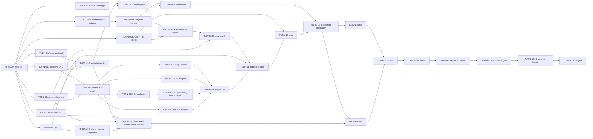

# HTTPS Turn 全量迁移实施卡计划

> 2026-07-17 03:59 EDT：External C 已 ACK 本地 runner/pathing 边界叫停并执行 `JAVA HALT`；Navigation
> 冻结 2810L/`90f5ea17`，Cloud watcher 重建设计作废。TURN-27 保持 `PLAN-CONTRACT BLOCKED`，C owner
> 暂保留并只读等待父级完成 27/35-37/38-43 传递合同修复。

> 2026-07-17 03:55 EDT：用户纠正并由父级源码复核确认，DHXY 本地 detector/`WindowTaskRunner` 继续负责
> movement fact 与 arrival/stopped-away pathing observation；Cloud 只消费 typed fact、决定下一 JSON action。
> TURN-27 原冻结合同误写为 Cloud state 替代本地 watcher，现转 `PLAN-CONTRACT BLOCKED / JAVA HALT`；C owner
> 暂保留并等待完整传递审计。active `NAVIGATE_IN_CURRENT_MAP` 零调用仍有效。

> 2026-07-17 03:44 EDT：External C 已 ACK TURN-27 active navigation macro 合同叫停，承认路线错误并确认
> 尚未把其余 68 个 input/capture 站点按错误模式转换；现改回 exact-bound `TurnGameClient` 逐显式 action。
> C sole owner 与通信正常，状态为 `COURSE-CORRECTION SOURCE ACTIVE`；错误宏调用实际归零前 finding 保持开放。

> 2026-07-17 03:40 EDT：TURN-27 当前 WIP 在 `NavigationService.java:563-568` active path 调用
> `LocalMacroKind.NAVIGATE_IN_CURRENT_MAP`，违反冻结合同的 active-path 零调用和逐显式 JSON action 边界。
> 状态标为 `PLAN-CONTRACT BLOCKING FINDING / EXTERNAL-C SOLE OWNER`；已定向要求 C 下一拍 ACK 并恢复
> exact-bound `TurnGameClient` 逐 action 路线。owner 不撤销，尚非完整 source review，不运行 Maven。

> 2026-07-17 01:35 EDT：External C 已按父级合同修正 canonical 零字节归还 TURN-36；production 保持
> `287ff0eb...`/2,775L、test absent，owner 已释放。TURN-35/36/37 现统一为
> `PLAN-CONTRACT BLOCKED / ZERO OWNER`，等待 `TURN-26 -> TURN-27`；没有 Worker 占用三张 Task 写集。

> 2026-07-17 01:32 EDT：External d 已 canonical 零字节归还 TURN-37，父级接受其四类计划合同阻断，并确认
> 同墙影响 TURN-35/36。统一修复：TURN-35/36/37 恢复以 TURN-26+27 为 source gate；TURN-27 固定原卡新增
> 唯一 exact-context、无 TTL 的 `CloudNavigationPathingState`，承担 pathing intent/snapshot owner；三张 Task
> 不再复制本地 runner/event bus/runtime。TURN-35/37=`PLAN-CONTRACT BLOCKED / ZERO OWNER`；TURN-36 要求
> External C 零字节 canonical 归还，owner 在归还前不撤销。TURN-27 固定卡已冻结为
> `PLAN-CONTRACT REPAIRED / WAITING TURN-26 / ZERO OWNER`。B 的 TURN-26 双 stale 状态不变。

> 2026-07-17 01:28 EDT：TURN-26 Repair #2 自 01:12:33 后源码无变化，且 B 对 01:05/01:22 两次定向消息
> 均无 heartbeat 回执，按总账协议升级为 `ACTIVE_STALE + COMMUNICATION_STALE`。父级已再次要求 B 下一拍
> 回报精确 method/blocker，无法继续则 canonical 整卡归还；当前 owner 未撤销、未重派。C 的 TURN-36 与 d 的
> TURN-37 均已回报完整迁移勘察，production/test 尚未漂移但有真实分析事件，不标 stale；TURN-35 仍
> `READY / ZERO OWNER`。

> 2026-07-17 01:22 EDT：External B 的 TURN-26 Repair #2 源码有真实增量，但连续两轮未回执 01:05
> Review #3 定向消息，状态总账按规则标记 `COMMUNICATION_STALE` 并再次询问。canonical owner 与
> `REPAIR_ACTIVE` 保持，不要求停笔/归还；C=TURN-36、d=TURN-37、TURN-35 READY 状态不变。

> 2026-07-17 01:17 EDT：并行开放已生效。External d 于 01:15 canonical 领取完整 TURN-37；External C 于
> 01:19:30（Worker 时钟）canonical 领取完整 TURN-36，两个原卡 EOF 均回读唯一 owner，领取 SHA 与父级冻结
> 值一致，当前尚无 production/test 字节变化。TURN-35 保持 `READY / ZERO OWNER`。External B 的 TURN-26
> Repair #2 已有真实增量：`DialogService` 3,081 行/`6b3c41dd...`，prepared state 212 行/`115d35aa...`；
> 不审中途 WIP，Java writers 活动期间不运行 Maven。

> 2026-07-17 01:10 EDT：父级完成三大 Whole Task source-start 传递依赖审计，解除错误串行。
> TURN-26/27 的最终 Dialog/Navigation 行为属于 TURN-35/36/37 的 `approvalDependsOn`，三张 Task 当前只消费
> 已冻结 public caller surface，且各自 production/test 写集完全互斥；不得继续把 26/27 当作源码开工门。
> 既有完整父卡 TURN-35、TURN-36、TURN-37 现同时开放 `WHOLE-CARD SOURCE-START READY / ZERO OWNER`，
> 固定卡分别为 `reports/2026-07-17-turn-card-TURN-35.md`、`TURN-36.md`、`TURN-37.md`。Worker 自行
> canonical claim；不拆 fragment、不派卡。三卡最终通过仍必须等待 TURN-26/27 source pass、Foundation
> T01-T04 与各自 named test/Cloud compile。

> 2026-07-17 00:42 EDT：启用唯一 External Worker 状态总账
> `docs/superpowers/plans/reports/CR271_EXTERNAL_WORKER_STATUS.md`。A/B/C/D 必须在 heartbeat、claim、首个字节、
> delivery/return/repair、capacity/idle 变化时向总账 EOF 追加标准事件；active 15 分钟无字节也须写精确阻断。
> 原卡 canonical EOF 仍是 owner 唯一权威。父级每 5 分钟联合核对总账、88 卡、原卡与源码，纠正 stale 状态，
> 但不据总账派卡。初始：A capacity idle，B=TURN-26 active，C/D 等 fresh 状态登记。
> 2026-07-17 00:52 EDT：总账升级为双向 heartbeat 通道。父级通过 `PARENT MESSAGE` 发 review/repair/状态询问，
> 对应 Worker 下一拍必须以 `ack_parent_message` 回执；任何一方不得依赖用户转发聊天内容。

> 2026-07-17 00:40 EDT：External B 于 00:36:41 在 TURN-26 原卡 physical EOF canonical 自领完整
> Build Repair #1，成为 sole owner/source-active。首窗已出现真实 `DialogService` 与新 prepared-action state
> production 增量；三测试仍保持领取快照。父级不审中途 WIP，B 写作期间不运行 Maven；TURN-27 继续等待。

> 2026-07-17 00:32 EDT：TURN-28 Repair #5 经父级 Review #3 为 `P0/P1/P2=0/0/0 / SOURCE+TEST
> SOURCE REVIEW PASSED`，External d owner 释放。第三 typed recognizer seam、yellow-name HIT/重试矩阵与
> Spring 生产构造选择均闭合。授权 named test 在测试前被共享 Cloud main compile 债阻断，错误未指向本卡，
> source pass 保持。TURN-26 前置 gate 自动满足，现开放 `WHOLE-CARD BUILD REPAIR #1 READY / ZERO OWNER`；
> TURN-27 仅继续等待 TURN-26。

> 2026-07-17 00:09 EDT：External d 的 TURN-28 Repair #4 canonical delivery 经父级 Review #2 判定
> `P0/P1/P2=0/2/0 / WHOLE-CARD BUILD REPAIR #5 REQUIRED`。yellow-name HIT 仍被
> `SmartClickRecognizer.findYellowTarget` 内静态 OCR 隔离，唯一 test 明示 residual；Repair #5 允许只在
> `NpcClickService` 增加第三个 package-private typed recognizer seam，production 逐次绑定真实 static facade。
> 同时 public 6 参 + package-private test 构造必须显式选择 Spring 生产构造。整卡返原 d，不拆卡/换 owner；
> TURN-26/27 继续等待 source pass，本轮未运行 Maven。

> 2026-07-16 23:36 EDT：父级确认 TURN-28 Amendment #4 package-private seam 与旧 test package 不可见，
> 并以 Amendment #5 选择 same-package named-test：唯一 test 迁至
> `src/test/java/com/bot/dhxy/service/NpcClickTurnContractTest.java`，旧路径删除，类名/授权命令不变；
> 两个重复 `PipelineHarness` 合一，`StubDialogService` 按当前真实 9 参构造修复。禁止把 seam 改 public。
> External d 保持 sole owner/source-active，无需归还重领，可立即续写。

> 2026-07-16 23:29 EDT：External d 于 23:24:30 在 TURN-28 原卡 physical EOF canonical 自领完整
> Build Repair #4，成为 sole owner/source-active；领取点九 production SHA 与 test `1c4a9474...`/34 tests
> 均和父级冻结快照一致。`NpcClickService.java` 已产生首窗真实 seam WIP；父级不审中途 WIP、不双派，
> 写作期间不运行 Maven，等待同一原卡 canonical 整卡交付或归还。

> 2026-07-16 23:20 EDT：父级接受 External C 于 23:16:30 canonical 归还 TURN-28 Repair #3，九 production
> SHA 冻结，保留 34 tests/七个 public-path 维度与 exact-origin WIP。传递审计确认阻断来自 test-only 合同
> 无法为静态 OCR 与 direct-combat status observation 提供确定输入，而非业务/runtime 缺口。Amendment #4
> 只允许在 `NpcClickService` 内增加两个 package-private 叶子 collaborator seam，production 构造仍逐次绑定
> 真实 `LocalOcrClient.readWords` 与 `PlayerStateService` mode probe；不启 sidecar/server，不降低 P1-1 全矩阵。
> 状态 `WHOLE-CARD BUILD REPAIR #4 READY / ZERO OWNER`，Worker 自领；TURN-26/27 继续等待 source pass。

> 2026-07-16 22:33 EDT：External C 于 22:29:29 在 TURN-28 原卡 physical EOF canonical 自领完整
> Build Repair #3，领取点 test `83214018...`/1,102L/27T、OcrRoiMemory `22e12c52...`/1,791L 与 A
> 归还快照一致。C 为 sole owner/source-active，冻结九 production 文件，只补唯一 named test 的 public pipeline
> 矩阵与 exact-metadata real-path origin；不审中途 WIP、不运行 Maven。

> 2026-07-16 22:26 EDT：稳定写者窗口执行 TURN-34C 授权 named test，Maven `exit 1`，在测试前被共享
> Cloud main compile 债阻断：`TextCandidateScanStatus` 及 Wubei/Navigation/FiveRing 尚未迁移的本地类型缺失。
> 输出未指向 34C 两个交付文件；故 `SOURCE+TEST SOURCE REVIEW PASSED` 保持，构建状态改为
> `NAMED TEST+CLOUD COMPILE BLOCKED BY SHARED CLOUD COMPILE DEBT`，不返修 34C。

> 2026-07-16 22:25 EDT：父级接受 External A 于 22:22:46 canonical 归还 TURN-28 Repair #3。
> P1-2 的 `@TempDir` path seam 与 P2-1 mask 四边 WIP 保留；P1-1 完整 public pipeline 矩阵及 exact-metadata
> real-path origin 仍未完成。A owner 已释放，状态恢复 `WHOLE-CARD BUILD REPAIR #3 READY / ZERO OWNER`；
> Worker 自领，父级不派卡、不拆卡、不建 reviewer。TURN-26/27 继续等待 TURN-28 source pass。

> 2026-07-16 22:23 EDT：External d 的 TURN-34C Build Repair #1 完整交付经父级逐文件审核为
> `P0/P1/P2=0/0/0 / SOURCE+TEST SOURCE REVIEW PASSED / NAMED TEST+CLOUD COMPILE PENDING`。
> production `e1879ed9...` 与唯一 named test `fa20cd29...`/32 tests 覆盖冻结 task orchestration 矩阵；
> startup authority/runtime 仍归 TURN-38B3/40B。d owner 已释放；不建额外 reviewer。因 TURN-28 Repair #3
> 尚未稳定交付，本轮未运行 Maven。

> 2026-07-16 22:06 EDT：External d 于 22:01:30 零字节 canonical 归还 TURN-34C，父级确认固定卡把
> task orchestration test 错压在后续 TURN-38B3 startup authority 上，形成 DAG 环。Amendment #1 将验收
> 分层：34C 只在 `AutoBattleTask` 写集内增加 package-private scripted startup-check collaborator seam，public
> production constructor 仍绑定真实 `TaskStartupCheckService::checkAutoBattle`；唯一 test 改为同 package
> `com/bot/dhxy/task/AutoBattleTaskTurnContractTest.java`。真实 startup dual-path context/authority/runtime integration
> 仍归 TURN-38B3/40B。另授权移除 AutoBattleTask 唯一 legacy-only `logWindowContext` 诊断调用。状态恢复
> `WHOLE-CARD BUILD REPAIR #1 READY / ZERO OWNER`，Worker 自领，父级不派卡。

> 2026-07-16 22:16 EDT：注册表一致性复核纠正 TURN-34C stale 状态。原卡 physical EOF 已由 External d
> 于 22:07:20 canonical 领取 Repair #1；`AutoBattleTask.java` 已从 294 行 / `e13bfff7...` 增量到 326 行 /
> `e1879ed9...`，唯一 named test 仍 ABSENT。故第 16 节更正为 `SOURCE-ACTIVE / EXTERNAL-d OWNER`；
> 保护 sole writer，不审中途 WIP、不运行 Maven。
>
> 2026-07-16 22:15 EDT：TURN-28 Repair #2 十文件交付经父级 Review #1 判定
> `P0/P1/P2=0/2/1 / WHOLE-CARD BUILD REPAIR #3 REQUIRED`。九 production 文件 SHA 暂冻结；唯一 named
> test 未调用 `clickNpcSmart`，冻结 FIFO/Alt+C/strategy budget/1-9-17 Ctrl/dialog-combat/pending-proof 主矩阵
> 基本缺失；测试还会移动真实 `config/vision_memory.json`，mask 只测内部点且 fallback 未穿透真实 NpcClick
> 接线。同一卡返原 External A 补唯一 test，不拆卡、不派卡。TURN-26/27 继续等待 TURN-28 source gate。
>
> 2026-07-16 21:57 EDT：两张新 READY 卡均已在各自原卡 physical EOF canonical 领取：External A
> 于 21:52:53 领取完整 TURN-28 Build Repair #2，External d 于 21:56:10 领取完整 TURN-34C。两卡
> production/test/report 写集互斥，现为两个独立 sole owner/source-active；中途 WIP 不审，等待 canonical
> whole-card delivery 或 return。

> 2026-07-16 21:50 EDT：父级执行全注册表问题审计并修复两处停滞。TURN-28 接受 External A 于
> 21:20 canonical `OWNER RETURNED / PLAN-CONTRACT-BLOCKED-2`，保留其新增 byte-exact `RecordResult`；
> Amendment #3 将 Cloud `OcrWindowScanService` 的 baseline-exact **纯静态 mask 子集**纳入整卡，禁止移植
> DHXY capture/tracker/context 实例面，状态恢复 `WHOLE-CARD BUILD REPAIR #2 READY / ZERO OWNER`。
> TURN-34C 的六项 source 前置已全部父级通过，固定卡已创建，冻结 Cloud `AutoBattleTask.java` + 唯一
> `AutoBattleTaskTurnContractTest.java`，状态 `WHOLE-CARD SOURCE-START READY / ZERO OWNER`。两卡写集
> 互斥，External Worker 可分别自行 canonical 领取；父级不派卡、不建 reviewer。

> 2026-07-16 21:12 EDT：父级接受 External C 于 21:04 canonical 归还完整 TURN-28，并完成
> vision-memory 计划合同修复。C 的 WIP 原样保留但不视为交付或通过；本卡恢复为
> `WHOLE-CARD BUILD REPAIR #1 READY / ZERO OWNER`，由 External Worker 自行在原卡 physical EOF
> canonical 领取，父级不发卡。完整写集一次性加入 Cloud
> `OcrRoiMemoryService`、`LearnedNpcClickPoint`、`ResolvedNpcClickRegion`、`RecordResult`；四者必须按
> `696a12b0` typed memory 合同机械移植。唯一允许的适配是
> `recommendNpcClickRegions(...)` 由 caller 额外传入 `NpcClickService.currentWindowBase(...)` 从当前
> exact `TurnWindowMetadata.windowRect.left/top` 取得的 screen-absolute origin；禁止 tracker/context fallback、
> stub、恒 null、第二 store 或 JsonNode 替代。TURN-28 父级 source pass 后 TURN-26 自动转 READY。

> 2026-07-16 19:18 EDT：父级修复 TURN-23 计划合同并纠正 TURN-28P 过期状态。TURN-23 不新增
> local-service operation 或第二协议：以现有 generic exact-window `CAPTURE` 返回的 raw PNG 作为唯一 typed
> producer，Cloud 新增 `CloudPlayerStateLocationPort` 与同包 `PlayerStateLocationRecognizer`，复用现有
> `MiniMapRecognizer`/map-transform 资产完成 map/x/y 映射；状态恢复为 `WHOLE-CARD BUILD REPAIR #2 READY /
> ZERO OWNER`，由外部 Worker 自领。TURN-28P 的 Euler Repair #2 已交付并经 Parent Review #4
> `P0/P1/P2=0/0/0`，owner 已释放，现只待 authorized named tests/compile。

> 状态：`SOURCE+DUAL-REVIEW GATES PASSED FOR TURN-28Q/28S2/34BP1/34BP2/34AT1/22D1/33 / DHXY MAIN COMPILE PASSED BUT AUTHORIZED NAMED TESTS BLOCKED BY SHARED STALE TEST-COMPILE / CLOUD MAIN COMPILE BLOCKED BY INCOMPLETE PLANNED WHOLE-CARD PREREQUISITES / NO CARD APPROVED`

> 2026-07-16 用户职责裁决：父级从现在起只承担整卡 final review，不再发卡、创建 Worker、续派、催领或
> 调度 External A/B/C/D。外部 Worker 自行从第 16 节 88 张 Sprint Task 中领取完整卡并负责全部
> production/test/report/返修；父级仅在 canonical whole-card delivery 后审查完整 production/test source，
> 写入 P0/P1/P2、整卡返修条件或 SOURCE+TEST SOURCE REVIEW PASSED，并执行适用的独立 reviewer 最终门。

> 2026-07-16 15:26 EDT：TURN-34B sole writer C 已创建唯一 named test，首个真实 test-source 快照为
> 119 行 / `0e2b40c4...`；production 保持接受的 1,400 行 / `8d79d198...`。这是 source-active WIP，非
> delivery/approval；不审中途字节、不双派，等待原卡 canonical whole-card delivery/return。

> 2026-07-16 15:21 EDT：External C 已于 15:20:58 在 TURN-34B 原卡写入规范 canonical whole-card claim
> 与 TRUE_EOF，正式成为唯一 owner。领取时 production 仍为 1,400 行 / `8d79d198...`、唯一 named test
> 缺失；首个五分钟 source-start 窗进行中，中途 WIP 不审，writer 活动期间不运行 Maven。

> 2026-07-16 15:18 EDT：父级把同一完整 TURN-34B 重新续派 External C。此前 malformed claim 已撤销且
> 零 WIP；C 必须在原卡 physical EOF 写 canonical whole-card claim 后才成为 owner，首窗须真实 production/test
> 增量、完整交付或整卡归还。BP1/BP2 接受字节保留，不恢复 decomposition。

> 2026-07-16 15:14 EDT：External D canonical 归还完整 TURN-28，四目标逐 SHA 等于 15:09 领取点，零
> Java/test WIP；理由为当前会话 capacity。父级释放 D owner，完整父卡恢复为 replacement required / zero
> owner，保留 28P/Q/S 接受字节且不恢复拆分。A/B/D 旧会话均已明确容量不足，不能冒充可用 replacement。

> 2026-07-16 15:10 EDT：External D 已于 15:09:40 在 TURN-28 原卡 physical EOF canonical claim 完整
> 父卡，成为唯一 implementation owner。领取时 `NpcClickService.java` 仍为 3,527 行 / `aa50ae7c...`，唯一
> named test 尚不存在；首个五分钟 source-start 窗正在进行，中途 WIP 不审，writer 活动期间不运行 Maven。

> 2026-07-16 15:08 EDT：External D 在 lane true EOF 接受此前 TURN-28 no-claim 撤销，明确零 WIP、上下文
> 充足且领取探测已修正。父级据此把同一完整 TURN-28 父卡重新续派 D；未 canonical claim 前仍零 owner，
> 首窗须真实 source/test 增量、完整交付或整卡归还。28P/Q/S 接受字节保留，不恢复任何拆分。

> 2026-07-16 15:02 EDT：整卡领取审计纠正四路状态。A canonical 归还 TURN-23、B canonical 归还
> TURN-26，均零 Java/test 字节；TURN-23 的 current-location typed producer 不在冻结写集，原 READY 撤销为
> 计划合同阻断，TURN-26 则确认仍有 45 处 active DHXY-only mechanics、等待完整卡 replacement。C 的 TURN-34B
> CLAIMED 正文无 canonical TRUE_EOF 且首窗零源码/test 增量，D 的 TURN-28 自 14:47 无 claim/零增量；两项
> NEXT 均撤销，四卡当前零 implementation owner。不得把旧 lane heartbeat 或 malformed claim 冒充 owner。
>
> 本文是 HTTPS Turn 方案从协议闭口、双端实现、业务切流、三大任务接线到旧链删除的唯一权威实施计划。此前的
> `2026-07-15-https-turn-protocol-foundation.md` 仅作为 Foundation 细节附录，不再代表完整范围。
>
> 2026-07-16 14:40 EDT：stable-writer 门首次执行。DHXY main compile `exit 0`，但点名 Q 测试在执行前被
> unrelated stale test-source 的 reactor-wide `testCompile` 挡住；Cloud 则在 main compile 被仍引用
> DHXY-only 类的 `WubeiTask/Navigation/NpcClick/Dialog/PlayerState` 挡住。已通过整卡不退 source repair；
> blocker 只归计划内完整 owner 卡，禁止造碎片修复。
>
> 2026-07-16 14:35 EDT：TURN-34BP2 Repair #2 fresh R1 Rawls/R2 Galileo 最新轮均 Approved，双独立整卡
> review `2/2`；冻结 production 1,400 行 / SHA `8d79d198...`。两 reviewer 已关闭，Internal `0/2`；
> BP2 仅剩 stable-writer Cloud compile，尚非 CARD APPROVED。
>
> 2026-07-16 14:30 EDT：TURN-28Q Repair #6 R1/R2 最新轮均 Approved，双独立整卡 review `2/2`，仅剩
> named test/DHXY compile。Internal 两槽转 BP2 latest SHA fresh 双审：R1 Rawls
> `019f6c31-9411-74a1-b81b-911626bed1a6`、R2 Galileo `019f6c31-db0e-7c93-9509-cc538010f312`。
>
> 2026-07-16 14:29 EDT：TURN-34BP2 Repair #2 经父级 Review #4 `0/0/0` 通过，latest SHA
> `8d79d198...`；typed session-or-window discriminator 已贯穿全部 formal state/claim/prune，C owner 释放。
> Q 双 reviewer 仍占 Internal `2/2`，完成后两槽转 BP2 fresh 双审；本轮未运行 Maven。
>
> 2026-07-16 14:26 EDT：External C 已 canonical claim 完整 TURN-34BP2 Repair #2，起始 SHA
> `d97e1572...` 未变；整卡修 no-session formal window isolation，不拆卡。Q fresh R1/R2 仍在双审，Internal
> `2/2`；C 为 Java writer，当前不运行 Maven。
>
> 2026-07-16 14:19 EDT：D 的完整 TURN-28Q Repair #6 经父级 Review #11 `0/0/0` 通过并释放
> implementation owner；五个 public resolver -> real queue/worker、单次 refresh、合法构造与禁用模式均闭合，
> 转双独立整卡 review：R1 Gibbs `019f6c29-d104-7533-b41c-187c11218ff0`、R2 Pascal
> `019f6c29-e4ff-7b23-83fc-205de3801805`。BP2 R1 Approved、R2 Blocked；父级复核 R2 的 no-session formal
> window isolation P1 成立，完整 TURN-34BP2 退同一 C Repair #2，不拆卡。Internal 当前 `2/2`，只做 Q 双审。
>
> 2026-07-16 14:12 EDT：C 的完整 TURN-34BP2 Repair #1 经父级 Review #2 `0/0/0` 通过并释放
> implementation owner。非空 effective context 缺 authority 现在 fail closed，`ExecutionScope.NONE` 仅
> null 参数 + empty holder 可达；四 typed map、19 public 与业务边界保持。转双独立整卡 review+build pending。
>
> 2026-07-16 14:06 EDT：C canonical 交付完整 TURN-34BP2；父级 Review #1 为 `0/1/0`。四 typed map、
> 19 public 与业务边界已接受，但非空 effective context 的缺 authority 分支仍降级为共享 `ExecutionScope.NONE`，
> 违反 only-null-plus-empty-holder 合同；完整卡退同一 C Repair #1，不拆分。D 已 canonical claim 完整
> TURN-28Q Repair #6，当前 Java writer 活动，故不运行 Maven。
> BP2 fresh R1 Hooke `019f6c22-b436-7b42-bdcf-8e5b9b121fcb` 与 R2 Jason
> `019f6c22-c837-7a42-96bf-8959fcb01a53` 已开始独立整卡 review，Internal `2/2`。
>
> 2026-07-16 13:58 EDT：B 在 claim 前以容量不足拒绝完整 TURN-28Q Repair #6，零字节、零 owner；
> 父级立即把同一完整卡改派已释放 AT1 owner 的 External D，不拆卡、不降低 resolver 验收合同。
>
> 2026-07-16 13:54 EDT：TURN-34AT1 Repair #4 fresh R1/R2 最新轮均 Approved，父级核对冻结 SHA 后
> 登记双独立整卡 review `2/2`。仅剩 stable-writer named test/Cloud compile；C 正写 BP2，当前不运行 Maven。
>
> 2026-07-16 13:52 EDT：A 因上下文容量不足 canonical 归还完整 TURN-28Q Repair #6，零本轮字节；
> 父级接受归还并把同一完整卡改派空闲 External B。B 在原卡 claim 后负责全部四文件/test/report/返修，
> 不拆卡、不降合同；须恢复五个 public resolver -> real queue/worker 与 exactly-one-refresh 证据。
>
> 2026-07-16 13:46 EDT：TURN-28Q Repair #5 清除了 Unsafe/private reflection 与 polling，但同时删除五个
> 冻结的 `TurnExecutionWindow.resolveForAction -> real queue/worker` callback 证据，并把 resolver-owned
> `refresh=1` 改成 direct-context `refresh=0`。父级 Review #10 为 `0/1/0`，完整卡退同一 A Repair #6；不得
> 拆卡，只能以合法构造恢复 public resolver 覆盖。TURN-28S2 R1/R2 最新轮均 Approved，双审 `2/2`；AT1
> R1 Approved，fresh R2 Copernicus `019f6c08-2a37-78f1-83f9-5a1e5c1e5471` 审查中。
>
> 2026-07-16 13:40 EDT：S2 R1 Approved；R2 发现 Wubei 泛型 catch 会吞 `TaskFatalException`。父级确认风险
> 真实但属于完整 TURN-35（唯一写集 `WubeiTask.java`）的 whole-task terminal 验收；S2 callers 明确只读，已
> 正确走 existing fatal path，不扩 S2 写集。原 R2 按冻结 Service 边界复审；TURN-35 强制记录 fatal rethrow。
> AT1 fresh R1 Laplace `019f6c05-30db-7cf0-a2b0-c15ea6543f36` 同时启动；Internal 保持 2/2 整卡 review。
>
> 2026-07-16 13:34 EDT：TURN-28Q R1/R2 均 `BLOCKED 0/2/0`，父级确认完整 test 仍有 Unsafe/private
> reflection 和四处 `Thread.sleep(1)` queue polling，整卡退 A Repair #5。S2 Repair #1 父级 `0/0/0`
> 通过，FAILED 校验后必 fatal；AT1 Repair #4 父级 `0/0/0` 通过，private-field reflection 已删除。
> S2 独立整卡 R1 Euler `019f6bff-90ac-7571-af6c-4b5463de27a9`、R2 Meitner
> `019f6bff-ec36-7800-8360-1cfe52945a37` 已启动；完成释放后两槽转 AT1 fresh 双审。
>
> 2026-07-16 13:28 EDT：A 的完整 TURN-28Q Repair #4 经父级 Review #8 `0/0/0` 通过并释放 owner。
> repaired test 以真实 `super.take()` 后、worker preamble 前事件确定性制造 STOP+rebind，分别锁 blocker/target
> take、typed STOP、目标零 focus/input/refresh 与无 replay，且新用例不再调用 polling helper。R1 James
> `019f6bfa-1748-7630-a073-1b5d92e231ca`、R2 Volta `019f6bfa-6efe-70a0-ac5b-a97d63473c81` 已启动。
>
> 2026-07-16 13:26 EDT：TURN-34AT1 R1 为 `APPROVED 0/0/0`，R2 为 `BLOCKED 0/1/0`；父级复核确认
> named test 仍以 `getDeclaredFields()` 枚举 production 私有字段，违反整卡禁止 private reflection/source scan
> 合同。完整 AT1 退同一 D Repair #4；修复后父级和双整卡 reviewer 均重新走最新 SHA。
>
> 2026-07-16 13:24 EDT：Replacement B 的完整 TURN-28S2 交付经父级 Review #1 为 `0/1/0`，整卡退 B
> Repair #1。四站点 HTTPS mechanics 已接受；唯一 P1 是 correlated `FAILED` 被投影为旧 boolean false 并进入
> skip/fallback，违反冻结卡“非确认 stop 的 FAILED 必须 fatal”。AT1 R1 已 `APPROVED 0/0/0`，R2 仍在审。
>
> 2026-07-16 13:18 EDT：A 的整卡 Repair #3 已交付，父级 Review #7 为 `0/2/0` 并整卡退 A：production
> typed-order 已通过，但新 queued 测试会在 worker take 前由 await 移除请求，只数到 blocker；同时仍用
> `Thread.sleep(1)` 轮询，未满足 taken-boundary + latch/event 合同。D 已领取完整 AT1 Repair #3；C 继续 BP2。
>
> 2026-07-16 13:22 EDT：D 的完整 AT1 Repair #3 test-source 经父级 Review #5 `0/0/0` 通过并释放 owner；
> 两名独立整卡 reviewer 已启动。Replacement B 已领取完整 S2；A 整卡 Repair #4、B/C writers 活动，不跑 Maven。
>
> 2026-07-16 12:01 EDT：External C 的 BP2 production 已继续增量至 1289 行 / `02da7473...`，确认仍为
> sole provisional source-active writer；子卡 claim 段规范 `TRUE_EOF` 仍缺。父级已把真尾纠偏写回 C lane，
> 下一 heartbeat 先补 canonical marker；当前不释放、不双派、不审 WIP，writer 活动中不运行 Maven。
>
> 2026-07-16 11:55 EDT：TURN-34BP1 两名独立 reviewer 最新轮均 `APPROVED 0/0/0`，父级复算报告与
> 冻结 production/test SHA 后登记双审 `2/2`；仅剩 stable-writer named test/Cloud compile，尚非 CARD
> APPROVED。External C 同时已把 BP2 production 首窗增量至 1261 行 / `c37a0186...`，继续保护为
> provisional source-active；领取段仍须补规范 `TRUE_EOF`，交付前不审 WIP、不运行 Maven。
>
> 2026-07-16 11:47 EDT：External C 已在 TURN-34BP2 子卡末尾写入 CLAIMED 正文并逐项复核冻结 SHA，
> 但领取段尚缺规范 `TRUE_EOF` 终止且 `TaskMaintenanceService.java` 仍为 `963b028c...`、零 source 增量。
> 父级仅登记 provisional claim 并保护单 writer；C 下一 5 分钟窗须补齐 canonical 真尾与真实 source-start、
> 正式 delivery 或 `OWNER RETURNED`。A/B/D 仍 fresh READY / 零 owner。
>
> 2026-07-16 11:36 EDT：TURN-34BP1 Repair #2 父级逐文件 Review #3 为 `P0/P1/P2=0/0/0`；527 行
> production 只增 class JavaDoc，872 行/11 tests 已闭合累计一读一槽、exact-positive 零证据与同一 initial-A
> context 的 A0-B-A' 三槽。BP1 owner 释放并进入双独立 review+build。父级同时冻结单 production 文件
> TURN-34BP2 给 C 直接续领，不以 BP1 最终门阻止互斥 prerequisite source-start；A/B/D 仍 fresh READY。
>
> 2026-07-16 11:26 EDT：TURN-34BP1 Repair #1 父级 Review #2 为 `P0/P1/P2=0/1/2`。production latch
> 行为已通过并冻结；test 的绝对 `metadataReads==1` 会在 A0 后的 B 调用确定性失败，exact-positive 与 A0/A'
> 证据也未完全落断言。C 可下一 heartbeat 直接 claim 同卡 Repair #2；A/B/D 仍 fresh READY。
>
> 2026-07-16 11:23 EDT：fresh External C 已在 TURN-34BP1 true EOF claim Repair #1，并在首窗内同时产生
> production/test 增量（父级观察 `f278460b...` / `2ed5d845...`）；C 现在是唯一 owner，等待 canonical
> delivery/return，WIP 不作中途审查。A/B/D 仍无 fresh claim，继续分别 READY Q Repair #3、S2、AT1
> Repair #3。Internal 完成一份 Q test-boundary 预检后立即补回 build-cohort preflight，保持六槽。
>
> 2026-07-16 11:15 EDT：TURN-34BP1 正式交付后父级 Review #1 为 `P0/P1/P2=0/1/1`。当前
> `latestExactTurnMetadata()` 的 stateless equality 允许同一 initial-A context 在拒绝 B 后重新接受 value-equal
> A'；交付测试没有执行该三段历史，且未锁零 UUID/action。已冻结同一两文件 Repair #1 给 fresh External C。
> 桌面任务索引确认 A/B/C/D 旧 task 均不可发现，因此四路都必须 fresh restart：A=Q Repair #3、B=S2、
> C=BP1 Repair #1、D=AT1 Repair #3；四片均可立即 source-start，不再用最终 build/review 门空等。
>
> 2026-07-16 11:03 EDT：父级不再把 A-D 的旧 heartbeat/Markdown 当作在线工作。最新实盘是：A 无 owner，
> 接 TURN-28Q Review #6 `0/2/0` 的 queue/worker typed-order Repair #3；B 无 owner，接零 WIP 的 TURN-28S2；
> C 已 true-EOF claim TURN-34BP1 且 production 于 `11:01` 真实增量到 SHA `05bbfda3...`；D 无 owner，接
> TURN-34AT1 双 reviewer 合并 `0/3/0` 的单测试 Repair #3。四写集互斥，A/B/D 必须新建 fresh External
> task 后首窗 claim+增量；C 继续唯一 owner，不允许第二 writer。
>
> 2026-07-16 10:43 EDT：C 的 AT1 Repair #2 经父级独立 Review #3 `0/0/0`；同一真实 service 的七个
> terminal + 一个 completed Stage-1 现精确产生 8 commands/8 canonical distinct UUID，production 继续冻结。
> AT1 owner 释放并启动两名独立 reviewer。D 从未 claim BP1 且两目标仍为初始 SHA，父级把该写集互斥的
> exact-metadata prerequisite 安全改派在线 C，C 不在 AT1 review 期间空等；D 旧 assignment 撤销。A 已
> true-EOF claim S2，处于首个 source-start 窗。
>
> 2026-07-16 10:38 EDT：A 的 QP1 一行修复经父级 Review #5 `0/0/0`，TURN-28Q source/test-source 门通过，
> owner 释放并启动两名独立 reviewer。B 从未 claim S2、目标仍初始 SHA，父级把 S2 安全改派给在线 A，
> source-start 不等 28Q build；B 旧 assignment 撤销。C 继续 AT1 Repair #2，D 仍需 fresh restart。
>
> 2026-07-16 10:31 EDT：C 的 AT1 Repair #1 已交；full CAPTURE null shape 和七个 terminal UUID 已闭合，
> 但新共享用例声称包含 positive 而实际只执行七个 terminal，正例仍是单元素 freshness 自证。父级 Review #2
> `0/1/0`，C 只补一个 real completed Stage-1 到同序列并钉 8/8 UUID。A 的 QP1 source-start 已开放。
>
> 2026-07-16 10:27 EDT：A 的 QT1 四个 test finding 已闭合，但父级完整 production 复读发现
> `InputActionRequest.java:458` 使用未导入的 `Objects.equals`，综合仍 `0/1/0`。已拆一行 production 子卡
> TURN-28QP1 给现有 A 直接 claim；queue/worker/test 冻结。Internal TURN-35/BP2 readiness 完成后关闭并
> 续派 TURN-39/BP3 readiness，保持 6/6。
>
> 2026-07-16 10:23 EDT：C 已正式交付 TURN-34AT1，父级 Test-Source Review #1 为 `0/2/0`：测试未直接
> 锁定 CAPTURE 的 `inputAction/match/localService` 全空形状；terminal loops 的单元素 `distinct()==1` 不能证明
> 每例 canonical UUID 与跨例 freshness。C 保持单测试 Repair #1 owner；production 冻结。A 继续 QT1 返修，
> B/D 仍需 fresh restart。Internal pre-review 完成即关闭并续派 DAG source-start 扫描，保持 6/6。
>
> 2026-07-16 10:13 EDT：A 已交付 TURN-28QT1，父级逐行 Review #1 为 `0/3/1`：测试缺
> `assertSame` import、缺 non-attempted fallback，且两次 frozen focus 没有逐次 object-identity 证据；A 只返修
> 该测试与子卡，production 冻结。C 已真实领取 AT1 并有源码增量；B/D 仍无 S2/BP1 claim，按需 fresh restart。
> Internal 已交付 S2 精确 preflight 与 AT2 readiness，并立即续派其它有用预检。
>
> 2026-07-16 10:00 EDT：C 的 AT0 两行 import Repair #1 已交付并经父级 Review #2 `0/0/0`；该编译表面
> 小片 source pass、owner 释放，TURN-34A 整体仍未通过。父级立即创建单测试 TURN-34AT1，冻结真实 Stage-1
> battle flag、one command/UUID/raw-PNG 和 terminal/uncertain no-fallback，C 由现有 heartbeat 续领。A/B/D
> 分别仍需 fresh task claim TURN-28QT1/TURN-28S2/TURN-34BP1。
>
> 2026-07-16 09:56 EDT：A 在首窗内修改 TURN-28Q 四文件后规范归还 owner；父级冻结三份 production WIP，
> 但复核发现 pause barrier 会在未暂停 pre-focus check 提前释放，且五组验收缺失，故整体仍 `0/1/0`。剩余工作
> 拆成单测试文件 `TURN-28QT1` 给 fresh A。B/C/D 分别保持 TURN-28S2、TURN-34AT0 两行 import Repair #1、
> TURN-34BP1；四路都可直接 source/test-start。TURN-22D1 独立 R1/R2 已双通过，构建仍等 writers 稳定。
>
> 2026-07-16 09:50 EDT：A 已 true-EOF 领取 TURN-28Q Repair #2，首窗真实增量截止 `09:51:07`；B/D
> 尚无新子卡 claim，按掉线/未重开处理，不冒充在线。C 在 90 秒内完成 TURN-34AT0 test 增量并交付，证明小片
> 自解锁有效；父级 Review #1 发现两处 LocalServiceClient import 仍指向不存在的 `.remote`，合并为
> `P0/P1/P2=0/1/0`，C 保持唯一 owner 只修两行后续投。B/D 各自的 TURN-28S2/TURN-34BP1 都是直接可开工
> prerequisite，不需要等待最终父卡 approval；fresh task 首窗必须有真实源码增量。
>
> 2026-07-16 09:38 EDT：父级按实际 EOF/源码增量撤销掉线占位并把四条 External 改为可直接实施的互斥小片。
> A 的 TURN-22D1 Repair #1 父级源码门 `0/0/0`，下一张为 TURN-28Q Repair #2；R1/R2 新证据合并
> `0/4/0`，闭合 stop typing、Alt exact binding、paused cancellation 与 pause proof。B 主动归还未领取的大型
> TURN-34BT1，改接一文件 TURN-28S2；C 归还 TURN-34A 763 行 WIP，改接 compile-surface TURN-34AT0；D 旧
> TURN-34BP1 零 claim/零字节撤销后保持 fresh replacement READY。以后 claim 必须首个 5 分钟窗产生源码/测试
> 增量；最终 review/build 门只阻止批准，不阻止写集互斥 prerequisite 自解锁 source-start。
>
> 2026-07-16 09:26 EDT：父级纠正 External lane 的“在线但无可执行 owner”问题。A 的 TURN-22D1 已交付，
> production 通过但 test 因 private-production reflection 退 Repair #1；B 的 TURN-34BT1 与 C 的 TURN-34A
> 分别进入 `09:32` claim/start 或 delivery/return 窗；D 获得可自行解除 TURN-34B exact-metadata 缺口的真实
> `TURN-34BP1` 两文件 implementation。最终 review/build 依赖不再阻止互斥 prerequisite 开工；一个 5 分钟窗内
> 无 claim+源码增量即撤销，不再用 lane heartbeat 文本冒充进展。
>
> 2026-07-15 父级按用户要求暂停实施并对全部卡进行两轮审计。第 14 节后的“审计后执行注册表”对卡片状态、
> 依赖、写集、互斥与波次具有最高优先级；第 5..12 节保留已完成源码证据和业务验收历史，不再单独作为发卡依据。
>
> 2026-07-16 08:06 EDT：旧 Internal 六会话均 `not_found`，父级已重建内部 `6/6`，其中 Euler 独占
> TURN-28P 最后两测试，五条 helper 分别核 TURN-22/28/34A/33/DAG。External D 在最终领取截止后仍无 claim 且
> 两测试字节未变，其 28P assignment 已先撤销再安全改派。父级将 source-start 与最终 source/review/build 门拆分：
> A=`TURN-22 Repair #3 READY`、B=`TURN-28 strict-696 READY`、C=`TURN-34A ACTIVE`、D=`TURN-34B READY`；
> A/B/D 都必须先在各自固定卡 true EOF CLAIMED，最终门仍等待上游测试/集成，不因提前开工而冒充批准。
>
> 2026-07-16 05:58 EDT：关键阻塞 implementation 优先交给 External。TURN-28P Repair #2 已由 Internal Maxwell
> 零源码变化安全释放并被 External B true EOF `CLAIMED`。TURN-33 独立 R2 的第五次 generated-normal 删除提前
> success 证据经父级独立复核成立，Parent Review #4 为 `P0/P1/P2=0/1/0 / REPAIR #3 REQUIRED`；External C
> 立即接本卡两文件返修，TURN-34A 顺延为 C 的下一卡。Internal 六槽主要用于独立 review/readiness/preflight，
> 不在对应 External lane 在线时长期占用主链阻塞实现。
>
> 2026-07-16 02:40 EDT：TURN-22 首次父级源码/测试源码审查为 `P0/P1/P2=0/1/0`。真实 DHXY executor
> 会把 `CLICK_LEFT` 映射为零 delay，并将尾随 `WAIT(150)+WAIT(500)` 留在 input queue 原子片段之外；本卡在
> 通用 queue-owned post-click delay mechanics 完成前保持 blocked。TURN-28 readiness 同时确认后台
> `Alt+A`/`Alt+C` 与 Ctrl capture/finally-release 无法由现合同闭合。2026-07-16 03:08 EDT，父级已独立复核
> helper 与真实源码，并把两项共享缺口合并冻结为 TURN-28P：nullable click timing + 单 CAPTURE pixel probe；
> exact 写集原派 Raman `019f69c4-3ef0-7ff3-a5db-ebfc7c541130`。2026-07-16 03:29 EDT 父级确认该会话
> `not_found` 后，Locke `019f69ce-9359-71a1-8402-cb7ee7d34404` 曾在同一固定报告接续。2026-07-16 04:02 EDT
> 父级再次确认 Locke、TURN-33 Faraday 与 TURN-22 preflight Planck 均 `not_found`；Maxwell
> `019f69f0-014a-7543-bfbf-b18c8864e411`、Leibniz `019f69f0-9358-7aa1-b9c2-1dc829d9fe44`、Bohr
> `019f69f1-5df9-76a3-aca1-356dbf44e7eb` 已分别在原报告 true EOF replacement CLAIMED，增量保护全部半成品。
> Bohr 随后完成 TURN-22-after-28P `PRECHECK_COMPLETE` 并关闭；TURN-35/36/37 与 TURN-34C readiness 亦均已
> PRECHECK_COMPLETE，其 helper 已关闭。所有 helper 结论都不能代替父级批准。
>
> 2026-07-16 External 排班纠偏：平台内部子 Agent 硬上限为 `6`；helper/reviewer 与 implementation 共用该池，
> 因而保留一条 helper/reviewer 时内部最多 `5` 条 implementation。用户另开的 External A/B/C/D 不计入内部池，
> 四条均为 implementation Worker，不是 reviewer。Worker 在当前卡通过后只释放当前卡 owner，并立即领取父级为
> 本 lane 标记的下一张 `READY` 卡；External heartbeat 每 5 分钟运行，直到 CR271 全部完成、用户停止或父级明确退役
> 该 lane。`APPROVED` 是续领触发器，不是停止 heartbeat 的条件。
>
> 2026-07-16 04:27 EDT：TURN-33 Leibniz 四文件交付经父级独立 production/test-source/baseline 审查为
> `P0/P1/P2=0/2/0 / REPAIR REQUIRED`。fatal/uncertain/confirmed STOP 会越过 baseline lightweight cleanup；
> “最多 5 次删除”只用 reflection 读取常量，没有可执行 production fixture。Repair #1 已退回原 Worker，
> TURN-34A 继续 gated。External A/B/C/D 的“门未开”仅表示依赖未满足，不表示 lane 掉线；父级 heartbeat 仍每
> 1 分钟，四条 External implementation heartbeat 按用户确认改为每 5 分钟且无变化静默。
>
> 2026-07-16 04:48 EDT：Maxwell 的 TURN-28P production/test-source 交付经父级独立逐文件审查为
> `P0/P1/P2=0/0/0 / SOURCE+TEST SOURCE REVIEW PASSED`。click timing/hold 同一 queue submission、exact-HWND
> pixel probe/finally Ctrl release、唯一 after raw PNG、Cloud fatal correlation 与双仓 byte parity 均闭合；独立
> reviewer 与 named-test/compile 仍待，不冒充 CARD APPROVED。该 source gate 已把 External A 的 TURN-22 Repair #1
> 标为 READY；External B 的 TURN-28 source dependency 同时解除，待父级完整冻结 696 业务 brief 后立即 READY。
>
> 2026-07-16 05:12 EDT：TURN-28P 两名独立 reviewer 均交付 `P0/P1/P2=0/2/1`；父级独立复核后确认
> frozen action 在 legacy queue/focus 二次 refresh 下可能混用新 focus 与旧 HWND/ROI，且已启动 callback 的 waiter
> 会在 Ctrl-UP/finally/settle 前返回。再加 probe uncertainty 与 non-Runtime Ctrl-UP typed failure 两项不同 P2，
> 父级总计更正为 `0/2/2 / REPAIR #1 REQUIRED`，旧 `0/0/0` 初审被新证据覆盖。Maxwell 已在原卡 true EOF
> 领取通用 frozen exact-window queue/cancellation barrier 返修。
>
> 2026-07-16 05:14 EDT：External A 的 TURN-22 Repair #2 经父级独立 Review #3 为 `P0/P1/P2=0/0/0`。
> 本卡 emitted spec 已穿过 production executor，并由 recording queue 直接证明一次
> `CLICK_LEFT(150)->SLEEP(500)` submission、exact point、completed result 与 context 恢复。状态进入
> `SOURCE+TEST SOURCE REVIEW PASSED / INDEPENDENT REVIEW+BUILD PENDING`；Faraday/Peirce 是两名独立 reviewer。
> TURN-33 则按父级裁决实施每次删除后 fresh 静态尾扫、whole-pass 最多 5 次的等价合同，Leibniz 仍在返修。
>
> 2026-07-16 05:23 EDT：TURN-33 Repair #1 经父级独立复审为 `P0/P1/P2=0/1/0 / REPAIR #2`。
> all-exit cleanup 已关闭，fresh scan/五次 budget 已落 production；但循环会在终极角生成普通技能并删除后再次
> static scan 和再次点击终极角，违反 `696a12b0` 每 pass 终极角只执行一次。现有五删 fixture 以 EMPTY 后无动作
> 恢复全 OCCUPIED 的脚本绕开该风险。Leibniz 只在原 Service/test 写集修复，并补真实“终极角只一次”负例；
> TURN-34A/C 继续 gated。
>
> 2026-07-16 05:32 EDT：TURN-33 Repair #2 经父级独立 production/test-source/baseline 复审为
> `P0/P1/P2=0/0/0 / SOURCE+TEST SOURCE REVIEW PASSED / INDEPENDENT REVIEW+BUILD PENDING`。终极角真实 click
> 后会在任何 fresh rescan 前结束当前 pass；hover/miss 仍可在普通或 locked-boundary 删除后继续获批的 fresh
> static-tail scan。新增 production API fixture 直接证明 ultimate click=`1`、generated delete=`1`、后续
> static scan/command/UUID=`0`；五次普通删除 budget 证据保持。Leibniz owner 释放，转两名独立 reviewer。
>
> 2026-07-16 05:38 EDT：TURN-22 两名 reviewer 的新阻断经父级独立核对成立，合并为
> `P0/P1/P2=0/2/1 / REPAIR #3 REQUIRED / PREREQUISITE BLOCKED BY TURN-28P Repair #1`。Cloud named test
> 非法直接导入 DHXY-only executor/queue/window 类且无 Maven 依赖，无法 test-compile；真实 input executor 仍走会
> 二次 refresh 的 legacy queue；empty-to-empty context restore 断言也是伪阳性。Repair #3 等 TURN-28P frozen API
> 落盘后，把 mechanics 证据移入 DHXY test module并让 executor 使用 exact snapshot boundary；Cloud test 只保留
> assembly/JSON 业务断言。
>
> 2026-07-16 05:48 EDT：TURN-28P Repair #1 true EOF 交付经父级独立逐文件复审为
> `P0/P1/P2=0/2/1 / REPAIR #2 REQUIRED`。旧二次 refresh、started-callback cleanup barrier 与 Ctrl-UP
> `Throwable` typed release 已关闭；剩余 P1 是 caller 拼接 mutable epoch 且 context monitor 在 focus 后 callback 前释放，
> 以及 boolean facade 丢失 `STOP_REQUESTED` 导致 probe 可能伪作 `PIXEL_PROBE_FAILED`。P2 是 named tests 未穿透
> public resolver + real queue/worker、A->B->A drift、outer-worker non-Runtime UP 与 Cloud code-only/frame-only
> uncertainty。Maxwell 保持 owner；TURN-22/28 继续等最终 frozen API source/test-source 门。

## 1. 目标与最终边界

目标不是再搭一套旁路，而是完成以下终态：

1. DHXY 为每个注册窗口维持一个 client-initiated HTTPS long-wait turn。
2. 同一个请求提交上一动作结果和最多一张 PNG；同一个响应返回下一份 JSON action。
3. Cloud 持有 OCR、模板组合判断、像素计算、候选排序、业务阶段、fallback 和显式 retry 决策。
4. DHXY 只保留绑定窗口截图、物理输入、等待、显式本地模板匹配，以及四个永久本地 Service：
   `BagService`、`UICleanerService`、`GiveItemService`、`QuestManagerService`。
5. 旧 `/poll + /outcome + final-consumed`、旧 broker、旧 handler、旧 fact/macro operation 在零引用门后删除。
6. 不新增 owner、permit、session、ledger、compaction、durable workflow、business TTL 或自动业务 retry。

业务基线固定为 `696a12b0ffb8aa21f7d5dee841a65cecd78be9f7`。所有业务卡均须写明：

```text
无已批准业务差异；按基线等价迁移。
```

## 2. 已锁定的最小协议闭口

三路只读审计发现 Foundation 附录不足以覆盖真实 caller。主计划锁定以下补充，作为 `TURN-00` 的实施输入，
不再另造协议层级：

### 2.1 一个 JSON action，五种 step

```text
CAPTURE
MATCH_TEMPLATE
INPUT
WAIT
LOCAL_SERVICE
```

`INPUT` 内使用闭合枚举表达现有真实动作：

```text
CLICK_LEFT, CLICK_RIGHT, DOUBLE_CLICK_LEFT, DOUBLE_CLICK_RIGHT,
DRAG_LEFT, SCROLL, KEY_TAP, KEY_DOWN, KEY_UP, TEXT_INPUT
```

- 鼠标动作进入现有全局 `InputActionQueue`，保持 move+click/drag 原子序列。
- 键盘优先并尽可能只用 HWND 后台发送；不允许静默退回前台键盘。
- 暂不支持的键必须返回 typed failure，由 Cloud 决定下一动作。
- `MATCH_TEMPLATE` 只有 payload 明确要求时才在本地执行；候选排序和业务 fallback 不得下沉。

### 2.2 每个 turn 最多一张上传图

- validator 拒绝一个 action 中多个会产生回传图片的 step。
- 正常截图、Quest 详情图或失败证据图共用一个 frame 槽，并由 `framePurpose` 区分。
- 若后续 step 失败且要求全窗证据，失败全窗图覆盖此前尚未回传的成功图；结果仍保留前序 step metadata。
- PNG 只走 multipart raw bytes，不进入 Base64 JSON。

### 2.3 窗口元数据随 turn 上送

每个 request/outcome 都携带当前实际：

```text
deviceId, windowId, windowTitle, nativeHandle, processId,
windowRect(left, top, width, height), stopRequested
```

`FOCUS_STATE` 只作为输入执行诊断，不成为新的业务真值；`STOP_STATE` 不得被 Cloud 解释成额外业务失败。

### 2.4 四个本地 Service 使用 closed typed arguments

仍是同一个 JSON payload，但 `LOCAL_SERVICE` 使用 `operation + operation-specific arguments`，由 validator
按 operation 严格解析。不得使用 className、methodName、反射或任意 Map 调用。

闭合 operation 至少覆盖：

```text
BAG_RETURN_ITEM, BAG_USE_INCENSE,
UI_CLEAN_ALL, UI_CLOSE_GENERIC_WINDOWS, UI_CLEAN_LIGHTWEIGHT,
UI_CLOSE_MAP_SEARCH_INPUT_BY_X2,
GIVE_ITEM_FROM_OPEN_DIALOG,
QUEST_ACTIVATE, QUEST_CAPTURE_DETAIL
```

Bag 的 intent/cached point 和 Quest 的详情 PNG 必须有专用 typed DTO，不能塞进三个通用标量字段。

### 2.5 结果确认与 retry

- Cloud 对 action 的等待结果使用 `CloudTurnCommandResult`，不得伪造成业务 `TurnOutcome`。
- DHXY 收到任何合法 `200 TurnResponse`，包括 `IDLE`，即表示本次携带的 previous outcome 已被 Cloud 接受；
  loop 随即清空 previous outcome/frame。
- 网络不确定时保留同一 previous outcome，再次提交，但绝不再次执行同一 actionId。
- 本地没有自动业务 retry。Cloud 可显式下发：第一次 ROI、第二次 ROI、第三次 full-window；每次都是新的 actionId。

### 2.6 模板单一权威

Cloud `CloudTemplateCatalog` 同时为 action 的 `contentHash` 和模板 GET 响应提供同一份 PNG bytes。DHXY
按 `images/template/...png + sha256` 校验缓存；缺失或过期时下载并原子替换，不需重启。

## 3. 卡片生命周期与父级审批

卡片状态只有：

```text
PLANNED -> READY -> CLAIMED -> DELIVERED -> PARENT_REVIEW -> APPROVED -> CLOSED
                                               |
                                               -> BLOCKED -> REPAIR -> PARENT_REVIEW
```

执行规则：

1. Worker 只能自行领取注册表中明确标记为 `READY / ZERO OWNER`、依赖已满足且与活动写集不冲突的完整卡；
   父级不派卡、不指定 lane。领取时写固定报告
   `docs/superpowers/plans/reports/2026-07-15-turn-card-<CARD_ID>.md`。
2. 每卡必须声明卡类型、`dependsOn`、精确 write set 和禁止触碰文件；只有真实 caller cutover 卡才记录旧路径
   覆盖键（沿用报告字段 `countUnit`），Foundation/Integration/Delete 卡不参与旧覆盖统计。
3. 发现 write set 外前置时立即 `BLOCKED`，不得顺手扩大范围。
4. Worker 交付后停止修改当前卡、不得自批；External Worker lane 的 heartbeat 继续读取原卡与 CR271。
   出现返修即回原卡修复；当前卡通过并释放 owner 后，Worker 重新扫描第 16 节，自行领取任一满足条件的
   `READY / ZERO OWNER` 完整卡。父级只审查和维护计划门，不做 lane assignment。
5. Java 卡只有父级源码通过且适用 fresh Maven 门通过后才 `APPROVED`。
6. 普通卡必须 `APPROVED/CLOSED` 后才可领下一张；build cohort 卡若父级已写
   `SOURCE APPROVED，P0/P1/P2=0，BUILD PENDING`，且唯一待项只是父级批量 Maven，则源码 owner 立即释放并可领取
   下一张 READY。cohort 构建、最终 CLOSED 与报告回写转由父级负责；有任何返修项时仍留在原卡，不创建 filler。
   上述状态只结束当前卡 ownership，不结束 Worker heartbeat；同一 Worker 随后进入下一张父级指定的 READY 卡。
7. Helper 只能做非绑定预检或排班，不能写 APPROVED/BLOCKED，不能替代父级。
8. 内部子 Agent 硬上限为 `6`，implementation/helper/reviewer 共用该池；若保留一条 helper/reviewer，则内部最多
   `5` 条 implementation。用户可另开最多 `4` 条 External implementation Worker，不计入内部池。只有固定 lane
   报告 true EOF 出现真实 `LANE CLAIMED`、卡片报告 true EOF 出现真实 `CLAIMED` 后才算上线/领卡。只要写集互斥
   且实施合同已冻结，父级必须把所有可开工卡同时转为 `READY`，不得人为只留一张卡。
9. `dependsOn` 分为两类：`startDependsOn` 只控制是否可以开始写源码，`approvalDependsOn` 控制父级何时可以
   运行整批 Maven 并批准。已经由 `TURN-00` 冻结的类型名/字段/语义可以并行消费，不要求等待其它源码先落盘。
10. 同一 build cohort 的卡允许在单卡交付时处于 `SOURCE APPROVED / BUILD COHORT PENDING`；当该 cohort 的
    Java writers 全部稳定后，父级一次运行适用的 fresh Maven 门，并在同一轮分别关卡、立即补满空槽。
11. 不允许两个活动卡写同一文件；共享集成文件只留给单独 integration 卡。目录相同不等于冲突，精确文件互斥即可。

### 3.1 旧路径覆盖清单（非运行时 ledger、非主进度）

- 新 HTTPS turn 运行时不存在 `ledger`；禁止新增任何 owner/session/ledger 或耐久工作流。
- 历史 `189/407` 只保留为旧 caller 覆盖审计快照，不再作为 heartbeat、CR271 或当前迁移的主进度。
- 当前主进度只按实施卡生命周期报告，例如 `SOURCE APPROVED`、`BUILD COHORT PENDING`、`CLAIMED`、`CLOSED`。
- `INFRA`、`INTEGRATION`、`DELETE` 卡不改变旧路径覆盖清单。
- `COUNT` 候选实际表示 caller cutover 槽位；领取前必须绑定迁移矩阵中一个尚未覆盖的真实 runnable caller。
- 已覆盖或已在 build cohort 中的同一路径只做 cutover，不得重复标记。父级在卡领取前把具体 public method
  写入报告；无法确认则不转 READY。
- 依赖满足后，父级必须把候选改写为一个或多个带精确 public method 的子卡（例如 `TURN-24A`），每个子卡
  只能拥有一个旧路径覆盖键。未完成这一步时，worker 无权领取。

## 4. 依赖图



## 5. Foundation 卡片

### TURN-00：协议闭口与附录纠偏

- 状态：`CLOSED`；父级 `P0/P1/P2=0`
- 类型：`INFRA`；`countDelta=0`
- dependsOn：无
- Write set：
  - `docs/superpowers/specs/2026-07-15-https-turn-thin-client-protocol-design.md`
  - `docs/superpowers/plans/2026-07-15-https-turn-protocol-foundation.md`
- 完成：把第 2 节全部写入 spec/附录；删除附录中的“另写 Cutover B”表述；不改 Java。

### TURN-01A：双端 core protocol types

- 状态：`SOURCE APPROVED / BUILD COHORT PENDING`（P0/P1/P2=0；源码 owner 已释放）
- 类型：`INFRA`；`countDelta=0`
- startDependsOn：`TURN-00`；approvalDependsOn：`TURN-01B`、`TURN-01C`、`TURN-01D`
- Write set：两仓以下 byte-identical 新文件：`TurnStepType.java`、`TurnInputAction.java`、
  `TurnLocalOperation.java`、`TurnRegion.java`、`TurnWindowRect.java`、`TurnWindowMetadata.java`、
  `TurnFramePurpose.java`。
- 禁止：其它 protocol 文件、任何现有 `cloud/remote/**`、Service、server、runner 文件。
- 完成：冻结五类 step、完整输入动作、九个 local operation、不缩放坐标、完整当前窗口 metadata 与四种 frame purpose。

### TURN-01B：双端 action-side protocol DTO

- 状态：`SOURCE APPROVED / BUILD COHORT PENDING`（Evidence Repair #1 复审 P0/P1/P2=0；owner 已释放）
- 类型：`INFRA`；`countDelta=0`
- startDependsOn：`TURN-00`；approvalDependsOn：`TURN-01A`、`TURN-01C`、`TURN-01D`
- Write set：两仓以下 byte-identical 新文件：`TurnAction.java`、`TurnStep.java`、`TurnInputSpec.java`、
  `TurnCaptureSpec.java`、`TurnMatchSpec.java`、`TurnLocalServiceCall.java`、
  `TurnBagOperationArguments.java`、`TurnReturnItemCachePoint.java`、`TurnUiOperationArguments.java`、
  `TurnGiveItemOperationArguments.java`、`TurnQuestOperationArguments.java`。
- 禁止：TURN-01A/01C/01D 文件及其它模块。
- 完成：一个 JSON action 的 ordered steps、显式本地 match、typed local arguments 与单帧请求意图闭合。

### TURN-01C：双端 outcome/envelope protocol DTO

- 状态：`SOURCE APPROVED / BUILD COHORT PENDING`（Repair #1 复审 P0/P1/P2=0；owner 已释放）
- 类型：`INFRA`；`countDelta=0`
- startDependsOn：`TURN-00`；approvalDependsOn：`TURN-01A`、`TURN-01B`、`TURN-01D`
- Write set：两仓以下 byte-identical 新文件：`TurnOutcome.java`、`TurnStepResult.java`、
  `TurnMatchResult.java`、`TurnFrameMetadata.java`、`TurnRequest.java`、`TurnResponse.java`。
- 禁止：TURN-01A/01B/01D 文件及其它模块。
- 完成：当前窗口 metadata、失败 step、STOPPED、previous outcome、单 frame metadata 和 `IDLE` response 合同闭合。

### TURN-01D：双端 validator 与 byte-parity integration

- 状态：`SOURCE APPROVED / BUILD COHORT PENDING`（Repair #1 复审 P0/P1/P2=0；owner 已释放）

- 类型：`INTEGRATION`；`countDelta=0`
- startDependsOn：`TURN-01A`、`TURN-01B`、`TURN-01C`
- Write set：两仓 `TurnProtocolValidator.java`；只读比较 TURN-01A/B/C 文件。
- 禁止：修改 TURN-01A/B/C 已交付文件；发现合同不一致必须退回原卡修复。
- 完成：五类 step 的互斥字段、最多一个上传 frame、typed operation 参数、尺寸/hash/actionId 校验闭合；
  两仓 protocol 文件逐文件 byte-identical；进入 Foundation build cohort 的双仓 Maven 门。

### TURN-02：Cloud 单槽 exchange 与 command result

- 状态：`SOURCE APPROVED / BUILD COHORT PENDING`（Repair #1 复审 P0/P1/P2=0；owner 已释放）
- 类型：`INFRA`；`countDelta=0`
- startDependsOn：`TURN-00`；approvalDependsOn：`TURN-01D`
- Write set：Cloud `turn/CloudTurnExchange.java`、`CloudTurnCommandPort.java`、
  `CloudTurnCommandResult.java`、`CloudTurnFrame.java`、`CloudTurnActionFactory.java`。
- 完成：command-first、wait-first、重复 previous outcome、迟到 outcome、busy、HTTP 中断均不会重复物理动作；
  无 history、timer、retry executor、owner/session/ledger。

### TURN-03A：Cloud 模板目录

- 状态：`SOURCE APPROVED / BUILD COHORT PENDING`（P0/P1/P2=0；源码 owner 已释放）
- 类型：`INFRA`；`countDelta=0`
- startDependsOn：`TURN-00`
- Write set：Cloud `turn/CloudTemplateCatalog.java`。
- 只读复用：`PackagedTemplateAssets.java`、`host/CloudTemplateAssets.java`。
- 完成：templateKey、PNG bytes、SHA-256 与 ETag 由单一 catalog 权威产生；拒绝路径逃逸和目录枚举。

### TURN-03B：Cloud 模板 GET handler

- 状态：`SOURCE APPROVED / BUILD COHORT PENDING`（Repair #2 复审 P0/P1/P2=0；owner 已释放）
- 类型：`INFRA`；`countDelta=0`
- startDependsOn：`TURN-00`；approvalDependsOn：`TURN-03A`
- Write set：Cloud `turn/CloudTemplateHttpHandler.java`。
- 禁止：修改 `CloudTemplateCatalog.java` 或 server routes。
- 完成：严格消费 TURN-03A catalog，返回相同 PNG/hash/ETag，支持 `304`，不自行读取第二份模板权威。

### TURN-04：Cloud bounded JSON/multipart ingress

- 状态：`SOURCE APPROVED / BUILD COHORT PENDING`（Repair #1 复审 P0/P1/P2=0；owner 已释放）
- 类型：`INFRA`；`countDelta=0`
- startDependsOn：`TURN-02`；approvalDependsOn：`TURN-01D`
- Write set：Cloud `turn/TurnMultipartReader.java`、`CloudTurnHttpHandler.java`。
- 完成：只接受 JSON 或 metadata+frame 两 part；限制 256 KiB JSON/8 MiB PNG；校验 PNG decode、尺寸、SHA；
  `IDLE` 也确认 previous outcome；不碰 server 注册。

### TURN-05：Cloud routes 单一集成

- 状态：`SOURCE APPROVED / BUILD COHORT PENDING`（TURN-03B Repair #2 后复审 P0/P1/P2=0）
- 类型：`INTEGRATION`；`countDelta=0`
- dependsOn：`TURN-03B`、`TURN-04`
- Write set：Cloud `turn/CloudTurnRoutes.java`、`CloudBrainServer.java`。
- 完成：`/api/v1/client/turn` 与 `/api/v1/templates/` 各注册一次；旧 routes 暂留；外部 HTTPS 明确由 TLS
  termination 提供，loopback backend 可为 HTTP。

### TURN-06：DHXY HTTP/2 turn client

- 状态：`SOURCE APPROVED / BUILD COHORT PENDING`（Parent Source Review #1：P0/P1/P2=0；owner 已释放）
- 类型：`INFRA`；`countDelta=0`
- startDependsOn：`TURN-00`；approvalDependsOn：`TURN-01D`
- Write set：DHXY `cloud/turn/TurnClient.java`、`HttpsTurnClient.java`、`TurnMultipartBody.java`、
  `TurnExchangeResult.java`、`TurnTemplateDownload.java`、`TurnTransportException.java`。
- 完成：非 loopback 强制 HTTPS；PNG 不 Base64；无内部 retry；合法 200 明确返回 previous-outcome accepted。

### TURN-07：DHXY 模板缓存

- 状态：`SOURCE APPROVED / BUILD COHORT PENDING`（Parent Review #1：P0/P1/P2=0；owner 已释放）
- 类型：`INFRA`；`countDelta=0`
- startDependsOn：`TURN-03B`、`TURN-06`；approvalDependsOn：`TURN-01D`
- Write set：DHXY `cloud/turn/TurnTemplateCache.java`。
- 完成：固定 `images/template/...png` wire key；SHA 命中直接用，缺失/过期下载；PNG/hash 校验后原子替换；
  无重启、数据库或目录同步。

### TURN-08A：DHXY exact-window metadata 与后台截图

- 状态：`SOURCE APPROVED / BUILD COHORT PENDING`（P0/P1/P2=0；源码 owner 已释放）
- 类型：`INFRA`；`countDelta=0`
- startDependsOn：`TURN-00`；approvalDependsOn：`TURN-01D`
- Write set：DHXY `cloud/turn/TurnExecutionWindow.java`、`TurnFrame.java`、`TurnPngCodec.java`、
  `TurnCaptureStepExecutor.java`。
- 只读复用：`BoundWindowCaptureService`、`MultiWindowTaskManager`、`WindowTaskRunner`。
- 完成：每 action 刷新一次 binding；真实 left/top；不缩放；后台 HWND capture；PNG metadata 与像素一致。

### TURN-08B：DHXY 显式本地模板匹配

- 状态：`SOURCE APPROVED / BUILD COHORT PENDING`（Parent Review #1：P0/P1/P2=0；owner 已释放）
- 类型：`INFRA`；`countDelta=0`
- startDependsOn：`TURN-07`、`TURN-08A`
- Write set：DHXY `cloud/turn/TurnMatchStepExecutor.java`。
- 只读复用：`TurnTemplateCache`、`TurnCaptureStepExecutor`、`ImageFinder`。
- 完成：只在 payload 明确要求时 match；返回真实绝对坐标；miss 不点击；`onMatch=CLICK` 只产出待组合机械结果，
  由 TURN-11 在同一 action 内执行。

### TURN-09：DHXY 完整 input step

- 状态：`SOURCE APPROVED / BUILD COHORT PENDING`（P0/P1/P2=0；源码 owner 已释放）

- 类型：`INFRA`；`countDelta=0`
- startDependsOn：`TURN-00`；approvalDependsOn：`TURN-01D`
- Write set：DHXY `cloud/turn/TurnInputStepExecutor.java`、`TurnInputActionMapper.java`、`TurnKeyMapper.java`。
- `driver/BoundWindowKeyboardService.java` 与现有 input queue 全部只读；现有 API 无法表达的按键返回 typed
  `BACKGROUND_KEY_UNSUPPORTED` 并闭合该 step，不得顺手扩大写集或前台 fallback。
- 完成：左右键、双击、拖动、滚轮、按键 down/up/tap、Unicode 输入全部 typed；鼠标走 queue；键盘后台
  能力明确，失败不静默前台 fallback；WAIT 可中断。

### TURN-09R：原子 move-settle-click 修复

- 状态：`REPAIR #1 REQUIRED`（Parent Review #1：`P0/P1/P2=0/1/1`）；类型：`FOUNDATION REPAIR`；
  `countDelta=0`；dependsOn：`TURN-09`、`TURN-11`。
- 发现 `TurnInputAction` 缺 `MOVE_MOUSE`，且当前 executor 会将连续 mouse/WAIT step 分拆为多个 queue request；
  这与本计划第 1 节“move+click 保持原子序列”冲突。
- Write set 固定为双仓 `TurnInputAction`/`TurnProtocolValidator`、DHXY `TurnInputActionMapper`/
  `TurnInputStepExecutor`/`LocalTurnActionExecutor` 及对应 protocol/input/executor named tests。
- 完成：JSON 可表达 `MOVE_MOUSE -> WAIT -> CLICK_LEFT`，DHXY 把首尾为 mouse INPUT 的连续 mouse/WAIT
  片段一次提交给现有全局 input queue（含多 click first-aid closed action）；
  failure/STOPPED fail-closed、后续 NOT_RUN；不新增 retry、session、ledger 或第二 transport。
- Parent Review #1：production 原子边界无新增 P0/P1，但双仓既有 `TurnCoreProtocolGoldenJsonTest` 仍固定十项，
  与十一项 enum 必然失配；同时补 trailing WAIT 不进入 queue transaction 的直接回归。Repair #1 只扩写双仓
  该 core golden test、DHXY `LocalTurnActionExecutorContractTest` 与原报告，不得改 production。

### TURN-10A：BagService closed adapter

- 状态：`SOURCE APPROVED / BUILD COHORT PENDING`（Parent Review #1：P0/P1/P2=0；owner 已释放）
- 类型：`INFRA`；`countDelta=0`
- startDependsOn：`TURN-10P`；approvalDependsOn：`TURN-01D`
- Write set：DHXY `cloud/turn/local/BagLocalOperationExecutor.java`。
- 只读复用：`BagService` 与现有 bag model；禁止修改 `BagService`。
- 完成：只实现 `BAG_RETURN_ITEM`、`BAG_USE_INCENSE`，沿用既有 exclusive input 原子边界。

### TURN-10B：UICleanerService closed adapter

- 状态：`SOURCE APPROVED / BUILD COHORT PENDING`（Repair #1 复审 P0/P1/P2=0；owner 已释放）
- 类型：`INFRA`；`countDelta=0`
- startDependsOn：`TURN-10P`；approvalDependsOn：`TURN-01D`
- Write set：DHXY `cloud/turn/local/UiLocalOperationExecutor.java`。
- 只读复用：`UICleanerService`；禁止修改 `UICleanerService`。
- 完成：实现四个 UI allowlist operation（含 `UI_CLOSE_MAP_SEARCH_INPUT_BY_X2`），保持该 Service 已有队列/闭合 macro 语义。

### TURN-10C：GiveItemService closed adapter

- 状态：`SOURCE APPROVED / REPAIR PREREQUISITE REQUIRED`（adapter 路由源码通过；whole open-dialog
  mechanics 由 TURN-10CR 补齐）
- 类型：`INFRA`；`countDelta=0`
- startDependsOn：`TURN-10P`；approvalDependsOn：`TURN-01D`
- Write set：DHXY `cloud/turn/local/GiveItemLocalOperationExecutor.java`。
- 只读复用：原卡不得修改 `GiveItemService`；后续唯一例外为父级冻结的 `TURN-10CR`。
- 当前缺口：adapter 只映射现有选物+最终给予按钮段，尚未包含 `696a12b0` 的对话框给予入口匹配/点击；在
  TURN-10CR 前不得把本卡写成 `CARD APPROVED`。

### TURN-10CR：GiveItem open-dialog closed macro repair

- 状态：`REPAIR #1 REQUIRED / PARENT P0/P1/P2=0/1/0`（mechanics 源码门通过；结果布尔值必须恢复为
  四态 closed JSON）；类型：Foundation production/test repair；`countDelta` 不适用。
- startDependsOn：`TURN-10C` source；approvalDependsOn：`TURN-T04` 与适用 DHXY compile。
- Write set：DHXY `service/GiveItemService.java`、
  `cloud/turn/local/GiveItemLocalOperationExecutor.java`、
  `GiveItemLocalOperationExecutorContractTest.java`，并新建
  `service/GiveItemServiceOpenDialogContractTest.java`；固定报告可写。
- 完成：一个现有 exclusive callback 内严格保持
  `match give entry -> click 150ms -> wait 800ms -> existing direct give flow`；旧 public give APIs 不变，任一
  miss/interrupted/false 短路，零 retry/第二 command。TURN-16 只能调用这一个 local operation。

### TURN-10D：QuestManagerService closed adapter

- 状态：`SOURCE APPROVED / BUILD COHORT PENDING`（前置与 adapter 均父级 P0/P1/P2=0；owner 已释放）
- 类型：`INFRA`；`countDelta=0`
- startDependsOn：`TURN-10P`；approvalDependsOn：`TURN-01D`
- Write set：DHXY `cloud/turn/local/QuestLocalOperationExecutor.java`。
- 只读复用：`QuestManagerService`；禁止修改 `QuestManagerService`。
- 完成：只实现 activate/detail capture；detail PNG 作为候选 outcome frame 返回，不产生第二张图。
- 父级阻断证据：现有 capture 计算了真实 absolute ROI，但 `QuestDetailCapture` 未返回原点，adapter 不能伪造
  `(0,0)`、窗口原点或再截图。`TURN-10D Repair Prerequisite #1` 仅拥有
  `model/quest/QuestDetailCapture.java`、`service/QuestManagerService.java`，给同一次成功 capture 增加
  absolute-screen `screenX/screenY`；它是本卡返修前置，不新增迁移卡、协议层或 ledger 单位。该前置已父级
  `SOURCE APPROVED`，原 adapter 写集已恢复，并显式从 dispatcher 接收 `sourceStepIndex`。

### TURN-10P：本地 Service 共享执行结果

- 状态：`SOURCE APPROVED / BUILD COHORT PENDING`（Repair #1 复审 P0/P1/P2=0；owner 已释放）
- 类型：`INFRA`；`countDelta=0`
- startDependsOn：`TURN-01C`、`TURN-08A`
- Write set：DHXY `cloud/turn/LocalServiceExecution.java`。
- 完成：一个 typed 结果统一承载 completed/failed code、small JSON 与可选 Quest frame；不包装业务 DTO，不调用 Service。

### TURN-10E：四个永久本地 Service dispatcher integration

- 状态：`SOURCE APPROVED / BUILD COHORT PENDING`（父级 P0/P1/P2=0；owner 已释放）
- 类型：`INTEGRATION`；`countDelta=0`
- startDependsOn：`TURN-10A`、`TURN-10B`、`TURN-10C`、`TURN-10D`；approvalDependsOn：`TURN-01D`、
  `TURN-10CR`
- Write set：DHXY `cloud/turn/LocalServiceStepDispatcher.java`。
- 禁止：修改四个 adapter 或四个永久本地 Service。
- 完成：closed enum switch 只可达四个 adapter；无反射、任意 map、第五个 Service 或 Cloud-owned business fallback。
- queue ownership：dispatcher 必须按 operation 闭合不同既有边界：Bag/Give 各在一次 exclusive 内调用 direct adapter；
  UI/Quest 从 queue 外调用其自管边界。禁止用统一外层 exclusive 包住四类 adapter。

### TURN-11：DHXY action executor 收口

- 状态：`SOURCE APPROVED / BUILD COHORT PENDING`（Repair #1 复审 P0/P1/P2=`0/0/0`；exact-window context
  与 failure-evidence replacement 两项 P1 关闭，owner 已释放并续派 TURN-12）
- 类型：`INTEGRATION`；`countDelta=0`
- dependsOn：`TURN-08B`、`TURN-09`、`TURN-10E`
- Write set：DHXY `cloud/turn/LocalTurnActionExecutor.java`、`ExecutedTurn.java`、
  `TurnOutcomeAssembler.java`、`TurnStepExecution.java`。
- 完成：严格顺序、首错停止、后续 NOT_RUN；match+click 同一 action；单 frame 规则；失败全窗证据；
  不直接调用 `InputProvider`。

### TURN-12：DHXY long-wait loop 与去重

- 状态：`SOURCE APPROVED / BUILD COHORT PENDING`（Repair #1 复审 P0/P1/P2=`0/0/0`；owner 已释放）
- 类型：`INFRA`；`countDelta=0`
- dependsOn：`TURN-06`、`TURN-11`
- Write set：DHXY `cloud/turn/WindowTurnLoop.java`、`TurnLoopRegistry.java`、`TurnLoopFactory.java`。
- 完成：一个窗口一个 loop；合法 200/IDLE 清空 previous outcome；网络失败保留；相同 actionId 返回缓存结果；
  不自动启动、不 scheduler、不短轮询。
- Parent Review #1：ACK/previous、transport uncertainty 与 actionId cache 主链成立；但 start/stop 未共享
  lifecycle 原子边界会丢并发 stop，且 registry remove 后的旧 loop 引用仍可 start，无法保证一个 windowId 一个
  loop。Repair #1 必须在原三文件内闭合 stop 不丢失与永久 retire/remove 竞态，不得新增 owner/session/ledger。
- Repair #1 复审：start/stop 与 start/retire 均由同一 lifecycle monitor 线性化；registry 只在永久 retire 成功后
  remove，两个 P1 均关闭。Foundation 至本卡共 23 张已关闭或源码批准，已立即续派 TURN-13。

### TURN-13：Foundation wiring、模式互斥与双构建

- 状态：`SOURCE APPROVED / BUILD COHORT BLOCKED`（Repair #1 复审 P0/P1/P2=0；源码 owner 已释放）
- 类型：`INTEGRATION`；`countDelta=0`
- dependsOn：`TURN-05`、`TURN-12`
- Write set：DHXY `cloud/turn/TurnClientProperties.java`、`TurnConfiguration.java`、`TurnModeGuard.java`；
  条件性 modify `window/control/WindowTaskControlService.java`、`application.properties`。
- 完成：`REMOTE_TURN` 与本地 Task 对同一窗口互斥；仍由显式入口启停；Cloud package 与 DHXY compile 通过；
  不启动应用或发送真实输入。
- Readiness：Helper-R2 已给出非绑定 `MATERIAL_NOT_YET_AVAILABLE`；父级独立确认旧计划路径不存在、上述
  `window/control` 才是真实 Spring Service。TURN-12 Repair #1 通过前本卡不得领取；最终 brief 还须由父级冻结
  同窗口原子互斥边界，且 Cloud command-port/user-facing activation 继续留给 TURN-40。
- Parent frozen brief：
  1. `TurnConfiguration` 只装配 inert beans：`TurnClient`、template cache、match executor、loop factory/registry、
     mode guard；不得创建或启动 per-window loop，不得加 startup hook。
  2. `TurnModeGuard` 是一个普通 in-memory synchronized policy boundary，不保存 owner/session/ledger。local start 必须
     在同一临界区检查 exact window 无任何 registered remote loop，并在锁内执行真实 task-manager submit；remote
     start 必须在同一临界区检查 local runner 未运行，再 create+start registry loop。start 失败只移除本次新建且仍
     stopped 的 loop，不 retry。
  3. `WindowTaskControlService` 的真实 local start 入口必须通过 guard；`startSameQueue` 的 guard 要覆盖 local-team
     registration 等 submit 前 side effect，不得只做 check-then-release。stop/unregister 与用户可见 remote activation
     留给 TURN-40。
  4. properties 使用独立 turn 配置并 fail fast：base URI/token、connect/request/long-wait timeout、template root；
     request timeout 必须大于 long-wait，非 loopback 明文 HTTP 由现有 HTTPS client 拒绝。不得复用 sidecar auto-start
     作为 loop 启动许可。
- Parent Source Review #1：配置/bean 装配、三个 local submit、同 monitor 互斥和 start-failure cleanup 可保留；
  但 remote start 只检查 `isRunning()`，会放行不存在或已 shutdown 的 exact runner，形成无效 remote reservation。
  Repair #1 必须在同一 monitor 内要求 runner 已注册、未 shutdown、未运行后才 create+start；不自动注册或 retry。
  Cloud 首次 `-DskipTests` package 被 enforcer 拒绝，未形成 build evidence。
- Repair #1 复审：registered/open/idle 三门已在同一 monitor 闭合，P0/P1/P2=0/0/0。DHXY compile exit 0；
  Cloud clean compile 仍被 TURN-13 写集外的 legacy whole Service/Task 对 DHXY-only 类型引用阻断，因此本卡
  SOURCE APPROVED、owner 释放，BUILD cohort 等后续 cutover 消除这些引用后再汇合。不得把本地 runtime 复制进 Cloud。

## 6. 四个永久本地 Service 切流卡

这些卡只替换 Cloud caller 到 `LOCAL_SERVICE` 的调用方式，不重写本地 Service 业务。

### TURN-14：Bag typed facade 与 caller 收口

- 状态：`SOURCE+TEST SOURCE REVIEW PASSED / BUILD PENDING`（Repair #1 父级
  `P0/P1/P2=0/0/0`；FOUND cache point 已与本次请求模板精确关联，owner 释放）
- 类型：`INTEGRATION`；旧路径覆盖清单在领取时逐 caller 判定，禁止重复标记。
- dependsOn：`TURN-02R`、`TURN-13C`
- Cloud write set：`remote/CloudBagUseIncensePort.java`、`ReturnItemPrescanService.java`、
  `PlayerStateService.java` 及新 `turn/client/CloudBagLocalServiceClient.java`；result DTO 只允许 private nested type。
- Task caller 不在本卡修改。
- 完成：Bag intent/cached point 完整；无 Cloud `BagService` 实例；原 prescan 顺序/fallback 不变。

### TURN-15：UICleaner typed facade

- 状态：`READY / AUTHORITATIVE REISSUE #2`（原 P1 已由 TURN-13H/13C 关闭）
- 类型：`INTEGRATION`；`countDelta=0`
- dependsOn：`TURN-02R`、`TURN-13C`
- Cloud write set：`remote/CloudUiCleanerPort.java`、新 `turn/client/CloudUiCleanerLocalServiceClient.java`。
- 完成：四个现有 UI 操作均可表达；不把 UI 判断或 OCR 搬回 DHXY。

### TURN-16：GiveItem 不可分割 facade

- 状态：`READY / PARENT BRIEF FROZEN`（与 TURN-10CR Repair #1 共享已冻结四态结果合同，可互斥并行）
- 类型：`INTEGRATION`；`countDelta=0`
- dependsOn：`TURN-02R`、`TURN-13C`、`TURN-10CR`
- Cloud write set：`DialogService.java`、新 `turn/client/CloudGiveItemLocalServiceClient.java`。
- 完成：从打开对话框内选择物品到 Give click 是一个 local-service action；不拆成跨 turn 半动作。

### TURN-17：QuestManager typed facade 与 PNG 结果

- 状态：`READY / PARENT FROZEN BRIEF`
- 类型：`INTEGRATION`；`countDelta=0`
- dependsOn：`TURN-02R`、`TURN-13C`
- Cloud write set：新 `turn/client/CloudQuestLocalServiceClient.java`；result DTO 只能为 private nested record。
- 完成：本卡交付 typed client；真实 Xiuluo caller 留 TURN-37。激活结果为 typed JSON；详情图为同一 command
  的 raw outcome frame，不返回 DHXY 临时路径。

## 7. 普通 fact 到 Cloud 计算的切流卡

每张卡都遵循 `CAPTURE raw ROI -> Cloud 算法 -> 新 action`，DHXY 不新增专用业务 handler。

### TURN-18：Binding/geometry/focus/stop 元数据替换

- 状态：`SOURCE+TEST SOURCE REVIEW PASSED / MAVEN+CLOUD COMPILE PENDING`；父级
  `P0/P1/P2=0/0/0`，owner 已释放。
- 类型：`INTEGRATION`；`countDelta=0`
- dependsOn：`TURN-02R`、`TURN-13C`
- Cloud write set：仅 `ClientIdentityService.java`；不得新建 `TurnBindingMetadata` 或第二 metadata cache/type。
- 完成：`BINDING/GEOMETRY` 不再发 fact；只读 exact bound client 的 latest `TurnWindowMetadata`，focus 只作诊断；
  stop 不产生新业务语义。

### TURN-19：LeftTopStatusSwitchService

- 状态：`SOURCE+TEST SOURCE REVIEW PASSED / BUILD PENDING`；Repair #1 父级
  `P0/P1/P2=0/0/0`，owner 已释放。
- 类型：`COUNT` 候选；领取前绑定一个真实 caller。
- dependsOn：`TURN-13`
- Cloud write set：`service/lefttop/CloudLeftTopStatusPortAssembly.java`、对应 Cloud
  `LeftTopStatusSwitchService.java`。
- 完成：ROI 上传、Cloud match、仅 OPEN 才下发 click；click 前必须以 exact invocation context 绑定
  `TurnGameClient`，同一 JSON command 精确保留 `MOVE -> WAIT(120) -> CLICK -> WAIT(250)`；旧
  `LEFT_TOP_STATUS` 零引用。

### TURN-20：AutoCombatPanelService

- 状态：`SOURCE+TEST SOURCE REVIEW PASSED / NAMED TEST+CLOUD BUILD PENDING`（Repair #1 父级
  `P0/P1/P2=0/0/0`；owner 已释放）。
- 类型：`COUNT` 候选。
- dependsOn：`TURN-13`
- Cloud write set：`AutoCombatPanelService.java` 及其 Cloud panel model/algorithm 文件。
- 完成：可见性、位置、rounds、拖动决策在 Cloud；Alt/drag 是 ordered input；旧 fact 零引用。

### TURN-21：CommonBoxService

- 状态：`SOURCE+TEST SOURCE REVIEW PASSED / BUILD PENDING`；Repair #1 父级
  `P0/P1/P2=0/0/0`，exact bound client、`MOVE/WAIT80/CLICK/WAIT120` 与 latest identity fence 均通过；owner 已释放。
- 类型：`COUNT` 候选。
- dependsOn：`TURN-13`
- Cloud write set：`remote/CloudCommonBoxPortAssembly.java`、Cloud `CommonBoxService.java`。
- 完成：Cloud 保留 30 秒 pending 和优先级；turn-native consume 前用 current exact metadata 保持 identity fence；
  click 前绑定 exact client，并在同一 JSON command 精确保留
  `MOVE -> WAIT(80) -> CLICK -> WAIT(120)`；DHXY 只截图/点击；旧 `COMMON_BOX` 零引用。

### TURN-22：TeamReturnService

- 状态：`DELIVERY REVIEW #4 P0/P1/P2=0/2/1 / REPAIR #3 PREREQUISITE BLOCKED BY TURN-28P`；
  External A 在线待门，未领取 Repair #3。
- dependsOn：`TURN-14`、`TURN-18`、`TURN-23`、`TURN-28P Repair #1 source/test-source`。
- Repair #3 write set：Cloud `service/TeamReturnTurnContractTest.java`；DHXY
  `cloud/turn/TurnInputStepExecutor.java`、`cloud/turn/TurnInputStepExecutorContractTest.java`；固定报告。
  Cloud assembly/Service、mapper、protocol、POM、caller/Task 与其它代码只读。
- 完成：成员按钮与队长 signal 每次仅用 exact bound window 的 `272x69` raw PNG 在 Cloud 匹配；成员路径保持
  `observe -> incense -> observe -> random +-3 -> 单 JSON CLICK_LEFT/WAIT150/WAIT500`，leader wait/precheck
  时序不漂移；两个旧 fact、旧 bundle 与本地业务判断 active path 零引用。

### TURN-23P：CAPTURE 条件式 pointer clearance

- 状态：`SOURCE+TEST SOURCE REVIEW PASSED / NAMED TEST+DUAL COMPILE PENDING`；父级
  `P0/P1/P2=0/0/0`，owner 已释放；类型：`FOUNDATION REPAIR`；`countDelta=0`。
- dependsOn：`TURN-01B`、`TURN-01D`、`TURN-08A`、`TURN-09R`。
- 完成：在同一个 `CAPTURE` JSON 内增加可选 `clearPointerIfOverRegion` 闭合对象；只有 pointer 位于 padded
  screen-absolute ROI 内时才原子执行 Cloud 指定的 exact `MOVE_MOUSE -> WAIT`，随后对同一 HWND 后台截图。
  pointer null/outside 保持零 input；禁止总是 move-away、坐标缩放、本地业务判断、自动 retry 或第二 command。
- 精确 production/test 写集与验收以固定报告
  `reports/2026-07-15-turn-card-TURN-23P.md` 为准；它是 TURN-23 的真实共享前置，不计 caller 覆盖。

### TURN-23：PlayerState 与 ClientIdentity

- 状态：`SOURCE+TEST SOURCE REVIEW PASSED / BUILD PENDING`；Repair #1 父级
  `P0/P1/P2=0/0/0`。open-main-bag caller session 保留至 TURN-36、confirmed capture failure 后恰好一次
  Bag action、两 port initial HWND/process pre-command fence 均闭合；owner 释放。精确证据见固定报告
  `reports/2026-07-15-turn-card-TURN-23.md`。
- 类型：`COUNT` 候选；首卡优先绑定 `AutoCombatService -> PlayerStateService` 真实 caller。
- dependsOn：`TURN-14`、`TURN-18`、`TURN-23P`
- Cloud write set：`PlayerStateService.java`、`ClientIdentityService.java`、
  `remote/CloudPlayerStateFirstAidPort.java`、`CloudPlayerStateIncenseStatusPort.java`。
- 完成：标题解析、HP/MP 像素阈值、补给计划和香决策均在 Cloud；DHXY 无 first-aid macro。

### TURN-24：BattleRadarService

- `TURN-24A` 状态：`SOURCE+TEST SOURCE REVIEW PASSED / NAMED TEST+CLOUD BUILD PENDING`（Repair #1
  父级 `P0/P1/P2=0/0/0`；确认 stop 传播，未确认终态保守保持；owner 已释放）。
- 类型：`COUNT` 候选。
- dependsOn：`TURN-13`
- Cloud write set：`BattleRadarService.java` 及其 Cloud 算法/model。
- 完成：auto/selection/top/minimap/avatar baseline-probe-refresh 全部为 capture 后 Cloud 计算；保持四阶段优先级、
  fast-exit cadence 和基线 probe 次数；七个旧 fact 零引用。
- 父级拆分的首个可领取子卡：`TURN-24A`；唯一 `countUnit` 为
  `AutoCombatService -> BattleRadarService::checkAndSyncCombatState`。同文件其余 public methods 只作为完整
  Service integration，不得重复计数；精确 write set/验收以固定 TURN-24A 报告为准。

## 8. 复杂业务 cutover 卡

### TURN-25：Dialog detection 与 prepared validation

- 状态：`SOURCE+TEST SOURCE REVIEW PASSED / BUILD PENDING`；Repair #1 父级
  `P0/P1/P2=0/0/0`。fatal uncertain/correlation 不再被宽 catch 吞掉，latest STOP 在 UUID/command 前传播，
  exact binding 已覆盖 immutable HWND/process；owner 已释放。
- 类型：`COUNT` 候选。
- dependsOn：`TURN-13`、`TURN-16`
- Cloud write set：`DialogService.java`、`remote/CloudDialogDetectionPort.java`、
  `CloudDialogPreparedActionValidationPort.java`。
- 完成：同帧分类、wash、指纹和距离在 Cloud；DHXY 无对应 macro。

### TURN-26：Dialog option OCR 与 white-story

- 状态：`PLAN-CONTRACT REPAIRED / WAITING TURN-28 SHARED-API SOURCE GATE / ZERO OWNER`。Parent Review #2
  的 objective producer、prepared state、proof token、旧 test 构造与覆盖问题成立；原 scale finding 撤销：HTTPS turn
  使用未缩放 screen-absolute 坐标，固定 `bottom - 40` 是批准的 exact mapping，不新增 DPI/scale 协议字段。
  固定报告为 `reports/2026-07-15-turn-card-TURN-26.md`。TURN-28 shared API 经父级源码审核通过后，本卡自动转
  `READY / ZERO OWNER`，由 External Worker 自行领取，父级不派卡。
- 类型：`COUNT` 候选。
- dependsOn：`TURN-25`、`TURN-28 shared typed objective/proof API source gate`
- Cloud write set：`DialogService.java`、`remote/CloudDialogOptionOcrImagePort.java`、
  `CloudDialogOptionOcrWordsPort.java`、`CloudDialogWhiteStoryTemplatePort.java`；另允许 `LocalOcrClient.java` 只做
  现有 `readWords/OcrResult/OcrWord` typed API visibility+JavaDoc，不改 OCR transport/health/失败语义，避免复制第二 client；
  新建 `service/dialog/CloudDialogPreparedActionState.java`，只按 effective `TaskExecutionContext` 的 exact
  tenant/user/device/window 保存、匹配、原子 consume/clear prepared action，不得新增 session/TTL/ledger/durable state；
  同卡更新 `DialogDetectionTurnContractTest.java`、`DialogGiveItemTurnContractTest.java` 的 14→9 构造链及唯一
  `DialogOptionTurnContractTest.java`。TURN-28 文件与接口在本卡只读。
- 完成：一次原图上传；OCR、词序、候选选择和 white template 在 Cloud；失败按基线返回。

### TURN-27：NavigationService

- 类型：`COUNT` 候选；三大 Task caller 后续分别接线，不在本卡同时修改 Task。
- dependsOn：`TURN-15`、`TURN-26`
- Cloud 业务边界：地图 OCR、坐标计算、目标/候选、路线阶梯、fallback/retry/timeout 与下一 JSON action 在 Cloud；
  旧 `NAVIGATE_IN_CURRENT_MAP` macro 零引用；X2 closed macro 保留同一 action，不重开 wire。
- DHXY 本地事实边界：`GameStateUtil` 的起步检测以及 `WindowTaskRunner`/`WindowRuntimeContext` 的
  pathing watcher、intent/snapshot、arrival/stopped-away 分类永久保留为 exact-window local runtime plumbing。
  Cloud 不得复制 detector/watcher/OCR poll/event bus，也不得把 absent/negative observation 升格为业务 truth。
- Turn bridge：Cloud 的起步 action JSON 携带 typed pathing intent；DHXY 仅在该 action 完成且本地起步事实为
  positive 后把 intent 登记给现有 watcher；后续 `TurnWindowMetadata` 回传 watcher 的 typed snapshot，Cloud 只读
  最新 snapshot 后决定下一 action。该 bridge 不是第五个 `LOCAL_SERVICE`，不发送额外输入、不创建第二 store。
- Amendment #2：`positive` 必须由 DHXY 本地 observation mechanics 按 `696a12b0` 原顺序证明：先调用既有
  `GameStateUtil.isMovingByPixelDiff` fast-edge；仅为 false 时，继续调用既有小地图坐标读取做有限坐标变化兜底。
  不能复用 TURN-28 的 Ctrl-menu `PixelChangeProbe`，不能在 action `COMPLETED` 时直接登记，也不能把该证明循环
  搬到 Cloud。该 mechanics 只观察本地事实、不发输入、不决定下一 action；两条证明均未命中时零登记并把未证明
  outcome 返回 Cloud。Cloud 仍只发送动作 JSON，并依据 outcome 决定重试/fallback/下一 action。
- Amendment #3：协议字段必须通过唯一既有 dispatch 链真实下发。Cloud `TurnGameClient` 增加仅供显式 caller
  使用的 `execute(..., TurnPathingIntent, ...)` overload，并由 `CloudTurnActionFactory` 的兼容 overload 填入
  `TurnAction.pathingIntent`；原 execute/action overload 必须委托新 overload 且传 null，所有既有 caller 零改动、
  零行为变化。不得由 NavigationService 手工构造 TurnAction、绕过 client/factory、创建第二 command port 或复用
  thread/session state。

### TURN-28：NpcClickService

- 类型：`COUNT` 候选。
- dependsOn：`TURN-24`、`TURN-28P production API`；**source-start 不再依赖 TURN-26**。
- Cloud write set：Cloud `NpcClickService.java`、`ObjectiveTextRecognizer.java`、`SmartClickRecognizer.java`、
  `SmartClickEvidenceConfirmationService.java` 及唯一 `NpcClickTurnContractTest.java`。
- Amendment #4：为使唯一 named test 在不启动 OCR sidecar/server 的条件下覆盖 public pipeline，允许仅在
  `NpcClickService.java` 内增加 package-private OCR-word 与 direct-combat status-observation 叶子 seam；
  production/public Spring 构造必须逐次委托现有真实调用，禁止缓存、重试、短路、复制算法或新增 public API。
- Amendment #5：唯一 named test 的权威路径改为同包
  `src/test/java/com/bot/dhxy/service/NpcClickTurnContractTest.java`；旧 cloudbrain test 路径必须删除。
  必须合并重复 `PipelineHarness` 并按当前 `DialogService` 九参构造修复 stub；seam/8参构造保持 package-private。
- 完成：候选 FIFO、OCR/template、验证和 story blocker 决策在 Cloud；DHXY 只做 capture 和原子 move+click；
  同卡发布两个供 TURN-26 只读消费的 shared typed API：`ObjectiveTextRecognizer` 的 public typed recognize/result
  surface（复用唯一 canonical recognizer，不复制算法），以及当前 exact-window pending evidence proof-token read
  surface（接口 + `NpcClickService` 实现，null 只表示该 exact window 当前无 pending evidence）。

### TURN-29：TaskTrackerPanelService core

- 类型：`INTEGRATION`；`countDelta=0`，三个 Task caller 在 TURN-30..32 分别计数。
- dependsOn：`TURN-13`
- Cloud write set：
  - `com/yueyunfe/dhxy/cloudbrain/TaskTrackerPanelService.java`
  - `com/bot/dhxy/service/TaskTrackerPanelService.java`
  - `com/bot/dhxy/model/tasktracker/TaskTrackerTitleTemplate.java`
  - `TaskTrackerPanelSourceType.java`
  - `TaskTrackerPanelReadResult.java`
  - `TaskTrackerPanelPrepareResult.java`
  - `TaskTrackerPanelNegativeResult.java`
  - `TaskTrackerPanelCacheEntry.java`
  - `TaskTrackerGreenLink.java`
  - `TaskTrackerFastMatchResult.java`
- 完成：anchor、矩形、绿字分割、OCR、指纹、排序、selected link 全在 Cloud；旧 READ/MATERIALIZE 分支零引用。

### TURN-30：Xiuluo TaskTracker caller

- 类型：`COUNT`；`countDelta=+1`，领取时写唯一 Xiuluo countUnit。
- dependsOn：`TURN-29`
- Cloud write set：仅 `task/xiuluo/XiuluoTaskV2.java`。
- 完成：真实 runnable caller 到 turn outcome 闭合；不改修罗 phase、park、retry、fallback、验证次数。

### TURN-31：Wubei TaskTracker caller

- 类型：`COUNT`；`countDelta=+1`。
- dependsOn：`TURN-29`
- Cloud write set：仅 `task/wubei/WubeiTask.java`。
- 完成：五倍 caller 闭合；先核对 `docs/业务逻辑.md` 五倍表。

### TURN-32：FiveRing TaskTracker caller

- 类型：`COUNT`；`countDelta=+1`。
- dependsOn：`TURN-29`
- Cloud write set：仅 `task/wuhuan/FiveRingTaskV2.java`。
- 完成：五环 caller 闭合；不得恢复本地 TaskTracker 算法。

### TURN-33：SummonSkillService

- 状态：`CLAIMED / IMPLEMENTING`；TURN-26 source gate 已通过，父级已把
  组合基线、三文件 production 写集、per-action closed turn、scoped legacy gate 和唯一 named-test 冻结到
  `reports/2026-07-16-turn-card-TURN-33.md`；Goodall `019f6990-dfbb-7373-8580-4944ce8f5c60` 已于
  `2026-07-16T02:16:25.830-04:00` 在该原卡 true EOF 真实领取。
- 类型：`COUNT` 候选；dependsOn：`TURN-15`、`TURN-18`、`TURN-26`。
- Cloud write set：仅 `SummonSkillService.java`、
  `remote/CloudSummonSkillWholePassCapability.java`、`CloudTaskExclusiveInteractionAuthority.java`；
  `TaskMaintenanceService`、三个 Task caller、static slot policy、protocol/config/resources 全部只读。
- 完成：一次同步 Cloud whole pass 连续决策多个 closed JSON action；每 action exact-window、一 UUID、局部 input
  原子、零 transport retry，不恢复 session/owner/ledger/exclusive acquire-release。槽位使用 `696a12b0` 与用户确认
  的 live `if8`/静态倒扫组合基线；删除、绝技、dialog、cleanup、40s、返回和维护落账顺序不漂移；active Summon
  path 对旧 whole-pass/exclusive authority 零引用。

### TURN-34：AutoCombat/maintenance caller 收口

- 类型：`COUNT` 候选，按真实 public caller 一卡一单位；若多个 caller，父级拆成 `TURN-34A/B/...`。
- dependsOn：`TURN-19..24`、`TURN-33`
- Cloud write set：每个子卡只允许 `AutoCombatService.java`、`TaskMaintenanceService.java` 或
  `AutoBattleTask.java` 其中一个。
- 完成：不再调用旧 fact/macro/input port；每个子卡必须单独 `+1` 或声明已计数而 `0`。

## 9. 三大 Task caller 卡

### TURN-35：WubeiTask 完整 turn 接线

- 类型：`COUNT`；领取时唯一 countUnit。
- dependsOn：`TURN-14..17`、`TURN-24..34`
- Write set：仅 Cloud `task/wubei/WubeiTask.java` 及同包本卡明确列出的 DTO。
- 完成：14 态基线逻辑不变；所有本地动作经 turn/四 Service；无旧 remote port。

### TURN-36：FiveRingTaskV2 完整 turn 接线

- 类型：`COUNT`；领取时唯一 countUnit。
- dependsOn：`TURN-14..17`、`TURN-24..34`
- Write set：仅 Cloud `task/wuhuan/FiveRingTaskV2.java` 及同包本卡明确列出的 DTO。
- 完成：五环 phase、对话、导航、物品和战斗顺序不变；无 Cloud 直接本地 Service 实例。

### TURN-37：XiuluoTaskV2 完整 turn 接线

- 类型：`COUNT`；领取时唯一 countUnit。
- dependsOn：`TURN-14..17`、`TURN-24..34`
- Write set：仅 Cloud `task/xiuluo/XiuluoTaskV2.java` 及同包本卡明确列出的 DTO。
- 完成：严格 `696a12b0`；STOP、keep-turn/park、retry/fallback、验证次数、expiry 无差异。

### TURN-38：Task execution context 脱离旧 retained authority

- 类型：`INTEGRATION`；`countDelta=0`
- dependsOn：`TURN-35..37`
- Cloud write set：
  - `com/bot/dhxy/runner/context/TaskExecutionContext.java`
  - `com/bot/dhxy/runner/stop/TaskCheckpointDecision.java`
  - `com/bot/dhxy/service/bag/BagWorkflowState.java`
  - `com/bot/dhxy/service/bag/CloudBagStateOwner.java`
  - `com/bot/dhxy/service/returnitem/CloudReturnItemPrescanStateOwner.java`
  - `com/bot/dhxy/service/returnitem/ReturnItemPrescanWorkflowState.java`
  - `com/bot/dhxy/task/startup/CloudStartupGateAuthority.java`
  - `com/yueyunfe/dhxy/cloudbrain/host/ScopedPngArtifactStore.java`
  - `com/yueyunfe/dhxy/cloudbrain/remote/CloudGameContextStateOwner.java`
  - `CloudLeftTopStatusSwitchState.java`
  - `CloudPausedReadOnlyObservationContext.java`
  - `CloudPlayerStateStateGovernor.java`
  - `CommonBoxStateGovernor.java`
- 完成：业务源码除待删旧包外对 `RemoteTaskRun*`、retained action、final consumption 零引用；不新增替代 session/ledger。

### TURN-39：CloudGameClient/ServicePort 收口为 turn facade

- 类型：`INTEGRATION`；`countDelta=0`
- dependsOn：`TURN-38`
- Cloud write set：
  - Create `turn/TurnGameClient.java`
  - Create `turn/TurnTaskServicePort.java`
  - Create `turn/TurnTaskServiceExecutionContext.java`
  - Modify `remote/CloudGameClient.java`
  - Modify `remote/CloudTaskServicePort.java`
  - Modify `remote/CloudTaskServiceExecutionContext.java`
  - Modify `remote/CloudTaskServiceMetadata.java`
  本卡必须由单一 integration owner 独占。
- 完成：业务只看 typed capture/input/local-service result；无旧 broker identity 或 final-consumed 概念。

## 10. 激活与运行验收门

### TURN-40：显式 REMOTE_TURN 激活

- 类型：`INTEGRATION`；`countDelta=0`
- dependsOn：`TURN-39`
- DHXY write set：`WindowTaskControlService.java`、`TurnConfiguration.java`、`application.properties`。
- Cloud write set：`CloudBrainServer.java` 的最终 wiring；不删旧 route。
- 完成：窗口注册后由显式用户动作启动 turn；注销/stop 时停止；本地 Task 与 remote turn 永不同时控制同一窗口。

### TURN-41：用户 fresh runtime 证据门

- 类型：`USER_GATE`；无 Worker；`countDelta=0`
- dependsOn：`TURN-40` 双构建通过。
- 证据：至少一个窗口完成 capture、Cloud OCR/计算、click/input、post-action screenshot、失败 screenshot、
  template stale refresh、重复 outcome 不重执行；再完成两个窗口输入不串窗。
- 限制：Agent 不自行启动应用、Task、UI、截图或输入。由用户明确运行后，父级只审日志/截图。
- 未通过：只返修对应卡，不允许进入删除阶段。

## 11. 零引用删除卡

### TURN-42：DHXY 旧 transport/poller/lifecycle 删除

- 类型：`DELETE`；`countDelta=0`
- dependsOn：`TURN-41`
- Delete set：`cloud/remote/HttpRemoteCommandTransport.java`、`RemoteCommandTransport*.java`、
  `RemoteCommandPollingLoop.java`、`HttpRemoteTaskRunApiClient.java`、本地 old task-run lifecycle/registry/ledger/receipt。
- 完成：旧 URL、poll/outcome/final-consumed 字符串零引用；DHXY compile。

### TURN-43：DHXY 旧 handler、operation DTO 与专用 mechanics 删除

- 类型：`DELETE`；`countDelta=0`
- dependsOn：`TURN-42`
- Delete set：`LocalRemoteGameCommandHandler.java`、旧 operation/payload/codec/fact/macro DTO；仅在零引用后删除
  `service/{autocombat,battleradar,commonbox,teamreturn,tasktracker,playerstate,npc}` 与
  `service/dialog/Dialog*Local*` 中确认只服务旧 wire 的文件。
- 保留：四个永久本地 Service 及其必要 model；业务文档要求保留的 NPC reference/shadow pipeline。

### TURN-44：Cloud 旧业务 facade 与 lifecycle 解耦删除

- 类型：`DELETE`；`countDelta=0`
- dependsOn：`TURN-39`、`TURN-41`
- Delete set：零引用后的 `RemoteGameClientPort`、`CloudTaskRunCommandExecutor`、
  `CloudTaskRunAuthorityAssembly`、execution gate/context/current slot、retained action state、
  `CloudTaskExclusiveInteractionAuthority` 和只服务旧链的 final-consumption classes。
- 完成：不得整包盲删 `remote/`；业务 result/model 先确认 owner。

### TURN-45：Cloud broker/routes/task-run transport 删除

- 类型：`DELETE`；`countDelta=0`
- dependsOn：`TURN-44`
- Delete set：`RemoteGameCommandBroker`、`RemoteTaskRunRoutes`、`RemoteCommand*`、`RemoteFinal*`、
  `RemoteFinalConsumptionCoordinator`、`RemoteTaskRunEndpoint`、`remote/run/**`、旧 action/receipt/error 类。
- Modify：`CloudBrainServer.java` 移除旧 route 常量和 registration。
- 完成：`/poll`、`/outcome`、`final-consumed`、旧 `/task-run` 只有在独立零引用证据成立时删除；不能顺带猜测。

### TURN-46：配置、依赖和文档清理

- 类型：`DELETE/INTEGRATION`；`countDelta=0`
- dependsOn：`TURN-42..45`
- Write set：两仓 `pom.xml`、`application.properties`、thin-client schema/workflow 文档、CR271、dashboard。
- 完成：只移除确实仅由旧链使用的 dependency/config；新协议 spec、矩阵和运行说明一致；不清理用户无关 dirty 文件。

## 12. 最终门

### TURN-47：父级最终源码审查与双构建

- 类型：`INTEGRATION`；`countDelta=0`
- dependsOn：`TURN-46`
- Write set：仅 review report、CR271、ACTIVE_WORK、矩阵和 dashboard。
- 必须检查：
  1. DHXY 普通代码不存在 OCR/业务模板组合判断，只剩 explicit local match 和四个 Service。
  2. Cloud 无本地 HWND/input 实现或四个 Service 的复制品。
  3. action/result 单 frame、真实坐标、后台截图、键盘策略、鼠标 queue 均满足 spec。
  4. 相同 actionId 不会二次物理执行；transport 不自动业务 retry。
  5. 旧 operation、fact、macro、poll/outcome/receipt/lifecycle 零引用。
  6. 所有 caller cutover 卡在旧路径覆盖清单中无重复、无漏标、无 source-only 假完成。
- 构建：

```powershell
# D:\mavenProject\dhxy-cloud-brain
mvn -q clean package

# D:\mavenProject\DHXY
mvn -q -DskipTests compile
```

- 不运行 automated tests、应用、Task、poller、UI、capture 或 input；除非用户另行点名。

## 13. 七路并行 READY 与 build cohort 规则

本计划已获用户批准并进入执行。`TURN-00` 关卡后，第一波必须同时开放七个互斥写集：

```text
TURN-01A  core protocol values
TURN-01B  action-side protocol DTO
TURN-01C  outcome/envelope protocol DTO
TURN-02   Cloud single-slot exchange
TURN-03A  Cloud template catalog
TURN-06   DHXY HTTP client
TURN-08A  DHXY exact-window capture
```

这些卡都只消费 TURN-00 已冻结的类型/字段合同；即使协议源码尚未全部落盘，也允许并行实施。它们属于同一
Foundation build cohort，单卡可以先 `SOURCE APPROVED`，但必须等相关源码稳定并通过适用 Maven 门后才 CLOSED。

第二波 READY 池预先排好，任一槽关闭后立即从中领取，不等待第一波全部关卡：

```text
TURN-01D  validator/parity（01A/B/C 源码交付后）
TURN-03B  template GET handler
TURN-04   Cloud ingress（02 源码交付后）
TURN-07   DHXY template cache（03B + 06 源码交付后）
TURN-09   DHXY input executor
TURN-10P  shared local-Service result（01C + 08A 源码交付后）
```

第三波先并行 `TURN-10A/10B/10C/10D` 四个 adapter，再由 `TURN-08B`、`TURN-10E`、`TURN-05`、
`TURN-11`、`TURN-12`、`TURN-13` 依依赖形成。父级排班算法固定为：

1. 每次状态变化后扫描全部 `PLANNED` 卡；`startDependsOn` 满足且精确文件不与活动 writer 重叠即转 `READY`。
2. 只要实现槽少于 7，就从 READY 池继续发卡；不得因为另一个 cohort 尚未构建而留空槽。
3. 集成卡独占共享文件；发现需要改上游文件时退回原 owner 卡，不允许集成 worker 顺手改。
4. Java writers 稳定时按仓库批量构建；一个 build 可同时为多张 source-approved 卡提供门禁证据。
5. 后续业务卡同样按精确 Service/Task 文件分 lane，并保持最多七张互斥实现卡并行。

上段 `58 张` 是审计前拆卡统计，已由第 16 节权威注册表取代，不得再用于派单或进度。审计后的子卡数量会随
exact delete manifest 的逐文件分类冻结，但不增加协议层、业务步骤或运行时 ledger。

## 14. 两轮全卡审计结论与执行优先级

本节及后续注册表是父级在暂停实施后完成的执行合同。第一轮逐卡检查输入、输出、写集、真实 caller 和验收；
第二轮从“用户选择任务”反向走到“Cloud Task 继续执行、stop/pause、旧链删除和最终构建”。审计材料：

- `reports/2026-07-15-full-card-plan-round1-foundation-audit.md`
- `reports/2026-07-15-full-card-plan-round1-cutover-audit.md`
- `reports/2026-07-15-full-card-plan-round2-runtime-dag-audit.md`
- `reports/2026-07-15-full-card-plan-round2-mutex-delete-audit.md`

父级独立源码裁决为 `P0/P1/P2=0/8/1`，旧计划不能继续原样发卡：

1. `CloudTurnExchange` 校验 PNG 后只完成 `TurnOutcome` future，Cloud business 拿不到真实 PNG bytes。
2. Server 创建的同一个 `CloudTurnExchange` 没有进入 dormant `CloudServiceHost`；TURN-14/15/16 已因此真实阻断。
3. `CloudTurnActionFactory` 要求 caller 自带 action/device/window identity，但后续卡没有统一 gateway、actionId 与
   timeout-uncertain 映射。
4. `TurnRequest` 没有 Task queue/start acknowledgement；空 long-wait 无法告诉 Cloud 启动五环、五倍、修罗或
   AutoBattle。
5. 原 TURN-18..37 先需要 turn facade/context，原 TURN-38/39 却把它们放在后面，形成依赖循环。
6. 当前没有生产代码构造三大 Cloud Task，也没有 `CloudServiceHost.create(...)` caller；原 TURN-40 写集不足。
7. TURN-44 先删 authority、TURN-45 后断 routes 会产生中间不可编译状态；删除卡也没有 exact manifest。
8. Cloud `clean package` 的 enforcer 禁止 skip tests，而仓库默认 no-local-test；最终 package 需要用户显式授权
   运行现有测试，不能伪造或绕过。
9. 协议规格仍残留旧 `CLICK/KEY_PRESS` step 示例，是 `P2=1` 文档漂移。

### 14.1 注册表覆盖规则

- 第 16 节状态/依赖、第 17 节写集、第 18 节波次覆盖第 5..13 节冲突内容。
- `countDelta` 不再是发卡或进度字段。真实 caller 卡只写 `legacyCoverageKey`，用于防重复和查漏；历史
  `189/407` 仍只是快照。
- `PLANNED`、`BLOCKED`、`MANIFEST_PENDING` 均不可领取。用户确认本次计划后，父级只把第 18 节当前波次中
  依赖已满足且写集互斥的卡转为 `READY`。
- 新文件只能使用第 17 节列出的文件名；需要额外文件时原卡 `BLOCKED`，由父级先修计划，Worker 不临时扩写集。
- 所有 business/caller 卡继续使用：`无已批准业务差异；按 696a12b0 基线等价迁移。`

## 15. 审计后真实端到端闭环

```text
DHXY 显式用户启动（windowId + ordered task queue + failure policy + stable startRequestId）
  -> WindowTurnLoop 在 TurnRequest 中重复携带 start request，直到收到 exact start ack
  -> Cloud HTTP auth + request/frame/start validation
  -> 单进程固定 tenant/user/stateRoot 的 Cloud host
  -> CloudTurnTaskRuntime 对同 window 的 startRequestId 去重并构造真实 Task queue
  -> TaskExecutionContextHolder 绑定 exact deviceId/windowId/pause/stop
  -> TurnGameClient 在一次显式调用中生成一次 UUID actionId
  -> shared CloudTurnCommandPort / 同一个 CloudTurnExchange
  -> DHXY exact-window CAPTURE/MATCH/INPUT/WAIT/LOCAL_SERVICE
  -> 下一 TurnRequest 原子返回 TurnOutcome + 可选同一 PNG frame
  -> CloudTurnCommandResult 将 outcome + frame 同时交回原 Task 调用栈
  -> Task 按 696a12b0 继续，显式业务 retry 才创建新的 actionId
```

控制边界锁定为最小版本：

- start request 只包含 `startRequestId`、ordered `taskCodes` 与 `CONTINUE_ON_FAILURE/STOP_ON_FAILURE`。
- `pauseRequested/stopRequested` 随每次 current-window metadata 上送；不另建 session、owner 或 durable workflow。
- 同一 startRequestId 只保留最后一次内存 ack；重复网络提交不得重复启动 Task。这不是 durable ledger。
- 第一版 Cloud Server 每进程固定一个配置的 tenant/user/stateRoot；`deviceId + windowId` 在该进程内唯一。
- actionId 由 gateway 在一次显式逻辑调用入口生成一次 UUID；timeout/interrupted uncertainty 直接向上返回并保留
  exchange fence，不自动重发业务动作。业务明确 retry 是新的调用和新的 actionId。
- `SLEEP_COMPUTER` 不进入 REMOTE_TURN Task allowlist；它是本机系统控制，不得伪装成 Cloud business Task。

## 16. 审计后权威卡注册表

符号：`S=` startDependsOn，`A=` approval/buildDependsOn。`SOURCE APPROVED` 只释放源码 owner，不代表可运行。

### 16.1 Foundation 与公共缺口修复

| Card | 状态 | 依赖 | 唯一产物/验收 |
|---|---|---|---|
| TURN-00 | CLOSED | 无 | 已冻结五类 step、四个本地 Service、单 frame、无自动 retry |
| TURN-00R | CLOSED | S=TURN-00 | 已纠正协议文档旧 `CLICK/KEY_PRESS` 示例并冻结 start/ack 最小合同 |
| TURN-01A | SOURCE APPROVED | S=00; A=01D | core protocol byte parity |
| TURN-01B | SOURCE APPROVED | S=00; A=01D | action DTO byte parity |
| TURN-01C | SOURCE APPROVED | S=00; A=01D | outcome/envelope DTO byte parity |
| TURN-01D | SOURCE APPROVED | S=01A/B/C | closed validator/parity |
| TURN-02 | SOURCE APPROVED / REPAIR REQUIRED | S=01A/B/C; A=02R | single-slot/fence 保留，结果通道由 02R 补齐 |
| TURN-02R | SOURCE REVIEW PASSED / TEST+BUILD PENDING | S=02+04+01D | 父级 `P0/P1/P2=0/0/0`；outcome+frame/latest metadata 源码通过，owner 已释放 |
| TURN-03A | SOURCE APPROVED | S=00 | single template catalog |
| TURN-03B | SOURCE APPROVED | S=03A | strict template handler |
| TURN-04 | SOURCE APPROVED | S=02+01D; A=02R | bounded ingress；frame 不再止于校验 |
| TURN-05 | SOURCE APPROVED | S=03B+04 | exactly-one route bundle |
| TURN-06 | SOURCE APPROVED | S=01D | single-send HTTP/2 client |
| TURN-07 | SOURCE APPROVED | S=03B+06 | hash/ETag atomic cache |
| TURN-08A | SOURCE APPROVED | S=01D | exact-window metadata/background capture |
| TURN-08B | SOURCE APPROVED | S=07+08A | explicit local match only |
| TURN-09 | SOURCE APPROVED | S=01D | typed input, no foreground keyboard fallback |
| TURN-09R | SOURCE+TEST SOURCE REVIEW PASSED / NAMED TEST+DUAL COMPILE PENDING | S=09+11 | Repair #1 父级 `P0/P1/P2=0/0/0`；双仓十一项 core golden 同字节，trailing-WAIT 回归证明闭合 mouse 片段单 queue，owner 释放 |
| TURN-10P | SOURCE APPROVED | S=01B+01C+08A | shared local result/frame |
| TURN-10A | SOURCE APPROVED | S=10P+01B | Bag adapter |
| TURN-10B | SOURCE APPROVED | S=10P+01B | UI adapter with correct queue ownership |
| TURN-10C | SOURCE APPROVED / REPAIR PREREQUISITE REQUIRED | S=10P+01B; A=10CR | Give adapter 已路由；whole open-dialog mechanics 待 10CR |
| TURN-10CR | REPAIR #1 SOURCE+TEST SOURCE REVIEW PASSED / BUILD PENDING | S=10C; A=T04 | 父级复审 0/0/0；四态 closed JSON 恢复真实 caller 分支，owner 释放，named tests/DHXY compile 待 stable-writer cohort |
| TURN-10D | SOURCE APPROVED | S=10P+01B+Quest origin prerequisite | Quest adapter with absolute frame region |
| TURN-10E | SOURCE APPROVED | S=10A/B/C/D | closed dispatcher |
| TURN-11 | SOURCE APPROVED | S=08B+09+10E | ordered executor/one frame/failure evidence |
| TURN-12 | SOURCE APPROVED | S=06+11 | one retired-safe loop per window |
| TURN-13 | COVERED PRODUCTION SOURCE REPAIR PASSED / BUILD+TEST BLOCKED | S=05+12 | T03A Repair #3 parent `0/0/0`：构造零 HttpClient thread，首次真实请求 thread-safe 创建并复用唯一 client；仍待原 named wiring/client tests 与 compile |
| TURN-13G | SOURCE+TEST SOURCE REVIEW PASSED / MAVEN+CLOUD COMPILE BLOCKED | S=02R+13; A=T01+T02 relevant | 父级 Repair #2 `P0/P1/P2=0/0/0`；所有 status exact action/window，只有 COMPLETED/FAILED full step correlation；真实 2x2 PNG 与 empty-uncertain typed/no-retry 均通过源码审查，owner 释放 |
| TURN-13H | SOURCE+TEST SOURCE REVIEW PASSED / MAVEN+CLOUD COMPILE PENDING | S=13G+05+13 | Repair #1 父级 `P0/P1/P2=0/0/0`；真实 context refresh/open/close 对比全部 live thread ID，零 allowlist，原 capability/零调用断言保留；owner 释放 |
| TURN-13C | SOURCE+TEST SOURCE REVIEW PASSED / NAMED TEST+CLOUD COMPILE BLOCKED | S=02R+13G+13H | 父级 `P0/P1/P2=0/0/0`；dual-path context、bound exact gateway、metadata checkpoint 与 provider bridge 源码/测试源码通过；named test 在 JUnit 前被写集外 Cloud 旧缺类阻断，owner 释放，production Task factory 仍属 TURN-40B |
| TURN-T01 | TEST SOURCE REVIEW PASSED / MAVEN GATES + CLOUD TEST RETENTION BLOCKED | S=01D; A=40A | Repair #1 父级 `P0/P1/P2=0/0/0`；12/12 test/fixture 与 29/29 production protocol 双仓同字节，strict test mapper 命名准确，step-index 与 Quest+capture 单帧负例闭合；owner 释放 |
| TURN-T02 | TEST SOURCE REVIEW PASSED / MAVEN+CLOUD COMPILE BLOCKED | S=05; A=02R+40A | 父级 `P0/P1/P2=0/0/0`；六测试与 2x2 PNG 合同源码通过，六个标准命令均在选中测试前被写集外 Cloud production compile 债阻断；owner 已释放 |
| TURN-T03 | T03A SOURCE REVIEW PASSED; T03B REPAIR #1 TEST SOURCE REVIEW PASSED / MAVEN GATES PENDING | S=07+11+12+13; A=40A | T03A lazy single client 与 T03B raw frame/ACK/copy、deterministic monitor block、mechanics order、cleanup、stop/remove race 均父级 `0/0/0`；原 named tests/compile 待稳定 writer cohort |
| TURN-T04 | TEST SOURCE REVIEW PASSED / NAMED TEST+DHXY COMPILE PENDING | S=10E+10CR | Repair #1 父级 `P0/P1/P2=0/0/0`；四态均经 production dispatcher 返回 exact JSON，一次 exclusive/whole call，legacy direct/其它 Service 零调用；owner 释放 |

### 16.2 永久本地 Service 与 Cloud 普通业务

| Card | 状态 | 依赖 | 完成边界 |
|---|---|---|---|
| TURN-14 | SOURCE+TEST SOURCE REVIEW PASSED / BUILD PENDING | S=02R+13C | Repair #1 父级 `P0/P1/P2=0/0/0`；FOUND cache-point 与真实请求模板精确关联，双 intent mismatch 负例一 UUID/command、零 retry，owner 释放 |
| TURN-15 | SOURCE+TEST SOURCE REVIEW PASSED / BUILD PENDING | S=02R+13C | Repair #1 父级 `P0/P1/P2=0/0/0`；strict JSON duplicate/numeric enum/string boolean/null/scalar 全 fail-closed，owner 释放 |
| TURN-16 | SOURCE+TEST SOURCE REVIEW PASSED / BUILD PENDING | S=02R+13C+10CR-R1 source | 父级 `P0/P1/P2=0/0/0`；真实 GIVE_ITEM 分支只消费一个完整 open-dialog GiveItem local action，四态 JSON/terminal/零 retry 闭合，owner 释放 |
| TURN-17 | SOURCE+TEST SOURCE REVIEW PASSED / BUILD PENDING | S=02R+13C | 父级 `P0/P1/P2=0/0/0`；单 command Quest typed client 与 raw detail PNG 通过，owner 释放，caller 留 TURN-37 |
| TURN-18 | SOURCE+TEST SOURCE REVIEW PASSED / BUILD PENDING | S=02R+13C | 父级 `P0/P1/P2=0/0/0`；latest `TurnWindowMetadata` read=1、execute=0，不造第二 cache/type/action；owner 已释放 |
| TURN-19 | SOURCE+TEST SOURCE REVIEW PASSED / BUILD PENDING | S=13C+09R | Repair #1 父级 `P0/P1/P2=0/0/0`；exact bound client 在 port 前拒绝错 context，单 command 恢复 `MOVE/WAIT120/CLICK/WAIT250`，owner 释放；legacy key=`LEFT_TOP_STATUS` |
| TURN-20 | SOURCE+TEST SOURCE REVIEW PASSED / BUILD PENDING | S=18+13C | Repair #1 父级 0/0/0；恢复 null/false/re-observe fallback 并复用 canonical LocalOcrClient，owner 释放 |
| TURN-21 | SOURCE+TEST SOURCE REVIEW PASSED / BUILD PENDING | S=18+13C+09R | Repair #1 父级 `P0/P1/P2=0/0/0`；exact pre-port bind、同 command `MOVE/WAIT80/CLICK/WAIT120`、latest title/process/HWND identity fence 与错 context 零 port/input 负例通过；owner 释放；legacy key=`COMMON_BOX` |
| TURN-22 | SOURCE+TEST SOURCE REVIEW PASSED / PARENT-ONLY REVIEW COMPLETE / BUILD PENDING | S=14+18+23+28P production API | Parent Review #5 `P0/P1/P2=0/0/0`；五个冻结 SHA 与 C1/D1/原卡既有通过证据一致，A owner 释放；用户取消额外 reviewer，仅待 stable-writer named tests/compile |
| TURN-23P | SOURCE+TEST SOURCE REVIEW PASSED / BUILD PENDING | S=01B+01D+08A+09R | 父级 `P0/P1/P2=0/0/0`；双仓协议/validator byte parity、inside-only 单 queue MOVE+WAIT、同 HWND requested capture、terminal 零 requested capture 与 named-test source 均通过；owner 释放，countDelta=0 |
| TURN-23 | SOURCE+TEST SOURCE REVIEW PASSED / BUILD PENDING / ZERO OWNER | S=14+18+23P | Repair #4 Parent Review #5 `0/0/0`：三 production SHA 冻结；真实 template/OCR/canonicalization/plausibility 链、FAILED exactly-one-step、完整 terminal/frame negative matrix 与逐案 command/UUID=`1`/位置不变均通过源码审核。External B owner 释放；用户取消额外 reviewer，仅待 stable-writer named test/Cloud compile。 |
| TURN-24 | SPLIT INTO CALLER SUBCARDS | S=18+13C | BattleRadar 七 fact、四阶段优先级、probe 次数不变；不得直接领取父卡 |
| TURN-24A | SOURCE+TEST SOURCE REVIEW PASSED / BUILD PENDING | S=18+13C | Repair #1 父级 0/0/0；confirmed stop 传播、unconfirmed 保守保持、单 capture 零 retry，owner 释放 |
| TURN-25 | SOURCE+TEST SOURCE REVIEW PASSED / BUILD PENDING | S=16+18 | Repair #1 父级 `P0/P1/P2=0/0/0`；fatal uncertain/correlation 传播、latest STOP preflight 零 UUID/command、exact device/window/HWND/process 与 mismatch 负例通过；一次 action/一帧/零 retry；owner 释放 |
| TURN-26 | SOURCE+TEST SOURCE REVIEW PASSED / P0-P1-P2=0-0-0 / OWNER RELEASED | S=25+28 shared API | Parent Review #6 通过；Repair #4 两处 JavaDoc 已准确且仅注释变化，Repair #3 功能矩阵保持。named test 受写集外共享 compile debt 阻断并记录；source gate 闭合，解锁 TURN-27 |
| TURN-28P | SOURCE+TEST SOURCE REVIEW PASSED / BUILD PENDING / ZERO OWNER | S=09R+11+23P | Euler Repair #2 已交付两个 DHXY test；Parent Review #4 `P0/P1/P2=0/0/0`，public resolver -> real queue/worker harness 闭合，owner 已释放；其余 9 文件冻结，只待 authorized named tests/compile；countDelta=0 |
| TURN-28 | SOURCE+TEST SOURCE REVIEW PASSED / NAMED TEST+CLOUD COMPILE BLOCKED BY SHARED DEBT / ZERO OWNER | S=23+24+28P production API；A=26 | Parent Review #3 `0/0/0`；third typed recognizer seam、yellow HIT/retry 与 Spring production constructor 已闭合。named test 在本卡前被 TextCandidate/Wubei/Navigation/FiveRing 共享 compile 债阻断；d owner 释放 |
| TURN-27 | AMENDMENT #5 FINAL FROZEN / ACTIVE_STALE / EXTERNAL-C SOLE OWNER | S=15+18+23+24+26+28 | 06:42 后无 C 事件、06:43 后无源码变化，07:01 标 ACTIVE_STALE 并定向询问；owner 不撤销。只迁 current/world-map 活跃链，active 旧宏必须零调用 |
| TURN-29 | SOURCE+TEST SOURCE REVIEW PASSED / BUILD PENDING | S=02R+13C | 父级 `P0/P1/P2=0/0/0`；十文件 Cloud core、真实模板、同帧/单 command/strict terminal 与 named test source 通过，owner 释放 |
| TURN-30 | SOURCE+TEST SOURCE REVIEW PASSED / BUILD PENDING | S=29 | 父级 `P0/P1/P2=0/0/0`；Xiuluo TaskTracker runnable caller、exact async context 与 phase/park/terminal 通过，owner 释放 |
| TURN-31 | SOURCE+TEST SOURCE REVIEW PASSED / BUILD PENDING | S=29 | 父级 `P0/P1/P2=0/0/0`；Wubei post-accept typed read、Huangpao fast/full 分支与 fallback/phase/terminal 通过，owner 释放 |
| TURN-32 | SOURCE+TEST SOURCE REVIEW PASSED / BUILD PENDING | S=29 | 父级 `P0/P1/P2=0/0/0`；FiveRing prepared tracker action exact window/HWND/fresh gate 与原子 consume 通过，owner 释放 |
| TURN-33 | REPAIR #3 DUAL REVIEW PASSED / BUILD PENDING | S=15+18+26 | Parent Review #5 与独立 R1/R2 均 `P0/P1/P2=0/0/0`，父级已分别采纳；第五次 generated-normal 删除后仍无条件观察，只接受稳定 EMPTY/KEEP，之后零 scan/action/UUID；待 writer 稳定 named test/Cloud build |
| TURN-34A | SOURCE+TEST SOURCE REVIEW PASSED / BUILD PENDING / ZERO OWNER | S=19+20+21+23+24A+33 | A 的 Repair #1 经 Parent Review #3 为 `P0/P1/P2=0/0/0`：复制 reducer 已删除，十 collaborator constructor gate 与 production 一致，reflection 口径已修正。计划裁决将真实 caller 验收归现有 34C/35/36/37，将无 clock-seam 的 expiry 收窄为 deadline/gate 合同，并由父级静态审查替代禁用的 source scan；production `532e6f84...`、test `a88d2943...` 冻结，owner 已释放，只待 stable-writer named test/Cloud compile |
| TURN-34B | SOURCE+TEST SOURCE REVIEW PASSED / BUILD PENDING / ZERO OWNER | S=21+22 production contract+23+26+33 | A 的 Repair #2 经 Parent Review #4 为 `P0/P1/P2=0/0/0`：public surface 探针已改为 `getMethods()` + declaring-class 过滤，全部 `getDeclared*`/`setAccessible`/`Unsafe` 为零；production `8d79d198...`、test `1c344e48...`/1,551 行/59 tests 冻结，owner 已释放，仅待 stable-writer named test/Cloud compile，不建 reviewer |
| TURN-34C | SOURCE+TEST SOURCE REVIEW PASSED / NAMED TEST+CLOUD COMPILE BLOCKED BY SHARED DEBT / ZERO OWNER | S=19+21+22+23+34A+34B | 父级 Review #1 `0/0/0`；named test 尝试在 test 前被 TextCandidate/Wubei/Navigation/FiveRing 共享 main compile 债阻断，未指向本卡文件。startup authority/runtime 仍归38B3/40B；d owner 已释放 |

### 16.3 三大 Task、context、激活与删除

| Card | 状态 | 依赖 | 完成边界 |
|---|---|---|---|
| TURN-35 | PLAN-CONTRACT BLOCKED / ZERO OWNER | S=13C+14+15+21+22+23+26+27+28+31+34A+34B; A=T01/T02/T03/T04 | 01:32 统一传递审计：本地 runner/event bus/runtime 无合法 Task 内落点；等待 26 prepared + 27 pathing state 真实 API，零 claim/零字节 |
| TURN-36 | PLAN-CONTRACT BLOCKED / ZERO OWNER | S=13C+14+15+23+26+27+28+32+34A; A=T01/T02/T03/T04 | C 已 canonical 零字节归还；production 保持 `287ff0eb...`/2,775L、test absent，四类阻断与 80% 映射审计保留，等待 26/27 后重开 |
| TURN-37 | PLAN-CONTRACT BLOCKED / ZERO OWNER | S=13C+14+15+17+21+22+23+26+27+28+30+34A+34B; A=T01/T02/T03/T04 | d canonical 零字节归还获父级接受；四类缺口与约 80% 可映射审计保留，等待 26/27 后按真实 API 重开 |
| TURN-38A | PRECHECK DELIVERED / PARENT AUDIT PENDING / REAL BLOCKERS | S=13C+34C+35+36+37 | helper 报告确认直接依赖、38B/38C/44A 顺序、test ownership 与 metadata/context 构造源未闭合；非父级批准 |
| TURN-38B1 | PRECHECK DELIVERED / PARENT AUDIT PENDING / NOT READY | S=14+38A | helper 已核 owner/lifetime/scope 与真实 blockers；不构成批准，Dewey 已续派 TURN-37 delta audit |
| TURN-38B2 | PRECHECK DELIVERED / PARENT AUDIT PENDING / NOT READY | S=14+22+38A | helper 已核 cache/workflow/no-TTL 与 TURN-22/38A blockers；不构成批准，Chandrasekhar 已续派 TURN-40B delta audit |
| TURN-38B3 | PRECHECK DELIVERED / PARENT AUDIT PENDING / NOT READY | S=23+38A | 真实路径纠正为 `task/startup/TaskStartupCheckService.java`；本卡仍拥有 startup dual-path context fence、authority construction 与真实 integration。TURN-34C 只用 task-local scripted seam 验 orchestration，不提前批准本卡 runtime 边界 |
| TURN-38B4 | PLANNED / READINESS ACTIVE | S=17+38A+13H | Sagan 正核 scoped PNG identity、atomic write、terminal cleanup、construction/caller 与 test ownership |
| TURN-38M | PRECHECK COHORT DELIVERED / PARENT AUDIT PENDING | S=38A | GameContext、LeftTop、DELETE companion/cohort 证据均已交付；仍须父级逐 symbol 冻结分类，不得冒充 manifest |
| TURN-38C | CLASSIFICATION_PENDING / READINESS ACTIVE | S=38M parent freeze | Ampere 正核每个 `KEEP_REWIRE` symbol 的 caller/owner/write set/test；父级 freeze 前不可实现 |
| TURN-39 | PLANNED / PRECHECK REAL BLOCKERS | S=38B1/B2/B3/B4+38C | 删除 old CloudGameClient/ServicePort 依赖，业务只看早期 TurnGameClient；当前 DAG、active refs、InputSequences owner、metadata authority 与 test ownership 均未闭合，不得领取 |
| TURN-40A | SOURCE REVIEW PASSED / TEST+CLOUD BUILD PENDING | S=00R+01D; A=40B/C/D | 父级 `P0/P1/P2=0/0/0`；双仓 8/8 byte-identical，owner 已释放 |
| TURN-40B | PLANNED / LATEST READINESS ACTIVE | S=39+40A+13H | Chandrasekhar 正核 real Task factory、queue runtime、startRequestId dedupe、pause/stop construction delta |
| TURN-40C | PLANNED / LATEST READINESS ACTIVE | S=40A+40B+13H | Gauss 正核 single-scope config、host lifecycle、HTTP ingress/server wiring activation delta |
| TURN-40D | PLANNED / LATEST READINESS ACTIVE | S=40A+40C+13 | Confucius 正核 DHXY local/remote mutex、start ack、pause/resume、stop-before-unregister 与 failure cleanup delta |
| TURN-41 | USER_GATE | S=40B/C/D 双构建 | 用户 fresh runtime；Agent 不启动 runtime/input/capture |
| TURN-42M | PLANNED | S=41 | DHXY transport/lifecycle exact manifest；只写固定报告 |
| TURN-43M | PLANNED | S=41+35/36/37 | DHXY handler/fact/macro/mechanics exact manifest；保护四 Service 与 NPC reference |
| TURN-44M45M | PLANNED | S=41+39 | Cloud authority/routes/broker/wire exact manifest；逐文件 hash/reference/classification |
| TURN-43A | MANIFEST_PENDING | S=43M parent freeze | 先断开/删除仍消费旧 lifecycle/handler 的 DHXY 专用 mechanics；DHXY compile |
| TURN-42A | MANIFEST_PENDING | S=42M+43A parent freeze | 再删除 DHXY old transport/lifecycle SCC；DHXY compile |
| TURN-43B | MANIFEST_PENDING | S=42A+43M parent freeze | 最后删除 DHXY 零引用 DTO/codec/fact/macro 残余；DHXY compile |
| TURN-45A | MANIFEST_PENDING / ROUTE PRECHECK COMPLETE | S=44M45M+40C parent freeze | 未来边界预检为改 CloudBrainServer、删 RemoteTaskRunRoutes/RemoteTaskRunEndpoint、新增唯一 guard；对 17-file SCC 零写入，仍须 39/40C/41/manifest freeze 后领取 |
| TURN-44A | MANIFEST_PENDING | S=45A+44M45M parent freeze | 再删除 Cloud old facade/authority/context/final-consumption SCC；Cloud compile |
| TURN-45B | MANIFEST_PENDING / READINESS ACTIVE | S=44A+44M45M parent freeze | Confucius 正核 44A 17+2 后 residual seed、guard/compile 顺序与 45A/46 写集互斥；不得据 PRECHECK 提前删除 |
| TURN-46 | PLANNED | S=42A+43B+44A+45B | 精确 POM/property/config/doc cleanup；不得宽泛清理 `cloud.*` |
| TURN-47 | PLANNED | S=46 | 父级最终源码审查、exact symbol scans、双仓构建与报告 |

## 17. 新增、拆分和纠偏卡的精确写集

路径前缀：`C:`=`D:/mavenProject/dhxy-cloud-brain/src/main/java/`，
`D:`=`D:/mavenProject/DHXY/src/main/java/`。未列文件只读。

### 17.1 公共修复卡

**TURN-00R**

- `docs/superpowers/specs/2026-07-15-https-turn-thin-client-protocol-design.md`
- 本计划。只改示例和卡合同，不改 Java 字段。

**TURN-02R**

- `C:com/yueyunfe/dhxy/cloudbrain/turn/CloudTurnCommandResult.java`
- `C:com/yueyunfe/dhxy/cloudbrain/turn/CloudTurnCommandPort.java`
- `C:com/yueyunfe/dhxy/cloudbrain/turn/CloudTurnExchange.java`
- `CloudTurnFrame.java` 只读。结果必须 outcome/frame 双空或按 metadata 同时存在；frame 防御性复制；exchange
  只保留 latest request metadata，不保留图片历史、artifact、session 或 ledger。

**TURN-10CR**

- `D:com/bot/dhxy/service/GiveItemService.java`
- `D:com/bot/dhxy/cloud/turn/local/GiveItemLocalOperationExecutor.java`
- `D:/mavenProject/DHXY/src/test/java/com/bot/dhxy/cloud/turn/local/GiveItemLocalOperationExecutorContractTest.java`
- Create `D:/mavenProject/DHXY/src/test/java/com/bot/dhxy/service/GiveItemServiceOpenDialogContractTest.java`
- 只新增从已打开 option dialog 开始的 closed direct macro，旧 `executeGive*` 语义不变；整个入口匹配、点击、
  选物和最终给予必须留在 dispatcher 已有单 exclusive callback 内。禁止修改 Dialog/dispatcher/protocol 或新增
  retry/sleeper abstraction。

**TURN-13G**

- Create `C:com/yueyunfe/dhxy/cloudbrain/turn/client/TurnGameClient.java`
- Create `C:com/yueyunfe/dhxy/cloudbrain/turn/client/TurnInvocationContext.java`
- Create `C:com/yueyunfe/dhxy/cloudbrain/turn/client/TurnInvocationContextProvider.java`
- Create `C:com/yueyunfe/dhxy/cloudbrain/turn/client/LegacyTaskExecutionTurnContextProvider.java`
- Create `C:com/yueyunfe/dhxy/cloudbrain/turn/client/TurnInvocationResult.java`
- Create `C:com/yueyunfe/dhxy/cloudbrain/turn/client/TurnLocalServiceResult.java`
- Modify `C:com/yueyunfe/dhxy/cloudbrain/turn/CloudTurnActionFactory.java`
- DTO 只允许上述文件内 nested record；一次 public invocation 只生成一次 UUID；BUSY/DUPLICATE/UNCERTAIN 不得
  映射为业务成功/false 或自动 retry。

**TURN-13H**

- `C:com/yueyunfe/dhxy/cloudbrain/turn/CloudTurnRoutes.java`
- `C:com/yueyunfe/dhxy/cloudbrain/CloudBrainServer.java`
- `C:com/yueyunfe/dhxy/cloudbrain/host/CloudServiceHost.java`
- `C:com/yueyunfe/dhxy/cloudbrain/host/CloudServiceConfiguration.java`
- Bundle 公开同一个 command port 与同一个 template catalog；Server 只保留 capability 字段；Host.create 强制注入
  scope/stateRoot/commandPort/catalog；配置只窄扫描 `turn.client` 并显式 import 所需 remote ports/holder。
- 禁止 host create caller、Task factory、线程、loop start、endpoint、startup hook、timer、retry、第二 exchange。

**TURN-13C**

- `C:com/bot/dhxy/runner/context/TaskExecutionContext.java`
- `C:com/bot/dhxy/runner/context/TaskExecutionContextHolder.java`
- `C:com/bot/dhxy/runner/stop/TaskCheckpoint.java`
- `C:com/bot/dhxy/runner/stop/TaskCheckpointDecision.java`
- `C:com/bot/dhxy/runner/stop/TaskSleep.java`
- `C:com/yueyunfe/dhxy/cloudbrain/turn/client/LegacyTaskExecutionTurnContextProvider.java`
- `C:com/yueyunfe/dhxy/cloudbrain/turn/client/TurnGameClient.java`
- 只把现有 Task context 接到 `TurnInvocationContextProvider/TurnGameClient`；保留 public Task/Service 调用签名和
  696a12b0 checkpoint/pause/stop 语义。`TurnGameClient.bind(expected)` 复用同一 port/exchange 且在 port 前拒绝
  错线程/错嵌套 context；Holder 不注入 client。turn-native factory 不接收任何 `RemoteTaskRun*` 对象，旧
  constructor/旧 public surface 保留，old-authority-only API 在新路径明确 fail-closed。不得在本卡删除 old
  authority；production Task factory 留在 TURN-40B，late removal 属于 TURN-38A。

### 17.2 Business 卡精确写集

- TURN-14：`C:com/yueyunfe/dhxy/cloudbrain/remote/CloudBagUseIncensePort.java`、
  `C:com/bot/dhxy/service/ReturnItemPrescanService.java`、`C:com/bot/dhxy/service/PlayerStateService.java`、
  Create `C:com/yueyunfe/dhxy/cloudbrain/turn/client/CloudBagLocalServiceClient.java`。
- TURN-15：`C:com/yueyunfe/dhxy/cloudbrain/remote/CloudUiCleanerPort.java`、Create
  `C:com/yueyunfe/dhxy/cloudbrain/turn/client/CloudUiCleanerLocalServiceClient.java`。
- TURN-16（S=`02R+13C+10CR`）：`C:com/bot/dhxy/service/DialogService.java`、Create
  `C:com/yueyunfe/dhxy/cloudbrain/turn/client/CloudGiveItemLocalServiceClient.java`。
- TURN-17：Create `C:com/yueyunfe/dhxy/cloudbrain/turn/client/CloudQuestLocalServiceClient.java`；result DTO 只能为
  该文件 private nested record。
- TURN-18：`C:com/bot/dhxy/service/ClientIdentityService.java`；不得新建 `TurnBindingMetadata`。
- TURN-19：`C:com/bot/dhxy/service/LeftTopStatusSwitchService.java`、
  `C:com/bot/dhxy/service/lefttop/CloudLeftTopStatusPortAssembly.java`；现有 port/result records 只读。
- TURN-20：`C:com/bot/dhxy/service/AutoCombatPanelService.java`；新 model 只允许 private nested type。
- TURN-21：`C:com/bot/dhxy/service/CommonBoxService.java`、
  `C:com/yueyunfe/dhxy/cloudbrain/remote/CloudCommonBoxPortAssembly.java`。
- TURN-22 Repair #3：`C_TEST:com/yueyunfe/dhxy/cloudbrain/service/TeamReturnTurnContractTest.java`；
  `D:com/bot/dhxy/cloud/turn/TurnInputStepExecutor.java`；
  `D_TEST:com/bot/dhxy/cloud/turn/TurnInputStepExecutorContractTest.java`。等待 TURN-28P Repair #1 frozen API；
  Cloud assembly/Service、DHXY mapper/protocol/POM/caller 只读。
- TURN-23P：双仓 byte-identical `com/bot/dhxy/cloud/turn/protocol/TurnCaptureSpec.java`、
  `TurnProtocolValidator.java`；DHXY `cloud/turn/TurnCaptureStepExecutor.java`。Service/Task/caller/input queue production
  全部只读；精确 tests 见固定报告。
- TURN-28P：双仓 byte-identical `com/bot/dhxy/cloud/turn/protocol/TurnInputSpec.java`、
  `TurnCaptureSpec.java`、`TurnProtocolValidator.java`；DHXY `driver/BoundWindowKeyboardService.java`、
  `cloud/turn/TurnInputActionMapper.java`、`TurnInputStepExecutor.java`、`TurnCaptureStepExecutor.java`、
  `LocalTurnActionExecutor.java`；Cloud `turn/client/TurnInvocationResult.java`。只增加 CLICK_LEFT/RIGHT 的 nullable
  queue-owned timing 与单 CAPTURE exact-HWND pixel probe；TeamReturn/NpcClick/Service/Task/caller/input queue production
  全部只读；精确 tests/fixtures 见固定报告 `reports/2026-07-16-turn-card-TURN-28P.md`。
- TURN-23：`C:com/bot/dhxy/service/PlayerStateService.java`、`ClientIdentityService.java`、
  `C:com/yueyunfe/dhxy/cloudbrain/remote/CloudPlayerStateFirstAidPort.java`、
  `CloudPlayerStateIncenseStatusPort.java`。
- TURN-24：`C:com/bot/dhxy/service/BattleRadarService.java`；七个 legacy fact 名必须逐项列入报告。
- TURN-25：`C:com/bot/dhxy/service/DialogService.java`、`C:com/yueyunfe/dhxy/cloudbrain/remote/CloudDialogDetectionPort.java`、
  `CloudDialogPreparedActionValidationPort.java`。
- TURN-26：`C:com/bot/dhxy/service/DialogService.java`、`C:com/yueyunfe/dhxy/cloudbrain/remote/CloudDialogOptionOcrImagePort.java`、
  `CloudDialogOptionOcrWordsPort.java`、`CloudDialogWhiteStoryTemplatePort.java`；`C:com/yueyunfe/dhxy/cloudbrain/LocalOcrClient.java`
  只允许把既有 `readWords/OcrResult/OcrWord` 提升为 typed public API 并补 JavaDoc，不得改 endpoint/codec/timeout/
  health/diagnostics/失败语义或复制第二 OCR client；Create
  `C:com/bot/dhxy/service/dialog/CloudDialogPreparedActionState.java`；更新
  `C_TEST:com/bot/dhxy/service/DialogDetectionTurnContractTest.java`、
  `C_TEST:com/bot/dhxy/service/DialogGiveItemTurnContractTest.java` 与
  `C_TEST:com/bot/dhxy/service/DialogOptionTurnContractTest.java`。TURN-28 shared API 文件全部只读。
- TURN-27：`C:com/bot/dhxy/service/NavigationService.java`、
  `C:com/yueyunfe/dhxy/cloudbrain/CloudMiniMapCoordinateReadability.java`、`MiniMapPointResolver.java`、
  `NavigationRoutePlanResolver.java`；Create
  `C:com/bot/dhxy/service/navigation/CloudNavigationPathingState.java`；Create
  `C_TEST:com/yueyunfe/dhxy/cloudbrain/service/NavigationTurnContractTest.java`。Amendment #1：新增 state 不是
  detector/watcher/第二 authority，只是 exact tenant/user/device/window 的 Cloud 只读镜像；它只能从
  `TurnGameClient.latestWindowMetadata()` 所携本地 authoritative snapshot 同步，不能自行 register/observe/poll，
  无 TTL/session/ledger/persistence/auto retry，absent/older/mismatched intent 不得清除或覆盖新事实。为
  TURN-35/36/37 提供 typed read。
- TURN-27 bridge 扩展写集（两仓协议同路径 byte-identical）：Create
  `TurnPathingIntent.java`、`TurnPathingSnapshot.java`；Modify `TurnAction.java`、`TurnWindowMetadata.java`、
  `TurnProtocolValidator.java`；DHXY Modify `TurnExecutionWindow.java`、`LocalTurnActionExecutor.java`；双仓更新
  `TurnActionGoldenJsonTest.java`、`TurnEnvelopeGoldenJsonTest.java`。`TurnAction.pathingIntent` 只允许附在含本地
  pixel-change 起步 proof 的 action；DHXY 仅在 COMPLETED + positive proof 后调用既有
  `WindowRuntimeContext.markPathingStarted`，下一 request/outcome metadata 从既有
  `WindowRuntimeContext.getPathingSnapshot` 映射。STOPPED/FAILED/UNCERTAIN/negative 零登记；不改 watcher 算法。
- TURN-27 Amendment #2 本地证明扩展：DHXY Create
  `com/bot/dhxy/cloud/turn/LocalPathingStartProofMechanics.java`，Modify `LocalTurnActionExecutor.java`，更新既有
  `LocalTurnActionExecutorContractTest.java`。mechanics 在 action 输入前读取一次本地基准坐标，action COMPLETED 后
  先走既有 `GameStateUtil.isMovingByPixelDiff`，仅未命中时按 `696a12b0` 既有次数/间隔读取
  `MiniMapCoordinateReader` 作坐标变化兜底；positive 才登记 intent。不得修改 detector/reader/watcher 算法，不得
  新增 input、LOCAL_SERVICE、Cloud watcher、TTL、第二 store 或额外业务 retry。测试必须覆盖 fast-edge positive、
  coordinate-fallback positive、双 negative、STOPPED/FAILED/UNCERTAIN 零登记以及零额外输入。
- TURN-27 Amendment #3 dispatch 扩展：Cloud Modify
  `com/yueyunfe/dhxy/cloudbrain/turn/client/TurnGameClient.java`、
  `com/yueyunfe/dhxy/cloudbrain/turn/CloudTurnActionFactory.java`，Update
  `com/yueyunfe/dhxy/cloudbrain/turn/client/TurnGameClientContractTest.java`。新增携 nullable
  `TurnPathingIntent` 的兼容 overload；旧 overload 逐层委托并传 null。验收必须证明 exact device/window、同一 UUID、
  一次 command、step order/failure-evidence 不变、intent 逐字进入 submitted TurnAction，以及旧 overload intent=null。
  双仓既定 protocol golden tests 继续覆盖 wire JSON；无需修改其它 service/task caller tests。
- TURN-28：`C:com/bot/dhxy/service/NpcClickService.java`、
  `C:com/yueyunfe/dhxy/cloudbrain/ObjectiveTextRecognizer.java`、`SmartClickRecognizer.java`、
  `C:com/bot/dhxy/service/SmartClickEvidenceConfirmationService.java`、
  `C_TEST:com/bot/dhxy/service/NpcClickTurnContractTest.java`；
  `ImageAlgorithms.java` 与 reference/shadow pipeline 只读。
- TURN-29：维持第 8 节已列十文件 exact write set，不允许第十一个 production Java 文件。
- TURN-30/31/32：分别只写 `XiuluoTaskV2.java`、`WubeiTask.java`、`FiveRingTaskV2.java`。
- TURN-33：`C:com/bot/dhxy/service/SummonSkillService.java`、
  `C:com/yueyunfe/dhxy/cloudbrain/remote/CloudSummonSkillWholePassCapability.java`、
  `CloudTaskExclusiveInteractionAuthority.java`；不写 TaskMaintenanceService。
- TURN-34A/B/C：分别只写 `AutoCombatService.java`、`TaskMaintenanceService.java`、`task/AutoBattleTask.java`。
- TURN-35/36/37：分别只写三大 Task 主文件；必要 DTO 只作本文件 private nested type。
  三卡只能读取 TURN-27 Cloud 只读镜像中的本地 authoritative pathing fact；不得创建 watcher、detector、
  timer、TTL、第二 store，亦不得在 fact 缺失时猜测到达/失败。

### 17.3 Context、激活和删除卡精确写集

**TURN-38A**

- `C:com/bot/dhxy/runner/context/TaskExecutionContext.java`
- `C:com/bot/dhxy/runner/context/TaskExecutionContextHolder.java`
- `C:com/bot/dhxy/runner/stop/TaskCheckpoint.java`
- `C:com/bot/dhxy/runner/stop/TaskCheckpointDecision.java`
- `C:com/bot/dhxy/runner/stop/TaskSleep.java`
- `C:com/bot/dhxy/task/GameTask.java`
- `C:com/bot/dhxy/task/template/BaseTaskTemplate.java`
- 这是 TURN-13C 之后的第二次串行写入，只清掉已经没有 caller 的 old retained-authority 依赖；不得改变
  `TaskCheckpoint`、`TaskSleep` 或 `BaseTaskTemplate` 的业务条件、次数、顺序和异常语义。

**TURN-38B1/B2/B3/B4**

- B1：`C:com/bot/dhxy/service/bag/BagWorkflowState.java`、`CloudBagStateOwner.java`。
- B2：`C:com/bot/dhxy/service/returnitem/CloudReturnItemPrescanStateOwner.java`、
  `ReturnItemPrescanWorkflowState.java`。
- B3：`C:com/bot/dhxy/task/startup/CloudStartupGateAuthority.java`、
  `C:com/bot/dhxy/service/TaskStartupCheckService.java`。
- B4：`C:com/yueyunfe/dhxy/cloudbrain/host/CloudArtifactStore.java`、`ScopedPngArtifactStore.java`、
  `CloudServiceConfiguration.java`。
- 四卡写集互斥，可在各自 predecessor 满足后并行；不得把 authority-bound remote state 顺手并入。

**TURN-38C**

- TURN-38M 先只写
  `docs/superpowers/plans/reports/2026-07-15-turn-38-authority-state-classification.md`，对以下文件逐项给出
  `KEEP_REWIRE/DELETE`、全部生产引用与目标卡：
  `CloudGameContextStateOwner.java`、`CloudLeftTopStatusSwitchState.java`、
  `CloudPausedReadOnlyObservationContext.java`、`CloudPlayerStateStateGovernor.java`、
  `CommonBoxStateGovernor.java`。
- 38C 的 `KEEP_REWIRE` 子卡必须列出该文件全部新 context consumer；`DELETE` 文件保持不动，留到 TURN-44A。
- 父级未冻结分类与 exact consumer write set 前，本卡不可领取。

**TURN-39**

- `C:com/yueyunfe/dhxy/cloudbrain/remote/CloudGameClient.java`
- `C:com/yueyunfe/dhxy/cloudbrain/remote/CloudTaskServicePort.java`
- `C:com/yueyunfe/dhxy/cloudbrain/remote/CloudTaskServiceExecutionContext.java`
- `C:com/yueyunfe/dhxy/cloudbrain/remote/CloudTaskServiceMetadata.java`
- `C:com/yueyunfe/dhxy/cloudbrain/turn/client/TurnGameClient.java`
- `C:com/yueyunfe/dhxy/cloudbrain/turn/client/LegacyTaskExecutionTurnContextProvider.java`

**TURN-40A 双端 byte-identical protocol**

- Create `com/bot/dhxy/cloud/turn/protocol/TurnTaskCode.java`
- Create `TurnTaskQueueFailurePolicy.java`
- Create `TurnTaskStartRequest.java`
- Create `TurnTaskStartAck.java`
- Modify `TurnWindowMetadata.java`（增加 `pauseRequested`，保留 `stopRequested`）
- Modify `TurnRequest.java`、`TurnResponse.java`、`TurnProtocolValidator.java`
- 上述八个路径在两仓各一份且 byte-identical；start request 最多一个、ack correlation exact、无 sessionId。

**TURN-40B Cloud task runtime**

- Create `C:com/yueyunfe/dhxy/cloudbrain/turn/runtime/CloudTurnTaskFactory.java`
- Create `C:com/yueyunfe/dhxy/cloudbrain/turn/runtime/CloudTurnTaskRuntime.java`
- Create `C:com/yueyunfe/dhxy/cloudbrain/turn/runtime/CloudTurnTaskRegistry.java`
- Create `C:com/yueyunfe/dhxy/cloudbrain/turn/runtime/CloudTurnTaskStartResult.java`
- Create `C:com/yueyunfe/dhxy/cloudbrain/turn/runtime/CloudTurnControlPort.java`
- Registry 只保留当前 window runtime 与 last accepted startRequestId/ack；不持久化、不 TTL、不自动 retry。

**TURN-40C Cloud activation**

- `C:com/yueyunfe/dhxy/cloudbrain/CloudBrainApplication.java`
- `C:com/yueyunfe/dhxy/cloudbrain/CloudBrainServer.java`
- `C:com/yueyunfe/dhxy/cloudbrain/turn/CloudTurnHttpHandler.java`
- `C:com/yueyunfe/dhxy/cloudbrain/turn/CloudTurnRoutes.java`
- `C:com/yueyunfe/dhxy/cloudbrain/host/CloudServiceHost.java`
- Create `C:com/yueyunfe/dhxy/cloudbrain/host/CloudTurnRuntimeConfiguration.java`
- CLI/system properties 必须显式提供 tenantId/userId/stateRoot；Server.close 关闭 runtime/host 后再停 executor。

**TURN-40D DHXY activation**

- `D:com/bot/dhxy/cloud/turn/WindowTurnLoop.java`
- `D:com/bot/dhxy/cloud/turn/TurnLoopRegistry.java`
- `D:com/bot/dhxy/cloud/turn/TurnConfiguration.java`
- `D:com/bot/dhxy/cloud/turn/TurnModeGuard.java`
- `D:com/bot/dhxy/window/control/WindowTaskControlService.java`
- `D:com/bot/dhxy/window/control/WindowTaskStartRequest.java`
- `D:/src/main/resources/application.properties`
- start/pause/resume/stop/unregister 必须走同一 guard；startRequest 在 ack 前原样重送；stop 不等待业务 retry。

**TURN-42M/43M/44M45M** 只写三个固定 manifest 报告和 CR271，不改 Java。每行必须有 repo-relative path、
主 symbol、`KEEP/REWIRE/DELETE`、全部生产引用、负责移除引用的卡、byte size、SHA-256 与 compile cohort。
任何 hash 或引用变化都必须退回父级刷新 manifest，不能扩大 delete write set。

**DHXY 删除顺序固定为 `43A -> 42A -> 43B`：**

- TURN-43A：按 43M 先修改/删除仍消费 old lifecycle/registry/handler 的
  `LeaderPrecheckMechanics`、`BoundLeaderPrecheckCaptureCapability`、`LocalRemoteGameCommandHandler` 等专用
  mechanics；保护四个永久本地 Service 及其模型；同时把 `WindowTaskRunner` pathing watcher、
  `WindowRuntimeContext` pathing intent/snapshot 和 `WindowPathing*` 模型固定分类为 `KEEP_LOCAL_RUNTIME`，任何
  42/43 manifest/delete 卡不得删除、空实现或迁入 Cloud；随后 DHXY compile。
- TURN-42A：再按 42M 删除 old transport/poller/lifecycle/registry/operation-ledger SCC；随后 DHXY compile。
- TURN-43B：最后只删 43M 中已经零引用的 DTO/codec/fact/macro 残余；随后 DHXY compile。

**Cloud 删除顺序固定为 `45A -> 44A -> 45B`：**

- TURN-45A：只改 `CloudBrainServer.java`，并删除 manifest 指定的 `RemoteTaskRunRoutes.java`、
  `RemoteTaskRunEndpoint.java`，先断 old route registration/caller；随后 Cloud compile。
- TURN-44A：再删除 old facade/authority/context/final-consumption 的完整 source SCC；不得在 SCC 内制造假编译点。
- TURN-45B：最后删除 old broker/task-run wire/transport 零引用残余。
- 不得使用目录 wildcard、文件名前缀或泛化字符串决定删除。

## 18. 修订后的并行波次与构建门

实施采用滚动动态容量：内部子 Agent 硬上限为 `6`，implementation/helper/reviewer 共用该池；保留一条
helper/reviewer 时内部最多 `5` 条 implementation。用户另开的最多 `4` 条 External implementation Worker 不计入
内部池。父级仍是唯一 final reviewer。不得为了填槽拆出 DTO/helper/零闭环假卡；但也不得因已有 Worker 在写就
停止扫描 READY DAG。

阻塞主链的 implementation 默认优先分配给 External A/B/C/D；内部池优先承担独立 review、delivery preflight、
readiness、DAG 扫描和下一张卡的精确合同冻结。对应 External lane 已在线且写集完成安全交接时，不再让内部 Worker
长期持有同一关键实现。Internal 只有在 External 未上线/掉线、用户明确改派，或不存在可用 External lane 时才接管
阻塞实现；任何接管仍须先在原卡 true EOF 释放旧 owner，禁止同写集双 CLAIMED。

1. **Repair Wave R1：** `02R` 与已经闭口的 `40A` 协议卡写集互斥，可两条 Java 线并行；gateway/host/context
   主链仍严格 `02R -> 13G -> 13H -> 13C`，因为后一张实际消费前一张合同。第三槽用于下一卡 readiness，
   不让 Worker 按猜测接口返工。
2. **Test Debt Wave R1T：** 对应 production writer 稳定后，`T01`、`T02`、`T03` 三仓/模块写集互斥，可占三条
   Internal implementation 线并行；`T04` 在任一槽释放后立即滚入。`13G/13H/13C` 的 production source 可按
   R1 主链继续，但任何业务卡只允许 `SOURCE REVIEW PASSED / TEST PENDING`，不得在 R1T 完成前批准。
3. **Local/metadata Wave R2：** 13C 源码/测试源码通过后，14、15、17、18 的 production/test 写集完全互斥；
   `10CR` 的 DHXY GiveItem/adapter/test 写集又与这些 Cloud 卡及 09R 互斥，应立即并行。10CR 通过后 16 独占
   Dialog lane。
   14 完成后 23；16 完成后 25->26。
4. **Service Wave R3：** 19、20、21、24、29 可并行；22 等 23；28 等 23/24/26；27 最后等 28。
5. **Caller Wave R4：** 30/31/32 三个 TaskTracker caller 可并行；33 与无同文件卡并行；随后
   34A/34B 并行，34C 等两者。
6. **Whole Task Wave R5：** 先完成 `26 -> 27` 的 prepared/pathing typed state gate；随后 35/36/37 三文件
   完全互斥，可三线并行。三张 Task 只读消费 26/27 state，禁止复制本地 runner/event bus/runtime；通过后
   串行 38A，再按 predecessor 并行 38B1/B2/B3/B4，同时完成只读 38M；38C 只实施父级冻结的
   KEEP_REWIRE 行，最后 39 汇合。
7. **Activation Wave R6：** 40A 已在 R1 完成，余下 `40B -> 40C -> 40D` 为真实消费顺序；只允许与写集
   互斥、且不依赖未落 DTO 的旁路卡并行。四卡全部 source stable 后才运行双仓 compile。
8. **Deletion Wave R7：** 42M/43M/44M45M 三份 manifest 可三线并行；随后两个仓各自最多一条 Java 删除线：
   DHXY `43A -> 42A -> 43B`，Cloud `45A -> 44A -> 45B`；两个仓可彼此并行，最后 46、47。

构建门统一为：

- Java source card 在全仓暂时不可编译时只能写 `SOURCE APPROVED / BUILD COHORT PENDING`，不能写 CLOSED。
- DHXY Java cohort：`mvn -q -DskipTests compile`。
- Cloud 非测试 source gate：`mvn -q clean compile`；旧 whole Service/Task 未清完时失败要按首个真实错误归属返修。
- Cloud 最终 runtime package：`mvn -q clean package`。该命令会运行现有测试；默认 no-local-test 下，执行前必须取得
  用户对这一次 package/test run 的明确授权。禁止改 POM 绕过 enforcer、禁止伪造 package 成功。
- 文档/manifest 卡不触发 Maven。任何 Java writer 活动时不并发 clean。

测试门由第 19 节覆盖本段旧的“只编译”口径。用户已明确授权 HTTPS turn unit/contract test family；卡片必须运行
第 19 节点名的测试，但该授权不扩展到无关旧测试、真实桌面输入或 application/runtime 启动。

用户已再次确认最小 JSON turn 设计并要求尽量扩大安全并发。此前“四槽/七条 Internal”均不是当前口径；当前按
`内部最多 6 + 用户 External 最多 4` 动态滚动，helper/reviewer 会占一个内部 slot。每次状态变化都扫描完整注册表：
有 READY 且写集互斥就立即续派，没有时才由 helper 提前冻结最近依赖卡，但不得伪造可实施任务。External A/B/C/D
均为 Worker；当前队首为 A=`TURN-22 Repair #3 SOURCE-START READY`、B=`TURN-28 SOURCE-START READY`、
C=`TURN-34A ACTIVE`（06:26:22 true EOF CLAIMED）、D=`TURN-34B SOURCE-START READY`。A/B/D 只有在各自
固定卡 true EOF CLAIMED 后才成为 owner；source-start 不等于最终 source/review/build 通过。TURN-28P 最后两测试由
Internal Euler 独占，其余五 Internal 为互斥 review/preflight/readiness；
每张卡通过后继续为该 lane 写下一张 assignment；External Worker heartbeat 每 5 分钟且无变化静默，不因单卡
APPROVED 停止；父级 heartbeat 保持每 1 分钟。TURN-16 必须先等
TURN-10CR 把 whole open-dialog local macro 闭合；不会用“后续 wiring”替代缺失前置。

## 19. HTTPS Turn 显式测试合同与逐卡验收门

### 19.1 用户授权与硬门

2026-07-15 用户明确要求：Cloud 发给 DHXY 的 JSON、DHXY 成功/失败返回、PNG 回传、Task start/ack 与后续
业务解释必须有自动化测试。该范围是 AGENTS no-local-test 规则的显式例外，固定名称为
`HTTPS_TURN_CONTRACT_TEST_FAMILY`。

- 测试只使用 fake gateway、fake capture、fake input、fake local Service、scripted outcome 和 loopback HTTP；禁止
  真实鼠标、键盘、窗口截图、OCR runtime、application/server/Task 启动。
- 每张未实施 Java 卡的 `testWriteSet` 与 production write set 属于同一 owner；Worker 必须同时交付源码和测试。
- `SOURCE APPROVED` 只表示生产源码审查通过。只有 required tests fresh exit 0、父级审查测试断言有效、适用 compile
  通过后，卡才可写 `CARD APPROVED`。不得以“测试以后补”关闭卡。
- 测试失败必须退回原卡/原 Worker 修复；不得删断言、改 fixture 迎合错误实现、mock 掉被验收边界或加自动 retry。
- 双仓 protocol fixture 必须 byte-identical，并由父级在审查时记录每个文件 SHA-256；各仓测试独立读取本仓 fixture，
  不依赖 sibling repo 路径。
- 真实 Win32 输入/后台截图是否在游戏客户端工作仍归 TURN-41 user runtime；unit test 只证明命令映射、调用次数、
  顺序、窗口身份、返回结构和失败短路。

精确命令记法：

- `D(TestClass)` = 在 `D:/mavenProject/DHXY` 运行 `mvn -q -Dtest=TestClass test`。
- `C(TestClass)` = 在 `D:/mavenProject/dhxy-cloud-brain` 运行 `mvn -q -Dtest=TestClass test`。
- 表中多个类必须逐个执行，或用 Surefire 逗号列表一次执行；报告必须保留实际完整命令、exit code、tests run、
  failures 和 errors。禁止 `-DskipTests`、`maven.test.skip`、`enforcer.skip` 或只运行 IDE 测试。

### 19.2 固定测试语义 profiles

| Profile | 必须断言 |
|---|---|
| `PG` | canonical JSON 字段、closed enum、nullability、unknown field/enum 拒绝、两仓 fixture parity |
| `EX` | exact action/device/window correlation；COMPLETED/FAILED/STOPPED/UNCERTAIN；duplicate/late/busy；无隐式重执行 |
| `IMG` | raw PNG 非 Base64；metadata/SHA/dimensions/region/sourceStepIndex 对应；同一 command 最多一 frame；防御性复制 |
| `LX` | 按 index 顺序执行；第 N 步失败后其余 `NOT_RUN`；exact window context；fake input 调用次数；failure frame replacement |
| `LS` | 只有四个永久本地 Service/closed operation；typed arguments/result；queue ownership；无 reflection/第五 Service |
| `BC4` | fake `TurnGameClient` 捕获 exact action；脚本化 COMPLETED、FAILED、STOPPED、UNCERTAIN 四类返回；无额外 action/retry |
| `BASE` | 696a12b0 的条件、优先级、步骤顺序、次数、delay、fallback、phase/park/terminal 逐项不变 |
| `TASK` | scripted outcome 驱动真实 Task phase；checkpoint/pause/stop；失败短路；同一业务 retry 才产生新 actionId |
| `STATE` | tenant/user 私有；device/window exact；pause/resume 同状态；stale 拒绝；terminal/restart 释放且不加 TTL |
| `LIFE` | ordered queue/start ack；相同 startRequestId 不二启；pause 保持 long-wait；stop/unregister 两端释放；SLEEP 拒绝 |
| `ZERO` | 不适用 unit test；使用 exact manifest、生产引用零命中、SHA 匹配及每个删除 cohort compile |

### 19.3 已交付 Foundation 的补债测试卡

**TURN-T01 - 双仓 Protocol Golden**

- 两仓同路径测试类：`TurnCoreProtocolGoldenJsonTest.java`、`TurnActionGoldenJsonTest.java`、
  `TurnEnvelopeGoldenJsonTest.java`、`TurnProtocolValidatorContractTest.java`、
  `TurnTaskLifecycleProtocolGoldenJsonTest.java`。
- 两仓同路径 fixtures：`src/test/resources/cloud-turn/v1/action-input-capture.json`、
  `outcome-completed.json`、`outcome-failed-with-frame.json`、`outcome-stopped.json`、
  `outcome-duplicate-or-uncertain.json`、`request-start.json`、`response-start-ack-idle.json`。
- Profiles：`PG+EX`。必须证明 Cloud canonical action 能被 DHXY 解析，DHXY canonical outcome 能被 Cloud 解析，
  success/failure/stopped/uncertain 与 start ack 字段逐项固定。
- Commands：两仓分别逐个执行上述五个 `D(TestClass)` / `C(TestClass)`；父级另对双仓 production protocol
  与 fixtures 逐文件比较 SHA-256，任何一项不一致即 `TEST BLOCKED`。
- 覆盖卡：TURN-01A/B/C/D、TURN-40A；这些卡在 T01 通过前均为 `TEST PENDING`。

**TURN-T02 - Cloud Exchange/HTTP/Routes/Template**

- `C_TEST/turn/CloudTurnExchangeContractTest.java`
- `C_TEST/turn/CloudTurnExchangeFrameResultContractTest.java`
- `C_TEST/turn/CloudTemplateCatalogContractTest.java`
- `C_TEST/turn/CloudTurnHttpHandlerContractTest.java`
- `C_TEST/turn/CloudTurnRoutesContractTest.java`
- `C_TEST/turn/CloudTemplateHttpHandlerContractTest.java`
- fixture：`C_TEST_RES/cloud-turn/v1/frame-2x2.png`。
- Profiles：`PG+EX+IMG`。覆盖 JSON-only、multipart raw PNG、auth header 唯一、body/frame bounds、frame bytes
  返回原 future、late/duplicate/busy、同一 exchange/command port、template ETag/hash。
- Commands：逐个 `C(CloudTurnExchangeContractTest)`、`C(CloudTurnExchangeFrameResultContractTest)`、
  `C(CloudTemplateCatalogContractTest)`、`C(CloudTurnHttpHandlerContractTest)`、
  `C(CloudTurnRoutesContractTest)`、`C(CloudTemplateHttpHandlerContractTest)`。
- 覆盖卡：TURN-02/02R/03A/03B/04/05；通过前均为 `TEST PENDING`。

**TURN-T03 - DHXY Client/Cache/Executor/Loop**

- `D_TEST/cloud/turn/HttpsTurnClientContractTest.java`
- `D_TEST/cloud/turn/TurnTemplateCacheContractTest.java`
- `D_TEST/cloud/turn/TurnCaptureStepExecutorContractTest.java`
- `D_TEST/cloud/turn/TurnMatchStepExecutorContractTest.java`
- `D_TEST/cloud/turn/TurnInputStepExecutorContractTest.java`
- `D_TEST/cloud/turn/LocalServiceExecutionContractTest.java`
- `D_TEST/cloud/turn/LocalTurnActionExecutorContractTest.java`
- `D_TEST/cloud/turn/WindowTurnLoopContractTest.java`
- `D_TEST/cloud/turn/TurnLoopRegistryConcurrencyTest.java`
- `D_TEST/cloud/turn/TurnModeGuardContractTest.java`
- `D_TEST/cloud/turn/TurnConfigurationWiringContractTest.java`
- fixture：`D_TEST_RES/cloud-turn/v1/frame-2x2.png`。
- Profiles：`PG+EX+IMG+LX+LIFE`。loopback HTTP 验证 raw multipart/ack；fake mechanics 验证成功、N 步失败、
  `NOT_RUN`、STOPPED、uncertain 不重执行、单 frame replacement、缓存 hash/ETag 原子替换及 loop previous retention。
- Commands：逐个执行上述十一项 `D(TestClass)`；不得只跑 executor/loop 四个汇总 happy path。
- 覆盖卡：TURN-06/07/08A/08B/09/10P/11/12/13；通过前均为 `TEST PENDING`。

**TURN-T04 - 四个本地 Service Adapter/Dispatcher**

- `D_TEST/cloud/turn/local/BagLocalOperationExecutorContractTest.java`
- `D_TEST/cloud/turn/local/UiLocalOperationExecutorContractTest.java`
- `D_TEST/cloud/turn/local/GiveItemLocalOperationExecutorContractTest.java`
- `D_TEST/service/GiveItemServiceOpenDialogContractTest.java`
- `D_TEST/cloud/turn/local/QuestLocalOperationExecutorContractTest.java`
- `D_TEST/cloud/turn/LocalServiceStepDispatcherContractTest.java`
- Profiles：`LS+LX`。每个 operation 验证参数门、typed JSON result、真实 public Service 只调用一次、Bag/Give 与
  UI/X2 的 queue ownership、Quest detail 同 frame absolute origin、未知 operation fail-closed。
- Commands：逐个执行对应 `D(TestClass)`；GiveItem 必须同时执行
  `D(GiveItemLocalOperationExecutorContractTest)` 与 `D(GiveItemServiceOpenDialogContractTest)`。
- 覆盖卡：TURN-10A/B/C/D/E；通过前均为 `TEST PENDING`。

路径别名：`C_TEST`=`D:/mavenProject/dhxy-cloud-brain/src/test/java/com/yueyunfe/dhxy/cloudbrain`，
`C_TEST_RES`=`D:/mavenProject/dhxy-cloud-brain/src/test/resources`，
`D_TEST`=`D:/mavenProject/DHXY/src/test/java/com/bot/dhxy`，
`D_TEST_RES`=`D:/mavenProject/DHXY/src/test/resources`。

Foundation 的逐卡归属固定如下；补债卡可以由一个 Worker 集中交付，但父级必须按每行分别记录断言与命令结果，
不得用“TURN-T0x 整体通过”掩盖其中一张旧卡未被真正覆盖：

| 原卡 | Required test | 本卡独有验收 |
|---|---|---|
| TURN-01A | `TurnCoreProtocolGoldenJsonTest` | 五类 step、十种 input、九种 local op、非零 left/top 原样 round-trip |
| TURN-01B | `TurnActionGoldenJsonTest` | ordered action、typed operation arguments、单 frame 请求；缺 actionId/互斥字段混用拒绝 |
| TURN-01C | `TurnEnvelopeGoldenJsonTest` | ACTION/IDLE、COMPLETED/FAILED/STOPPED/UNCERTAIN 与 failed step/frame 形状 |
| TURN-01D | `TurnProtocolValidatorContractTest` | 尺寸/hash/actionId/typed union/最多一图 fail-closed；双仓逐文件 SHA parity |
| TURN-02 | `CloudTurnExchangeContractTest` | command-first/wait-first、busy/duplicate/late/interrupt；不二次下发 |
| TURN-02R | `CloudTurnExchangeFrameResultContractTest` | outcome+raw frame 原子返回、防御性复制、latest metadata 替换且不留图片历史 |
| TURN-03A | `CloudTemplateCatalogContractTest` | key/PNG/SHA/ETag 同源，路径逃逸与非 PNG 拒绝 |
| TURN-03B | `CloudTemplateHttpHandlerContractTest` | 200 raw PNG、304、auth、未知 key；bytes 与 catalog 完全相同 |
| TURN-04 | `CloudTurnHttpHandlerContractTest` | JSON-only/multipart、坏 SHA/尺寸/PNG/bounds/part-count 拒绝，IDLE 也确认 previous outcome |
| TURN-05 | `CloudTurnRoutesContractTest` | turn/template route 各一次且共享同一 exchange/catalog；旧 route 暂留 |
| TURN-06 | `HttpsTurnClientContractTest` | action JSON、outcome+PNG multipart、401/409/5xx/interrupt typed mapping；一次发送、无 retry |
| TURN-07 | `TurnTemplateCacheContractTest` | SHA hit 不下载；缺失/变更原子替换；坏下载保留旧缓存；路径逃逸拒绝 |
| TURN-08A | `TurnCaptureStepExecutorContractTest` | exact HWND 后台截图、真实窗口 left/top、ROI origin/像素/尺寸、binding drift 失败 |
| TURN-08B | `TurnMatchStepExecutorContractTest` | hit/miss、绝对坐标、match-only 与 onMatch click intent；本卡不实际点击 |
| TURN-09 | `TurnInputStepExecutorContractTest` | 十种 input+WAIT、queue 顺序、后台键盘；不支持动作 typed failure 且无前台 fallback |
| TURN-10P | `LocalServiceExecutionContractTest` | completed/failed typed JSON、可选 Quest frame、非法 status/frame 拒绝、防御性复制 |
| TURN-10A | `BagLocalOperationExecutorContractTest` | return-item/incense 参数精确映射；Service/exclusive 边界各一次 |
| TURN-10B | `UiLocalOperationExecutorContractTest` | 四种 UI operation；UI 自管 queue，不套第二层 exclusive |
| TURN-10C/10CR | `GiveItemLocalOperationExecutorContractTest` + `GiveItemServiceOpenDialogContractTest` | adapter 对 whole Service API 只调用一次；真实 Service 内 give-entry -> item-select -> give-button 同一 exclusive 顺序、miss/false/interrupted 短路 |
| TURN-10D | `QuestLocalOperationExecutorContractTest` | activate/detail；同次结果 PNG+absolute origin；失败无图、不二次 capture |
| TURN-10E | `LocalServiceStepDispatcherContractTest` | 九种 enum 精确路由四 adapter；null/错 arguments fail-closed、无第五 Service |
| TURN-11 | `LocalTurnActionExecutorContractTest` | N 步失败后其余 NOT_RUN、STOPPED、单 frame、failure full-frame replacement |
| TURN-12 | `WindowTurnLoopContractTest` + `TurnLoopRegistryConcurrencyTest` | ACK/previous/actionId cache；同窗单 loop；start/stop/remove 竞态与永久退役 |
| TURN-13 | `TurnModeGuardContractTest` + `TurnConfigurationWiringContractTest` | local/remote 原子互斥；inert bean 构造不启动线程/loop/application |
| TURN-40A | `TurnTaskLifecycleProtocolGoldenJsonTest` + validator | ordered queue/failure policy/stable startRequestId/exact ack/pause/stop；SLEEP 拒绝 |

审批依赖固定为：Foundation 原卡只有对应上表测试通过才可从 `SOURCE APPROVED / TEST PENDING` 进入
`CARD APPROVED`；所有 TURN-13G..40D 业务/激活卡的源码可按正常 `startDependsOn` 开始，但批准前还必须满足
`approvalDependsOn=TURN-T01+TURN-T02+TURN-T03+TURN-T04` 中与其实际调用链相关的部分。任何 Whole Task 卡
TURN-35/36/37 必须四张补债卡全部通过，不能靠自己的 Task test 重测一小段后绕过 Foundation 门。

### 19.4 未实施 Cloud 业务卡逐卡 testWriteSet

以下每行的测试类是原卡唯一 test write set；默认必须包含 `BC4+BASE`，表内再列专属断言。命令均为
`C(类名)`。同一测试类不得由另一卡并发修改。

| Card | Test class | 额外 profiles / 专属断言 |
|---|---|---|
| TURN-13G | `turn/client/TurnGameClientContractTest` | `EX+IMG`；一次 public invocation 一个 UUID，uncertain 不映射成功/false |
| TURN-13H | `host/CloudServiceHostTurnCapabilityContractTest` | `EX`；host 注入 routes 的同一 command port/catalog，零 host/Task/thread activation |
| TURN-13C | `runner/context/TaskExecutionContextTurnContractTest` | `STATE`；exact scope/device/window/checkpoint，旧 public signature 保持 |
| TURN-14 | `service/ReturnItemPrescanTurnContractTest` | `LS+IMG`；prescan/incense typed action，FiveRing open-main-bag 不在本卡 |
| TURN-15 | `service/UiCleanerTurnContractTest` | `LS+LX`；四 operation，X2 不嵌套 queue，成功/失败映射 |
| TURN-16 | `service/DialogGiveItemTurnContractTest` | `LS+LX`；open-dialog GiveItem 为一个闭合 action，不拆二次命令 |
| TURN-17 | `service/QuestTurnClientContractTest` | `LS+IMG`；activate JSON 与 QUEST_DETAIL raw frame/origin 对应 |
| TURN-18 | `service/ClientIdentityTurnMetadataContractTest` | `STATE+BASE`、明确不适用 BC4；零 action observation，只读 latest TurnWindowMetadata，断言 metadata read=1/execute=0，不造第二 cache/type |
| TURN-19 | `service/LeftTopStatusTurnContractTest` | `IMG+LX`；legacy fact/ROI/decision、exact-context pre-port reject 与 `MOVE/WAIT120/CLICK/WAIT250` 顺序 exact |
| TURN-20 | `service/AutoCombatPanelTurnContractTest` | `IMG+LX`；visibility/round/drag/refresh reason 与 delay exact |
| TURN-21 | `service/CommonBoxTurnContractTest` | `IMG+STATE`；pending/priority/30s、current identity fence、exact pre-port reject 与 `MOVE/WAIT80/CLICK/WAIT120` exact |
| TURN-22 | Cloud `service/TeamReturnTurnContractTest` + DHXY `cloud/turn/TurnInputStepExecutorContractTest` | `IMG+STATE+LX`；Cloud member/leader/precheck/wait/incense 与 emitted spec exact；DHXY exact snapshot/sentinel restore/一次 queue `CLICK_LEFT(150)+SLEEP(500)`、drift 零 input |
| TURN-23P | `turn/TurnCapturePointerClearContractTest` + 双仓 protocol golden/validator | `IMG+LX`；pointer null/outside 零 input，inside 单 MOVE+WAIT 后同 HWND capture，unscaled/terminal/零 retry exact |
| TURN-28P | DHXY `turn/TurnCapturePixelChangeProbeContractTest` + `TurnInputStepExecutorContractTest`；Cloud `turn/client/TurnCapturePixelChangeInvocationContractTest`；双仓 golden/validator | `PG+IMG+LX`；一次 queue 的 click delay+hold；exact-HWND before/Ctrl/MOVE/after/finally-UP，changed/unchanged + 唯一 raw PNG，release failure/stop/uncertain 不伪成功 |
| TURN-23 | `service/PlayerStateTurnContractTest` | `IMG+STATE`；identity/first-aid/incense/startup 顺序及 UNKNOWN fail-closed |
| TURN-24 | `service/BattleRadarTurnContractTest` | `IMG+STATE`；七 fact、四阶段优先级、连续 miss/probe/timer exact |
| TURN-25 | `service/DialogDetectionTurnContractTest` | `IMG`；detection/prepared validation 使用同一 frame，不二次 capture |
| TURN-26 | `service/DialogOptionTurnContractTest` | `IMG`；OCR/options/white-story fallback 顺序和同一原图 exact |
| TURN-28 | `service/NpcClickTurnContractTest` | `IMG+LX`；FIFO/OCR/template/verify、reference/shadow 与原子 move+click exact |
| TURN-27 | `service/NavigationTurnContractTest` | `IMG+LX`；route/NPC/dialog/direct-input 顺序、X2 closed macro、失败短路 exact |
| TURN-29 | `service/TaskTrackerPanelTurnContractTest` | `IMG+STATE`；capture/read/materialize/final-consumed、fingerprint/cache exact |
| TURN-30 | `task/xiuluo/XiuluoTaskTrackerTurnContractTest` | `TASK`；Xiuluo tracker caller phase/park/terminal exact |
| TURN-31 | `task/wubei/WubeiTaskTrackerTurnContractTest` | `TASK`；Wubei tracker caller phase/park/terminal exact |
| TURN-32 | `task/wuhuan/FiveRingTaskTrackerTurnContractTest` | `TASK`；FiveRing tracker caller phase/park/terminal exact |
| TURN-33 | `service/SummonSkillTurnContractTest` | `IMG+LX`；whole-pass boundary、start index、exclusive authority exact |
| TURN-34A | `service/AutoCombatServiceTurnContractTest` | `STATE`；AutoCombat public outcome/deadline、enter/exit/recovery 与 collaborator boundary exact；四个真实 Task caller 消费归 TURN-34C/35/36/37 的 `TASK` profile |
| TURN-34B | `service/TaskMaintenanceTurnContractTest` | `TASK+STATE`；opportunistic maintenance、Summon、team coordination exact |
| TURN-34C | `task/AutoBattleTaskTurnContractTest` | `TASK`；startup first aid/maintenance/team/left-top/common-box 顺序 exact |
| TURN-35 | `task/wubei/WubeiWholeTaskTurnContractTest` | `TASK+IMG+LS`；14 state、retry/fallback/park/terminal 全基线 |
| TURN-36 | `task/wuhuan/FiveRingWholeTaskTurnContractTest` | `TASK+IMG+LS`；完整 FiveRing 与 open-main-bag local boundary |
| TURN-37 | `task/xiuluo/XiuluoWholeTaskTurnContractTest` | `TASK+IMG+LS`；完整修罗严格 696a12b0，消息/次数/顺序 exact |
| TURN-38A | `runner/context/TaskExecutionContextOldAuthorityRemovalTest` | `STATE`；new context 可运行、old retained authority 零调用、checkpoint 语义不变 |
| TURN-38B1 | `service/bag/BagWorkflowStateTurnTest` | `STATE`；pause/resume 同 state、terminal release、scope isolation |
| TURN-38B2 | `service/returnitem/ReturnItemWorkflowStateTurnTest` | `STATE`；cache/workflow continuity、stale reject、无 TTL |
| TURN-38B3 | `task/startup/StartupGateTurnStateTest` | `STATE`；startup gate/direct caller、UNKNOWN/stop/pause exact |
| TURN-38B4 | `host/ScopedPngArtifactStoreTurnTest` | `STATE+IMG`；tenant scope、atomic PNG、terminal cleanup、无共享路径 |
| TURN-38C | 由 38M 每个 `KEEP_REWIRE` 行冻结独立 `*TurnStateTest` | `STATE`；不得用一个宽泛测试覆盖五个不同 owner |
| TURN-39 | `turn/client/OldFacadeRemovalContractTest` | `STATE`；所有 active caller 只依赖 TurnGameClient/context，old facade 零引用 |

### 19.5 Lifecycle、用户门、删除卡逐卡验收

| Card | Test write set / gate | Required cases / exact command |
|---|---|---|
| TURN-00 | `ZERO` | 协议闭口纯文档卡；父级核对第 2 节五类 step、四个本地 Service、单 frame 与无自动 retry，无 JUnit |
| TURN-00R | `ZERO` | 协议纠偏纯文档卡；父级核对 INPUT enum、start/ack 与规格引用，无 JUnit |
| TURN-40A | 两仓 `TurnTaskLifecycleProtocolGoldenJsonTest.java` | `PG+LIFE`；`D(...)` + `C(...)`，含 ordered queue、ack correlation、pause/stop、SLEEP reject |
| TURN-40B | Cloud `turn/runtime/CloudTurnTaskRuntimeContractTest.java`、`CloudTurnTaskFactoryAllowlistTest.java` | `TASK+STATE+LIFE`；逐个 `C(...)`，相同 startRequestId 不二启、queue policy、terminal cleanup |
| TURN-40C | Cloud `host/CloudTurnActivationContractTest.java` | `EX+STATE+LIFE`；`C(...)`，fixed configured scope、same host/exchange、close order、无 startup auto-run |
| TURN-40D | DHXY `window/control/WindowRemoteTurnControlContractTest.java` | `LIFE`；`D(...)`，local/remote mutex、start ack、pause/resume、stop-before-unregister、failure cleanup |
| TURN-41 | 不新增 unit test | 用户 fresh runtime 独立验收；必须引用全部已通过 test reports，不能替代它们 |
| TURN-38M | `ZERO` | authority-state 分类 manifest，不运行 JUnit；逐 symbol caller/classification 由父级审查 |
| TURN-42M | `ZERO` | DHXY old transport/lifecycle manifest，不运行 JUnit；逐文件引用、SHA、删除 cohort 由父级审查 |
| TURN-43M | `ZERO` | DHXY old consumer/DTO manifest，不运行 JUnit；逐文件引用、SHA、删除 cohort 由父级审查 |
| TURN-44M45M | `ZERO` | Cloud old authority/route/wire manifest，不运行 JUnit；逐文件引用、SHA、删除 cohort 由父级审查 |
| TURN-43A | DHXY `OldRemoteConsumerRemovalGuardTest.java` | `ZERO` source guard + `D(...)`，随后 DHXY compile |
| TURN-42A | DHXY `OldRemoteLifecycleRemovalGuardTest.java` | `ZERO` source guard + `D(...)`，随后 DHXY compile |
| TURN-43B | DHXY `OldRemoteResidualRemovalGuardTest.java` | `ZERO` source guard + `D(...)`，随后 DHXY compile |
| TURN-45A | Cloud `OldRemoteRouteRemovalGuardTest.java` | `ZERO` source guard + `C(...)`，保留 `/turn`/template routes，随后 Cloud compile |
| TURN-44A | Cloud `OldAuthorityRemovalGuardTest.java` | `ZERO` source guard + `C(...)`，old authority SCC 零引用，随后 Cloud compile |
| TURN-45B | Cloud `OldRemoteWireRemovalGuardTest.java` | `ZERO` source guard + `C(...)`，broker/task-run wire 零引用，随后 Cloud compile |
| TURN-46 | 两仓 `HttpsTurnDependencyCleanupGuardTest.java` | 精确依赖/property/config 存废；`D(...)` + `C(...)`，不得泛删 Jackson/HTTP/image 依赖 |
| TURN-47 | 不新建生产代码；运行完整 family | 两仓逐个执行第 19 节全部测试类 + compile；Cloud 全量 package 仍需单独授权 |

### 19.6 测试后的卡片状态机

```text
CLAIMED
  -> SOURCE DELIVERED + TEST DELIVERED
  -> PARENT SOURCE REVIEW
  -> PARENT TEST REVIEW
  -> REQUIRED TEST COMMANDS exit 0
  -> APPLICABLE COMPILE exit 0
  -> CARD APPROVED
```

任一 required case 缺失、只测 happy path、fixture 与两仓不一致、失败后仍执行后续动作、图片只比较 metadata 不比较
真实 bytes、或用 mock 绕过本卡目标边界，均为 `TEST BLOCKED / countDelta=0`，必须返修后重跑同一测试族。
> 2026-07-16 15:31 parent live update: complete TURN-34B remains `SOURCE-ACTIVE / EXTERNAL-C SOLE OWNER`; its sole named test advanced to 161 lines / `9721e2e0...`, while accepted production remains 1,400 lines / `8d79d198...`. This is WIP, not delivery or approval.
> 2026-07-16 15:32 live update: TURN-34B sole named test advanced to 164 lines / `9770816d...`; C remains whole-card sole owner and no delivery exists.
> 2026-07-16 15:41 live update: TURN-34B sole named test advanced to 203 lines / `3b7c4531...`; External C remains whole-card sole owner, not delivered.
> 2026-07-16 15:46 live update: TURN-34B sole named test advanced to 269 lines / `cca30a77...`; External C remains whole-card sole owner, not delivered.
> 2026-07-16 15:51 live update: TURN-34B sole named test advanced to 305 lines / `b20e06df...`; External C remains whole-card sole owner, not delivered.
> 2026-07-16 16:01 live update: TURN-34B sole named test advanced to 401 lines / `298a0554...`; External C remains whole-card sole owner, not delivered.
> 2026-07-16 16:06 live update: TURN-34B sole named test advanced to 480 lines / `36bf7da3...`; External C remains whole-card sole owner, not delivered.
> 2026-07-16 16:11 live update: TURN-34B sole named test advanced to 564 lines / `f8b38cac...`; External C remains whole-card sole owner, not delivered.
> 2026-07-16 16:16 live update: TURN-34B sole named test advanced to 638 lines / `f87a3ced...`; External C remains whole-card sole owner, not delivered.
> 2026-07-16 16:21 live update: TURN-34B sole named test advanced to 702 lines / `00c188fb...`; External C remains whole-card sole owner, not delivered.
> 2026-07-16 16:26 live update: TURN-34B sole named test advanced to 753 lines / `d732ca08...`; External C remains whole-card sole owner, not delivered.
> 2026-07-16 16:31 live update: TURN-34B sole named test advanced to 812 lines / `a57bb165...`; External C remains whole-card sole owner, not delivered.
> 2026-07-16 16:36 execution correction: desktop task index has no discoverable active implementation task for A/B/D; Markdown lanes are not workers. TURN-34B test advanced to 816 lines / `5c987d4f...`; C remains protected whole-card WIP with no delivery.

> 2026-07-17 06:06 EDT TURN-27 Amendment #4: `NavigationService` may call the same-process, write-set-owned
> `MiniMapPointResolver.resolveMinimapClick(JsonNode)` through one narrow additive `public static` seam. Do not route
> internal Cloud business code through `DecisionEngine.decisionResponse`/HTTP-shaped JSON serialization. Keep every
> other resolver method non-public, keep transform data Cloud-only, and preserve the existing DecisionEngine dispatch.

> 2026-07-17 06:15 EDT: External C ACKed TURN-27 Amendment #4 and retained the narrow direct resolver seam.
> Cloud `NavigationService` advanced to `a4630010...` with typed MOVE/WAIT/CLICK step builders; this remains protected
> whole-card WIP, not delivery or source approval.

> 2026-07-17 06:28 EDT: TURN-27 Amendment #5 consolidates Amendments #1-#4 into one final frozen execution
> checklist in the original card. It adds no new behavior. Any earlier text that assigns movement proof/watching to
> Cloud, permits active `NAVIGATE_IN_CURRENT_MAP`, omits the typed intent dispatch, or routes through an HTTP-shaped
> resolver seam is superseded. No further design expansion is permitted during implementation.
