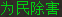
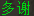
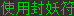

# 天庭任务 Design(设计文档)

> 业务权威:`docs/天庭任务流程大MD.md`(已从 DHXY 基线复制入本仓,先通读)。
> 本文是实施前设计:模板资产盘点、workflow、云/本地职责、复用构件映射、写集预估、决议记录。
> **2026-07-29 用户已对首轮 13 条开放问题全部拍板(见 §12 决议表);剩余 3 项实施前置待补(§13)。**
> 新工人须先读 `docs/云端迁移常见错误清单.md`。
> 参考架构 = **修罗(XiuluoTaskV2)/五倍(WubeiTask)组队任务形态**。五环是单人任务,只借用它的通用机制(tracker/绿链/接任务 dialog/判稳),任务形态一律以修罗/五倍为准。

## 0. 任务定位与组队形态

- **组队任务,必须组队**(用户拍板,同修罗设计):队长执行 `TIANTING`,同队队员沿用现有角色预检分配为 `AUTO_BATTLE`;**没有单窗口模式**——启动预检要求队伍存在(对照修罗的组队预检;07-29 二轮确认,此前借 G004"单人允许"表述作废)。
- 战斗信号:**Client Runner 是战斗状态唯一裁决者**;队员走 G002 队长战斗广播免检三件套。
- 架构基座:turn 协议 + 观察面点菜制;park 只等事件、一律有界(≤25s 循环再挂);观察全走 G002 共享周期帧,不新增独立截图。动作按 G003 方向组织为原子连续包。

## 1. 模板资产清单(12 张全部已落盘,当前零代码引用)

### 1.1 对话框选项模板 `images/template/dialog/tianting/`(绿字,**本地模板匹配**;全 miss 才发云端 fallback)

| 图 | 文件 | 实际文字 | 命中后 |
|---|---|---|---|
|  | `accept.png` | 「为民除害」 | 接任务(李靖对话框) |
|  | `kaida.png` | 「妖孽,看打」 | 点击进战。**必须第一优先级**(用户拍板) |
|  | `duoxie.png` | 「多谢」 | 进多谢分支 |
|  | `fengyao.png` | 「使用封妖符」 | **条件模板,不入常驻探针集**:仅多谢点击后 ~1s 窗口内匹配(业务 §3-3);命中→封妖符坐标分支 |
|  | `zhuoyue.png` | 「卓越,2倍经验」 | 点击进战 |
|  | `yaowang.png` | 「捉的就是你」 | 点击进战,**列末**(用户拍板:除看打必须第一外,其余顺序无所谓) |
|  | `yinyao.png` | 「使用引妖香」 | 战后引妖点击,≤5 次 |

### 1.2 tracker / 背包 / NPC 模板 `images/template/tianting/`

| 图 | 文件 | 内容 | 用途(用户拍板后) |
|---|---|---|---|
|  | `tianting_title.png` | 「天庭任务」黄字 | tracker title 锚(0.82)。消失 = 一轮 6 次完成,唯一回城信号 |
|  | `anlei.png` | 暗雷小图标 | **云端面板分析内匹配**(用户 07-29 拍板,覆盖业务 §2"本地匹配"字面:面板每次同步云端反正都要分析,同一趟出绿链+暗雷标记更优,免去本地匹配后再上报一趟)。每次面板更新都重判 |
|  | `fengyaofu.png` | 「封妖符」白字 | **仅作坐标对话框 anchor**:点四坐标前查它在不在——在=界面已开可点;不在=先点绿链打开(云端在上行面板帧上判)。anchor ROI 预留(P1)。封妖符小任务本身的判定**不靠此图**,见 §7 进入事件标记 |
|  | `huicheng.png` | 回城道具图标 | 背包宏路径串 `"tianting/huicheng.png"`;回城目的地=**天宫**(与李靖同图) |
|  | `daotong.png` | 「道童」小字 | **现在不用**(用户拍板) |

匹配归属(**2026-07-29 用户纠偏,与业务文档 §3 一致**):dialog 7 张**全部本地匹配**——业务文档明文"本地先按已定义的天庭 dialog 模板和优先级处理;本地已命中模板时不走 fallback"。范式=修罗看打的本地模板探针(`DialogService.LocalDialogTemplateMatch` / `sampleXiuluoLocalKanda`,interest 下发后本地在 G002 共享帧上匹配,命中经输入队列**本地直接点击**,结果经观察面上报);仅当所有本地模板全 miss 时,才把 dialog 帧发云端,云端固定返回第一行绿链让本地点击。tracker 侧分工(07-29 二轮定稿):`tianting_title` 与 `anlei.png` 均在**云端面板分析**同一趟内出结果(title→box→绿链→暗雷标记一次分析);`fengyaofu.png` 仅 anchor,云端在上行面板帧上判。`huicheng.png` 本地 BagService 独占宏内匹配。模板文件只存客户端仓。

## 2. 总体 workflow

```
┌─ PREPARE(启动预检/清理)
│
▼
接任务:导航天宫(144,114) → NPC点击李靖 → accept.png(fallback第一条绿)     ◄──────────┐
│   (仅回城之后的重接,接任务前先 cleanUpAll 大清理;平时接任务不加清理)                 │
▼                                                                                    │
SYNC_TRACKER:anchor→tianting_title→task box                                          │
│  ├─ anlei.png 匹配(每次面板同步都做,非一次性)→ 命中则当前小任务标记暗雷怪          │
│  └─ 绿链识别(云)→prepared action→本地点击→pathing intent                            │
▼                                                                                    │
WAIT_PATHING:移动中只等(park,事件唤醒)                                               │
│                                                                                    │
▼ 停下(STOPPED_AWAY / 到达;没移动就停下 = 同样按停下处理)                             │
分流依据只有一条:当前小任务是否已被 anlei.png 标记为暗雷怪(§5)                        │
│  ├─ 已标记暗雷怪 → 先查飞行、在飞则取消(业务 §4.1)                                  │
│  │                 → 水平巡逻移动主动触发进战(左右交替点击巡逻点,§5)                │
│  └─ 未标记 → 等待对话框(暗雷小任务无 dialog,探针自然不命中,无需例外):            │
│        ├─ dialog 未出现 → 按修罗 STOPPED_AWAY 常规处理:重点 tracker 绿链           │
│        ├─ 常驻四张按优先级本地匹配:看打(必须第一)→多谢→卓越→妖王;                 │
│        │   封妖=条件模板,仅多谢点击后 ~1s 窗口内匹配                                │
│        │    ├─ 看打/卓越/妖王 命中点击 → 进战                                       │
│        │    ├─ 多谢 → 多谢分支(§6)                                                  │
│        │    └─ 封妖 → 封妖符坐标分支(§7)                                            │
│        └─ 全部未中 → 发云端,固定返回第一行绿链,本地点击                            │
│             → 点击后重新状态重估:进战→战斗;新 dialog→重新匹配;                    │
│               左侧面板变化→导航(点绿链)(§5 fallback 重估)                           │
▼                                                                                    │
战斗(仅真实进战的分支到达这里;队长广播,队员 AUTO_BATTLE 跟随)                        │
▼                                                                                    │
战后处理(§8):恢复(含摄妖香,同修罗)→title检查→绿链→未移动才七模板恢复              │
│              →移动放权后才开队员补给/等归队(同修罗)                                  │
│  ├─ title 仍在 → 下一小任务(回 SYNC_TRACKER)────────────────────────────────►──────┤
│  └─ title 消失(=一轮6次完成) → 回城道具(验证到天宫)                                 │
│        ├─ 成功 → cleanUpAll 大清理 → 重新接任务 ───────────────────────────►───────┘
│        └─ 失败 → 手动导航回李靖 → cleanUpAll → 重接 ────────────────────────►──────┘
```

一轮 = 6 次小任务;**只有 title 消失才允许用回城道具**,单次战斗结束绝不回城。任何时刻找不到 title:先找回城道具用,道具无效/无道具则手动导航回李靖重接(业务文档 §8 末条)。

## 3. 接任务(李靖)

| 步骤 | 复用构件(全部现成) |
|---|---|
| 导航天宫(144,114) | `NavigationService.navigateToNPC` + `NavigationRequest`(fresh 位置预热对照修罗);黄字路线计算段经 `NavigationTurnYield` 放权(2026-07-28 已接线) |
| 李靖识别 | **零新增**:`ImageAlgorithms.npcYellowTargetProfile` 已把李靖映射到 BAILONGMA 黄字 profile;`SmartClickRecognizer` 已有李靖精确 OCR 兜底(仅接受全文「李靖」,实测分数 0.95054) |
| NPC 点击 | `NpcClickService.registerArrivalFrameFifo`(到达帧 FIFO)/`registerPreparedFrameFifo` + `NPC_CLICK_PLAN_READY` 事件唤醒 |
| 接任务对话框 | `WHOLE_TASK_DIALOG_INTEREST_UPDATE` 点菜(本地探针模式)→ **本地匹配 accept.png,命中本地直接点击**(修罗看打探针同款,用户 07-29 拍板) |
| 接成功判定 | **本地查左侧 tracker 面板出现 `tianting_title.png`**:看见 title = 接成功 → 观察面上报"接任务成功",云端进下一 phase;不需要云端再确认 |
| accept 本地未中 | 上报云端(dialog 帧)→ 云端 fallback 返回第一条绿 → prepared → 本地点击 → 重回 title 判定 |
| 回城后的重接 | **回城(或回城失败改走导航)之后、接任务之前,调用一次 `cleanUpAll` 大清理**(处理升级弹框等积累的杂窗);平时的每次接任务**不**另加 closeGenericWindows(用户拍板) |
| 升级弹框风险 | 战斗/任务成功加经验可能升级弹框——**无需特殊处理**(用户结论:tracker 挡不住,点绿链导航后 dialog 弹最前,正常 dialog 链能点掉);唯一保障就是上一行的回城后 cleanUpAll |
| 取消任务分支 | 只记录不实现(点第二条链接),正常流程不进入 |

## 4. tracker 定位与任务链接

- anchor:共用 `images/template/task/wubei_tracker_anchor.png`(0.82,搜索区 (6,196)-(207,551))——现成。
- title:`tianting_title.png` → 云端纯算法 `TaskTrackerPanelService` 新增 title 模板常量 + `analyzePanel` 分支 + `detailHeight("tianting")` = **按五倍的 block 高度取值**(用户拍板:选大的那个);tracker 白名单 `:1067` 加 `"tianting"`。
- task box 内两步:
  1. **暗雷标记**:`anlei.png` **云端面板分析内匹配**(用户 07-29 拍板,覆盖业务 §2"本地匹配"字面;评审 P1-1 的"改回本地"随之作废)——面板每次同步云端都要分析,title→box→绿链→暗雷标记同一趟出,免去本地匹配再上报一趟。**每次面板更新都重新识别,非一次性**(用户强调);标记只对当前小任务有效。(五倍暗雷是 OCR 关键词,不共用代码路径);
  2. **绿链**:`findGreenBands` 绿链提取链现成 → prepared action(`TASK_TRACKER_PATHING`,targetKeyword=`tianting`)→ 本地点击,`UNTARGETED_TRACKER` intent。
- 移动/停止判定:客户端 300ms 数字框 diff(118,70,45×12)+600ms 判稳 + 坐标条验证——现成事实链,任务侧只 park 等 `PATHING_TERMINAL`。
- 战斗中 tracker/dialog 观察自动抑制(`CloudWholeTaskObserver` 现成行为)。
- **title 缺失兜底(评审 P4-1 澄清)**:业务 §8 末条"只要识别 title 没看见就先找回城道具"适用于 **RUN_SUBTASKS 段**(已接任务后)的任何一次 tracker 同步——看不到 `tianting_title` 即走 §9 回城流程,不限于战后检查点。**ACCEPT_TASK 段例外**:刚点 accept 后 title 未出现=接任务未成,走 accept 重试/fallback(§3),不回城。

## 5. 停下后的分流(唯一依据:暗雷标记)

停下 = 点绿链触发移动后的 STOPPED_AWAY/到达;**点了绿链但根本没动、直接判停,也是同一个停下入口**(用户确认,Q13)。

### 5.1 暗雷怪分支(主动巡逻,不是被动等待——用户拍板改)

0. **暗雷怪路径没有 dialog**(用户 07-29 澄清,评审 P1-2 的"互斥机制"撤销):点绿链只是导航到地点,到达后不会弹任何对话框,后续操作全靠自己(飞行检测→巡逻)。常驻四张 dialog 探针是模板门控的——没有 dialog 出现就永远不命中,天然无害,**无需注销 interest、无需互斥机制**。
1. 飞行检测 `detectFlyingStateTurn`(Alt+U 开状态面板→本地截 ROI(660,573,52,24) 回传→云判 flying/unflying/unknown→Alt+U 关);FLYING → Alt+C 取消;**UNKNOWN → 不取消,直接进巡逻**(修罗现行保守语义,评审 P4-2 澄清)。
2. **按地图查表的两点巡逻**(用户 07-29 重新定义,**不再识别人物名字**,`findHorizontalPatrolPoints` 方案作废):
   - **只认地图**:停下后取当前地图名(pathing 镜像;镜像没有则 `playerStateService.syncMyPosition()` 兜底),在四张已量地图里查表;
   - 四张地图各自两点(窗口相对,`TiantingGeometry` 由实测屏幕坐标减 base(1317,187) 统一换算):蟠桃园 (300,381)/(420,421)、瑶池 (329,275)/(697,278)、御马监 (300,465)/(554,473)、长寿村外 (300,469)/(686,469);G037 证明旧左点 `(82,381)` 落在 Tracker 面板内，合同随即检出御马监 `(201,465)` 与长寿村外 `(273,469)` 同类失效，三点均保持原 Y、移至面板右侧 `x=300`；
   - **每秒一次左右交替右键点击**这两点,靠走位触发进战,直到 Client Runner 判 `IN_COMBAT`;**蟠桃园例外**：停下后先对右点连续右键点击两次，再按 `左 → 右 → 左 → 右 ...` 开始交替；其余地图从正常左右交替开始;
   - 地图名匹配**单向 contains + 最长名优先**:上报名可带后缀("长寿村外围"命中"长寿村外"),但短名不得命中长名(**"长寿村" 不许拿到 "长寿村外" 的点**,否则角色走得很像样却永远遇不到怪);
   - **不在表里的地图 → 拒绝点击**(猜一个点可能把角色走出任务区且无廉价退路),给预算 `DARK_THUNDER_UNKNOWN_MAP_LIMIT=5` 后整轮 failed,**不无限 park**——无限 park 从外部看和正常运行一模一样;
   - **落在面板上的点必须拒绝**:右键点在任务追踪面板 ROI `(0,100) 280×604` 上会被 UI 吃掉,角色不动而 turn 照样 COMPLETED;`TiantingGeometry.isOccludedByUi` / `clickablePatrolPointsFor` 过滤,可用点不足 2 个则整轮 failed 并打 error;
   - 循环内照常 stop/checkpoint,无需额外超时设计(Q9 决议:暗雷是移动触发,不是定时等待);
   - 走位的输入包形状照抄 G004 `WildBattleTask.clickBundle`(`MOVE_MOUSE → CLICK_RIGHT(hold 100ms) → WAIT 1000ms` 原子不可拆),循环/进战释放 turn 的骨架同 `WildBattleTask`。
3. 不点任何战斗对话框;摄妖香照常(摄妖香与暗雷怪**不冲突**,有香也能触发暗雷——用户拍板,Q6)。

### 5.2 非暗雷分支

- 点绿链前只注册四张普通战斗选项 interest；Runner 证明 exact intent 已开始移动时保持原 `PARK_PATHING`。只有 Runner 在有界窗口内确认该次点击**没有启动移动**，才把 interest 切成七张已知模板恢复集。park 唤醒集合仍包含:`PATHING_TERMINAL` + 本地 dialog 命中/点击结果事件 + `COMBAT_STATE_CHANGED`。
- **常驻探针集是四张**(评审 P1-4 修复):`kaida`(**必须第一**)→ `duoxie` → `zhuoyue` → `yaowang`(列末;顺序无所谓——Q3 决议)。**`fengyao` 是条件模板,不入常驻集**——仅在 `duoxie` 点击后 ~1s 窗口内匹配(业务 §3-3)。
- dialog 出现 → 本地按常驻四张优先级匹配(本地探针,命中本地直接点击,结果上报)。
- 绿链未启动移动 → 本地恢复集依次匹配七张已知模板:`kaida/duoxie/zhuoyue/yaowang/fengyao/accept/yinyao`;命中后沿各自既有业务分支处理。
- 七张在有界恢复窗口内全 miss → dialog 帧交给云端 `DialogService`,固定返回**第一行绿链**;fallback 无动作才允许再次点击 tracker。**点击后的重估**(Q12 决议):这次点击等价于替代了某一张 option 模板——
  - 若触发进战 → 战斗;
  - 未进战 → 必然是"更新了 dialog"或"更新了左侧面板"之一 → 重新走状态重估:新 dialog → 重新本地匹配(仍 miss 再问云端);左侧面板变化 → 回 tracker 点绿链导航。

## 6. 多谢分支

```
点击 duoxie.png
│ 等 ~1s
▼
匹配 fengyao.png?
├─ 命中 → 点击 → 封妖符坐标分支(§7)
└─ 未中 → 回 tracker 点绿链 → 移动停下 → 匹配 zhuoyue.png → 命中点击进战
```

## 7. 封妖符坐标分支

**封妖符小任务的判定(评审 P2-2 修复,填补 fengyaofu 改判 anchor 后的空洞)**:不读 tracker 内容判定,而由**进入事件标记**——多谢分支里点击 `fengyao.png`「使用封妖符」选项的那一刻,`RoundContext` 置位封妖符标记并**清零四坐标游标**;此后"tracker 仍是封妖符"(业务 §6"战后仍是封妖符")= **compare 快照 UNCHANGED**(与循环前快照比较未变化=小任务未推进=仍在封妖符内);compare 变化 = 小任务结束,标记与游标一并作废。回李靖重接时同样作废。**战后重开坐标对话框不重置游标**(跳过已点坐标,业务 §6 明文)。目标 NPC=`妖王幻影`。

**先做一次(整个封妖符小任务只做一次,进坐标循环之前)**:记录完整 tracker 快照(`TrackerTaskBoxContentComparator.capture`)——用户纠正:不是每点一个坐标记一次。此快照同时是"仍是封妖符/已推进"判定和引妖 compare 的基准。

四坐标按序、每个封妖符小任务内各点一次(**2026-07-29 重新实测,以此为准**;业务 MD 初版那四个裸值当时没有配套基点、无法换算成窗口相对坐标,**已作废**):

| # | 屏幕坐标 | 窗口相对(减 base) |
|---|---|---|
| 1 | `(1771, 570)` | `(454, 383)` |
| 2 | `(1901, 570)` | `(584, 383)` |
| 3 | `(1771, 704)` | `(454, 517)` |
| 4 | `(1903, 713)` | `(586, 526)` |

**base = (1317, 187)**;anchor ROI = 屏幕 `(1792,412)`-`(1887,451)` = 窗口相对 `(475,225)` 95×39。
**Q1 决议:hardcode 直接点**,换算集中在 `TiantingGeometry` 一处(改 base 是一行)。

### 7.1 单个坐标流程

```
① anchor 门(**每个坐标点击前都过一遍**,评审 P4-3 澄清):查 fengyaofu.png 在不在
│   ├─ 在 → 界面已打开,可点坐标
│   └─ 不在 → 界面没开 → 点一下左侧绿链打开 → 复查 anchor
│       (anchor ROI 预留,用户后补,§13-P1)
│       ★ 这次"打开对话框"的绿链点击(含战后重开)不携带 pathing intent——
│         它的预期结果是界面出现而非移动;点击后有界等待 anchor 出现
│         (面板帧复查,重试≤3);若误触发移动,PATHING_TERMINAL 照常兜底(评审 P4-4)
▼
② 左键点击当前未点坐标(hardcode 相对坐标)
│   ★ 移动意图设计(用户点名要设计好,防永久 park):
│     该点击必须与 tracker 绿链点击同构——同一 turn 命令包
│     moveStep→waitStep→clickLeftStep 并携带 TurnPathingIntent
│     (type=UNTARGETED_TRACKER,source=`tianting:fengyao-coord:<n>`),
│     本地移动 watcher 据此追移动、发 PATHING_TERMINAL。
│     现状确认:pathing intent 挂在 turn 输入命令上,不是绿链专属,
│     直接复用 submitWuhuanTrackerGreenClick 的命令形状即可。
▼
③ 等自动巡路(park 等 PATHING_TERMINAL)→ 停稳
▼
④ 进入直战模式点妖王幻影(用户拍板,较 tryDirectCombatTargetClick 有三处收窄):
│   1. **不做飞行检测**(与修罗/五倍不同,天庭这里跳过);
│   2. 云端预告"本次点击预期进战"(armDirectCombat,战斗退出快速识别用,保留);
│   3. Alt+A 进直战模式;
│   4. 识别只走 **MEMORY + TOOLTIP** 两条策略(不走黄字/紫字公式/Ctrl)。
│      **业务"禁用 NPC Click Smart 内部 Alt+A 分支"已结构性满足**(评审 P2-1 补明):
│      CR267 已把 Alt+A 从点击候选整体剥离,clickNpcSmart 策略链不含 Alt+A;
│      验收断言:整个点击链只出现 ③ 的一次 Alt+A,绝无第二次:
│      - MEMORY:妖王幻影记忆现在是空的;首次靠 TOOLTIP;
│      - **进战成功后必须存记忆**:记忆点 = tooltip 中心 y+90
│        (`directNpcPointFromTooltipCenter`,修罗实测 tooltip 在模型上方≈90px),
│        后续轮次走 MEMORY 快路;
│   5. TOOLTIP 也未命中 = 本次失败:先右键退出直战模式
│      (exitDirectCombatClickModeAfterFailure 现成)→ 导航回李靖重新接任务。
▼ 三种结局
├─ 未匹配到(tooltip 无)→ 退出模式 → 回李靖重接(见上 5)
├─ 触发进战 → 等战斗结束(战后处理 §8)→ 查战后 tracker:
│     ├─ 仍是封妖符 → 点绿链重开坐标对话框(anchor 门兜底)→ 跳过已点坐标 → 回 ①
│     └─ 内容已变化 → 本小任务结束 → 点绿链进下一小任务
└─ 未触发进战 → story dialogue 直接 Fast Click(advanceStoryDialog 现成)
      → compare 快照(与进循环前那次比):
      ├─ confirmsTaskAdvance → 小任务完成 → 绿链下一小任务
      ├─ 未变且还有未点坐标 → 回 ①
      └─ 未变且四坐标点尽 → **导航回李靖重接**(Q4 决议)
```

## 8. 战斗与战后通用处理(队长视角,每场战斗后固定顺序)

战斗期间:队长 `AutoCombatService.handleCombatTick`(自动战斗面板探测优先,面板缺失才 Alt+8);队员由 G002 队长广播驱动;战斗中零 tracker/dialog 输入。

**顺序 2026-08-04 G014 用户纠偏**:不再脱战后预扫引妖。先恢复、查 title、点击绿链；只有该次 exact 绿链点击没有启动移动，才扫描七张已知 dialog（其中包括引妖）。这样既能清掉挡路 dialog，也不让一个不存在的引妖检查阻塞每一场战斗后的主链。队员补给窗口仍等绿链点击后才开。

| 序 | 业务步骤 | 复用构件 |
|---|---|---|
| 1 | 战斗结束基础恢复 | `recoverAfterClientCombatExit(ctx, "tianting", policy)`;**摄妖香保持修罗/五倍原逻辑**(Q6 决议:与暗雷怪不冲突) |
| 2 | 查 title | tracker 面板匹配 `tianting_title.png`:消失→回城流程(§9);仍在→继续 |
| 3 | tracker 绿链 | 点击并等待 Runner 的 exact movement proof |
| 4 | 未移动时恢复 dialog | 切七模板恢复集；命中本地复验点击并走既有分支。`yinyao` 仅按真实 executed 事件计数，≤5 次；七张全 miss 才走一次 Cloud `DialogService` fallback。 |
| 5 | **移动放权后**队员恢复 | 与修罗一致:绿链点击触发移动、队长让权之后,才开 `openTeamFirstAidMaintenanceWindow`(补血补蓝)+`TeamReturnService` 死亡离队等归队(放权型等待,不死等) |
| — | 战前 tracker 快照 | 时机不变:进战边沿时 `TrackerTaskBoxContentComparator.capture`(封妖符小任务另有"循环前一次"的快照,见 §7,两者用途不同) |

## 9. 一轮完成与回城

- 一轮 = 6 次小任务;**title 消失是唯一的轮完成信号**(不数次数,不因单场战斗回城)。
- 回城:修罗 `useReturnItemAndVerifyStartMap` 样板全链照抄——`ReturnItemPrescanService`(prescan 时机:`whileInCombat`/`afterTrackerGreen`)→ `useCached`(路径串 `"tianting/huicheng.png"`)→ 用后 `syncMyPosition` + `isSameMapName("天宫")` 验证(**Q8 决议:目的地=天宫,与李靖同图**)→ 2 次尝试。
- **回城成功 → `cleanUpAll` 大清理 → 重新导航李靖接任务**(Q4/升级弹框决议:清理只挂在回城后这一处)。
- 回城失败(道具用不出/无道具/未到天宫)→ 手动导航回李靖 → 同样先 `cleanUpAll` → 重接。

## 10. 写集预估(注册点 + 新增件)

**协议/注册(两仓,对照 G004 WILD_BATTLE 接线抄全)**
- `TurnTaskCode.TIANTING`(两仓 byte-identical)+ `TaskType`(cloud: code+显示名"天庭";client: +singlePlayer=false)
- cloud:`CloudTurnTaskFactory` descriptor+provider、`CloudTurnRuntimeConfiguration` bean、`TurnProtocolValidator` 放行
- client:`WindowTaskControlService.toTurnTaskCode` switch、`MainWindowController` 任务入口/轮数字段、`BotProperties`、`GameUiSettingsStore`、`WindowRegistrationBatchBuilder` 队长/队员分派

**cloud 新增**
- `task/tianting/` 包:`TiantingTask`(prototype GameTask)+ `TiantingPhase` + `TiantingRoundContext` + `TiantingStepOutcome` + `TiantingDialogCatalog`——骨架对照 xinshou(最新最瘦)+修罗(组队形态)
- **Phase 结构(2026-07-29 定)**:宏观仅 4 个 phase + 终态——`PREPARE → ACCEPT_TASK → RUN_SUBTASKS → RETURN_HOME`(回城后回 ACCEPT_TASK)+ `FINISHED/FAILED/STOPPED`。
  - ACCEPT_TASK / RETURN_HOME 是纯顺序过程(中途无外部事实可对账),用 phase 承载重试预算、loop guard、forceRelease 生命周期钩子(修罗式);
  - **RUN_SUBTASKS 内部不再切 phase**:六次小任务推进没有可靠编号,唯一真状态是 tracker 本身——采用事实驱动优先级循环(本地 dialog 结果 > 战斗 park > pathing park > tracker 绿链 > no-movement dialog 恢复),每次唤醒重看事实分流,杜绝"云端内存状态与游戏真状态对账"类 bug;
  - 封妖符四坐标游标/循环前快照/多谢延迟匹配等中间态放 `TiantingRoundContext` 字段,不升格为 phase(小任务一换即作废,生命周期与 phase 不符);
  - 该切法与 G003 对齐:中段已是事实驱动,迁移时仅三段顺序程序需改造为队列请求串。
- `TaskTrackerPanelService`(纯算法):tianting title 常量、`analyzePanel` 分支、`detailHeight("tianting")`=五倍值、白名单 `:1067`
- `CloudWholeTaskObserver.prepareTaskInterest`:TIANTING 分支 + tracker ROI interest 发布
- task box 内 `anlei.png` 匹配(暗雷标记)
- 封妖符坐标点击的 pathing-intent 接线(§7.1-②,复用绿链点击命令形状)
- fengyaofu anchor 门(ROI 待用户提供,先常量占位)
- 暗雷巡逻:`TiantingGeometry` 地图查表(四张地图各两点)+ 每秒左右交替右键巡逻循环
- 妖王幻影 MEMORY+TOOLTIP 收窄点击路径 + 进战后存记忆(tooltip 中心 y+90)
- `AutoCombatService:558` 队伍急救 gate 加 tianting;启动预检/组队分支;`LeftTopStatusSwitchService`;`CloudTaskStartupPreparationService:332`

**client 新增**
- 预期为零或接近零(观察面/输入/Bag 宏/Fast Click 全现成)。

## 10.5 关于 park/唤醒的澄清(用户 2026-07-29 提问后补)

- **park/唤醒只发生在云端任务主循环线程**,本地从不 park:采样器/combat signal/tracker 上报全程后台照常。
- `COMBAT_STATE_CHANGED` 唤醒的意义 = 云端大脑得知"可以继续了",从而下发战后序列的**第一条指令**(恢复→title→绿链)。本地只上报事实,不自行决定"该做恢复了"。
- 事件唤醒仅是把"云端线程定时轮询状态"替换为"事件到达即续跑",省空转、降脱战反应延迟,不承担任何其他职责。
- 用户设想的"云端后台识别完直接下发 action、本地被 action 驱动"= **G003 动作队列终局形态**(大脑=事实驱动的入队者,本地=哑执行队列头)。天庭按现行架构实现(park/事件唤醒);G003 迁移时该层自然消解,不构成迁移障碍。

## 11. 与既有纪律的对齐

- park 只等事件、有界 ≤25s;每个可能结局必有唤醒事件;封妖符坐标点击必须携带 pathing intent,禁止裸点屏幕坐标后无事实可等(§7.1-②)。
- 截图全走 G002 共享周期帧;暗雷巡逻的 Alt+4 fresh 截图是显式 turn 内动作,不算独立采样。
- 凭据(anlei 标记、封妖符标记)是 expected 标签不是门:事实无条件上报,云端拿标签分流。
- 绿链点击零同步验证:点击记录后让权,推进判定交给后台事实。
- **Alt+A 直战模式只允许封妖符小任务进入**,其他天庭小任务一律禁止(业务 §4.3-1;评审 P2-3 补明文)。

## 12. 决议表(2026-07-29 用户拍板,原 13 条开放问题全部关闭)

| # | 问题 | 决议 |
|---|---|---|
| Q1 | 封妖符四坐标呈现/点击方式 | **hardcode 直接点**(换算窗口相对坐标);fengyaofu.png 作为坐标对话框 anchor 门:在→可点,不在→点绿链打开 |
| Q2 | 妖王幻影 OCR profile | **不需要 profile**:识别只走 MEMORY+TOOLTIP;进战成功存记忆(tooltip 中心 y+90,修罗做法) |
| Q3 | yaowang 优先级 | 看打必须第一;其余顺序无所谓,yaowang 列末即可 |
| Q4 | 四坐标尽 tracker 未变 | 导航回李靖重接;回城后接任务前统一 `cleanUpAll`(平时接任务不加清理) |
| Q5 | daotong.png 用途 | 现在不用 |
| Q6 | 摄妖香策略 | **保持修罗/五倍原逻辑**——摄妖香与暗雷怪不冲突,有香也能触发暗雷(此前"全程禁用"建议作废) |
| Q7 | task box 高度 | 按五倍的值(取大的) |
| Q8 | 回城目的地图 | 天宫(与李靖同图) |
| Q9 | 暗雷等进战超时 | 不是被动等待——**主动水平巡逻移动触发进战**(G004 预留巡逻点算法,左右交替点击);无需超时设计 |
| Q10 | Alt+A/Auto+A 混写 | 确认 Alt+A |
| Q11 | 绿链未启动移动 | 切本地七模板恢复探针；全 miss 才走一次 Cloud dialog fallback，fallback 无动作才重按绿链 |
| Q12 | fallback 点第一行绿链之后 | 该点击等价于替代某张 option 模板;点完重估:进战→战斗;新 dialog→重新匹配;左侧面板变化→点绿链导航 |
| Q13 | 分流二分/飞行检测位置 | 确认:停下分流只按暗雷标记二分;飞行检测只在暗雷怪停下后;"没移动就停"同走停下入口(STOPPED_AWAY 常规) |

**决议补录**:
- D1 升级弹框无需特殊处理——用户 2026-07-29 对话推演结论(tracker 挡不住→点绿链导航→dialog 弹最前正常点掉;唯一保障=回城后 cleanUpAll)。
- D2(已确认)**必须组队,没有单窗口模式**——同修罗设计,启动预检要求队伍;此前借 G004"单人允许"表述作废。
- D3 `anlei.png` **云端面板分析内匹配**——用户拍板覆盖业务 §2"本地匹配"字面(同一趟面板分析出绿链+暗雷标记更优)。
- D4 暗雷怪路径**没有 dialog**(点绿链仅导航,后续全靠自己)——评审 P1-2 的探针互斥机制不需要,常驻探针无 dialog 自然不命中。

## 13. 实施前置(剩余待补,不阻塞切卡)

| # | 项 | 状态 |
|---|---|---|
| ~~P1~~ | fengyaofu anchor 的 ROI | **已闭合(07-29)**:屏幕 (1792,412)-(1887,451) = 窗口相对 (475,225) 95×39 |
| ~~P2~~ | 四坐标的窗口相对换算基点 | **已闭合(07-29)**:base=(1317,187);四坐标屏幕 (1771,570)/(1901,570)/(1771,704)/(1903,713)。**业务 MD 初版那四个裸值当时没有配套基点、无法换算,已作废**,业务 MD §6 已按新测量重写。换算集中在 `TiantingGeometry`,改 base 是一行 |
| P3 | ~~`findHorizontalPatrolPoints`~~ | **作废**(用户 07-29):暗雷改为按地图查表两点巡逻,不识别人物名字 |

## 14. 验收标准(草案)

1. 双仓编译过、共享协议 byte-identical;新增测试隔离运行全绿。
2. 组队实机:队长 TIANTING+队员 AUTO_BATTLE 起一轮,完成 6 小任务(覆盖暗雷/看打/多谢→卓越/封妖符至少各一次)→ title 消失 → 回城验证到天宫 → cleanUpAll → 重接。
3. 暗雷分支:巡逻点识别一次后缓存复用;左右交替移动触发进战;摄妖香保持在线。
4. 封妖符分支(**gated on §13-P2 基点落定**):anchor 门每坐标生效(界面没开会先点绿链);四坐标按序各点一次不重复且**点击携带 pathing intent**(日志可见 intent source `tianting:fengyao-coord:*`,无永久 park);快照只在进分支时记一次;妖王幻影 tooltip 进战后记忆落盘,次轮走 MEMORY;整链只出现一次 Alt+A。
5. 战后链:队员补给窗口开启、死亡队员归队放权、引妖 ≤5 次封顶。
6. 主循环空转期间客户端无新增独立截图;战斗期间零 tracker/dialog 输入。
7. 停止/异常/轮完成均不遗留 turn 占用(`forceRelease` 兜底)。

## 15. 时序(云/本地消息流,Sequence)

四条泳道:**A=云端·任务大脑(TiantingTask)**;**B=云端·识别/观察消费(CloudWholeTaskObserver/TaskTrackerPanelService/DialogService/SmartClickRecognizer)**;**C=本地·输入执行(turn 下行,input worker)**;**D=本地·感知(观察面上行,WindowObservationSampler/combat signal)**。
记号:`-turn->` 云→本地指令(HTTPS turn);`-obs->` 本地→云**异步**事实上行(observation 通道);`->`(裸箭头)= **同一 turn 请求的回包内数据返回**(同步,如截图帧/执行结果),不走 observation(评审 P4-5 澄清);`[内部]` 泳道内动作。

### S1 接任务(2026-07-29 纠偏:accept 本地匹配本地点击,title 判成功)

```
A [内部] 回城后的重接?→ 先 cleanUpAll(仅此处)
A -turn-> C : 导航天宫(144,114)(黄字路线计算段 NavigationTurnYield 放权)
D -obs->  A : PATHING_TERMINAL(到达)
A -turn-> C : NPC 点击李靖(arrival FIFO;BAILONGMA profile+精确 OCR 兜底)
A -turn-> C : DIALOG_INTEREST_UPDATE(ACCEPT_TASK,本地探针模式)
D [内部] 看见 interest → 本地匹配 accept.png(修罗看打探针同款)
D -> C     : 命中 → 本地直接点击(输入队列)
D [内部] 接成功判定:tracker 面板出现 tianting_title
D -obs->  A : 接任务成功(title 已见)→ 云端进下一 phase
── 本地全 miss:
D -obs->  B : dialog 帧上报
B -> A     : fallback = 第一条绿(prepared)
A -turn-> C : 点击 fallback 点 → 本地重回 title 判定
```

### S2 tracker 绿链 → 移动 → 停下分流(纠偏:dialog interest 移动全程有效,park 唤醒集合明确)

```
A -turn-> C : tracker ROI interest(常驻,采样周期 1s)+ DIALOG_INTEREST(常驻四张本地探针,
              移动全程有效;fengyao 条件模板不在内;暗雷小任务无 dialog 自然不命中,无需例外)
D -obs->  B : tracker 面板 ROI(G002 共享帧裁剪)
B [内部] anchor→tianting_title→task box;anlei.png 匹配(每次面板同步都做)
B -> A     : prepared 绿链点击点 + 暗雷标记(随面板刷新)
A -turn-> C : move→wait→click 携带 TurnPathingIntent(UNTARGETED_TRACKER)
A [内部] park 等 {PATHING_TERMINAL, 本地dialog命中事件, COMBAT_STATE_CHANGED}(有界)
D [内部] 移动追踪;途中/停下 dialog 出现 → 本地常驻四张优先级匹配
D -> C     : 命中(如 kaida)→ 本地直接点击
D -obs->  A : dialog 命中+点击结果上报(唤醒 park)
D -obs->  A : PATHING_TERMINAL(STOPPED_AWAY/到达;没动过也走这里)→ 分流(暗雷→S3;
              dialog 未出现=按修罗 STOPPED_AWAY 重点绿链)
── 本地全 miss:D -obs-> B dialog 帧 → B -> A fallback 第一绿 → A -turn-> C 点击 → 重估
```

### S3 暗雷怪巡逻进战(纠偏:飞行判定需本地截图回传)

```
A -turn-> C : Alt+U → 本地截状态 ROI(660,573,52,24) → Alt+U(同一 turn 原子完成)
C -> B     : 状态 ROI 帧回传(turn 回包)
B -> A     : flying / unflying / unknown 判定
A -turn-> C : (FLYING)Alt+C 取消飞行
B          : 取当前地图名(pathing 镜像,空则 syncMyPosition 兜底)→ TiantingGeometry 查表得该地图两点
B -> A     : 巡逻两点 (x-100,y)/(x+100,y)(缓存,进出战复用不重识别)
A -turn-> C : 左右交替点击巡逻点(循环,checkpoint 照常)
D -obs->  A : COMBAT_SIGNAL → IN_COMBAT 边沿(Client Runner 唯一裁决)
A [内部] 停巡逻;战斗中零输入;park 等 COMBAT_STATE_CHANGED(退出)→ S5
```

### S4 封妖符单坐标(纠偏:anchor 判定需本地传图;三种结局都有结果回传)

```
B [内部] (进封妖符分支时,仅一次)tracker 快照 capture(帧来自面板 ROI 上行)+ 四坐标游标清零
── 以下 anchor 门每个坐标点击前都过一遍:
D -obs->  B : 面板帧上报(anchor 判定的图源)
B -> A     : anchor 判定:fengyaofu 在/不在
A -turn-> C : (不在)点绿链打开坐标对话框(不带 pathing intent,有界等 anchor 出现,重试≤3)
              → D 再传帧 → B 复查 anchor
A -turn-> C : (在)坐标点击(hardcode)携带 intent `tianting:fengyao-coord:<n>`
D -obs->  A : PATHING_TERMINAL(停稳)
A -turn-> C : armDirectCombat 预告 → Alt+A → fresh 捕获
C -> B     : 帧回传(turn 回包)→ MEMORY/TOOLTIP 识别妖王幻影(仅此两策略;评审 P1-3:识别在云端 B,非本地)
B -> A     : 识别结果(点击点 / 未命中)
A -turn-> C : (命中)目标点击
C -> A     : 点击执行结果回传
── 结局1 进战:D -obs-> A : IN_COMBAT;A -> B : 存记忆(tooltip 中心 y+90)→ S5
── 结局2 tooltip 未中:C -> A : 失败结果 → A -turn-> C : 右键退出直战模式 → 回李靖(S1)
── 结局3 未进战:A -turn-> C : story Fast Click;C -> A : 点击完成;
              D -obs-> B : tracker 帧上报 → B -> A : compare 结果
              → 变=下一小任务 / 未变=下一坐标 / 点尽=回李靖
```

### S5 战后 + 回城(G014:绿链先行;未移动才恢复 dialog)

```
D -obs->  A : COMBAT_STATE_CHANGED(退出)
A -turn-> C : 战斗结束基础恢复(摄妖香同修罗/五倍)
── ① title 检查:
D -obs->  B : tracker 面板帧 → B -> A : title 在 / 消失
── ② title 在:
A -turn-> C : tracker 绿链 → 等 exact movement proof
├─ Runner 证明开始移动 → PARK_PATHING
└─ 未启动移动 → Client 七模板恢复探针
     ├─ 命中 → fresh 复验、本地点击、retained event → Cloud 进入对应既有分支
     └─ 全 miss → Cloud DialogService 第一绿 fallback；无动作才重按 tracker
A [内部] 移动放权后才开:队员补给窗口 + TeamReturn 等归队(同修罗,绿链点了才放)
── ②' title 消失(一轮 6 次完成):
A -turn-> C : 回城道具宏("tianting/huicheng.png")
C -> A     : 宏执行结果回传(EXECUTED/USED …)
A -turn-> C : syncMyPosition(位置同步)
C -> A     : 坐标/地图回传 → A [内部] isSameMapName("天宫") 判定(2 次尝试,参考修罗)
A -turn-> C : cleanUpAll 大清理 → 重接(回 S1);失败 → 导航回李靖 → cleanUpAll → 重接
```

## Status

- 2026-08-04 **G014 覆盖旧战后顺序**：脱战后不再抢先单独探测引妖；改为
  `恢复→title→绿链→未移动才七模板恢复→全 miss 才 Cloud fallback`。该项覆盖 2026-07-29 的
  “引妖先清”记录，其他业务语义不变。
- 2026-07-29 **实施卡已切**:`docs/superpowers/plans/2026-07-29-g005-tianting-task.md`(G005,7 个 WP + DoD + 验收 + 前置)。本设计为该卡的权威依据,业务语义变更须先改本设计再改卡。

- 2026-07-28 设计建档(基于业务文档 + 三路构件探查)。
- 2026-07-28 修正:总体图"分派三分支"错误(fallback 归 dialog 兜底;停下分流只按暗雷标记二分);新增 Q11-Q13。
- 2026-07-29 **用户对 13 条开放问题全部拍板**,决议入 §12;暗雷改主动巡逻、封妖符 anchor 门+快照一次+MEMORY/TOOLTIP 收窄+坐标点击 intent 设计落档;剩余 3 项实施前置见 §13。
- 2026-07-29 **评审修复二轮用户复核,三处改判**:①暗雷怪路径无 dialog(点绿链仅导航)——P1-2 互斥机制撤销,探针无需例外(D4);②anlei 改判**云端**面板分析(D3,用户覆盖业务字面;P1-1 的"改回本地"作废);③**必须组队无单窗口**(D2 确认,同修罗;G004"单人允许"表述作废)。
- 2026-07-29 **外部评审代理一轮**(按业务 md 逐条):5 项必修全部闭合——P1-1 anlei 改回本地探针(业务明文);P1-2 暗雷标记与进战 dialog 探针互斥(§5.1-0,防移动途中误点看打);P1-3 妖王幻影识别归云端(S4 补帧回传);P1-4 fengyao 定为条件模板、常驻探针四张;P2-1 CR267 剥离 Alt+A 明文入 §7.1-④+验收断言;P2-2 封妖符判定=进入事件标记+compare UNCHANGED(§7 开头)。P2-3/P4 全部澄清入文(title 兜底范围、unknown 飞行、anchor 门每坐标、开对话框绿链不带 intent、裸箭头=turn 回包、引妖 compare 基准、游标重置时机、12 张更正);验收 4 标 gated on P2 基点;决议补录 D1/D2。
- 2026-07-29 时序评审四轮纠偏:①**dialog 7 张全部本地匹配**(业务 §3 明文,修罗看打探针范式;"云端匹配"设计作废)——接任务 accept 本地匹配本地点击、成功=本地见 title 上报;②S2 dialog interest 移动全程有效,park 唤醒集合={PATHING_TERMINAL,本地 dialog 命中,COMBAT};③S3 飞行判定/巡逻识别补本地截图回传;④S4 anchor 判定需本地传图、三结局均有结果回传;⑤**战后顺序改**:引妖先清(option dialog 挡路)→title→绿链→移动放权后才开队员补给(同修罗);⑥S5 回城补宏结果+位置同步回传。**设计冻结,待切 G 编号实施卡。**
